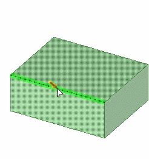

# 3D Modelling CAD



Yordan Tsvetkov introduces the basics of computer-aided design (CAD) using Onshape, one of the most popular CAD platforms. The tutorial walks you through completing the middle section of the biomimetic finger in just 15 minutes, while teaching you how to navigate Onshape and use fundamental sketching and 3D modeling tools. Key topics include:

* Navigating the Onshape interface
* Creating sketches on planes and faces
* Using geometry tools (Rectangle, Line, Circle, etc.)
* Modifying sketches (Trim, Mirror, etc.)
* Applying constraints
* Using Extrude and Cut Extrude
* Adding Chamfers and Fillets

<figure><figcaption>
Chamfering Edges
</figcaption></figure>

This video is the first half of the CAD segment. The next video will complete the finger’s design and introduce additional Onshape tools and commands. By the end of the series, you’ll have a solid foundation for exploring the exciting world of robotics.
