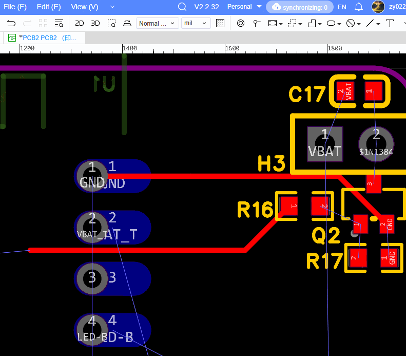
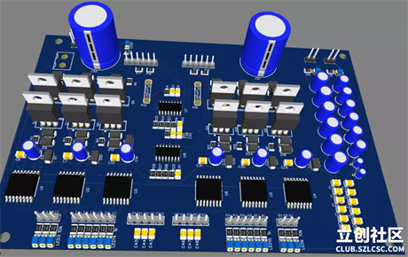

# PCB Design

### Entire User Guide : [https://docs.easyeda.com/en/](https://docs.easyeda.com/en/)

### Tutorial

{% embed url="https://www.google.com/url?cad=rja&cd=&esrc=s&opi=89978449&q=&rct=j&sa=t&source=web&uact=8&url=https://www.youtube.com/watch?v=gCwibH1YeiY&pp=ygUQI3R1dG9yaWFsZWFzeWVkYQ%3D%3D&usg=AOvVaw3wsE8kqEOw7iSTk1lEZOnU&ved=2ahUKEwjA17ai-KWNAxXwbWwGHYf4CqgQwqsBegQIDxAF" %}
A short tutorial on EASYEDA


### PCB Design Basics: How to Do It in EasyEDA 

### What is PCB Design?

PCB (Printed Circuit Board) design is the process of creating the layout for electronic circuits, ensuring all components are correctly connected and manufacturable. The process involves schematic capture, component placement, routing, and generating manufacturing files (Gerber files).

### Step-by-Step PCB Design in EasyEDA

**1. Create an Account and Start a Project**

* Go to [easyeda.com](https://easyeda.com/), sign up for a free account, and create a new project[3](https://docs.easyeda.com/en/Introduction/PCB-Layout/)[4](https://maker.pro/pcb/tutorial/pcb-design-tutorial-using-easyeda-jlcpcb)[9](https://www.altium.com/altium-designer/compare/kicad-eda).
* You can use the online editor or download the desktop version.

**2. Draw the Schematic**

* Open the schematic editor and add components using the left-side “Parts” or “Library” panel[3](https://docs.easyeda.com/en/Introduction/PCB-Layout/)[4](https://maker.pro/pcb/tutorial/pcb-design-tutorial-using-easyeda-jlcpcb)[9](https://www.altium.com/altium-designer/compare/kicad-eda).
* Search for components (resistors, ICs, connectors, etc.) and place them on the canvas.
* Connect components using the “Wire” tool (`W` key).
* Label all components and ensure the schematic is clear and well-organized.

**3. Convert Schematic to PCB**

* Once your schematic is complete and saved, click “Convert to PCB” (usually found under the Design menu)2[3](https://docs.easyeda.com/en/Introduction/PCB-Layout/)[4](https://maker.pro/pcb/tutorial/pcb-design-tutorial-using-easyeda-jlcpcb)[9](https://www.altium.com/altium-designer/compare/kicad-eda).
* This opens the PCB layout editor with all your components ready to be placed.

**4. Arrange Components**

* Place components logically, keeping related parts close together but not too tight[4](https://maker.pro/pcb/tutorial/pcb-design-tutorial-using-easyeda-jlcpcb).
* Use the “Drag” tool to move parts; blue lines (ratsnest) indicate required connections.

**5. Route the PCB**

<figure><figcaption></figcaption></figure>

* Use the “Route” tool to manually draw copper traces between pads, or use the “Autoroute” feature for automatic routing[4](https://maker.pro/pcb/tutorial/pcb-design-tutorial-using-easyeda-jlcpcb)[9](https://www.altium.com/altium-designer/compare/kicad-eda).
* Adjust track width as needed for power and signal lines (default is usually 0.25mm, but can be changed).
* Add vias and drill holes if required.

**6. Add Copper Pour**

* Use the “Copper Area” tool to add ground or power planes, which helps with noise reduction and stability[4](https://maker.pro/pcb/tutorial/pcb-design-tutorial-using-easyeda-jlcpcb).

**7. Design Rule Check (DRC)**

* Run a DRC to check for errors like short circuits, unconnected nets, or violations of spacing rules2.
* Adjust design as needed based on DRC feedback.

**8. Generate Gerber Files**

* When the layout is complete, click “Fabrication Output” or “Export Gerber Files”2[4](https://maker.pro/pcb/tutorial/pcb-design-tutorial-using-easyeda-jlcpcb).
* Download the Gerber and drill files, which are required by PCB manufacturers.

**9. Order the PCB**

<figure><figcaption></figcaption></figure>

* You can directly order boards from JLCPCB (integrated with EasyEDA) or upload your Gerber files to other fabrication houses[3](https://docs.easyeda.com/en/Introduction/PCB-Layout/)[12](https://image.easyeda.com/files/EasyEDA-Tutorial_v6.4.32.pdf).

**10. Bill of Materials (BOM)**

* Export the BOM for purchasing components: `File > Export BOM`2.

### Key Features of EasyEDA

* **Web-based**: No installation required; works on any device with a browser[12](https://image.easyeda.com/files/EasyEDA-Tutorial_v6.4.32.pdf).
* **Integrated with JLCPCB**: Direct manufacturing option from the design environment[12](https://image.easyeda.com/files/EasyEDA-Tutorial_v6.4.32.pdf).
* **Extensive Libraries**: Access to LCSC and JLCPCB parts, with many ready-to-use footprints[12](https://image.easyeda.com/files/EasyEDA-Tutorial_v6.4.32.pdf).
* **User-friendly**: Suitable for beginners and advanced users[12](https://image.easyeda.com/files/EasyEDA-Tutorial_v6.4.32.pdf).
* **Layer Management**: Supports up to 6 layers by default, more on request2.
* **Design Rule Check**: Ensures manufacturability and reduces errors2.

### Alternatives to EasyEDA

| Software            | Type              | Key Features                                                            | Best For                           |
| ------------------- | ----------------- | ----------------------------------------------------------------------- | ---------------------------------- |
| **KiCad**           | Free, Open Source | Multi-platform, advanced features, growing library, no size limits      | Beginners to advanced; open source |
| **Autodesk Eagle**  | Freemium          | Integration with Fusion 360, good for hobbyists, limited free version   | Hobbyists, small businesses        |
| **Altium Designer** | Paid              | Industry standard, advanced simulation, 3D visualization, large library | Professionals, complex projects    |
| **OrCAD**           | Paid              | Powerful simulation, high-speed design, industrial use                  | Professionals, high-performance    |
| **DipTrace**        | Freemium          | Intuitive interface, good for small/medium projects                     | Small teams, educators             |
| **Fritzing**        | Freemium          | Breadboard view, easy for beginners, good for Arduino and simple boards | Beginners, educators               |
| **LibrePCB**        | Free, Open Source | Simple, modern interface, growing community                             | Open source enthusiasts            |

### General PCB Design Guidelines

* **Clear Schematics**: Label components and nets; use protection circuitry as needed.
* **Track Width**: Size tracks for expected current; use calculators for guidance.
* **Drill Size**: Allow extra clearance for plated holes; avoid holes smaller than 0.015”.
* **Component Placement**: Place mounting holes for stability; use both sides for SMD if needed.
* **Package Orientation**: Ensure correct top/bottom views when creating custom footprints.
* **Manufacturing Files**: Always check Gerber files before sending for fabrication.
* **Avoid 90° Turns**: Use 45° angles for better manufacturability.
* **Surface Mount Selection**: 1206 packages are easiest to solder; avoid very small packages for hand assembly.

### Summary

EasyEDA offers a streamlined, beginner-friendly workflow for PCB design, from schematic to manufacturing. Its integration with JLCPCB, extensive part libraries, and web-based platform make it a top choice for hobbyists and professionals alike. Alternatives like KiCad, Eagle, Altium Designer, and others offer varying features and complexity, so choose based on your project needs and experience level[5](https://www.instructables.com/PCB-Designing-Using-EasyEDA/)[6](https://www.reddit.com/r/PrintedCircuitBoard/comments/190xe77/which_software_to_use_for_a_beginner/)[7](https://www.linkedin.com/pulse/choosing-right-eda-software-comparison-altium-eagle-kicad-khalid-1cglf)[8](https://www.hashstudioz.com/blog/choosing-the-right-pcb-design-software-altium-vs-eagle-vs-kicad-vs-orcad/)10[12](https://image.easyeda.com/files/EasyEDA-Tutorial_v6.4.32.pdf).
