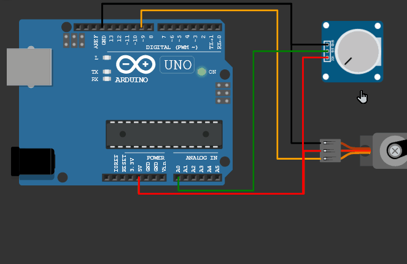

# Simulations

Simulation software accelerates robotics development by enabling virtual testing of control algorithms, physics interactions, and AI training workflows before committing to hardware[3](https://www.ros.org/)[5](https://zilliz.com/ai-faq/what-are-the-advantages-of-using-ros-robot-operating-system-in-mas). Modern platforms span middleware frameworks, model-based design tools, open-source physics engines, and GPU-accelerated synthetic data pipelines to cover every stage from prototyping to deployment[7](https://niryo.com/how-can-matlab-be-used-robotics/)[11](https://docs.omniverse.nvidia.com/isaacsim).

### WOKWI 

<figure><figcaption>
WOKWI Simulator
</figcaption></figure>

Looking for an easy beginner-friendly setup to simulate microcontrollers and visualize hardware Interaction, not much need be said check out Wokwi Here: [https://wokwi.com](https://wokwi.com)

### ROS 



ROS (Robot Operating System) is an open-source SDK providing drivers, state-of-the-art algorithms, and developer tools for robotics applications across research and industry2. It offers a standard platform that carries projects from initial prototyping through to production deployments[3](https://www.ros.org/). ROS supports indoor, outdoor, underwater, space, consumer, and industrial domains under a unified middleware architecture[3](https://www.ros.org/). ROS 2 extends this to Linux, Windows, macOS, and embedded targets (via micro-ROS), ensuring seamless integration on robots and backend systems alike[3](https://www.ros.org/).

* Official site: [https://www.ros.org](https://www.ros.org/)2

### MATLAB & Simulink 



<figure><figcaption></figcaption></figure>

MATLAB and Simulink deliver Model-Based Design for robotics, letting engineers build digital twins with accurate kinematics, dynamics, and sensor models in a single environment[16](https://docs.omniverse.nvidia.com/isaacsim/latest/index.html). The Robotics System Toolbox and Simscape enable co-simulation with Gazebo and Unreal Engine for high-fidelity scenario testing and automated validation workflows[5](https://zilliz.com/ai-faq/what-are-the-advantages-of-using-ros-robot-operating-system-in-mas). Built-in code generation and hardware-in-the-loop (HIL) testing streamline the path from simulation to real-world deployment on ROS, microcontrollers, FPGAs, and GPUs[5](https://zilliz.com/ai-faq/what-are-the-advantages-of-using-ros-robot-operating-system-in-mas).

* Official site: [https://www.mathworks.com/solutions/robotics.html](https://www.mathworks.com/solutions/robotics.html)[13](https://www.amantyatech.com/Robot_Operating_System_Powering_Robotics)

### Gazebo 

<figure><figcaption></figcaption></figure>

Gazebo is an open-source 3D simulator featuring multiple physics engines (ODE, Bullet, Simbody) that model collisions, friction, and gravity for realistic robot behavior[7](https://niryo.com/how-can-matlab-be-used-robotics/). It provides sensor plugins for cameras, lidars, GPS, IMUs, and contact/force sensors, with a plugin architecture for extending functionality[7](https://niryo.com/how-can-matlab-be-used-robotics/). Native ROS integration lets simulated robots publish and subscribe on real ROS topics, facilitating direct algorithm tests without hardware changes[8](https://en.wikipedia.org/wiki/Gazebo_\(simulator\)).

* Official site: [https://gazebosim.org](https://gazebosim.org/)[8](https://en.wikipedia.org/wiki/Gazebo_\(simulator\))

### NVIDIA Isaac Sim 

<figure><figcaption></figcaption></figure>

Isaac Sim is a GPU-accelerated robotics simulator built on NVIDIA Omniverse, offering physically accurate multi-physics and real-time ray-traced rendering for photorealistic environments[11](https://docs.omniverse.nvidia.com/isaacsim). It includes ROS 2 bridges for testing complete software stacks, Isaac Lab for reinforcement-learning agent training, and Replicator for generating large-scale synthetic datasets[11](https://docs.omniverse.nvidia.com/isaacsim). Delivered as a local application or container on AWS, Azure, and GCP, Isaac Sim leverages RTX GPUs to scale simulation and AI workflows in the cloud[20](https://developer.nvidia.com/blog/supercharge-robotics-workflows-with-ai-and-simulation-using-nvidia-isaac-sim-4-0-and-nvidia-isaac-lab/).

* Official site: [https://developer.nvidia.com/isaac-sim](https://developer.nvidia.com/isaac-sim)[10](https://www.allaboutai.com/ai-glossary/gazebo-simulator/)

Each of these tools plays a distinct role-from middleware and algorithm prototyping (ROS), through model-based design and co-simulation (MATLAB/Simulink), to open-source physics testing (Gazebo) and large-scale AI training with synthetic data (Isaac Sim)-together forming a comprehensive simulation ecosystem for modern robotics.

### Simulation Software Roles 

* **Offline Programming & Virtual Commissioning**: Create and validate robot programs in simulation to prevent production-line downtime and avoid on-site errors[8](https://flr.io/articles/choosing-the-right-robot-programming-simulation-software).
* **Physics-Based Testing**: Emulate real-world dynamics, collisions, and sensor feedback to refine control algorithms under varied conditions2.
* **Digital Twin & Facility-Level Validation**: Mirror entire production cells or assembly lines for real-time AI testing, bottleneck analysis, and layout optimization2.
* **Motion Planning & Control Verification**: Test path-planning, obstacle avoidance, and robotics frameworks (e.g., ROS) without hardware risks[6](https://robodk.com/).
* **Machine Learning & Reinforcement Learning**: Train perception and decision-making models using high-fidelity simulated sensor data before deployment2.
* **Operator & Maintenance Training**: Provide safe, interactive 3D scenarios for human operators to learn robot interfaces, emergency procedures, and maintenance tasks.

### Popular Simulation Tools 

* **NVIDIA Isaac Sim** ([docs](https://developer.nvidia.com/isaac-sim))\
  Photorealistic, physics-accurate simulation built on Omniverse for AI-driven robotics development and digital-twin workflows[3](https://blogs.nvidia.com/blog/what-is-robotics-simulation/)2.
* **Gazebo** ([gazebosim.org](https://gazebosim.org/))\
  Open-source simulator with multi-engine physics, extensive sensor models, and ROS integration for mobile and manipulator robots[3](https://blogs.nvidia.com/blog/what-is-robotics-simulation/)[4](https://formant.io/blog/best-robot-simulators/).
* **Webots** ([cyberbotics.com](https://cyberbotics.com/))\
  Versatile environment featuring a large library of pre-built robots, multi-language support, and ODE-based physics for educational and research projects[3](https://blogs.nvidia.com/blog/what-is-robotics-simulation/)[4](https://formant.io/blog/best-robot-simulators/).
* **CoppeliaSim (V-REP)** ([coppeliarobotics.com](https://coppeliarobotics.com/))\
  Modular platform offering real-time simulation, HIL testing, and APIs for Python, C/C++, Java, and MATLAB with multiple physics engines[4](https://formant.io/blog/best-robot-simulators/)[8](https://flr.io/articles/choosing-the-right-robot-programming-simulation-software).
* **RoboDK** ([robodk.com](https://robodk.com/))\
  Offline programming and simulation for industrial robot arms, supporting 80+ manufacturers, CAD integration, and collision-free path generation[3](https://blogs.nvidia.com/blog/what-is-robotics-simulation/)[5](https://thinkrobotics.com/blogs/learn/top-5-simulation-software-for-robotics-development).
* **Unity** ([unity.com](https://unity.com/))\
  Game-engine–based simulator delivering high-fidelity graphics and physics, extensible via C# scripting for custom robotics scenarios[3](https://blogs.nvidia.com/blog/what-is-robotics-simulation/).
* **AWS RoboMaker** ([aws.amazon.com/robomaker](https://aws.amazon.com/robomaker))\
  Cloud-native simulation service that scales computing resources for large-scale scenario testing and seamless deployment to ROS-based robots[3](https://blogs.nvidia.com/blog/what-is-robotics-simulation/).
* **Visual Components** ([visualcomponents.com](https://visualcomponents.com/))\
  Focused on industrial cell design, robot reach-ability studies, collision analysis, and throughput optimization with 3D animations[6](https://robodk.com/).
* **Fuzzy Studio** ([fuzzylogic.ai](https://fuzzylogic.ai/))\
  No-code environment for creating and validating robotic cells via drag-and-drop workflows and instant simulation feedback[7](https://www.visualcomponents.com/blog/robot-simulation-software-everything-you-need-to-know/).
* **DELmia** ([3ds.com/products-services/delmia](https://www.3ds.com/products-services/delmia/))\
  Comprehensive virtual factory planning and robotics simulation suite enabling full lifecycle digital manufacturing[7](https://www.visualcomponents.com/blog/robot-simulation-software-everything-you-need-to-know/).
* **MoveIt Studio** ([moveit.ros.org](https://moveit.ros.org/))\
  ROS-centric tool for debugging, diagnosing, and visualizing robot motion planning and calibration in simulation[7](https://www.visualcomponents.com/blog/robot-simulation-software-everything-you-need-to-know/).
* **Ready Robotics** ([ready-robotics.com](https://ready-robotics.com/))\
  User-friendly OS and simulation platform that bridges virtual testing with real-world robot deployments in automated facilities[7](https://www.visualcomponents.com/blog/robot-simulation-software-everything-you-need-to-know/).
* **Vention** ([vention.io](https://vention.io/))\
  End-to-end digital manufacturing platform combining CAD, simulation, and control for swift prototyping and factory automation[7](https://www.visualcomponents.com/blog/robot-simulation-software-everything-you-need-to-know/).
* **Wandelbots** ([wandelbots.com](https://wandelbots.com/))\
  Visual, demonstration-based interface for programming and simulating robot cells without extensive coding, accelerating deployment[7](https://www.visualcomponents.com/blog/robot-simulation-software-everything-you-need-to-know/).
