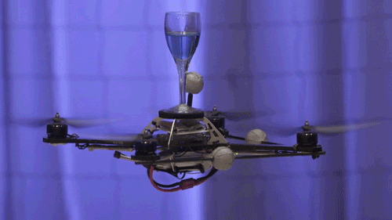

# Drones

### **Drones (Aerial Robotics): A Comprehensive Guide** 

<figure><figcaption></figcaption></figure>

Drones, formally known as Unmanned Aerial Vehicles (UAVs) or Unmanned Aircraft Systems (UAS), are aircraft without an onboard human pilot, operated either remotely or autonomously . Initially prominent in military applications, drone technology has rapidly evolved, becoming accessible and versatile for a vast array of commercial, civilian, and scientific purposes . From aerial photography and infrastructure inspection to package delivery and environmental monitoring, drones are transforming industries and creating new possibilities . This guide delves into the fundamentals of drone technology, their types, core components, autonomous capabilities including swarm robotics, diverse applications, the companies and institutes driving innovation (including those in India), significant research areas, and further resources.

***

### **1. Guide to Drones (Aerial Robotics)**

### **1.1. What are Drones? Definition and Significance**

A **drone** is an uncrewed aircraft that can be remotely controlled or fly autonomously using pre-programmed flight plans or more complex dynamic automation systems . The term UAS encompasses the drone itself, the ground-based controller, and the system of communications between them.

**Significance of Drones :**

* **Accessibility & Cost-Effectiveness:** Drones offer a relatively low-cost way to perform aerial tasks compared to manned aircraft.
* **Safety Enhancement:** They can undertake tasks in hazardous or difficult-to-reach environments, reducing risk to human personnel (e.g., inspecting power lines, disaster assessment) .
* **Data Acquisition:** Capable of collecting high-resolution imagery, LiDAR data, thermal data, and other sensor information efficiently.
* **Increased Efficiency:** Automate and speed up processes in agriculture, construction, logistics, and surveillance.
* **New Perspectives:** Provide unique aerial viewpoints for cinematography, journalism, and real estate.
* **Innovation Catalyst:** Driving advancements in robotics, AI, sensor technology, and data analytics .

### **1.2. How Drones Work: Core Principles**

Drones operate based on principles of aerodynamics, propulsion, navigation, and control. Multirotor drones, the most common type for many applications, use multiple propellers to generate lift and control their movement by varying the rotational speed of individual motors. Fixed-wing drones operate more like traditional airplanes. Autonomous flight relies on a sophisticated interplay of sensors, processors, and control algorithms .

### **1.3. Types and Classifications of Drones**

Drones vary widely in design, size, and capability, tailored for different applications :

| Drone Type                         | Description                                                                                                  | Common Uses                                                                        |
| ---------------------------------- | ------------------------------------------------------------------------------------------------------------ | ---------------------------------------------------------------------------------- |
| **Multirotor Drones**              | Use multiple rotors (e.g., quadcopters, hexacopters, octocopters) for lift and control. Capable of VTOL.     | Photography, videography, inspection, surveillance, short-range delivery, racing.  |
| **Fixed-Wing Drones**              | Resemble traditional airplanes with wings for lift. Generally offer longer flight times and higher speeds.   | Long-range surveillance, mapping, agriculture, cargo transport.                    |
| **VTOL Hybrid Drones**             | Combine features of multirotor (for vertical takeoff/landing) and fixed-wing (for efficient forward flight). | Versatile applications requiring both VTOL and endurance/range.                    |
| **Single-Rotor Helicopter Drones** | Use a single large rotor like traditional helicopters. Can offer higher payload capacity and endurance.      | Heavy-lift tasks, specialized industrial applications (e.g., EndureAir's Vibhram). |
| **Micro and Nano Drones**          | Extremely small drones, often bio-inspired, for surveillance or operation in confined spaces.                | Indoor surveillance, research.                                                     |
| **Biomimetic Systems**             | Drones designed to mimic the flight or form of birds or insects.                                             | Research, specialized surveillance.                                                |

### **1.4. Core Components and Subsystems of Drones**

A typical drone comprises several critical components [6](https://docs.duckietown.com/ente/course-intro-to-drones/book.pdf)[12](https://www.autonomousrobotslab.com/uploads/5/8/4/4/58449511/01_intro_dronesdemystified_v2.pdf):

| Component Category               | Examples/Details                                                                                                                                                                                                                                                                                                                                                                                                                                                                                                                          |
| -------------------------------- | ----------------------------------------------------------------------------------------------------------------------------------------------------------------------------------------------------------------------------------------------------------------------------------------------------------------------------------------------------------------------------------------------------------------------------------------------------------------------------------------------------------------------------------------- |
| **Airframe/Body**                | The structural chassis of the drone.                                                                                                                                                                                                                                                                                                                                                                                                                                                                                                      |
| **Propulsion System**            | Motors, propellers, Electronic Speed Controllers (ESCs).                                                                                                                                                                                                                                                                                                                                                                                                                                                                                  |
| **Flight Controller**            | The "brain" of the drone, processes sensor data, executes flight commands (e.g., Pixhawk, ArduPilot).                                                                                                                                                                                                                                                                                                                                                                                                                                     |
| **Navigation System**            | 
<strong>GPS:</strong> For outdoor positioning. <strong>IMU (Inertial Measurement Unit):</strong> Accelerometers, gyroscopes for orientation and motion sensing. <strong>Magnetometer:</strong> For yaw/heading (not on all drones like Duckiedrone <a href="https://docs.duckietown.com/ente/course-intro-to-drones/book.pdf">6</a>). <strong>Barometer:</strong> For altitude.
                                                                                                                                           |
| **Perception Sensors**           | 
<strong>Cameras (RGB, Thermal, Multispectral):</strong> For imaging, visual navigation, object detection, optical flow <a href="https://docs.duckietown.com/ente/course-intro-to-drones/book.pdf">6</a>. <strong>LiDAR:</strong> For 3D mapping, obstacle avoidance. <strong>Time-of-Flight (ToF) / Infrared Range Sensors:</strong> For height/distance measurement <a href="https://docs.duckietown.com/ente/course-intro-to-drones/book.pdf">6</a>. <strong>Ultrasonic/Radar Sensors:</strong> For obstacle detection.
 |
| **Communication System**         | Radio transmitters/receivers (for remote control), Wi-Fi, Cellular, Satellite links (for data and command/control).                                                                                                                                                                                                                                                                                                                                                                                                                       |
| **Power System**                 | Rechargeable batteries (LiPo common), sometimes fuel cells or tethered power; Power Management Units.                                                                                                                                                                                                                                                                                                                                                                                                                                     |
| **Payload**                      | Task-specific equipment: Gimbaled cameras, specialized sensors (e.g., gas detectors), delivery mechanisms, sprayers.                                                                                                                                                                                                                                                                                                                                                                                                                      |
| **Ground Control Station (GCS)** | Software/hardware interface for mission planning, remote piloting, and monitoring drone status.                                                                                                                                                                                                                                                                                                                                                                                                                                           |

### **1.5. Autonomous Flight: Principles and Technologies**

Autonomous drones can perform complex missions with minimal human input, relying on [5](https://www.sjsu.edu/research/strengths/technology/robotics.php)[12](https://www.autonomousrobotslab.com/uploads/5/8/4/4/58449511/01_intro_dronesdemystified_v2.pdf):

* **Autopilot Systems:** Manage flight stability and execute pre-programmed flight paths.
* **SLAM (Simultaneous Localization and Mapping):** Enables navigation in unknown or GPS-denied environments by building a map and tracking the drone's position within it.
* **Path Planning:** Algorithms determine optimal routes considering obstacles, waypoints, and mission objectives.
* **"Sense and Avoid" Systems:** Use sensors (LiDAR, cameras, radar) and AI to detect and maneuver around obstacles.
* **AI and Machine Learning:** For object recognition, scene understanding, decision-making, and adapting to dynamic conditions. Vecros, for example, uses AI and computer vision for intelligent decisions in GPS-denied areas [11](https://inc42.com/startups/eyes-in-the-sky-india-drone-startups-looking-for-major-pie/).

### **1.6. Swarm Robotics with Drones**



Drone swarms involve multiple drones coordinating to achieve a common goal.

* **Principles:** Inspired by collective behavior in nature (e.g., insect swarms).
* **Coordination:** Requires robust inter-drone communication and decentralized or centralized control algorithms.
* **Applications:** Coordinated surveillance, large-scale mapping, search and rescue, agricultural spraying, light shows, communication relays. Hindustan Aeronautics Limited (HAL) is working on combat training with a manned aircraft controlling a swarm of UAVs [9](https://builtin.com/articles/drone-companies-in-india).

***

### **2. Applications of Drones**

Drones are used across a vast spectrum of industries [2](https://www.entsoe.eu/Technopedia/techsheets/drones-and-robotics)[3](https://www.thedroneu.com/blog/top-drone-companies/)[5](https://www.sjsu.edu/research/strengths/technology/robotics.php)[8](https://ghrcemn.raisoni.net/drone-robotics-lab):

| Application Sector             | Examples                                                                                                                                                                                                                                                                                                              |
| ------------------------------ | --------------------------------------------------------------------------------------------------------------------------------------------------------------------------------------------------------------------------------------------------------------------------------------------------------------------- |
| **Aerial Imaging & Media**     | Photography, videography, cinematography, journalism, real estate marketing.                                                                                                                                                                                                                                          |
| **Inspection & Monitoring**    | Infrastructure (power grid [2](https://www.entsoe.eu/Technopedia/techsheets/drones-and-robotics), bridges [5](https://www.sjsu.edu/research/strengths/technology/robotics.php), pipelines, wind turbines, solar farms), construction sites, agriculture (crop health), environmental monitoring, disaster management. |
| **Surveying & Mapping**        | Creating high-resolution maps, 3D models, topographic surveys (GIS mapping [5](https://www.sjsu.edu/research/strengths/technology/robotics.php)).                                                                                                                                                                     |
| **Precision Agriculture**      | Crop monitoring, pest detection, targeted spraying, soil analysis, livestock monitoring.                                                                                                                                                                                                                              |
| **Logistics & Delivery**       | "Last-mile" package delivery, medical supply transport (e.g., Zipline), food delivery.                                                                                                                                                                                                                                |
| **Public Safety & Emergency**  | Search and rescue, disaster assessment, firefighting support [5](https://www.sjsu.edu/research/strengths/technology/robotics.php), law enforcement surveillance, border patrol.                                                                                                                                       |
| **Defense & Security**         | Intelligence, Surveillance, Reconnaissance (ISR), target acquisition, combat support. Aeroarc's Trishul X has dual civilian/military use [9](https://builtin.com/articles/drone-companies-in-india).                                                                                                                  |
| **Industrial Operations**      | Mining, oil & gas (pipeline inspection), power grid maintenance [2](https://www.entsoe.eu/Technopedia/techsheets/drones-and-robotics).                                                                                                                                                                                |
| **Environmental Conservation** | Wildlife monitoring, anti-poaching efforts, habitat mapping.                                                                                                                                                                                                                                                          |
| **Entertainment**              | Drone racing, synchronized light shows.                                                                                                                                                                                                                                                                               |
| **Scientific Research**        | Atmospheric research, geological surveys, archaeological site mapping.                                                                                                                                                                                                                                                |
| **Construction**               | Site progress monitoring, structural inspections, volume calculations [5](https://www.sjsu.edu/research/strengths/technology/robotics.php).                                                                                                                                                                           |
| **Water Operations**           | Underwater (PowerVision PowerRay) and water-surface (PowerVision PowerDolphin) robotic devices for fish finding, exploration [3](https://www.thedroneu.com/blog/top-drone-companies/).                                                                                                                                |

***

### **3. Companies and Institutes Working on Drones**

### **Leading Global Drone Companies & Technology Providers**

| Company Name         | Headquarters        | Key Focus Areas / Products                                                                                                                                                         | Raw Link                         |
| -------------------- | ------------------- | ---------------------------------------------------------------------------------------------------------------------------------------------------------------------------------- | -------------------------------- |
| **DJI**              | Shenzhen, China     | Market leader in consumer and professional drones (Mavic, Phantom, Inspire, Matrice, Agras series).                                                                                | `https://www.dji.com/`           |
| **Autel Robotics**   | Shenzhen, China     | Consumer and professional drones (EVO series: Nano+, Lite+, X-Star Premium) known for camera quality and flight features [3](https://www.thedroneu.com/blog/top-drone-companies/). | `https://www.autelrobotics.com/` |
| **Parrot**           | Paris, France       | Professional and enterprise drones (ANAFI USA, Thermal, Ai), focus on European market and cybersecurity [3](https://www.thedroneu.com/blog/top-drone-companies/).                  | `https://www.parrot.com/`        |
| **Skydio**           | California, USA     | AI-powered autonomous drones, strong in autonomous flight and obstacle avoidance.                                                                                                  | `https://www.skydio.com/`        |
| **Yuneec**           | Kunshan, China      | Consumer and commercial drones (Typhoon series, H520E).                                                                                                                            | `https://us.yuneec.com/`         |
| **PowerVision**      | Beijing, China      | Aerial, water-surface, and underwater robotic devices (PowerEgg, PowerRay, PowerDolphin, PowerSeeker, PowerEgg X) [3](https://www.thedroneu.com/blog/top-drone-companies/).        | `https://www.powervision.me/`    |
| **Zipline**          | California, USA     | Autonomous drone delivery, particularly for medical supplies in remote areas [13](https://wellfound.com/startups/industry/drones-2).                                               | `https://www.flyzipline.com/`    |
| **Wing (Alphabet)**  | California, USA     | Drone delivery services.                                                                                                                                                           | `https://wing.com/`              |
| **Amazon Prime Air** | USA                 | Drone delivery system development.                                                                                                                                                 | _(Search Amazon Prime Air)_      |
| **Auterion**         | Switzerland/USA     | Open-source drone software platform, enterprise drone solutions [13](https://wellfound.com/startups/industry/drones-2).                                                            | `https://auterion.com/`          |
| **DroneDeploy**      | California, USA     | Cloud-based drone mapping and analytics software [13](https://wellfound.com/startups/industry/drones-2).                                                                           | `https://www.dronedeploy.com/`   |
| **Wingtra**          | Zurich, Switzerland | Professional VTOL mapping drones (WingtraOne) [13](https://wellfound.com/startups/industry/drones-2).                                                                              | `https://wingtra.com/`           |
| **Pyka**             | California, USA     | Autonomous electric cargo and agricultural spray aircraft [13](https://wellfound.com/startups/industry/drones-2).                                                                  | `https://www.flypyka.com/`       |

### **Drone Companies and Institutes in India**

| Entity Name                              | Headquarters     | Key Focus Areas / Products / Contributions                                                                                                                                                                                                      | Raw Link                                                                                          |
| ---------------------------------------- | ---------------- | ----------------------------------------------------------------------------------------------------------------------------------------------------------------------------------------------------------------------------------------------- | ------------------------------------------------------------------------------------------------- |
| **EndureAir Systems Inc.**               | Kanpur           | UAV manufacturer, state-of-the-art solutions, novel airframes, autopilots, AI tools. Vibhram (single-main-rotor helicopter UAV for payload delivery) [4](https://www.nist.gov/ctl/pscr/endureair-systems).                                      | `https://www.endureair.tech/` (via email in [4](https://www.nist.gov/ctl/pscr/endureair-systems)) |
| **Hindustan Aeronautics Limited (HAL)**  | Bengaluru        | Aerospace and defense PSU. Developing advanced military UAVs, AI-powered multimodal drones, combat training systems with drone swarms [9](https://builtin.com/articles/drone-companies-in-india).                                               | `https://hal-india.co.in/`                                                                        |
| **Aeroarc**                              | New Delhi        | Aerial and terrestrial unmanned systems for harsh conditions, dual-use drones (e.g., Trishul X for reconnaissance/disaster management, AeroLM for mapping) [9](https://builtin.com/articles/drone-companies-in-india).                          | _(Search Aeroarc India)_                                                                          |
| **Asteria Aerospace**                    | Bengaluru        | Full-stack robotics and AI company, drone-based aerial data intelligence for security, surveillance, and industrial monitoring (oil, gas, agriculture) [9](https://builtin.com/articles/drone-companies-in-india).                              | `https://asteria.co.in/`                                                                          |
| **ideaForge Technology**                 | Mumbai           | Leading Indian drone manufacturer for surveillance, mapping, and inspection (NETRA, Q Series, SWITCH UAV).                                                                                                                                      | `https://www.ideaforgetech.com/`                                                                  |
| **DroneAcharya Aerial Innovations Ltd.** | Pune             | Drone research, consulting, DGCA-certified drone pilot training [7](https://www.smallcase.com/collections/drone-stocks-in-india/).                                                                                                              | `https://droneacharya.com/`                                                                       |
| **Omnipresent Robot Technologies**       | Delhi NCR/Global | Industrial drone and robotics solutions provider, early player in Indian drone market [11](https://inc42.com/startups/eyes-in-the-sky-india-drone-startups-looking-for-major-pie/).                                                             | `https://www.omnipresenttech.com/`                                                                |
| **Vecros**                               | Bengaluru        | Non-GPS autonomous drones using cameras/vision sensors, AI-enabled software (JETPIX™), custom PCB (JETCORE) for construction, warehouses, defense [11](https://inc42.com/startups/eyes-in-the-sky-india-drone-startups-looking-for-major-pie/). | `https://www.vecros.com/`                                                                         |
| **Garuda Aerospace**                     | Chennai          | Drone-as-a-Service (DaaS) provider, agricultural drones, surveillance.                                                                                                                                                                          | `https://www.garudaaerospace.com/`                                                                |
| **Marut Drones**                         | Hyderabad        | Drones for agriculture, healthcare, surveillance, and e-commerce.                                                                                                                                                                               | `https://www.marutdrones.com/`                                                                    |
| **Throttle Aerospace Systems (TAS)**     | Bengaluru        | Drone manufacturing, including heavy-lift drones and defense solutions.                                                                                                                                                                         | `https://www.throttleaerospace.com/`                                                              |
| **IITs (e.g., Kanpur, Bombay, Delhi)**   | Various          | Research in aerodynamics, autonomous control, AI for drones, sensor development. IIT Delhi developed an aerial robot for its campus [11](https://inc42.com/startups/eyes-in-the-sky-india-drone-startups-looking-for-major-pie/).               | _(Search specific IIT department pages)_                                                          |
| **IISc Bangalore**                       | Bengaluru        | Advanced research in aerospace engineering, AI, and robotics relevant to drone technology.                                                                                                                                                      | `https://iisc.ac.in/`                                                                             |
| **NITs & IIITs**                         | Various          | Research and development in drone-related technologies. G H Raisoni College of Engineering, Nagpur has a Drone and Robotics Lab [8](https://ghrcemn.raisoni.net/drone-robotics-lab).                                                            | _(Search specific institute pages)_                                                               |

***

### **4. Frontier Work & Interesting Research Areas in Drones**

| Research Area                                | Focus / Key Concepts                                                                                                                                                                                                                                                                                                                                                                                                        | Example Institutions/Focus                                                                                                                                                                                                                                                                                                                               |
| -------------------------------------------- | --------------------------------------------------------------------------------------------------------------------------------------------------------------------------------------------------------------------------------------------------------------------------------------------------------------------------------------------------------------------------------------------------------------------------- | -------------------------------------------------------------------------------------------------------------------------------------------------------------------------------------------------------------------------------------------------------------------------------------------------------------------------------------------------------- |
| **Advanced Autonomy & AI**                   | AI-driven solutions for human-like perception, complex decision-making, enhanced safety, and autonomous navigation in complex/GPS-denied environments [5](https://www.sjsu.edu/research/strengths/technology/robotics.php)[11](https://inc42.com/startups/eyes-in-the-sky-india-drone-startups-looking-for-major-pie/)[12](https://www.autonomousrobotslab.com/uploads/5/8/4/4/58449511/01_intro_dronesdemystified_v2.pdf). | San Jose State University [5](https://www.sjsu.edu/research/strengths/technology/robotics.php), Vecros [11](https://inc42.com/startups/eyes-in-the-sky-india-drone-startups-looking-for-major-pie/), Autonomous Robots Lab (Univ. of Nevada, Reno) [12](https://www.autonomousrobotslab.com/uploads/5/8/4/4/58449511/01_intro_dronesdemystified_v2.pdf). |
| **Drone Swarms & Multi-Agent Systems**       | Coordinated flight, distributed task allocation, resilient communication for surveillance, search & rescue, light shows, agricultural applications.                                                                                                                                                                                                                                                                         | HAL [9](https://builtin.com/articles/drone-companies-in-india), research labs focusing on multi-robot systems.                                                                                                                                                                                                                                           |
| **Novel Airframe Design & Propulsion**       | Development of new drone configurations (biomimetic, hybrid VTOL), efficient propulsion systems, and advanced materials for better endurance and payload capacity [4](https://www.nist.gov/ctl/pscr/endureair-systems)[12](https://www.autonomousrobotslab.com/uploads/5/8/4/4/58449511/01_intro_dronesdemystified_v2.pdf).                                                                                                 | EndureAir Systems (novel airframes) [4](https://www.nist.gov/ctl/pscr/endureair-systems), research labs in aerospace engineering.                                                                                                                                                                                                                        |
| **Onboard State Estimation & Perception**    | Real-time estimation of drone pose (position, orientation) using sensor fusion (IMU, cameras, LiDAR) for robust navigation, especially without GPS [6](https://docs.duckietown.com/ente/course-intro-to-drones/book.pdf)[12](https://www.autonomousrobotslab.com/uploads/5/8/4/4/58449511/01_intro_dronesdemystified_v2.pdf).                                                                                               | Duckietown (educational drone platform) [6](https://docs.duckietown.com/ente/course-intro-to-drones/book.pdf), Autonomous Robots Lab (Univ. of Nevada, Reno) [12](https://www.autonomousrobotslab.com/uploads/5/8/4/4/58449511/01_intro_dronesdemystified_v2.pdf).                                                                                       |
| **Human-Robot Interaction (HRI) for Drones** | Intuitive control interfaces, collaborative drone operations with humans.                                                                                                                                                                                                                                                                                                                                                   | San Jose State University (HRI focus) [5](https://www.sjsu.edu/research/strengths/technology/robotics.php).                                                                                                                                                                                                                                              |
| **Ethical and Secure Drone Operations**      | Developing secure communication protocols, data privacy measures, and frameworks for responsible AI in drones.                                                                                                                                                                                                                                                                                                              | Research on cybersecurity for UAS.                                                                                                                                                                                                                                                                                                                       |
| **Specialized Drone Applications**           | Drones for GIS mapping, AI-based bridge/road inspection [5](https://www.sjsu.edu/research/strengths/technology/robotics.php), assisting firefighters [5](https://www.sjsu.edu/research/strengths/technology/robotics.php), power grid maintenance [2](https://www.entsoe.eu/Technopedia/techsheets/drones-and-robotics).                                                                                                    | San Jose State University [5](https://www.sjsu.edu/research/strengths/technology/robotics.php), various industry-specific research.                                                                                                                                                                                                                      |
| **Robotics in Drone Education**              | Using drones as platforms for teaching robotics, programming, AI, and systems thinking [6](https://docs.duckietown.com/ente/course-intro-to-drones/book.pdf)[10](https://gyanviharworld.school/drones-and-robotics-exploring-the-exciting-world-of-unmanned-technology/).                                                                                                                                                   | Duckietown [6](https://docs.duckietown.com/ente/course-intro-to-drones/book.pdf), Gyan Vihar World School [10](https://gyanviharworld.school/drones-and-robotics-exploring-the-exciting-world-of-unmanned-technology/).                                                                                                                                  |

***

### **5. Comprehensive Guides & Further Resources**

| Resource Title                                                    | Provider/Source                               | Key Content                                                                                                                                                                                                                                      | Raw Link                                                                                         |
| ----------------------------------------------------------------- | --------------------------------------------- | ------------------------------------------------------------------------------------------------------------------------------------------------------------------------------------------------------------------------------------------------ | ------------------------------------------------------------------------------------------------ |
| Introduction to Aerial Robotics (Drones Demystified!) PDF         | Autonomous Robots Lab (Univ. of Nevada, Reno) | Broad understanding of aerial robot flight/operation, design of navigation/autonomy, modeling, state estimation, controls, motion planning [12](https://www.autonomousrobotslab.com/uploads/5/8/4/4/58449511/01_intro_dronesdemystified_v2.pdf). | `https://www.autonomousrobotslab.com/uploads/5/8/4/4/58449511/01_intro_dronesdemystified_v2.pdf` |
| Introduction to Robotics with Drones (Duckietown Textbook) PDF    | Duckietown Organization                       | Building, programming, operating autonomous drones; sensors (ToF, IMU, Camera), ROS integration, state estimation [6](https://docs.duckietown.com/ente/course-intro-to-drones/book.pdf).                                                         | `https://docs.duckietown.com/ente/course-intro-to-drones/book.pdf`                               |
| Drones and Robotics (for Power Grid)                              | ENTSO-e                                       | Use of drones/robotics for improving power grid maintenance quality and productivity [2](https://www.entsoe.eu/Technopedia/techsheets/drones-and-robotics).                                                                                      | `https://www.entsoe.eu/Technopedia/techsheets/drones-and-robotics`                               |
| Robots and Drones Research Strength                               | San Jose State University                     | AI-driven solutions for human-like perception, complex decisions, safety, autonomous navigation, drone applications [5](https://www.sjsu.edu/research/strengths/technology/robotics.php).                                                        | `https://www.sjsu.edu/research/strengths/technology/robotics.php`                                |
| The Top 29 Drone Companies in 2025                                | The Drone U Blog                              | List and profiles of leading global drone manufacturers [3](https://www.thedroneu.com/blog/top-drone-companies/).                                                                                                                                | `https://www.thedroneu.com/blog/top-drone-companies/`                                            |
| 20 Top Drone Companies in India                                   | Built In                                      | Profiles of prominent Indian drone companies [9](https://builtin.com/articles/drone-companies-in-india).                                                                                                                                         | `https://builtin.com/articles/drone-companies-in-india`                                          |
| Eyes In The Sky: 42 Indian Drone Startups Looking For A Major Pie | Inc42                                         | Overview of the Indian drone startup ecosystem [11](https://inc42.com/startups/eyes-in-the-sky-india-drone-startups-looking-for-major-pie/).                                                                                                     | `https://inc42.com/startups/eyes-in-the-sky-india-drone-startups-looking-for-major-pie/`         |
| List of Best Drone Stocks in India (2025)                         | Smallcase                                     | Information on publicly listed drone-related companies in India [7](https://www.smallcase.com/collections/drone-stocks-in-india/).                                                                                                               | `https://www.smallcase.com/collections/drone-stocks-in-india/`                                   |
| Best Drones Companies and Startups to Work for in 2025            | Wellfound (formerly AngelList Talent)         | List of notable drone startups globally [13](https://wellfound.com/startups/industry/drones-2).                                                                                                                                                  | `https://wellfound.com/startups/industry/drones-2`                                               |
