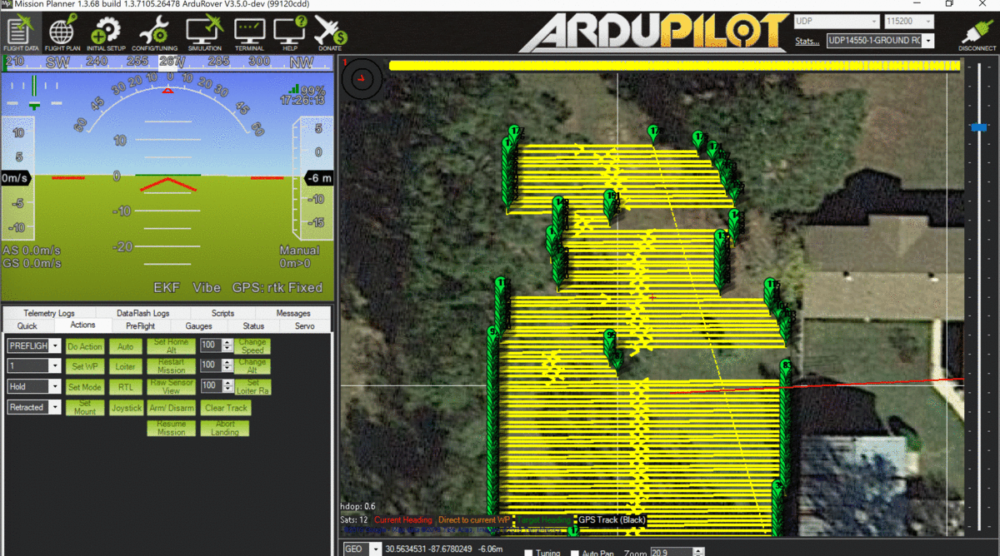

# Drone Anatomy



### **Understanding Drone Anatomy: Core Components, Subsystems, and DIY Builds** 

Building your own drone, especially a quadcopter, can be an incredibly rewarding experience, offering deep insights into how these aerial robots function. Whether you're aiming for a simple flyer, a high-performance FPV (First-Person View) racer, or a platform for aerial photography, understanding the core components and how they integrate is crucial. This guide breaks down the essential parts of a typical multirotor drone, explains their roles, and provides resources and links to DIY build guides.

***

### **1. Essential Drone Components and Subsystems**



Building a functional drone requires a synergistic interplay of several key parts. Here’s a breakdown of the most important components [2](https://umilesgroup.com/en/what-are-the-parts-of-a-drone-full-list/)[9](https://robocraze.com/blogs/post/drone-part-list)[11](https://www.slideshare.net/slideshow/drone-componentspptx/259226017)[13](https://roboticsbiz.com/seven-basis-components-for-building-a-drone/)[15](https://vayuyaan.com/blog/diy-drone-exciting-guide-to-building-your-drone/):

| Component/Subsystem                                                        | Description & Function                                                                                                                                                                                                                                                                                                                                                                                                                                                                                                                                                                                                                                 | Key Considerations for DIY Builds                                                                                                                                                                                                                                                                                                                                                                                                                                                                                                                          |
| -------------------------------------------------------------------------- | ------------------------------------------------------------------------------------------------------------------------------------------------------------------------------------------------------------------------------------------------------------------------------------------------------------------------------------------------------------------------------------------------------------------------------------------------------------------------------------------------------------------------------------------------------------------------------------------------------------------------------------------------------ | ---------------------------------------------------------------------------------------------------------------------------------------------------------------------------------------------------------------------------------------------------------------------------------------------------------------------------------------------------------------------------------------------------------------------------------------------------------------------------------------------------------------------------------------------------------- |
| **1. Drone Frame (Chassis)**                                               | The structural backbone that holds all components together. Provides mounting points for motors, electronics, and battery [2](https://umilesgroup.com/en/what-are-the-parts-of-a-drone-full-list/)[9](https://robocraze.com/blogs/post/drone-part-list).                                                                                                                                                                                                                                                                                                                                                                                               | 
<strong>Material:</strong> Carbon fiber (light, strong, common for FPV), aluminum, plastic. <strong>Size:</strong> Dictated by propeller size (e.g., 5-inch frame for 5-inch props). <strong>Configuration:</strong> Quadcopter (X, H), hexacopter, etc. <strong>Weight &#x26; Durability:</strong> Balance between lightness for agility and strength for crash resistance <a href="https://nidar.org.in/gallery-2/">8</a>.
                                                                                                               |
| **2. Motors (Brushless DC)**                                               | Generate the rotational force to spin the propellers, creating thrust for lift and maneuverability [2](https://umilesgroup.com/en/what-are-the-parts-of-a-drone-full-list/)[3](https://uavsystemsinternational.com/blogs/drone-guides/how-does-a-drone-work-components-of-drone)[9](https://robocraze.com/blogs/post/drone-part-list). Typically, two motors spin clockwise (CW) and two counter-clockwise (CCW) on a quadcopter [7](https://insidefpv.com/blogs/blogs/building-your-own-fpv-drone-step-by-step-guide).                                                                                                                                | 
<strong>Size &#x26; KV Rating:</strong> KV (RPM per volt) determines speed/torque. Lower KV for larger props/efficiency, higher KV for smaller props/acrobatics. Match to frame and propeller size <a href="https://robocraze.com/blogs/post/drone-part-list">9</a>. <strong>Thrust:</strong> Ensure motors provide enough thrust for the drone's total weight (aim for at least a 2:1 thrust-to-weight ratio).
                                                                                                                                  |
| **3. Propellers (Props)**                                                  | Airfoil-shaped blades that, when rotated by the motors, create an air pressure difference, generating lift and thrust [2](https://umilesgroup.com/en/what-are-the-parts-of-a-drone-full-list/)[9](https://robocraze.com/blogs/post/drone-part-list)[13](https://roboticsbiz.com/seven-basis-components-for-building-a-drone/). Come in pairs: standard (CCW) and reverse/pusher (CW) for stability [2](https://umilesgroup.com/en/what-are-the-parts-of-a-drone-full-list/).                                                                                                                                                                           | 
<strong>Size &#x26; Pitch:</strong> Must match motor capabilities and frame size (e.g., 1045 = 10-inch diameter, 4.5-inch pitch) <a href="https://vayuyaan.com/blog/diy-drone-exciting-guide-to-building-your-drone/">15</a>. <strong>Number of Blades:</strong> 2-blade, 3-blade, etc. Affects thrust and efficiency. <strong>Material:</strong> Plastic (cheaper, more forgiving), carbon fiber (stiffer, more responsive, expensive) <a href="https://roboticsbiz.com/seven-basis-components-for-building-a-drone/">13</a>.
                |
| **4. Electronic Speed Controllers (ESCs)**                                 | Control the speed of each brushless motor by precisely adjusting the amount of power delivered from the battery [3](https://uavsystemsinternational.com/blogs/drone-guides/how-does-a-drone-work-components-of-drone)[9](https://robocraze.com/blogs/post/drone-part-list)[11](https://www.slideshare.net/slideshow/drone-componentspptx/259226017). They convert DC power from the battery into three-phase AC power for the motors.                                                                                                                                                                                                                  | 
<strong>Current Rating (Amps):</strong> Must exceed the motor's maximum current draw. <strong>Firmware:</strong> (e.g., BLHeli_S, BLHeli_32) affects performance and features. <strong>Protocol:</strong> (e.g., DShot, Multishot) for communication with the flight controller. <strong>BEC (Battery Eliminator Circuit):</strong> Some ESCs have a built-in BEC to power the flight controller and receiver.
                                                                                                                             |
| **5. Flight Controller (FC)**                                              | The "brain" of the drone. Contains sensors (IMU: gyroscope, accelerometer) and a microprocessor. It takes input from the receiver (pilot commands) and onboard sensors, then sends signals to the ESCs to stabilize and maneuver the drone [3](https://uavsystemsinternational.com/blogs/drone-guides/how-does-a-drone-work-components-of-drone)[6](https://makerbazar.in/blogs/news-15/how-to-make-your-own-quadcopter-drone)[9](https://robocraze.com/blogs/post/drone-part-list)[13](https://roboticsbiz.com/seven-basis-components-for-building-a-drone/).                                                                                         | 
<strong>Processor:</strong> F4, F7, H7 are common (higher number generally means faster). <strong>Firmware Compatibility:</strong> Betaflight, ArduPilot (APM), PX4, iNAV are popular open-source firmware. <strong>Built-in Features:</strong> Some FCs have integrated PDB, OSD (On-Screen Display), barometer, magnetometer. <strong>Mounting Pattern:</strong> Standard sizes (e.g., 30.5x30.5mm, 20x20mm).
                                                                                                                            |
| **6. Power Distribution Board (PDB) (Optional with some FCs)**             | Distributes power from the battery to the ESCs and other components like the flight controller, FPV gear, and LEDs. Many modern FCs integrate PDB functionality ("All-in-One" or AIO FCs) [5](https://www.instructables.com/Build-a-High-Performance-FPV-Camera-Quadcopter/).                                                                                                                                                                                                                                                                                                                                                                          | 
<strong>Voltage Regulation:</strong> Ensure it provides the correct voltages for different components. <strong>Current Handling Capacity:</strong> Must support the total current draw. <strong>Soldering Pads:</strong> Clearly marked and robust pads are essential for reliable connections.
                                                                                                                                                                                                                                               |
| **7. Battery (LiPo - Lithium Polymer)**                                    | Provides power to the entire drone system. LiPo batteries are favored for their high energy density and discharge rates [3](https://uavsystemsinternational.com/blogs/drone-guides/how-does-a-drone-work-components-of-drone)[11](https://www.slideshare.net/slideshow/drone-componentspptx/259226017)[13](https://roboticsbiz.com/seven-basis-components-for-building-a-drone/).                                                                                                                                                                                                                                                                      | 
<strong>Voltage (Cell Count - 'S'):</strong> e.g., 3S (11.1V), 4S (14.8V), 6S (22.2V). Must match motor/ESC specs. <strong>Capacity (mAh):</strong> Determines flight time (e.g., 1500mAh). <strong>Discharge Rate ('C' Rating):</strong> Must be high enough for the motors' peak current draw <a href="https://roboticsbiz.com/seven-basis-components-for-building-a-drone/">13</a>. <strong>Connector Type:</strong> XT60, XT30 are common. <strong>Weight &#x26; Size:</strong> Affects flight performance and frame compatibility.
 |
| **8. Radio Transmitter (TX) & Receiver (RX)**                              | 
<strong>Transmitter (TX):</strong> The handheld remote control used by the pilot to send commands to the drone <a href="https://robocraze.com/blogs/post/drone-part-list">9</a><a href="https://roboticsbiz.com/seven-basis-components-for-building-a-drone/">13</a>. <strong>Receiver (RX):</strong> Mounted on the drone, it receives signals from the TX and sends them to the flight controller <a href="https://uavsystemsinternational.com/blogs/drone-guides/how-does-a-drone-work-components-of-drone">3</a><a href="https://robocraze.com/blogs/post/drone-part-list">9</a>.
                                                        | 
<strong>Number of Channels:</strong> At least 4 needed for basic flight (throttle, yaw, pitch, roll); more for auxiliary functions (modes, arming). <strong>Protocol:</strong> (e.g., FrSky ACCST/ACCESS, Spektrum DSMX, Crossfire, ELRS). RX and TX must use the same protocol. <strong>Range &#x26; Reliability:</strong> Important for maintaining control.
                                                                                                                                                                                |
| **9. FPV (First-Person View) System (Optional but common for FPV drones)** | Allows the pilot to see what the drone sees in real-time via goggles or a screen.                                                                                                                                                                                                                                                                                                                                                                                                                                                                                                                                                                      | 
<strong>FPV Camera:</strong> Small camera mounted on the drone. <strong>Video Transmitter (VTX):</strong> Transmits the camera's video signal. <strong>VTX Antenna:</strong> Crucial for video signal quality. <strong>FPV Goggles/Screen:</strong> Displays the live video feed.
                                                                                                                                                                                                                                                          |
| **10. GPS Module (Optional)**                                              | Provides location data for features like position hold, return-to-home, and autonomous waypoint navigation [8](https://nidar.org.in/gallery-2/)[11](https://www.slideshare.net/slideshow/drone-componentspptx/259226017).                                                                                                                                                                                                                                                                                                                                                                                                                              | 
<strong>Accuracy &#x26; Satellite Lock Speed:</strong> Varies between modules. <strong>Integrated Compass (Magnetometer):</strong> Often included, helps with heading determination.
                                                                                                                                                                                                                                                                                                                                                             |
| **11. Miscellaneous Hardware**                                             | Landing gear [11](https://www.slideshare.net/slideshow/drone-componentspptx/259226017)[13](https://roboticsbiz.com/seven-basis-components-for-building-a-drone/), screws, standoffs, zip ties [7](https://insidefpv.com/blogs/blogs/building-your-own-fpv-drone-step-by-step-guide), Velcro straps for battery [5](https://www.instructables.com/Build-a-High-Performance-FPV-Camera-Quadcopter/), heat shrink tubing [7](https://insidefpv.com/blogs/blogs/building-your-own-fpv-drone-step-by-step-guide), wires, connectors (XT60, JST, servo connectors), LEDs [5](https://www.instructables.com/Build-a-High-Performance-FPV-Camera-Quadcopter/). | Essential for assembly, cable management, and securing components.                                                                                                                                                                                                                                                                                                                                                                                                                                                                                         |

***

### **2. Guide to DIY Drone Building**

Building your own drone, especially an FPV quadcopter, is a hands-on learning experience. While challenging, it's highly rewarding and gives you a deep understanding of each component's role [14](https://oscarliang.com/how-to-build-fpv-drone/).

### **2.1. Planning Your Build**

* **Purpose:** What do you want to do with the drone (racing, freestyle FPV, aerial photography, learning)? This dictates component choices.
* **Budget:** Set a realistic budget. Components vary widely in price.
* **Research:** Watch build videos, read guides, and understand component compatibility. Oscar Liang's blog and Joshua Bardwell's YouTube channel are excellent resources for FPV drone building [8](https://nidar.org.in/gallery-2/)[14](https://oscarliang.com/how-to-build-fpv-drone/).

### **2.2. Gathering Components and Tools**

**Essential Components (Recap from above):**

* Frame
* Motors (4 for a quadcopter)
* ESCs (4, or a 4-in-1 ESC)
* Flight Controller
* Propellers (CW and CCW sets)
* Battery (LiPo) and Charger
* Radio Transmitter and Receiver
* (Optional but recommended for FPV: FPV Camera, VTX, FPV Goggles)

**Essential Tools** [**7**](https://insidefpv.com/blogs/blogs/building-your-own-fpv-drone-step-by-step-guide)**:**

* Soldering iron and solder (good soldering skills are crucial)
* Hex drivers/screwdrivers (appropriate sizes for your frame and motors)
* Wire strippers and cutters
* Tweezers
* Heat shrink tubing and heat gun/lighter
* Zip ties for cable management
* Multimeter (for checking continuity and voltages)
* Anti-static mat (recommended)
* Threadlocker (e.g., Loctite for motor screws) [14](https://oscarliang.com/how-to-build-fpv-drone/)[16](https://dronenodes.com/how-to-build-a-drone/)

### **2.3. Step-by-Step Assembly Process (General Outline)**

<figure><figcaption></figcaption></figure>

The exact order can vary slightly based on the frame and components, but a common workflow is [5](https://www.instructables.com/Build-a-High-Performance-FPV-Camera-Quadcopter/)[6](https://makerbazar.in/blogs/news-15/how-to-make-your-own-quadcopter-drone)[7](https://insidefpv.com/blogs/blogs/building-your-own-fpv-drone-step-by-step-guide)[12](https://dojofordrones.com/build-a-drone/)[14](https://oscarliang.com/how-to-build-fpv-drone/)[15](https://vayuyaan.com/blog/diy-drone-exciting-guide-to-building-your-drone/)[16](https://dronenodes.com/how-to-build-a-drone/):

1. **Frame Assembly:** Assemble the drone frame first, following the manufacturer's instructions. Ensure all screws are secure but avoid over-tightening on carbon fiber [7](https://insidefpv.com/blogs/blogs/building-your-own-fpv-drone-step-by-step-guide)[16](https://dronenodes.com/how-to-build-a-drone/). Some builders sand or glue carbon fiber edges for durability [16](https://dronenodes.com/how-to-build-a-drone/).
2. **Motor Mounting:** Attach motors to the arms of the frame. Pay attention to motor rotation direction if specified (though reversible in software). Use threadlocker on motor screws [14](https://oscarliang.com/how-to-build-fpv-drone/). Crucially, ensure screws are not too long and don't touch motor windings [14](https://oscarliang.com/how-to-build-fpv-drone/).
3. **ESC Installation & Wiring:**
   * If using individual ESCs, mount one on each arm [12](https://dojofordrones.com/build-a-drone/).
   * Solder ESC power wires to the Power Distribution Board (PDB) or the 4-in-1 ESC pads on the flight controller if it has an integrated PDB.
   * Solder ESC signal wires to the appropriate motor signal pads on the flight controller [7](https://insidefpv.com/blogs/blogs/building-your-own-fpv-drone-step-by-step-guide).
   * **Tip:** Tinning pads and wires before soldering makes the process easier.
4. **Power Distribution Board (PDB) Mounting (if not integrated into FC):** Mount the PDB, usually in the center of the frame, using nylon standoffs. Ensure no conductive parts touch the carbon fiber frame [16](https://dronenodes.com/how-to-build-a-drone/). Solder the main battery connector (e.g., XT60) to the PDB's input pads [5](https://www.instructables.com/Build-a-High-Performance-FPV-Camera-Quadcopter/)[12](https://dojofordrones.com/build-a-drone/).
5. **Flight Controller (FC) Mounting:** Mount the FC, typically on top of the PDB or in a dedicated spot, using vibration-dampening grommets or standoffs [7](https://insidefpv.com/blogs/blogs/building-your-own-fpv-drone-step-by-step-guide)[14](https://oscarliang.com/how-to-build-fpv-drone/).
6. **Connecting Components to FC:**
   * Connect ESC signal wires (if not already done).
   * Connect the radio receiver to the appropriate UART port on the FC [5](https://www.instructables.com/Build-a-High-Performance-FPV-Camera-Quadcopter/).
   * Connect FPV camera and VTX to the FC (if applicable) according to the FC's wiring diagram.
   * Connect GPS module (if applicable).
   * **Double-check all wiring carefully to prevent short circuits that can fry components** [7](https://insidefpv.com/blogs/blogs/building-your-own-fpv-drone-step-by-step-guide).
7. **FPV System Installation (if applicable):** Mount the FPV camera and VTX. Ensure good airflow for the VTX as it can get hot.
8. **Finishing Touches:** Secure all wires neatly with zip ties or heat shrink. Install any 3D printed accessories (antenna mounts, camera protectors) [14](https://oscarliang.com/how-to-build-fpv-drone/). Add Velcro tape and a battery strap to secure the LiPo battery [5](https://www.instructables.com/Build-a-High-Performance-FPV-Camera-Quadcopter/).
9. **Motor and ESC Testing (Before Propellers!):**
   * Use the flight controller software (e.g., Betaflight configurator) to test motor direction and ensure ESCs are responding correctly without propellers attached. This is a crucial safety step.
10. **Propeller Installation:** Install propellers, ensuring CW props go on CW motors and CCW props on CCW motors. If unsure, the flight controller software often shows the correct motor/prop direction. Secure with prop nuts, tight enough so they don't slip but not over-tightened [14](https://oscarliang.com/how-to-build-fpv-drone/).

### **2.4. Flight Controller Configuration (Software Setup)**

<figure><figcaption>
Mission Planner Software
</figcaption></figure>

Once assembled, the flight controller needs to be configured [6](https://makerbazar.in/blogs/news-15/how-to-make-your-own-quadcopter-drone):

* **Connect to Configurator Software:** Connect the FC to a computer via USB and use software like Betaflight Configurator, iNAV Configurator, ArduPilot Mission Planner, or QGroundControl (for PX4).
* **Firmware Update:** Flash the latest stable firmware for your FC.
* **Calibration:** Calibrate sensors (accelerometer, gyroscope). Compass calibration if using GPS.
* **Receiver Setup:** Configure the receiver protocol and channel mapping.
* **ESC Calibration & Motor Setup:** Calibrate ESCs (if needed by your ESC type/firmware) and set motor directions/protocols.
* **Modes Setup:** Configure flight modes (e.g., Acro, Angle, Horizon for FPV; Position Hold, Return-to-Home for GPS drones).
* **OSD Setup (if applicable):** Configure what information is displayed on your FPV feed.
* **Failsafe Setup:** Crucial for safety – configure what the drone does if it loses radio signal (e.g., drop, return-to-home).
* **PID Tuning (Advanced):** Adjust PID controller gains for optimal flight performance and stability. This is an iterative process and often requires flight testing [8](https://nidar.org.in/gallery-2/).

### **2.5. Testing and First Flight**

* **Pre-Flight Checks:** Always perform pre-flight checks: battery charged, props secure and correct orientation, all screws tight, failsafe tested.
* **First Hover Test:** In a safe, open area, away from people, attempt a gentle hover. Check for stability and responsiveness to controls [6](https://makerbazar.in/blogs/news-15/how-to-make-your-own-quadcopter-drone)[15](https://vayuyaan.com/blog/diy-drone-exciting-guide-to-building-your-drone/).
* **Tuning and Practice:** Fine-tune PIDs if needed. Practice flying in a simulator and then in open areas to build piloting skills [8](https://nidar.org.in/gallery-2/)[14](https://oscarliang.com/how-to-build-fpv-drone/).

***

### **3. DIY Drone Build Guides and Resources**

The internet is rich with guides and communities for DIY drone builders.

| Resource Type                               | Name/Source                                                                            | Focus / Key Content                                                                                                                                                                        | Raw Link                                                                                                                   |
| ------------------------------------------- | -------------------------------------------------------------------------------------- | ------------------------------------------------------------------------------------------------------------------------------------------------------------------------------------------ | -------------------------------------------------------------------------------------------------------------------------- |
| **Comprehensive Build Guides (Text/Photo)** | **Oscar Liang FPV Blog**                                                               | Extremely detailed FPV drone build tutorials, component reviews, setup guides (Betaflight), troubleshooting. Highly recommended [14](https://oscarliang.com/how-to-build-fpv-drone/).      | 
<code>https://oscarliang.com/how-to-build-fpv-drone/</code> <code>https://oscarliang.com/fpv-drone-guide/</code>
 |
|                                             | **Instructables: "The Ultimate Guide to Building a Quadcopter From Scratch"**          | General quadcopter build guide, covers construction to code [4](https://www.instructables.com/The-Ultimate-Guide-to-Building-a-Quadcopter-From-S/).                                        | `https://www.instructables.com/The-Ultimate-Guide-to-Building-a-Quadcopter-From-S/`                                        |
|                                             | **Instructables: "Build a High Performance FPV Camera Quadcopter"**                    | Detailed steps for an FPV camera quadcopter build, including specific component mounting and soldering [5](https://www.instructables.com/Build-a-High-Performance-FPV-Camera-Quadcopter/). | `https://www.instructables.com/Build-a-High-Performance-FPV-Camera-Quadcopter/`                                            |
|                                             | **DroneNodes: "How to Build A Drone DIY Step by Step Guide"**                          | Step-by-step FPV drone build, component selection, assembly, wiring, troubleshooting [16](https://dronenodes.com/how-to-build-a-drone/).                                                   | `https://dronenodes.com/how-to-build-a-drone/` (Also linked via NIDAR [8](https://nidar.org.in/gallery-2/))                |
|                                             | **DOJO FOR DRONES: "Learn How to Build Your Own Drone from Scratch"**                  | DIY drone guide from beginner to builder, including soldering and assembly steps [12](https://dojofordrones.com/build-a-drone/).                                                           | `https://dojofordrones.com/build-a-drone/`                                                                                 |
|                                             | **MakerBazar.in Blog: "How to Make Your Own Quadcopter Drone"**                        | Steps for choosing components, assembly, FC configuration, testing [6](https://makerbazar.in/blogs/news-15/how-to-make-your-own-quadcopter-drone).                                         | `https://makerbazar.in/blogs/news-15/how-to-make-your-own-quadcopter-drone`                                                |
|                                             | **Vayuyaan Blog: "DIY Drone - Exciting Guide to Building Your Drone"**                 | Overview of necessary components and step-by-step assembly guide [15](https://vayuyaan.com/blog/diy-drone-exciting-guide-to-building-your-drone/).                                         | `https://vayuyaan.com/blog/diy-drone-exciting-guide-to-building-your-drone/`                                               |
|                                             | **insideFPV Blog: "Building Your Own FPV Drone - Step by step Guide"**                 | Step-by-step FPV drone build guide, including workspace prep and component installation [7](https://insidefpv.com/blogs/blogs/building-your-own-fpv-drone-step-by-step-guide).             | `https://insidefpv.com/blogs/blogs/building-your-own-fpv-drone-step-by-step-guide`                                         |
| **Video Tutorials & Channels**              | **Joshua Bardwell (YouTube)**                                                          | Highly respected FPV drone expert. In-depth reviews, build tutorials, tuning guides, troubleshooting, pro tips [8](https://nidar.org.in/gallery-2/).                                       | `https://www.youtube.com/joshuabardwell`                                                                                   |
|                                             | **DroneBot Workshop (YouTube)**                                                        | Clear, hands-on tutorials and deep dives into the tech behind UAVs and robots [8](https://nidar.org.in/gallery-2/).                                                                        | `https://www.youtube.com/c/Dronebotworkshop`                                                                               |
|                                             | **FPV University (YouTube)**                                                           | Videos covering basics, including flight controller setup [8](https://nidar.org.in/gallery-2/).                                                                                            | _(Search "FPV University" on YouTube)_                                                                                     |
| **Component Information & Selection**       | **Robocraze Blog: "Top 10 Drone Parts List For Building A Drone"**                     | Lists important drone parts needed and explains their functions [9](https://robocraze.com/blogs/post/drone-part-list).                                                                     | `https://robocraze.com/blogs/post/drone-part-list`                                                                         |
|                                             | **RoboticsBiz: "Seven basis components for building a drone"**                         | Explains key components like transmitter, frame, motors, props, FC, battery [13](https://roboticsbiz.com/seven-basis-components-for-building-a-drone/).                                    | `https://roboticsbiz.com/seven-basis-components-for-building-a-drone/`                                                     |
|                                             | **NIDAR Resources: "Drone Parts - From Frame to Flight Controller"**                   | Explains essential parts for a PX4-based system (frame, motors, GPS, battery, FC) [8](https://nidar.org.in/gallery-2/).                                                                    | `https://nidar.org.in/gallery-2/` (Scroll to "Drone Parts - From Frame to Flight Controller")                              |
| **Flight Controller Info & Setup**          | **Oscar Liang: Flight Controller Recommendations & Reviews** (e.g., Speedybee F405 V4) | In-depth reviews and recommendations for flight controllers [14](https://oscarliang.com/how-to-build-fpv-drone/).                                                                          | `https://oscarliang.com/flight-controller/`                                                                                |
|                                             | **NIDAR Resources: Pixhawk and CubePilot Info**                                        | Information on Pixhawk (open-source FC) and CubePilot (advanced FCs like Cube Orange) [8](https://nidar.org.in/gallery-2/).                                                                | `https://nidar.org.in/gallery-2/`                                                                                          |
| **Flight Dynamics & Aerodynamics**          | \*\*NIDAR Resources: "Drones                                                           | The complete flight dynamics" (Sabin Civil Engineering video)\*\*                                                                                                                          | Covers lift, yaw, pitch, roll [8](https://nidar.org.in/gallery-2/).                                                        |
|                                             | **NIDAR Resources: NASA Aerodynamics Guide**                                           | Interactive guide on lift, drag, forces of flight [8](https://nidar.org.in/gallery-2/).                                                                                                    | `https://nidar.org.in/gallery-2/` (Link to NASA guide within page)                                                         |
| **Software & Firmware Guides**              | **ArduPilot Documentation**                                                            | Official guides for ArduPilot setup, sensor calibration, ESC configuration [8](https://nidar.org.in/gallery-2/).                                                                           | `https://ardupilot.org/copter/index.html` (Example for Copter, check relevant vehicle type)                                |
|                                             | **Betaflight Wiki / Oscar Liang Guides**                                               | Setup, tuning, and troubleshooting for Betaflight firmware.                                                                                                                                | 
<code>https://betaflight.com/docs/wiki/</code> <em>(Oscar Liang's site also covers Betaflight extensively)</em>
  |
| **Frame Assembly Example**                  | **Oscar Liang: GEPRC Vapor Frame Review & Assembly**                                   | Detailed assembly for a specific FPV frame [14](https://oscarliang.com/how-to-build-fpv-drone/).                                                                                           | `https://oscarliang.com/geprc-vapor-x5-d5-frame/`                                                                          |
