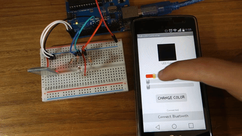
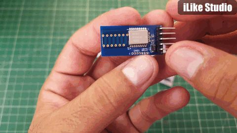
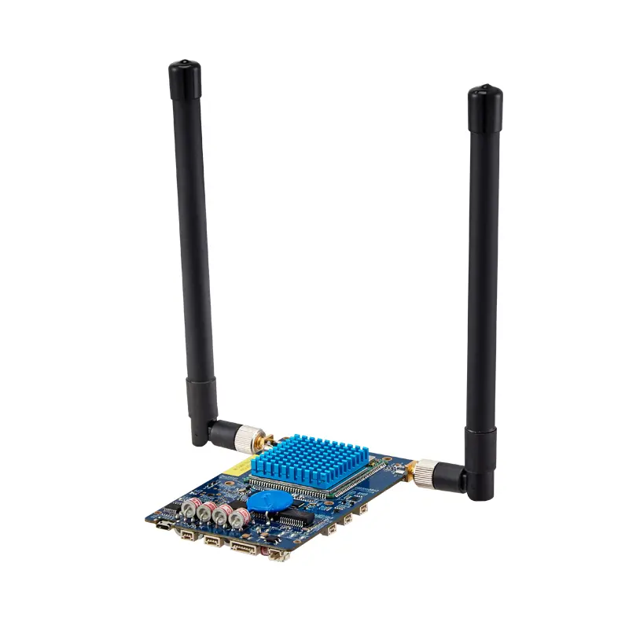
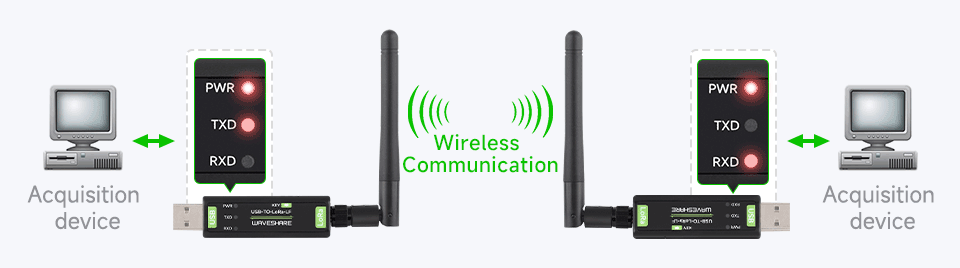

# Communication

## Communication Mediums in Robotics 

Wireless communication plays a crucial role in modern robotics, enabling remote control, data exchange, and coordination between robotic systems. Based on the latest developments in 2025, here's an updated comparison of key communication technologies used in robotics.

### Bluetooth Technology 

<figure><figcaption></figcaption></figure>

**Advantages:**

* Low power consumption, ideal for battery-powered robots
* Simple pairing process makes it user-friendly
* Suitable for short-range communication (typically within 10m)
* Widely available in consumer electronics for easy integration

**Disadvantages:**

* Limited range compared to other wireless technologies
* Typically supports one-to-one or one-to-few connections
* Potential interference in the 2.4GHz band
* Complex mesh networking setup for larger deployments

**Applications:** Wearable robots, exoskeletons, fitness monitoring robots, and interactive toys

### Bluetooth Low Energy (BLE) 

<figure><figcaption></figcaption></figure>

**Advantages:**

* Minimizes battery consumption in small robotic devices
* Ideal for wearables and smaller robotic devices requiring secure, low-power connectivity
* Energy efficiency extends battery life significantly

**Applications:** Medical robots, personal assistant robots, and devices requiring extended battery operation

### ESP-NOW Protocol 

<figure><figcaption></figcaption></figure>

**Advantages:**

* Low latency: direct communication between ESP32 devices reduces response time
* Energy efficient: ideal for battery-powered robotic applications
* Easy setup: doesn't require complex network infrastructure
* Scalable: supports communication with multiple devices simultaneously

**Disadvantages:**

* Limited range: similar to Wi-Fi and affected by physical obstacles
* Limited data transfer capacity: not suitable for large data transfers
* Limited support: specific to ESP devices, limiting interoperability

### Wi-Fi Modules 

<figure><figcaption></figcaption></figure>

**Advantages:**

* High bandwidth to meet big data transmission needs
* Wireless connection eliminates cable constraints in industrial robotics
* Wide coverage area for facility-wide communication
* Enables remote monitoring and management of robotic equipment

**Applications:** AGVs and mobile robots, production line data collection, industrial IoT platforms

**Disadvantages:**

* Higher power consumption compared to BLE or Zigbee
* More complex setup and configuration requirements

### PS2/PS3 Controller Modules 

<figure><figcaption></figcaption></figure>

**Advantages:**

* Provides intuitive control interface with numerous inputs (20 digital buttons and 2 analog sticks)
* Wireless operation gives freedom of movement
* Compatible with Arduino and other microcontrollers using available libraries

**Applications:** Mobile robots, robotic tanks, and educational robotics platforms

**Disadvantages:**

* Limited to specific controller types
* Requires dedicated receiver hardware

### Zigbee Technology 

<figure><figcaption></figcaption></figure>

**Advantages:**

* Mesh networking enables robust communication between multiple devices
* Low power operation suitable for extended battery life
* Scalable: supports a large number of devices in a network
* Better interference avoidance than Bluetooth in the 2.4GHz band

**Disadvantages:**

* Limited data rate compared to Wi-Fi or Bluetooth
* Limited range (approximately 100m maximum)
* More complex to implement and configure
* Not all devices are Zigbee-enabled, creating compatibility issues

**Applications:** Home automation robots, agricultural robots, environmental monitoring bots

### LoRa Technology 

<figure><figcaption></figcaption></figure>

**Advantages:**

* Exceptional range: up to 15-20km in ideal conditions (3 miles in urban areas, 10+ miles in rural areas)
* Ultra-low power consumption: battery life can exceed 10 years
* Remarkable immunity to interference through spread spectrum technology
* Easy and fast deployment with star topology

**Disadvantages:**

* Low data rate: not ideal for large data payloads or high-bandwidth applications
* Potential interference on unlicensed radio networks as deployments grow
* Less secure than some alternatives due to key management issues

**Applications:** Smart cities, environmental monitoring, agricultural robotics, long-range sensor networks
