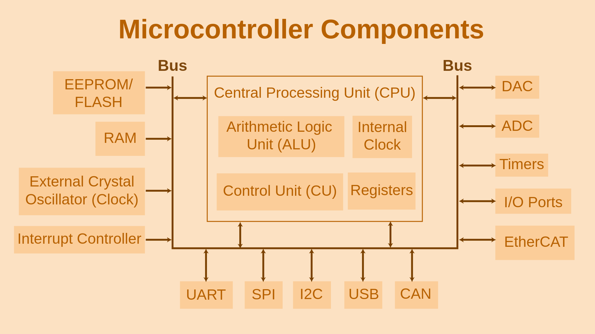

# Microcontrollers&#x20;

<figure><figcaption>
<em>Schematic Diagram of Microcontroller Components</em> (Copyrights: Embedded Robotics)
</figcaption></figure>

### **What is a Microcontroller?**

<figure><figcaption></figcaption></figure>

A microcontroller (MCU) is a compact integrated circuit that combines a processor (CPU), memory (RAM/ROM), and programmable input/output peripherals on a single chip. It’s designed to execute specific tasks in embedded systems, such as controlling motors, reading sensors, or managing communication protocols. Microcontrollers are the "brains" of devices like washing machines, drones, and industrial robots.

### **Key Components of a Microcontroller** 

### **1. Registers**

Registers are small, fast storage locations within the CPU used to hold data, addresses, or control signals during operations. They act as temporary "scratchpads" for calculations and system control.

### **Types of Registers**

* **Data Registers:** Store numeric values for arithmetic/logic operations.
* **Control Registers:** Configure peripherals (e.g., timers, PWM, UART).
* **Status Registers:** Track CPU state (e.g., carry flags, interrupt status).

**Example (PWM Registers in ARM LPC2148):**

* **PWMIR (Interrupt Register):** Flags interrupts from PWM match events.
* **PWMTCR (Timer Control Register):** Starts/stops the PWM timer.
* **PWMMR0 (Match Register 0):** Sets the PWM period by comparing against the timer counter.

### **2. Interrupts**

<figure><figcaption></figcaption></figure>

Interrupts are signals that pause the CPU’s current task to handle urgent events (e.g., sensor input, timer overflow). They ensure real-time responsiveness in robotics and automation.

### **Interrupt Workflow**

1. **Event Occurs:** A peripheral (e.g., timer, sensor) triggers an interrupt.
2. **CPU Response:** The CPU saves its current state and jumps to an **Interrupt Service Routine (ISR)**.
3. **ISR Execution:** The ISR handles the event (e.g., reads sensor data).
4. **Return:** The CPU resumes its original task.

**Example (PIC Microcontrollers):**

* **INTCON Register:** Manages global and peripheral interrupts.
* **PIR/PIE Registers:** Track interrupt flags and enable/disable sources (e.g., UART, ADC).

### **3. Pulse Width Modulation (PWM)**

<figure><figcaption></figcaption></figure>

PWM generates variable-width digital pulses to control power delivery to devices like motors, LEDs, and servos. The **duty cycle** (pulse width vs. period) determines the effective voltage.

### **PWM Implementation**

* **Timer/Counter:** Generates the PWM period (e.g., 1 kHz frequency).
* **Compare Registers:** Set the duty cycle by comparing against the timer value.

**Example (ARM LPC2148 PWM Setup):**

1.  **Configure PWMPR (Period Register):** Defines the PWM frequency.

    PWMPR=Clock FrequencyPrescaler×Desired Frequency−1PWMPR=Prescaler×Desired FrequencyClock Frequency−1
2.  **Set PWMMR (Match Register):** Determines the duty cycle.

    Duty Cycle (%)=(PWMMR ValuePWMPR Value)×100Duty Cycle (%)=(PWMPR ValuePWMMR Value)×100
3. **Enable PWM Output:** Use **PWMPCR** to activate the PWM channel.

### **Practical Applications in Robotics** 

### **1. Motor Control**

* **PWM for Speed:** Adjust motor speed by varying the duty cycle.
* **H-Bridge + PWM:** Combine with motor drivers for bidirectional control.

### **2. Sensor Integration**

* **ADC for Analog Sensors:** Convert analog signals (e.g., temperature, distance) to digital values using the microcontroller’s ADC.
* **Digital Sensors:** Read on/off signals (e.g., limit switches) via GPIO pins.

### **3. Real-Time Communication**

* **UART/SPI/I2C:** Interface with peripherals (e.g., GPS, IMU) using serial protocols.
* **Interrupt-Driven Communication:** Handle data asynchronously to avoid CPU bottlenecks.

### **Development Tools** 

* **IDEs:** PlatformIO, Arduino IDE, MPLAB X.
* **Simulators:** Proteus, Simulink.
* **Debuggers:** JTAG, SWD for real-time code inspection.

### **Comparison: Microcontroller vs. Microprocessor** 

| Feature         | Microcontroller                | Microprocessor                   |
| --------------- | ------------------------------ | -------------------------------- |
| **Integration** | CPU, memory, I/O on one chip   | Requires external components     |
| **Power Use**   | Low (µW to mW)                 | High (Watts)                     |
| **Cost**        | $0.10 – $10                    | $10 – $1000+                     |
| **Use Case**    | Embedded control (robots, IoT) | General computing (PCs, servers) |

### Microcontroller vs. Microprocessor

| Microcontroller (MCU)              | Microprocessor                          |
| ---------------------------------- | --------------------------------------- |
| CPU, memory, and I/O on one chip   | CPU only, needs external memory and I/O |
| Designed for specific tasks        | Designed for general computing          |
| Used in embedded systems           | Used in PCs, servers                    |
| Low power, compact, cost-effective | Higher power, more complex              |

### Types and Examples of Microcontrollers

### **Popular Microcontroller Families (2025)**

| Microcontroller       | Key Features                                         | Typical Applications                                  |
| --------------------- | ---------------------------------------------------- | ----------------------------------------------------- |
| **Arduino UNO**       | ATmega328P, easy to use, large ecosystem             | Prototyping, education, home automation               |
| **ESP32**             | Dual-core, Wi-Fi, Bluetooth, low power               | IoT, wearables, wireless sensor networks              |
| **Raspberry Pi Pico** | RP2040, fast, GPIO-rich, low cost                    | Robotics, embedded systems, simple IoT devices        |
| **STM32**             | ARM Cortex-M, scalable, industrial-grade             | Industrial automation, automotive, robotics           |
| **Teensy 4.1**        | ARM Cortex-M7, high speed and performance            | High-performance audio, data-intensive IoT, robotics  |
| **Microchip PIC32A**  | Advanced integration, scalable, real-time features   | Automotive, industrial, research, medical devices     |
| **TI MSPM0 series**   | Ultra-compact, low power, integrated analog features | Medical devices, wearables, space-constrained systems |

Recent innovations include ultra-small MCUs-like Texas Instruments' 2025 release, which is just 1.38 mm² yet offers 16 I/O pins, ADC, flash, and serial interfaces-enabling edge AI and advanced processing in tiny, battery-powered devices
