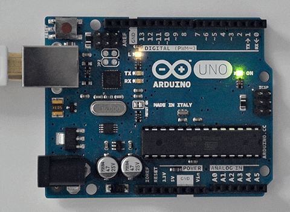
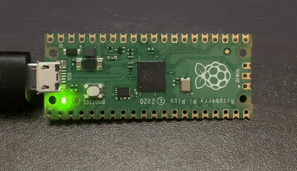
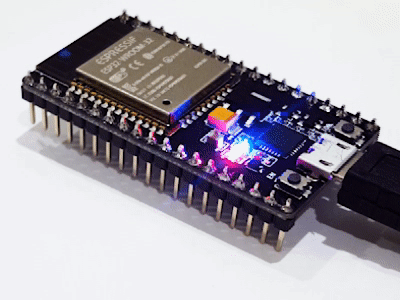
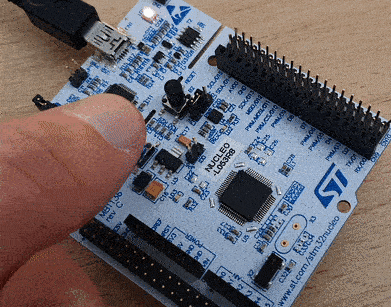
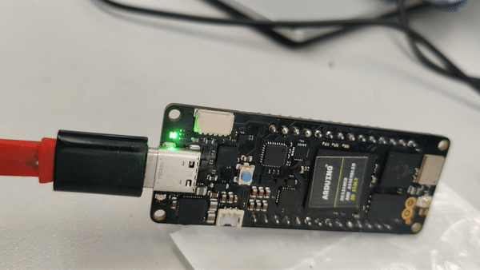
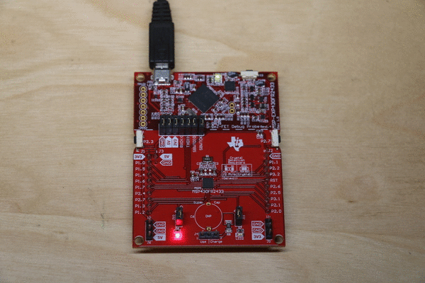
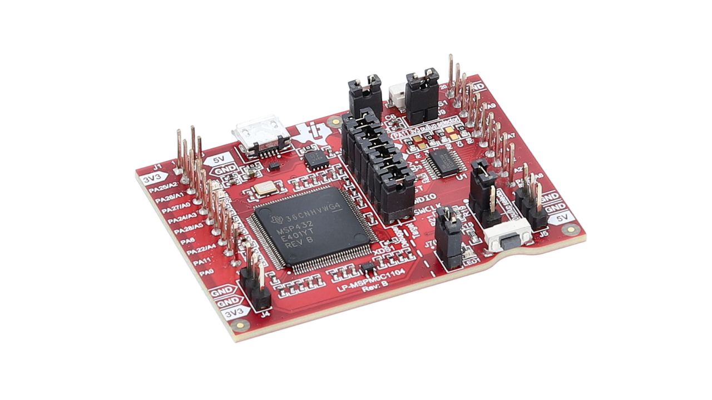
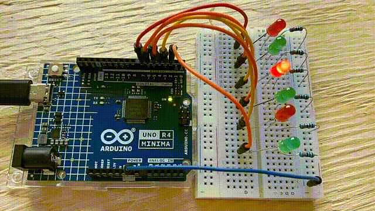
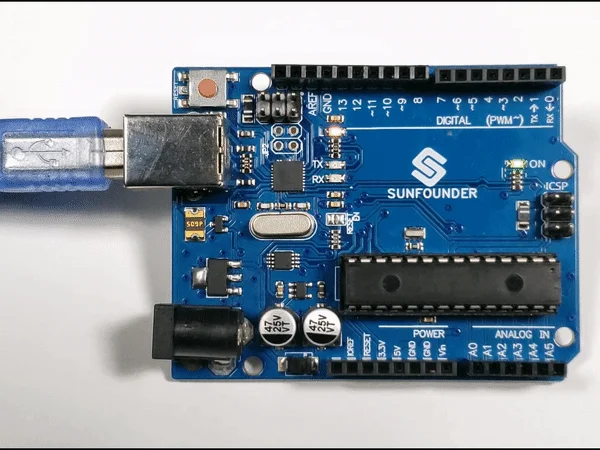

# Choosing a Microcontroller

### Arduino UNO R3 (ATmega328P) 

<figure><figcaption></figcaption></figure>

* **Overview**: The Arduino UNO R3 is one of the most popular microcontroller boards globally, especially for beginners. It is known for its robustness, extensive documentation, and large community support [10](https://en.wikipedia.org/wiki/List_of_Arduino_boards_and_compatible_systems).
* **Key Features**:
  * **MCU**: ATmega328P, 8-bit AVR [10](https://en.wikipedia.org/wiki/List_of_Arduino_boards_and_compatible_systems)[14](https://www.themechatronicsblog.com/2023/05/top-10-microcontroller-development-boards-for-beginners-to-professionals.html?m=1).
  * **Clock Speed**: 16 MHz [10](https://en.wikipedia.org/wiki/List_of_Arduino_boards_and_compatible_systems)[15](https://www.programmingelectronics.com/arduino-uno-r4-minima/).
  * **Memory**: 32 KB Flash, 1 KB EEPROM, 2 KB SRAM [10](https://en.wikipedia.org/wiki/List_of_Arduino_boards_and_compatible_systems).
  * **I/O Pins**: 14 digital I/O pins (6 with PWM), 6 analog input pins [10](https://en.wikipedia.org/wiki/List_of_Arduino_boards_and_compatible_systems).
  * **Host Interface**: USB-B (via ATmega16U2/8U2) [10](https://en.wikipedia.org/wiki/List_of_Arduino_boards_and_compatible_systems).
  * **Operating Voltage**: 5V [10](https://en.wikipedia.org/wiki/List_of_Arduino_boards_and_compatible_systems).
* **Best For**: Learning, prototyping, education, simple robotics [14](https://www.themechatronicsblog.com/2023/05/top-10-microcontroller-development-boards-for-beginners-to-professionals.html?m=1).
* **Typical Price**: ₹500–700 / $7–10.

### Raspberry Pi Pico (RP2040) 

<figure><figcaption></figcaption></figure>

* **Overview**: The Raspberry Pi Pico is a low-cost, high-performance microcontroller board featuring a custom dual-core ARM Cortex-M0+ chip designed by Raspberry Pi [7](https://www.thingbits.in/products/raspberry-pi-pico).
* **Key Features**:
  * **MCU**: RP2040, Dual-core ARM Cortex-M0+ [7](https://www.thingbits.in/products/raspberry-pi-pico).
  * **Clock Speed**: Up to 133 MHz [7](https://www.thingbits.in/products/raspberry-pi-pico).
  * **Memory**: 264 KB on-chip SRAM, 2 MB on-board QSPI Flash [7](https://www.thingbits.in/products/raspberry-pi-pico).
  * **I/O Pins**: 26 multi-function GPIO pins, including 3 analog inputs [7](https://www.thingbits.in/products/raspberry-pi-pico).
  * **Peripherals**: 2x UART, 2x SPI, 2x I2C, 16 PWM Channels, 8x PIO State Machines [7](https://www.thingbits.in/products/raspberry-pi-pico).
  * **Host Interface**: USB 1.1 with device and host support (Micro-USB port) [7](https://www.thingbits.in/products/raspberry-pi-pico).
  * **Operating Voltage**: Input power 1.8V to 5.5V DC [7](https://www.thingbits.in/products/raspberry-pi-pico).
* **Best For**: Robotics, embedded systems, IoT, education, projects requiring C/C++ or MicroPython [7](https://www.thingbits.in/products/raspberry-pi-pico)[14](https://www.themechatronicsblog.com/2023/05/top-10-microcontroller-development-boards-for-beginners-to-professionals.html?m=1).
* **Typical Price**: ₹350–450 / $4–6.

### ESP32 (Espressif Systems) 

* **Overview**: The ESP32 is a family of low-cost, low-power system-on-a-chip microcontrollers with integrated Wi-Fi and dual-mode Bluetooth [5](https://en.wikipedia.org/wiki/ESP32)[14](https://www.themechatronicsblog.com/2023/05/top-10-microcontroller-development-boards-for-beginners-to-professionals.html?m=1).
* **Key Features**:
  * **MCU**: Xtensa dual-core (or single-core) 32-bit LX6 microprocessor [5](https://en.wikipedia.org/wiki/ESP32).
  * **Clock Speed**: 160 or 240 MHz [5](https://en.wikipedia.org/wiki/ESP32).
  * **Memory**: 520 KiB SRAM, 448 KiB ROM (Flash memory varies, e.g., 4MB typical) [5](https://en.wikipedia.org/wiki/ESP32).
  * **Connectivity**: Wi-Fi 802.11 b/g/n, Bluetooth v4.2 BR/EDR and BLE [5](https://en.wikipedia.org/wiki/ESP32).
  * **I/O Pins**: 34 programmable GPIOs, 10 touch sensors [5](https://en.wikipedia.org/wiki/ESP32).
  * **Peripherals**: 2x 12-bit SAR ADCs (up to 18 channels), 2x 8-bit DACs, 4x SPI, 2x I2S, 2x I2C, 3x UART, Ethernet MAC, CAN bus 2.0, PWM, Hall sensor, infrared remote controller [5](https://en.wikipedia.org/wiki/ESP32).
  * **Security**: Secure boot, flash encryption, cryptographic hardware acceleration (AES, SHA-2, RSA, ECC, RNG) [5](https://en.wikipedia.org/wiki/ESP32).
* **Best For**: IoT applications, wireless sensor networks, smart devices, robotics [14](https://www.themechatronicsblog.com/2023/05/top-10-microcontroller-development-boards-for-beginners-to-professionals.html?m=1).
* **Typical Price**: ₹300–500 / $3–5.

### STM32 Family 

### STM32F4 Discovery Board (e.g., STM32F407)

<figure><figcaption></figcaption></figure>

* **Overview**: A powerful ARM Cortex-M4 board suitable for advanced robotics, signal processing, and industrial applications.
* **Key Features**:
  * **MCU**: STM32F407 (ARM Cortex-M4).
  * **Clock Speed**: Up to 168 MHz.
  * **Memory**: 1 MB Flash, 192 KB SRAM.
  * **I/O**: Multiple GPIO, ADC, DAC, UART, SPI, I2C, CAN, USB OTG, Ethernet.
  * **Onboard**: Accelerometer, audio DAC, pushbuttons, LEDs.
* **Best For**: Industrial automation, real-time control, advanced robotics.
* **Typical Price**: ₹1,200–2,500 / $15–30.

### STM32F103C8T6 ("Blue Pill")

<figure><figcaption></figcaption></figure>

* **Overview**: A cheap and popular development board based on the ARM Cortex-M3 microprocessor [6](https://erc-bpgc.github.io/handbook/electronics/Development_Boards/STM32/).
* **Key Features**:
  * **MCU**: ARM Cortex-M3 [6](https://erc-bpgc.github.io/handbook/electronics/Development_Boards/STM32/).
  * **Clock Speed**: 72 MHz [6](https://erc-bpgc.github.io/handbook/electronics/Development_Boards/STM32/).
  * **Memory**: 64 KB Flash, 20 KB RAM [6](https://erc-bpgc.github.io/handbook/electronics/Development_Boards/STM32/).
  * **I/O Pins**: 37 GPIO pins, 10 analog input pins (12-bit resolution), 12 PWM pins [6](https://erc-bpgc.github.io/handbook/electronics/Development_Boards/STM32/).
  * **Peripherals**: 2x I2C, 2x SPI, 1x CAN 2.0 [6](https://erc-bpgc.github.io/handbook/electronics/Development_Boards/STM32/).
  * **Operating Voltage**: 2.7V to 3.6V [6](https://erc-bpgc.github.io/handbook/electronics/Development_Boards/STM32/).
* **Best For**: Hobbyist projects, learning ARM Cortex-M3 development.

### Arduino Nano 

<figure><figcaption></figcaption></figure>

* **Overview**: A compact version of the Arduino UNO, ideal for breadboard projects and designs where space is limited. It uses the ATmega328P (or ATmega168 in older versions) [10](https://en.wikipedia.org/wiki/List_of_Arduino_boards_and_compatible_systems).
* **Key Features**:
  * **MCU**: ATmega328P (for v3.0) or ATmega168 [10](https://en.wikipedia.org/wiki/List_of_Arduino_boards_and_compatible_systems).
  * **Clock Speed**: 16 MHz [10](https://en.wikipedia.org/wiki/List_of_Arduino_boards_and_compatible_systems).
  * **Memory (ATmega328P version)**: 32 KB Flash, 1 KB EEPROM, 2 KB SRAM [10](https://en.wikipedia.org/wiki/List_of_Arduino_boards_and_compatible_systems).
  * **I/O Pins**: 14 digital I/O pins (6 PWM), 8 analog input pins [10](https://en.wikipedia.org/wiki/List_of_Arduino_boards_and_compatible_systems).
  * **Host Interface**: USB-Mini (FTDI FT232R for older versions) [10](https://en.wikipedia.org/wiki/List_of_Arduino_boards_and_compatible_systems).
  * **Operating Voltage**: 5V [10](https://en.wikipedia.org/wiki/List_of_Arduino_boards_and_compatible_systems).
* **Best For**: Wearables, compact robotics, breadboard prototyping, embedded devices.
* **Typical Price**: ₹300–400 / $4–6.

### ESP32-S3 

<figure><figcaption></figcaption></figure>

* **Overview**: An advanced variant of the ESP32 with enhancements for AI acceleration and more GPIOs, suitable for edge AI and vision tasks. Features a dual-core Xtensa LX7 processor.
* **Key Features**:
  * **MCU**: Dual-core Xtensa LX7.
  * **Clock Speed**: Up to 240 MHz.
  * **Memory**: (Varies by module, ESP32-S3-MINI-1-N8 used in UNO R4 WiFi has 8MB Flash) [13](https://docs.arduino.cc/resources/datasheets/ABX00087-datasheet.pdf). For the ESP32-S3 generally, ROM is 384kB, SRAM is 512kB [9](https://store.arduino.cc/products/uno-r4-wifi).
  * **I/O Pins**: Up to 45 GPIOs.
  * **Connectivity**: Wi-Fi 4 (802.11 b/g/n), Bluetooth 5.0 (BLE).
  * **Special Features**: AI vector instructions, USB-OTG, LCD/camera interface.
* **Best For**: Edge AI, machine vision, complex IoT devices.
* **Typical Price**: ₹400–600 / $4–6.

### Arduino Portenta H7 

<figure><figcaption></figcaption></figure>

* **Overview**: A high-end, industrial-grade board designed for advanced applications. It features a dual-core STM32H747 microcontroller [1](https://docs.simplefoc.com/microcontrollers).
* **Key Features**:
  * **MCU**: STM32H747, featuring a dual-core Cortex-M7 (up to 480 MHz) + Cortex-M4 (up to 240 MHz).
  * **Memory**: 2 MB Flash, 1 MB SRAM.
  * **Connectivity**: Wi-Fi, Bluetooth Low Energy, Ethernet, CAN bus.
  * **I/O**: Advanced I/O capabilities.
* **Best For**: Machine vision, industrial IoT, high-performance computing tasks.
* **Typical Price**: ₹12,000–15,000 / $120–150.

### Texas Instruments MSP430FR Series 

<figure><figcaption></figcaption></figure>

* **Overview**: A series of ultra-low-power 16-bit MCUs, well-suited for battery-powered and portable applications.
* **Key Features**:
  * **MCU Architecture**: 16-bit RISC.
  * **Clock Speed**: Up to 16 MHz.
  * **Memory**: Up to 128 KB FRAM, 8 KB SRAM (FRAM is a non-volatile memory known for high endurance and low power).
  * **Power**: Ultra-low power consumption (e.g., 0.1 µA in sleep mode).
  * **Peripherals**: ADC, UART, SPI, I2C.
* **Best For**: Battery-operated devices, energy harvesting applications, portable electronics.
* **Typical Price**: ₹50–100 / $0.50–1 (for individual MCUs).

### Texas Instruments MSPM0C1104 

<figure><figcaption></figcaption></figure>

* **Overview**: Marketed as one of the world’s smallest MCUs, designed for ultra-compact, low-power applications.
* **Key Features**:
  * **MCU**: Arm Cortex-M0+.
  * **Clock Speed**: 32 MHz.
  * **Memory**: 16 KB Flash, 4 KB SRAM.
  * **I/O Pins**: 6 GPIO.
  * **Peripherals**: 12-bit ADC.
  * **Package Size**: 1.38 mm².
* **Best For**: Extremely space-constrained applications, miniature sensors, disposable electronics.
* **Typical Price**: ₹20–30 / $0.20–0.30 (for individual MCUs).

### Arduino UNO R4 (Minima and WiFi) 

<figure><figcaption></figcaption></figure>

<figure><figcaption></figcaption></figure>

* **Overview**: An update to the classic UNO, featuring a 32-bit ARM Cortex-M4. It maintains the UNO form factor and 5V operation [2](https://docs.arduino.cc/hardware/uno-r4-wifi)[11](https://docs.arduino.cc/hardware/uno-r4-minima)[12](https://circuitdigest.com/article/different-types-of-arduino-boards).
* **Key Features (Common to both Minima & WiFi)**:
  * **MCU**: Renesas RA4M1 (ARM Cortex-M4) [2](https://docs.arduino.cc/hardware/uno-r4-wifi)[11](https://docs.arduino.cc/hardware/uno-r4-minima).
  * **Clock Speed (Main Core)**: 48 MHz [2](https://docs.arduino.cc/hardware/uno-r4-wifi)[9](https://store.arduino.cc/products/uno-r4-wifi)[11](https://docs.arduino.cc/hardware/uno-r4-minima).
  * **Memory (RA4M1)**: 256 KB Flash, 32 KB SRAM [2](https://docs.arduino.cc/hardware/uno-r4-wifi)[9](https://store.arduino.cc/products/uno-r4-wifi)[11](https://docs.arduino.cc/hardware/uno-r4-minima). Minima also has 8 KB EEPROM [11](https://docs.arduino.cc/hardware/uno-r4-minima).
  * **I/O Pins**: 14 digital I/O, 6 analog inputs (up to 14-bit resolution), 6 PWM [11](https://docs.arduino.cc/hardware/uno-r4-minima)[15](https://www.programmingelectronics.com/arduino-uno-r4-minima/).
  * **DAC**: 1 analog output (DAC) [15](https://www.programmingelectronics.com/arduino-uno-r4-minima/).
  * **Operating Voltage**: 5V [2](https://docs.arduino.cc/hardware/uno-r4-wifi)[11](https://docs.arduino.cc/hardware/uno-r4-minima).
  * **Host Interface**: USB-C [15](https://www.programmingelectronics.com/arduino-uno-r4-minima/).
  * **Peripherals**: CAN Bus, RTC, Operational Amplifier [11](https://docs.arduino.cc/hardware/uno-r4-minima)[12](https://circuitdigest.com/article/different-types-of-arduino-boards)[15](https://www.programmingelectronics.com/arduino-uno-r4-minima/). HID support [11](https://docs.arduino.cc/hardware/uno-r4-minima)[12](https://circuitdigest.com/article/different-types-of-arduino-boards).
* **UNO R4 WiFi Specific Features**:
  * **Co-processor**: ESP32-S3-MINI-1-N8 for Wi-Fi and Bluetooth® [2](https://docs.arduino.cc/hardware/uno-r4-wifi)[9](https://store.arduino.cc/products/uno-r4-wifi)[13](https://docs.arduino.cc/resources/datasheets/ABX00087-datasheet.pdf). ESP32-S3 clock up to 240 MHz [9](https://store.arduino.cc/products/uno-r4-wifi).
  * **Connectivity**: Wi-Fi®, Bluetooth® [2](https://docs.arduino.cc/hardware/uno-r4-wifi)[13](https://docs.arduino.cc/resources/datasheets/ABX00087-datasheet.pdf).
  * **Onboard**: 12x8 LED matrix, Qwiic I2C connector [9](https://store.arduino.cc/products/uno-r4-wifi)[12](https://circuitdigest.com/article/different-types-of-arduino-boards).
* **Best For**: Upgrading UNO projects, IoT (WiFi version), projects needing more processing power/memory than R3 [12](https://circuitdigest.com/article/different-types-of-arduino-boards).
* **Typical Price**: Varies; R4 Minima is generally less expensive than R4 WiFi.

### Arduino Due 

<figure><figcaption></figcaption></figure>

* **Overview**: The first Arduino board based on a 32-bit ARM Cortex-M3 microcontroller. It has a large number of I/O pins and operates at 3.3V [4](https://www.thingbits.in/products/arduino-due)[10](https://en.wikipedia.org/wiki/List_of_Arduino_boards_and_compatible_systems).
* **Key Features**:
  * **MCU**: Atmel SAM3X8E (ARM Cortex-M3) [4](https://www.thingbits.in/products/arduino-due)[10](https://en.wikipedia.org/wiki/List_of_Arduino_boards_and_compatible_systems).
  * **Clock Speed**: 84 MHz [4](https://www.thingbits.in/products/arduino-due)[10](https://en.wikipedia.org/wiki/List_of_Arduino_boards_and_compatible_systems).
  * **Memory**: 512 KB Flash, 96 KB SRAM [4](https://www.thingbits.in/products/arduino-due)[10](https://en.wikipedia.org/wiki/List_of_Arduino_boards_and_compatible_systems).
  * **I/O Pins**: 54 digital I/O pins (12 with PWM), 12 analog input pins [4](https://www.thingbits.in/products/arduino-due)[10](https://en.wikipedia.org/wiki/List_of_Arduino_boards_and_compatible_systems).
  * **DAC**: 2 analog output pins (DAC) [4](https://www.thingbits.in/products/arduino-due)[10](https://en.wikipedia.org/wiki/List_of_Arduino_boards_and_compatible_systems).
  * **Operating Voltage**: 3.3V (I/O pins are not 5V tolerant) [4](https://www.thingbits.in/products/arduino-due)[10](https://en.wikipedia.org/wiki/List_of_Arduino_boards_and_compatible_systems).
  * **Host Interface**: USB (ATmega16U2 + native host) [10](https://en.wikipedia.org/wiki/List_of_Arduino_boards_and_compatible_systems).
* **Best For**: Projects needing high processing power, many I/O pins, true analog output, and 32-bit computations [4](https://www.thingbits.in/products/arduino-due).
* **Typical Price**: Check current suppliers.

### Arduino Mega 2560 

<figure><figcaption></figcaption></figure>

* **Overview**: An 8-bit AVR microcontroller board with a significantly larger number of I/O pins and more memory than the Arduino UNO [3](https://spiceman.net/arduino-mega-2560/)[10](https://en.wikipedia.org/wiki/List_of_Arduino_boards_and_compatible_systems).
* **Key Features**:
  * **MCU**: ATmega2560 [3](https://spiceman.net/arduino-mega-2560/)[10](https://en.wikipedia.org/wiki/List_of_Arduino_boards_and_compatible_systems).
  * **Clock Speed**: 16 MHz [3](https://spiceman.net/arduino-mega-2560/)[10](https://en.wikipedia.org/wiki/List_of_Arduino_boards_and_compatible_systems).
  * **Memory**: 256 KB Flash, 4 KB EEPROM, 8 KB SRAM [3](https://spiceman.net/arduino-mega-2560/)[10](https://en.wikipedia.org/wiki/List_of_Arduino_boards_and_compatible_systems).
  * **I/O Pins**: 54 digital I/O pins (15 with PWM), 16 analog input pins [3](https://spiceman.net/arduino-mega-2560/)[10](https://en.wikipedia.org/wiki/List_of_Arduino_boards_and_compatible_systems).
  * **Operating Voltage**: 5V [3](https://spiceman.net/arduino-mega-2560/)[10](https://en.wikipedia.org/wiki/List_of_Arduino_boards_and_compatible_systems).
  * **Host Interface**: USB (ATmega16U2/8U2) [10](https://en.wikipedia.org/wiki/List_of_Arduino_boards_and_compatible_systems).
* **Best For**: Complex projects requiring many I/O pins like 3D printers, robotics, and multi-sensor applications [3](https://spiceman.net/arduino-mega-2560/).
* **Typical Price**: Varies, generally more than UNO.

### Arduino Nano ESP32 

* **Overview**: The first Arduino board to feature an ESP32 microcontroller from Espressif, specifically the u-blox NORA-W106 module (ESP32-S3) [10](https://en.wikipedia.org/wiki/List_of_Arduino_boards_and_compatible_systems)[12](https://circuitdigest.com/article/different-types-of-arduino-boards). It combines the Nano form factor with ESP32 capabilities.
* **Key Features**:
  * **MCU**: u-blox NORA-W106 (ESP32-S3) [10](https://en.wikipedia.org/wiki/List_of_Arduino_boards_and_compatible_systems).
  * **Clock Speed**: Up to 240 MHz [10](https://en.wikipedia.org/wiki/List_of_Arduino_boards_and_compatible_systems).
  * **Memory**: 16MB Flash, 512 KB SRAM (NORA-W106 has 384kB ROM too) [10](https://en.wikipedia.org/wiki/List_of_Arduino_boards_and_compatible_systems)[12](https://circuitdigest.com/article/different-types-of-arduino-boards).
  * **I/O Pins**: 14 digital I/O (5 PWM), 8 analog input [10](https://en.wikipedia.org/wiki/List_of_Arduino_boards_and_compatible_systems).
  * **Connectivity**: Wi-Fi, Bluetooth.
  * **Operating Voltage**: 3.3V [10](https://en.wikipedia.org/wiki/List_of_Arduino_boards_and_compatible_systems).
  * **Host Interface**: USB-C [10](https://en.wikipedia.org/wiki/List_of_Arduino_boards_and_compatible_systems)[12](https://circuitdigest.com/article/different-types-of-arduino-boards).
  * **Special Features**: Supports MicroPython, Arduino Cloud enabled, USB HID emulation [12](https://circuitdigest.com/article/different-types-of-arduino-boards).
* **Best For**: IoT projects, wireless applications in a compact form factor, MicroPython development [12](https://circuitdigest.com/article/different-types-of-arduino-boards).

### Arduino Leonardo 

* **Overview**: Uses the ATmega32U4 microcontroller, which has built-in USB communication, allowing it to appear as a mouse or keyboard to a connected computer [10](https://en.wikipedia.org/wiki/List_of_Arduino_boards_and_compatible_systems)[12](https://circuitdigest.com/article/different-types-of-arduino-boards).
* **Key Features**:
  * **MCU**: ATmega32U4 [10](https://en.wikipedia.org/wiki/List_of_Arduino_boards_and_compatible_systems)[12](https://circuitdigest.com/article/different-types-of-arduino-boards).
  * **Clock Speed**: 16 MHz [10](https://en.wikipedia.org/wiki/List_of_Arduino_boards_and_compatible_systems).
  * **Memory**: 32 KB Flash, 1 KB EEPROM, 2.5 KB SRAM [10](https://en.wikipedia.org/wiki/List_of_Arduino_boards_and_compatible_systems).
  * **I/O Pins**: 20 digital I/O pins (7 PWM), 12 analog input pins [10](https://en.wikipedia.org/wiki/List_of_Arduino_boards_and_compatible_systems)[12](https://circuitdigest.com/article/different-types-of-arduino-boards).
  * **Operating Voltage**: 5V [10](https://en.wikipedia.org/wiki/List_of_Arduino_boards_and_compatible_systems).
  * **Host Interface**: USB (built into ATmega32U4) [10](https://en.wikipedia.org/wiki/List_of_Arduino_boards_and_compatible_systems)[12](https://circuitdigest.com/article/different-types-of-arduino-boards).
* **Best For**: Projects requiring native USB capabilities (like HID emulation), general Arduino projects [12](https://circuitdigest.com/article/different-types-of-arduino-boards).

### Arduino Micro 

* **Overview**: A small board co-designed with Adafruit, also based on the ATmega32U4, similar to the Leonardo but in a smaller form factor, suitable for breadboards [10](https://en.wikipedia.org/wiki/List_of_Arduino_boards_and_compatible_systems)[12](https://circuitdigest.com/article/different-types-of-arduino-boards).
* **Key Features**:
  * **MCU**: ATmega32U4 [10](https://en.wikipedia.org/wiki/List_of_Arduino_boards_and_compatible_systems).
  * **Clock Speed**: 16 MHz [10](https://en.wikipedia.org/wiki/List_of_Arduino_boards_and_compatible_systems).
  * **Memory**: 32 KB Flash, 1 KB EEPROM, 2.5 KB SRAM [10](https://en.wikipedia.org/wiki/List_of_Arduino_boards_and_compatible_systems).
  * **I/O Pins**: 20 digital I/O pins (7 PWM), 12 analog input pins [10](https://en.wikipedia.org/wiki/List_of_Arduino_boards_and_compatible_systems).
  * **Operating Voltage**: 5V [10](https://en.wikipedia.org/wiki/List_of_Arduino_boards_and_compatible_systems).
  * **Host Interface**: USB (built into ATmega32U4) [10](https://en.wikipedia.org/wiki/List_of_Arduino_boards_and_compatible_systems).
* **Best For**: Compact projects, HID emulation, breadboard-friendly designs [12](https://circuitdigest.com/article/different-types-of-arduino-boards).

### Arduino Zero / MKR Zero 

* **Overview**: Based on the ATSAMD21G18A, a 32-bit ARM Cortex-M0+ microcontroller. The MKR Zero is part of the MKR family, designed for IoT applications and has a smaller form factor [10](https://en.wikipedia.org/wiki/List_of_Arduino_boards_and_compatible_systems).
* **Key Features (ATSAMD21G18A boards like Arduino Zero)**:
  * **MCU**: ATSAMD21G18A (ARM Cortex-M0+) [10](https://en.wikipedia.org/wiki/List_of_Arduino_boards_and_compatible_systems).
  * **Clock Speed**: 48 MHz [10](https://en.wikipedia.org/wiki/List_of_Arduino_boards_and_compatible_systems).
  * **Memory**: 256 KB Flash, 32 KB SRAM (EEPROM can be emulated) [10](https://en.wikipedia.org/wiki/List_of_Arduino_boards_and_compatible_systems).
  * **I/O Pins (Arduino Zero)**: 14 digital I/O (12 PWM), 6 analog input, 1 analog output (DAC) [10](https://en.wikipedia.org/wiki/List_of_Arduino_boards_and_compatible_systems).
  * **Operating Voltage**: 3.3V [10](https://en.wikipedia.org/wiki/List_of_Arduino_boards_and_compatible_systems).
  * **Host Interface**: Native USB & EDBG Debug (Arduino Zero) [10](https://en.wikipedia.org/wiki/List_of_Arduino_boards_and_compatible_systems).
* **Best For**: More computationally intensive projects than 8-bit Arduinos, IoT applications (MKR series), projects needing a DAC [10](https://en.wikipedia.org/wiki/List_of_Arduino_boards_and_compatible_systems).

Other notable microcontroller families and boards mentioned in the search results include Teensy and nRF52, often supported by libraries like SimpleFOC [1](https://docs.simplefoc.com/microcontrollers). These cater to various specific needs, from high-speed processing (Teensy) to low-power wireless communication (nRF52).
