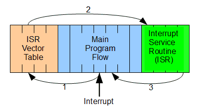
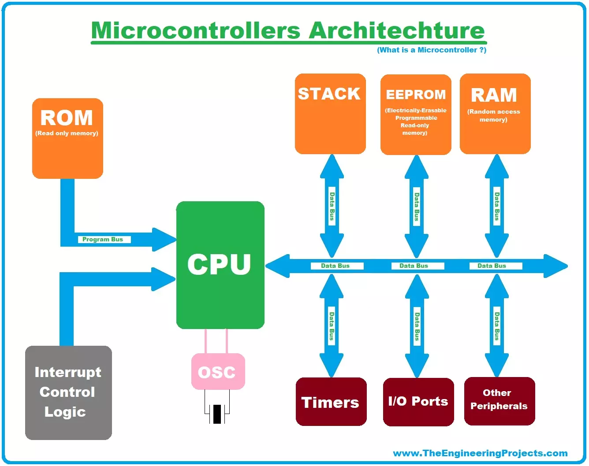

# Microcontrollers (Advanced Theory)

### **1. Registers: The CPU's Fast Storage**

<figure><figcaption></figcaption></figure>

Registers are small, high-speed memory locations within the CPU used to store data, addresses, or control flags during operations. They enable rapid access to critical information, reducing latency compared to external memory.

### **Types of Registers**

| Register Type            | Purpose                                                                | Example (ARM Cortex-M)          |
| ------------------------ | ---------------------------------------------------------------------- | ------------------------------- |
| **General-Purpose**      | Store intermediate results or operands for arithmetic/logic operations | R0-R12 (ARM)                    |
| **Program Counter (PC)** | Holds the address of the next instruction to execute                   | PC (E.g., `0x08000100`)         |
| **Stack Pointer (SP)**   | Points to the top of the stack for saving context during interrupts    | MSP (Main SP), PSP (Process SP) |
| **Status Register**      | Tracks CPU state (e.g., carry, zero, overflow flags)                   | APSR (Application Status Reg)   |
| **Control Registers**    | Configure peripherals (e.g., timers, PWM, UART)                        | TIM2\_CR1 (Timer 2 Control Reg) |

**Example:**\
To enable a timer interrupt on an STM32:

```
cTIM2_DIER |= (1 << 0); // Enable update interrupt for Timer 2
```

### **2. Interrupts: Real-Time Responsiveness**

<figure><figcaption></figcaption></figure>

Interrupts allow the CPU to pause current tasks and handle urgent events (e.g., sensor input, timer overflow). They ensure timely responses in applications like robotics and IoT.

### **Interrupt Workflow**

1. **Event Trigger:** A peripheral (e.g., timer, ADC) raises an interrupt flag.
2. **Priority Check:** The Interrupt Controller (NVIC) prioritizes interrupts.
3. **Context Save:** CPU pushes registers (PC, SP, status) onto the stack.
4. **ISR Execution:** Jumps to the Interrupt Service Routine (ISR) to handle the event.
5. **Context Restore:** Registers are popped, and the CPU resumes prior tasks.

**Example (Arduino External Interrupt):**

```
cppvoid setup() {
  attachInterrupt(digitalPinToInterrupt(2), buttonPress, FALLING);
}
void buttonPress() {
  // Handle button press
}
```

### **3. Pulse Width Modulation (PWM): Precision Control**

.png>).jpg>)

PWM generates variable-width pulses to control power delivery. The **duty cycle** (ON-time vs. period) determines the effective voltage.

### **PWM Configuration**

* **Frequency:** Set by the timer’s auto-reload register (e.g., 1 kHz → 1 ms period).
* **Duty Cycle:** Determined by the capture/compare register (CCR).

**Formula:**

Duty Cycle (%)=(CCR ValueARR Value)×100Duty Cycle (%)=(ARR ValueCCR Value)×100

**Example (STM32 PWM for Motor Control):**

```
cTIM3->ARR = 999; // 1 kHz frequency (assuming 1 MHz clock)
TIM3->CCR1 = 300; // 30% duty cycle
TIM3->CCER |= TIM_CCER_CC1E; // Enable PWM output
```

### **4. Memory Architecture**

<figure><figcaption></figcaption></figure>

Microcontrollers use Harvard or Von Neumann architectures to manage instructions and data.

### **Harvard Architecture**

<figure><figcaption></figcaption></figure>

* **Separate Buses:** Instructions and data have dedicated buses (faster, parallel access).
* **Common in MCUs:** STM32, PIC, AVR.

### **Von Neumann Architecture**

<figure><figcaption></figcaption></figure>

* **Shared Bus:** Single bus for instructions/data (simpler, slower).
* **Example:** Legacy systems (e.g., Intel 8051).

### **5. Peripherals and Interfaces**

| Peripheral          | Function                                                     | Example Use Case             |
| ------------------- | ------------------------------------------------------------ | ---------------------------- |
| **Timers/Counters** | Generate PWM, measure intervals, count events                | Motor speed control          |
| **ADC/DAC**         | Convert analog signals to digital (ADC) and vice versa (DAC) | Sensor reading, audio output |
| **UART/SPI/I2C**    | Serial communication protocols                               | GPS module, OLED display     |
| **GPIO**            | General-purpose input/output pins                            | Button input, LED control    |

**Example (ADC for Temperature Sensor):**

```
cADC1->CR2 |= ADC_CR2_ADON; // Enable ADC
ADC1->CR2 |= ADC_CR2_SWSTART; // Start conversion
while (!(ADC1->SR & ADC_SR_EOC)); // Wait for conversion
int temp = ADC1->DR; // Read digital value
```

### **6. Clock Systems**

<figure><figcaption></figcaption></figure>

Clocks synchronize operations. Common sources:

* **Internal RC Oscillator:** Low accuracy, low power (e.g., 8 MHz).
* **External Crystal:** High accuracy (e.g., 16 MHz for Arduino).
* **PLL:** Multiplies clock speed (e.g., STM32’s 72 MHz from 8 MHz).

**Clock Tree Example (STM32):**

```
textHSI → PLL → SYSCLK → APB1/APB2
```

### **7. Power Management**

* **Sleep Modes:** Reduce power during inactivity (e.g., STOP, STANDBY).
* **Peripheral Clocks:** Disable unused peripherals to save power.

**Example (Arduino Low-Power Mode):**

```
cpp#include <avr/sleep.h>
set_sleep_mode(SLEEP_MODE_PWR_DOWN);
sleep_enable();
sleep_cpu();
```

### **8. Real-World Application: Robotic Arm Control**

1. **Sensors:** Potentiometers (ADC) measure joint angles.
2. **PWM:** Control servo motors for precise movement.
3. **Interrupts:** Handle emergency stop button presses.
4. **UART:** Send/receive commands from a PC.

**Code Snippet (Servo Control):**

```
cppvoid setServoAngle(int angle) {
  int pulseWidth = map(angle, 0, 180, 1000, 2000); // 1-2 ms pulse
  digitalWrite(servoPin, HIGH);
  delayMicroseconds(pulseWidth);
  digitalWrite(servoPin, LOW);
}
```
