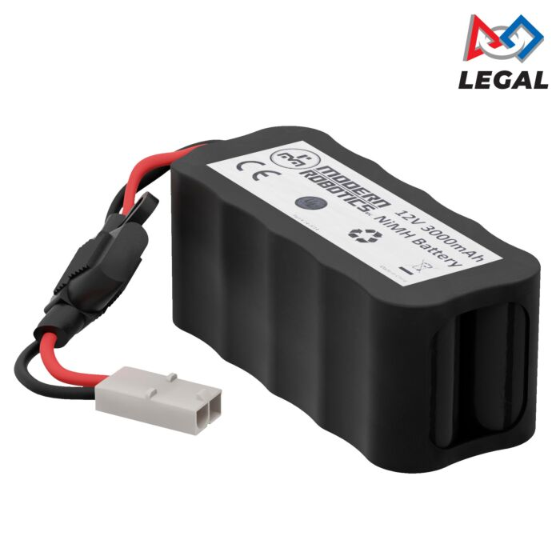
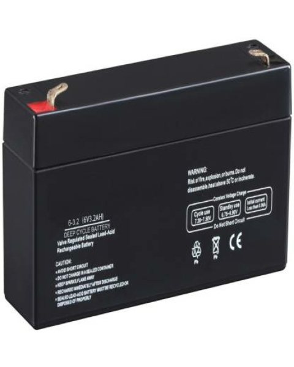
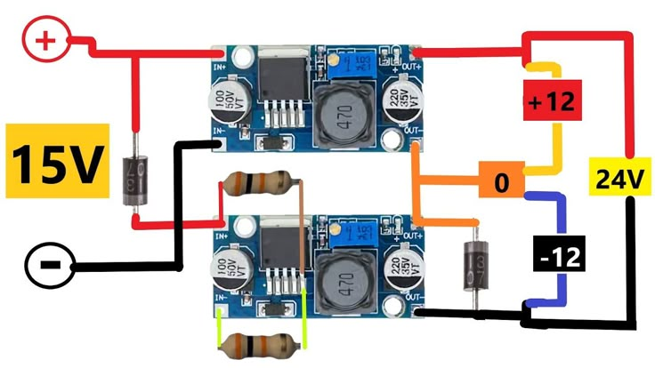
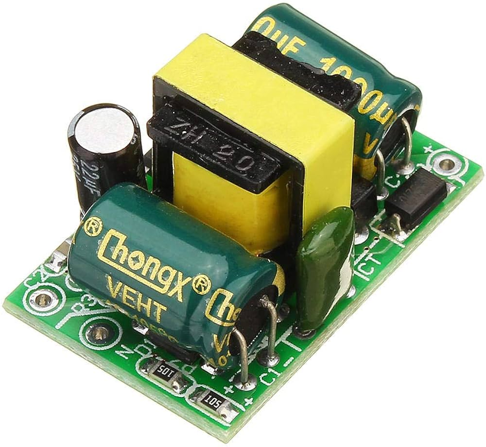
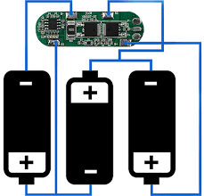
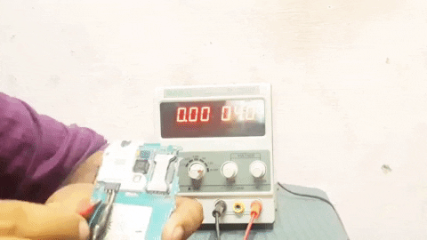

# Power Systems

### Battery Types

### **Lithium Polymer (LiPo) Batteries**

<figure><figcaption></figcaption></figure>

* **Advantages:**
  * High energy density
  * Lightweight
  * Flexible form factor
  * High discharge rates
  * Low self-discharge
* **Disadvantages:**
  * Requires careful charging/discharging
  * Sensitive to damage (risk of swelling, fire, explosion)
  * Shorter lifespan than Li-ion
* **Use Cases:** Drones, racing robots, small mobile robots
* **Image:**\
  !\[LiPo Battery]\([https://cdn.sparkfun.com//assets/parts/1/1/1/9/13855-01.jpgLithium-ion](https://cdn.sparkfun.com/assets/parts/1/1/1/9/13855-01.jpgLithium-ion)&#x20;

### Li-Ion Batteries

<figure><figcaption></figcaption></figure>

* **Advantages:**
  * High energy density
  * Long cycle life
  * Lightweight
  * Low self-discharge
* **Disadvantages:**
  * More expensive
  * Risk of thermal runaway if mishandled
  * Uses rare materials
* **Use Cases:** Service robots, autonomous vehicles, endurance robots
* **Image:**\
  !\[Li-ion Battery]\([https://upload.wikimedia.org/wikipedia/commons/1/](https://upload.wikimedia.org/wikipedia/commons/1/)&#x20;

### Nickel-Metal Hydride (NiMH) Batteries

<figure><figcaption></figcaption></figure>

* **Advantages:**
  * No memory effect
  * Higher energy density than NiCd
  * Environmentally friendlier
* **Disadvantages:**
  * Lower energy density than Li-ion
  * Higher self-discharge
  * Heavier and bulkier
* **Use Cases:** Educational robots, hobby kits, legacy systems
* **Image:**\
  !\[NiMH Battery]\([https://upload.wikimedia.org/wikipedia/commons/5/](https://upload.wikimedia.org/wikipedia/commons/5/)&#x20;

### Cadmium (NiCd) Batteries

<figure><figcaption></figcaption></figure>

* **Advantages:**
  * Good low-temperature performance
  * High current delivery
  * Low cost
* **Disadvantages:**
  * Memory effect
  * Toxic cadmium
  * Heavy, lower energy density
* **Use Cases:** Older robots, cold environments
* **Image:**\
  !\[NiCd Battery]\([https://upload.wikimedia.org/wikipedia/commons/6/](https://upload.wikimedia.org/wikipedia/commons/6/)&#x20;

### Lead Acid Batteries

<figure><figcaption></figcaption></figure>

* **Advantages:**
  * Low cost
  * High current output
  * Deep discharge capable
* **Disadvantages:**
  * Heavy and bulky
  * Low energy density
  * Hazardous materials
* **Use Cases:** Large stationary robots, AGVs, backup power
* **Image:**\
  !\[Lead Acid Battery]\([https://upload.wikimedia.org/wikipedia/commons/4/](https://upload.wikimedia.org/wikipedia/commons/4/) 2.&#x20;

### Power Converters and Management

### **DC-DC Converters**

* **Purpose:** Convert one DC voltage to another (e.g., 24V to 5V).
* **Types:** Buck (step-down), Boost (step-up), Buck-Boost (step-up/down), Isolated.
* **Use Cases:** Powering microcontrollers, sensors, actuators from a single battery.
* **Image:**\
  !\[DC-DC Converter]\([https://cdn.sparkfun.com//assets/parts/1/2/4/6/12766-01.jpg](https://cdn.sparkfun.com/assets/parts/1/2/4/6/12766-01.jpg):\*\* [Power converters in robotics](https://www.powerelectronicsnews.com/power-converters-enable-innovation-in-robotics-applications/)

### **AC-DC Power Supplies**

<figure><figcaption></figcaption></figure>

* **Purpose:** Convert AC mains to DC for robots with fixed bases or charging stations.
* **Use Cases:** Industrial arms, manufacturing robots, charging docks.
* **Image:**\
  !\[AC-DC Power Supply]\([https://www.meanwell.com/Upload/PDF/HRP-600/More](https://www.meanwell.com/Upload/PDF/HRP-600/More) Info:\*\* [Wall Industries: Robotic Power Supplies](https://www.wallindustries.com/products/robotics/)

### **Battery Management Systems (BMS)**

<figure><figcaption></figcaption></figure>

* **Purpose:** Protect batteries from overcharge, over-discharge, and balance cells.
* **Use Cases:** Essential for LiPo/Li-ion packs for safety and longevity.
* **Image:**\
  !\[BMS]\([https://cdn.sparkfun.com//assets/parts/1/2/2/](https://cdn.sparkfun.com/assets/parts/1/2/2/)&#x20;

### **Robotics Power Banks**

* **Purpose:** Portable, rechargeable power for mobile robots and development.
* **Features:** Stable voltage, pass-through charging, communication with robot.
* **Use Cases:** Field robotics, Raspberry Pi/Jetson-powered robots, prototyping.
* **Example:** [Duckiebattery](https://get.duckietown.com/products/duckiebattery)
* **Image:**\
  !\[Duckiebattery]\([https://cdn.shopify.com/s/files/1/0608/6066/7303/products/duckieb](https://cdn.shopify.com/s/files/1/0608/6066/7303/products/duckieb)&#x20;

**Standard Power Banks**

* **Use Cases:** Emergency power for small robots, field testing, charging controllers.
* **Image:**\
  !\[Power Bank]\([https://upload.wikimedia.org/wikipedia/commons/4/4b/Power\_Bank.jpg](https://upload.wikimedia.org/wikipedia/commons/4/4b/Power_Bank.jpg)&#x20;

Power Supply Units

<figure><figcaption></figcaption></figure>

* **Purpose:** Provide regulated DC voltage for testing, development, or powering robots on the bench.
* **Features:** Adjustable voltage/current, multiple outputs, display meters.
* **Use Cases:** Lab testing, prototyping, powering robots during development.
* **Image:**\
  !\[Bench Power Supply]\([https://upload.wikimedia.org/wikipedia/commons/4/4d/Bench\_Power\_Supply.jpg](https://upload.wikimedia.org/wikipedia/commons/4/4d/Bench_Power_Supply.jpg)&#x20;

Management Strategies

* **Energy-Efficient Design:** Use efficient motors, sleep modes, low-power electronics.
* **Dynamic Power Allocation:** Adjust power to subsystems based on task.
* **Thermal Management:** Use heat sinks, fans, or pads to dissipate heat.
* **Voltage Regulation:** Ensure stable supply to sensitive electronics using regulators and converters.

### 6. Choosing the Right Power System

* **Assess Power Needs:** Calculate voltage and current for all components.
* **Select Battery Type:** Match energy density, size, and safety to your robot’s needs.
* **Add Power Conversion:** Use DC-DC converters for correct subsystem voltages.
* **Implement Protection:** Use BMS for LiPo/Li-ion, fuses for short-circuit protection.
* **Consider Portability:** Use power banks or swappable battery packs for field robots.

##

### Summary Table: Robotics Power Solutions

| Component          | Purpose / Use Case                           | Example Image Link                                                                                        |
| ------------------ | -------------------------------------------- | --------------------------------------------------------------------------------------------------------- |
| LiPo Battery       | Lightweight, high-power mobile robots        | [LiPo](https://cdn.sparkfun.com/assets/parts/1/1/1/9/13855-01.jpg)                                        |
| Li-ion Battery     | Long-life, larger robots, endurance projects | [Li-ion](https://upload.wikimedia.org/wikipedia/commons/1/17/Li-ion_18650_cell.jpg)                       |
| NiMH Battery       | Safe, educational/hobby robots               | [NiMH](https://upload.wikimedia.org/wikipedia/commons/5/5d/NiMH_AAA_battery.jpg)                          |
| NiCd Battery       | Legacy, cold environments                    | [NiCd](https://upload.wikimedia.org/wikipedia/commons/6/6a/NiCd_battery.jpg)                              |
| Lead Acid Battery  | Stationary, heavy-duty robots                | [Lead Acid](https://upload.wikimedia.org/wikipedia/commons/4/4e/Car_battery.jpg)                          |
| DC-DC Converter    | Voltage conversion for subsystems            | [DC-DC Converter](https://cdn.sparkfun.com/assets/parts/1/2/4/6/12766-01.jpg)                             |
| AC-DC Power Supply | Mains-powered robots, charging stations      | [AC-DC Supply](https://www.meanwell.com/Upload/PDF/HRP-600/HRP-600-en.jpg)                                |
| Power Bank         | Portable power for field robots, development | [Power Bank](https://upload.wikimedia.org/wikipedia/commons/4/4b/Power_Bank.jpg)                          |
| Duckiebattery      | Smart robotics power bank                    | [Duckiebattery](https://cdn.shopify.com/s/files/1/0608/6066/7303/products/duckiebattery_1024x1024@2x.jpg) |
| Bench Power Supply | Lab testing, development                     | [Bench Supply](https://upload.wikimedia.org/wikipedia/commons/4/4d/Bench_Power_Supply.jpg)                |
| Battery Management | Protection, balancing, safety                | [BMS](https://cdn.sparkfun.com/assets/parts/1/2/2/6/13831-01.jpg)                                         |
