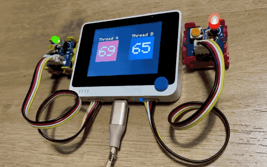
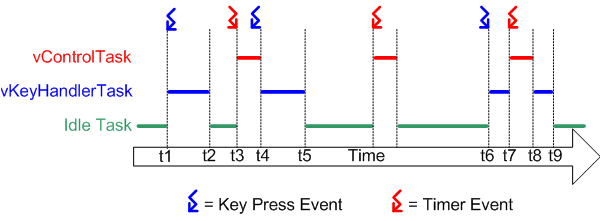

# RTOS

### **A Comprehensive Guide to Real-Time Operating Systems (RTOS)** 

<figure><figcaption></figcaption></figure>

In the world of embedded systems and robotics, where precise timing and reliability are paramount, a **Real-Time Operating System (RTOS)** plays a crucial role. Unlike general-purpose operating systems (GPOS) like Windows or Linux desktop distributions, an RTOS is specifically designed to manage hardware resources and schedule tasks to meet strict time constraints . This guide delves into the fundamentals of RTOS, their key features, architecture, how they work, common applications, popular examples including FreeRTOS and Zephyr OS, and considerations for development.

***

### **1. What is an RTOS? Definition and Importance**

A **Real-Time Operating System (RTOS)** is an operating system engineered to process data and events as they arrive, typically without buffering delays, and to execute tasks within predictable, often very short, timeframes (deadlines) . The core promise of an RTOS is **determinism**-the guarantee that the system will respond to an event within a specified and consistent time .

**Importance of RTOS:**

* **Time-Critical Applications:** Essential for systems where missing a deadline can lead to system failure, safety hazards, or mission-critical errors (e.g., automotive braking systems, medical pacemakers, industrial controllers) .
* **Predictability:** Ensures consistent response times, crucial for reliable operation.
* **Resource Management:** Efficiently manages CPU time, memory, and peripherals in resource-constrained embedded systems.
* **Concurrency:** Allows multiple tasks to appear to run simultaneously, managed by priority and scheduling.

***

### **2. How an RTOS Works: Core Mechanisms**

<figure><figcaption></figcaption></figure>

An RTOS achieves real-time behavior through a combination of several key mechanisms :

| Mechanism                                      | Description                                                                                                                                                                                                                                                 |
| ---------------------------------------------- | ----------------------------------------------------------------------------------------------------------------------------------------------------------------------------------------------------------------------------------------------------------- |
| **Task Scheduling**                            | The RTOS scheduler decides which task to execute at any given moment based on predefined algorithms (e.g., Rate Monotonic Scheduling, Earliest Deadline First, priority-based preemptive scheduling) to meet deadlines and prioritize critical operations . |
| **Interrupt Management**                       | Ensures minimal response times by quickly processing hardware interrupts. It can preempt ongoing lower-priority tasks to handle urgent interrupts immediately .                                                                                             |
| **Inter-Task Communication & Synchronization** | Provides mechanisms like semaphores, mutexes, message queues, and event flags to allow tasks to communicate, share data, and synchronize their execution safely and efficiently .                                                                           |
| **Resource Allocation**                        | Manages and allocates system resources such as CPU time, memory, and peripherals to different tasks according to their priority and needs, preventing conflicts .                                                                                           |

***

### **3. Key Features and Components of an RTOS**

| Feature/Component                     | Description                                                                                                                                                                   |
| ------------------------------------- | ----------------------------------------------------------------------------------------------------------------------------------------------------------------------------- |
| **Kernel**                            | The core of the RTOS, responsible for task management (creation, deletion, state changes), scheduling, inter-task communication, and resource management .                    |
| **Scheduler**                         | The essential component that implements the scheduling algorithm, managing task execution order and ensuring high-priority, time-sensitive tasks execute first .              |
| **Memory Management**                 | Efficiently allocates and manages memory, often using static memory allocation in hard real-time systems to prevent unpredictable delays associated with dynamic allocation . |
| **Fast Dispatch Latency**             | The minimal time taken for the RTOS to switch from one task to another (context switching). Low dispatch latency is critical for immediate response to real-time events .     |
| **Determinism**                       | Guarantees predictable responses to events within specified time constraints, a hallmark of RTOS functionality .                                                              |
| **Low Latency**                       | Minimal delay in task switching and interrupt handling .                                                                                                                      |
| **Reliability & Robustness**          | Designed for high reliability, crucial for critical applications where failure is not an option .                                                                             |
| **Symmetric Multiprocessing (SMP)**   | Many modern RTOS support SMP, allowing them to run across multiple processor cores for load balancing and improved performance .                                              |
| **Function Library (APIs)**           | Provides Application Programming Interfaces (APIs) for common operations like task creation, synchronization, communication, and device management, simplifying development . |
| **User-defined Data Objects/Classes** | Allows developers to create custom data structures and classes to enhance task management, synchronization, and message passing for optimized system performance .            |

***

### **4. Types of RTOS**

RTOS are broadly categorized based on the strictness of their timing constraints :

| RTOS Type                  | Description                                                                                                                          | Example Applications                                                                                              |
| -------------------------- | ------------------------------------------------------------------------------------------------------------------------------------ | ----------------------------------------------------------------------------------------------------------------- |
| **Hard Real-Time Systems** | Systems where missing a deadline is unacceptable and could lead to catastrophic failure or severe consequences.                      | Automotive (ABS, airbags, engine control), aerospace, medical (pacemakers, infusion pumps), industrial robotics . |
| **Soft Real-Time Systems** | Systems where meeting deadlines is important for performance, but occasional misses are tolerable and do not lead to system failure. | Multimedia streaming, online gaming, data acquisition systems.                                                    |
| **Firm Real-Time Systems** | A middle ground where infrequent deadline misses are tolerable, but may degrade the system's quality of service.                     | Some types of industrial control or financial trading systems.                                                    |

***

### **5. Common RTOS Applications**

RTOS are integral to a vast array of embedded systems and time-sensitive applications :

| Industry/Domain                      | Example Applications                                                                                                            |
| ------------------------------------ | ------------------------------------------------------------------------------------------------------------------------------- |
| **Automotive**                       | Engine Control Units (ECUs), Anti-lock Braking Systems (ABS), Advanced Driver Assistance Systems (ADAS), infotainment systems . |
| **Aerospace & Defense**              | Flight control systems, avionics, missile guidance, radar systems.                                                              |
| **Medical Devices**                  | Pacemakers, infusion pumps, patient monitoring systems, diagnostic equipment, surgical robots .                                 |
| **Industrial Automation & Robotics** | Programmable Logic Controllers (PLCs), robotic controllers, process control systems, SCADA systems .                            |
| **Consumer Electronics**             | Smartphones (baseband processors), wearables, smart home devices, set-top boxes, digital cameras .                              |
| **Telecommunications**               | Network routers, switches, base stations.                                                                                       |
| **Internet of Things (IoT)**         | Resource-constrained smart sensors, actuators, connected devices requiring real-time data processing .                          |

***

### **6. Popular RTOS Choices and Alternatives**

Several RTOS options are available, each with its strengths and target applications.

### **6.1. FreeRTOS (Amazon FreeRTOS)**

<figure><figcaption></figcaption></figure>

* **Overview:** A widely used, open-source, and portable real-time kernel for microcontrollers and small embedded systems . It is known for its small footprint, simplicity, and ease of use. Amazon Web Services (AWS) maintains and supports FreeRTOS, offering easy integration with AWS IoT services .
* **Key Features:** Preemptive and cooperative scheduling, inter-task communication (queues, semaphores, mutexes), small memory footprint, scalable.
* **Best Suited For:** Single-application IoT devices, energy-constrained use cases, systems where easy integration with AWS cloud is desired, less experienced developers looking for simplicity .
* **Ecosystem & Support:** While community support exists, professional support from AWS is a key aspect.
* **Considerations:** Fewer built-in features and less processing capability compared to more comprehensive RTOS like Zephyr. Security updates from AWS might be less frequent than community-driven projects .

### **6.2. Zephyr OS**

<figure><figcaption></figcaption></figure>

* **Overview:** An open-source RTOS hosted by the Linux Foundation, designed for resource-constrained embedded devices, from simple sensors to more complex IoT gateways and wearables . It emphasizes security, configurability, and a broad hardware architecture support (ARM Cortex-M, Intel x86, RISC-V, etc.) .
* **Key Features :**
  * Small kernel, highly configurable and modular (resources defined at compile-time) .
  * Multiple scheduling algorithms (preemptive, cooperative, earliest deadline first) .
  * Memory protection (MPU-based) .
  * Extensive connectivity support (Bluetooth, Wi-Fi, Ethernet, CAN, LoRaWAN, CoAP, LwM2M, MQTT) .
  * Rich set of device drivers and protocol stacks .
  * Strong security features (encryption, secure boot, firmware updates, OpenSSF Gold Badge) .
  * Build system based on Kconfig, devicetree, and CMake; "west" utility tool for management .
* **Best Suited For:** Complex IoT devices, wearables, automotive embedded systems, healthcare, devices requiring robust security, experienced developers familiar with Linux-like ecosystems, applications needing broad hardware and protocol support .
* **Ecosystem & Support:** Strong, active open-source community, extensive documentation, vast library of SDKs .
* **Considerations:** Its extensive feature set can present a steeper learning curve for less experienced developers compared to FreeRTOS .

### **6.3. Comparing FreeRTOS and Zephyr OS** [4](https://www.nabto.com/zephyr-vs-freertos-comparison/)

| Feature               | FreeRTOS                                                         | Zephyr OS                                                                          |
| --------------------- | ---------------------------------------------------------------- | ---------------------------------------------------------------------------------- |
| **Origin**            | Developed by AWS (originally Real Time Engineers Ltd.)           | Linux Foundation (open-source project)                                             |
| **Size & Complexity** | Very small, feature-light, almost bare-metal. Simple to use.     | More feature-rich, larger, more complex but highly configurable.                   |
| **Processing Power**  | Fewer features, less processing capability. Best for single app. | More computing power, suitable for multiple applications or complex devices.       |
| **Ecosystem**         | AWS professional support, less community-driven.                 | Strong open-source community, extensive documentation, vast SDK library.           |
| **Security**          | Relies on AWS security (updates can be less frequent).           | Strong focus on security, regular updates, OpenSSF Gold Badge.                     |
| **Customization**     | Highly customizable by adding features (requires dev time).      | Highly flexible and configurable due to modularity and Linux-based architecture.   |
| **Cloud Integration** | Easy integration with AWS cloud services.                        | Can integrate with various cloud services; good for P2P with platforms like Nabto. |

### **6.4. Other RTOS Alternatives** [5](https://www.g2.com/products/nucleus-rtos/competitors/alternatives)

| RTOS Alternative           | Description                                                                                                            |
| -------------------------- | ---------------------------------------------------------------------------------------------------------------------- |
| **Wind River VxWorks**     | Industry-leading commercial RTOS for embedded devices, known for rich functionality and reliability for over 30 years. |
| **Azure RTOS (ThreadX)**   | Microsoft's RTOS for small, resource-constrained IoT devices, often integrated with Azure IoT services.                |
| **Mbed OS**                | Arm's open-source embedded operating system for IoT devices based on Arm microcontrollers.                             |
| **NuttX**                  | A real-time operating system with an emphasis on standards compliance and small footprint.                             |
| **RIOT OS**                | A free, open-source operating system developed by a grassroots community for IoT devices.                              |
| **TinyOS**                 | Open-source, BSD-licensed OS designed for low-power wireless devices (sensor networks, ubiquitous computing) .         |
| **ChibiOS**                | Lightweight and efficient RTOS suitable for small embedded devices .                                                   |
| **μC/OS (Micrium)**        | Certified and reliable RTOS often used in safety-critical applications. (Now part of Silicon Labs).                    |
| **QNX Neutrino RTOS**      | A commercial Unix-like RTOS, known for its microkernel architecture and use in automotive and critical systems.        |
| **Nucleus RTOS (Siemens)** | A commercial RTOS used in a wide range of embedded applications, known for performance and scalability.                |

***

### **7. RTOS Development and Optimization**

Developing applications with an RTOS involves specific considerations :

* **Requirement Analysis:** Clearly defining the system's real-time requirements, deadlines, and task priorities.
* **System Design:** Architecting the system, including task decomposition, prioritization, resource management strategies, and inter-task communication mechanisms.
* **Implementation:** Writing efficient, modular code, mindful of real-time constraints and potential race conditions.
* **Testing and Debugging:** Rigorous testing under various load conditions to verify real-time performance and reliability. Using tools for real-time analysis.
* **Performance Optimization Techniques :**
  * Minimizing context switching overhead.
  * Optimizing interrupt handling routines (ISRs).
  * Handling priority inversion (e.g., using priority inheritance or ceiling protocols).
  * Using lightweight tasks where appropriate.
  * Efficient memory management.
* **Tools for Optimization :**
  * **Performance Analyzers:** (e.g., Tracealyzer) for visualizing task execution, timing, and identifying bottlenecks.
  * **Profiling Tools:** To measure execution time and pinpoint performance issues.

***

### **8. RTOS Design Patterns** [10](https://arshon.com/blog/comprehensive-guide-to-rtos-and-related-concepts/)

Using established design patterns can help solve common problems efficiently in RTOS development:

| Design Pattern                | Description                                                    | Benefits                                |
| ----------------------------- | -------------------------------------------------------------- | --------------------------------------- |
| **State Machine Pattern**     | Manages different states of a system or task.                  | Clarity, maintainability.               |
| **Observer Pattern**          | Handles event notification and distribution to multiple tasks. | Decoupling, flexibility.                |
| **Producer-Consumer Pattern** | Manages data flow between tasks producing and consuming data.  | Buffering, synchronization, decoupling. |

These patterns contribute to reusability, scalability, and maintainability of RTOS-based applications.
