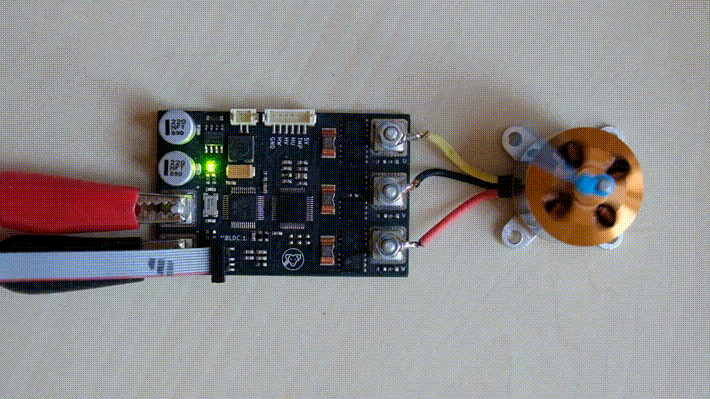
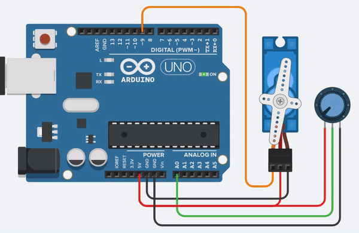
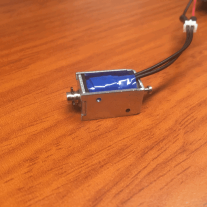
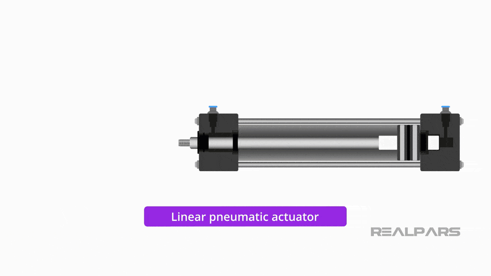

# Actuators for Robotics

## Actuators for Robotics 

Actuators are the "muscles" of robots, converting electrical, hydraulic, or pneumatic energy into mechanical motion. Here's a comprehensive overview of the most common actuator types used in robotics today.

### DC Motors 

<figure><figcaption></figcaption></figure>

DC motors are fundamental actuators that convert electrical energy into rotational motion. When voltage is applied to the terminals, the motor spins. Direction control is achieved by reversing polarity, while speed control is managed by varying voltage.

**Key characteristics:**

* High torque-to-weight ratio
* Quick response times
* Simple control mechanism
* Ideal for mobile robots and applications requiring consistent speed

DC motors are preferred in robotics applications due to their ability to provide high torque at low RPMs. Most robotic applications require mobility alongside operational capability, making battery-powered DC motors an excellent choice.

As of 2025, DC motors remain popular for robotics because they:

* Convert electrical energy to mechanical energy efficiently
* Provide high starting torque
* Offer excellent torque-to-speed ratio
* Allow for precise speed control

### Brushless DC Motors (BLDC) 

<figure><figcaption></figcaption></figure>

BLDC motors represent an advancement over traditional brushed DC motors, eliminating the need for physical brushes by using electronic commutation.

**Advantages over brushed motors:**

* Higher efficiency (85-90% vs. 75-80%)
* Longer lifespan with minimal maintenance
* Reduced noise and electromagnetic interference
* Higher power-to-weight ratio
* Nearly instantaneous control of speed and torque
* Suitable for high-speed applications (10,000+ RPM)

In BLDC motors, an electronic controller replaces the brush commutator contacts. The controller uses sensors to detect rotor position and switches current through the windings at the correct angle to create continuous torque.

### Servo Motors 

<figure><figcaption></figcaption></figure>

Servo motors are precision instruments that enable accurate position control. They consist of a motor with built-in feedback mechanisms that constantly monitor and adjust position.

**Components:**

* Motor (DC or AC)
* Control circuit
* Potentiometer or encoder for position feedback
* Gearing system

Servo motors excel in applications requiring precise angular positioning, such as:

* Robotic arms and grippers
* CNC machining
* Conveyor systems
* Camera positioning systems

The key feature of servo motors is their closed-loop control system (servomechanism) that ensures accurate positioning. They can rotate to specific angles with high precision, making them ideal for tasks requiring exact movements.

### Gear Motors 

<figure><figcaption></figcaption></figure>

A gear motor combines an electric motor with a gearbox containing a series of gears. The gearbox reduces the motor's speed while increasing its torque.

**Functions and benefits:**

* Multiplies the torque of the motor
* Reduces the speed of the input motor
* Provides multiple combinations of reduction ratios
* Offers an integrated, ready-to-use solution

Gear motors vary in structure depending on the intended load (light, medium, or heavy) and operating duration. The reduction ratio-the relationship between input and output speed-is a critical characteristic that determines performance.

Unlike stepper motors, gear motors have higher dynamic torque but lower holding torque, making them better suited for continuous motion than precise positioning.

### Solenoids 

<figure><figcaption></figcaption></figure>

Solenoids are electromagnetic actuators that produce linear motion. When current flows through the coil, it creates a magnetic field that pulls a ferromagnetic plunger.

**Applications:**

* Push-pull mechanisms
* Valve operators
* Locking mechanisms
* Jumping robots

Solenoids can be:

* Electromechanical (AC/DC)
* Hydraulic
* Pneumatic

They're simple, reliable, and ideal for applications requiring short, powerful linear movements.

### Stepper Motors 

<figure><figcaption></figcaption></figure>

Stepper motors rotate in discrete steps rather than continuously. They have multiple coils that must be energized in sequence to produce rotation.

**Key features:**

* Precise positioning without feedback
* Known step angle (typically 1.8° or 0.9° per step)
* Excellent holding torque
* Open-loop control possibility

Stepper motors are widely used in:

* 3D printers
* CNC machines
* Camera platforms
* Precision positioning systems

Their ability to move in exact increments makes them ideal for applications requiring precise positioning without complex feedback systems.

### Pneumatic & Hydraulic Actuators 

### Pneumatic Actuators

<figure><figcaption></figcaption></figure>

<figure><figcaption></figcaption></figure>

Pneumatic actuators use compressed air to generate force and motion. They're common in industrial automation due to their simplicity and reliability.

**Advantages:**

* Clean operation
* Safe in explosive environments
* Low cost
* Simple maintenance

**Applications:**

* Grippers
* Linear motion systems
* Robotic joints
* Valve control

### Hydraulic Actuators

Hydraulic actuators use incompressible fluid (typically oil) to transmit force. They excel in high-force applications.

**Advantages:**

* Extremely high force capability
* Smooth operation
* Self-lubricating
* Good control characteristics

**Applications:**

* Heavy lifting robots
* Industrial manipulators
* Construction robotics
* High-force applications

### Emerging Actuator Technologies 

### Shape Memory Alloys (SMAs)

Materials that change shape when heated, providing silent actuation with high power density.

### Piezoelectric Actuators

Convert electrical energy to precise mechanical displacement, ideal for micro-positioning.

### Electroactive Polymers (EAPs)

Polymer materials that change size or shape when stimulated by an electric field.

### Soft Actuators

Flexible, compliant actuators made from soft materials, often pneumatically or hydraulically driven.

### Selecting the Right Actuator 

When choosing actuators for robotics projects, consider:

* Required force/torque
* Speed and precision needs
* Power availability
* Weight constraints
* Control complexity
* Environmental conditions
* Cost limitations

Each actuator type has distinct advantages and limitations, making them suitable for different robotics applications. The right choice depends on your specific requirements and constraints.
