# Sensors for Robotics

### Motion and Orientation Sensors 

### Accelerometer

<figure>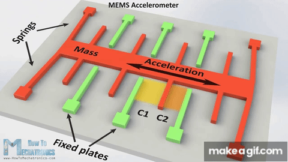<figcaption></figcaption></figure>

* **Function**: Measures linear acceleration forces and tilt
* **Types**: Capacitive MEMS, Piezoresistive, Piezoelectric
* **Applications**: Motion detection, orientation sensing, vibration analysis, fall detection
* **Examples**: ADXL345, MPU-6050, LIS3DH

### Types of Accelerometer

The 3 important types of accelerometers are:

* **Capacitive MEMS Accelerometer**: Detects changes in capacitance instead of resistance. Most mobile devices use this type of accelerometer.
* **Piezoresistive Accelerometer**: Measures vibrations by changes in resistance. Effective for measuring very slight vibrations, such as gravity vector.
* **Piezoelectric Accelerometer**: Uses crystals or ceramics (like lead zirconate, lead titanate) that absorb vibrations and produce equivalent electrical signals.

### Working Principle

The main working principle of an accelerometer is converting mechanical energy into electrical energy. When a mass placed on the sensor (which acts like a spring) moves due to acceleration, this movement generates an electrical signal proportional to the acceleration. This signal is used to measure variations in the device's position.

Accelerometers are available in both analog and digital forms and can detect static forces like gravity or dynamic forces in devices like phones and laptops.

### Applications in Robotics

* Motion detection and orientation sensing
* Vibration analysis
* Navigation systems
* Fall detection in safety systems
* Tilt sensing for balance control

### Gyroscope

<figure><figcaption></figcaption></figure>

* **Function**: Measures angular velocity and rotation
* **Types**: MEMS, Fiber optic, Ring laser
* **Applications**: Stabilization, navigation, motion control
* **Examples**: L3GD20H, ITG-3200, MPU-6050

### Working Principle

Modern MEMS gyroscopes use vibrating elements to detect changes in orientation based on the Coriolis effect. When the gyroscope rotates about any of the sense axes, the Coriolis Effect causes a vibration that is detected by a MEM inside the sensor. This signal is amplified, demodulated, and filtered to produce a voltage proportional to the angular rate.

### Applications in Robotics

* Stabilization systems for drones and robots
* Navigation and orientation tracking
* Camera stabilization
* Balancing robots
* Motion control in gaming and VR

### Magnetometer

<figure><figcaption></figcaption></figure>

* **Function**: Measures magnetic field strength and direction
* **Types**: Hall effect, Fluxgate, Magnetoresistive
* **Applications**: Compass heading, metal detection, position tracking
* **Examples**: HMC5883L, LSM303, MAG3110

### Working Principle

Magnetometers work on the principle of Faraday's Law of induction and magnetic properties of matter. Copper coils wrapped around a magnetic core detect fluctuations in magnetic fields, which induce current flow. Modern magnetometers use technologies like TMR (tunnel magnetoresistance) for higher accuracy.

### Applications in Robotics

* Navigation and heading determination
* Position tracking in GPS-denied environments
* Metal detection and mapping
* Gesture recognition in combination with other sensors
* Augmented reality applications

### IMU (Inertial Measurement Unit)

<figure><figcaption></figcaption></figure>

* **Function**: Combines accelerometer, gyroscope, and often magnetometer
* **Applications**: Drone stabilization, robot orientation, motion capture
* **Examples**: MPU-9250, BNO055, ICM-20948

### Working Principle

An IMU combines multiple sensors (typically accelerometers, gyroscopes, and sometimes magnetometers) to provide complete motion tracking. The accelerometer measures linear acceleration, the gyroscope measures rotational rate, and the magnetometer (if included) measures magnetic field direction.

Modern IMUs often include sensor fusion algorithms that combine data from all sensors to provide more accurate orientation information than any single sensor could provide alone.

### Applications in Robotics

* Drone stabilization and navigation
* Robot balance and orientation
* Motion capture
* Autonomous vehicle navigation
* Virtual and augmented reality

### Distance and Proximity Sensors 

### Infrared (IR) Proximity Sensor

<figure>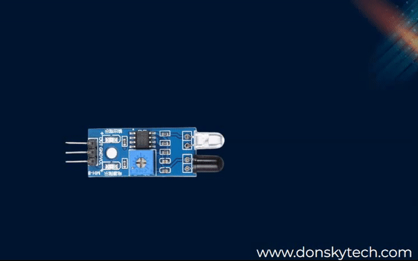<figcaption></figcaption></figure>

* **Function**: Detects nearby objects using IR reflection
* **Range**: 2cm to 30cm typically
* **Applications**: Obstacle detection, line following, motion detection
* **Examples**: TCRT5000, QRE1113, GP2Y0A21YK

### Working Principle

IR sensors work by emitting infrared light and detecting its reflection. The sensor consists of an IR LED (emitter) and a photodiode (detector). When the emitted IR light hits an object, it reflects back to the detector, creating a measurable electrical signal.

### Applications in Robotics

* Line following
* Obstacle detection
* Motion detection
* Encoders
* Color detection
* Edge detection

### IR Distance Sensor

* **Function**: Measures distance using triangulation
* **Range**: 10cm to 80cm typically
* **Applications**: Precise distance measurement, mapping
* **Examples**: Sharp GP2Y0A02YK, GP2Y0A710K

### Ultrasonic Sensor

<figure>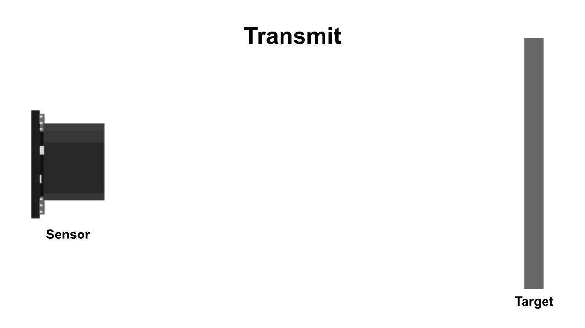<figcaption></figcaption></figure>

* **Function**: Measures distance using sound wave reflection
* **Range**: 2cm to 400cm typically
* **Applications**: Obstacle avoidance, level sensing, mapping
* **Examples**: HC-SR04, US-100, MB1240

### Working Principle

An ultrasonic sensor generates high-frequency sound waves (40 kHz) and evaluates the echo received back. By measuring the time between emission and reception, the sensor can calculate the distance to an object using the formula:

**Distance = Time × Speed of sound / 2**

Most ultrasonic sensors like HC-SR04 can measure distances from 2 cm to 400 cm.

### Applications in Robotics

* Obstacle avoidance
* Level sensing
* Object detection in transparent materials
* Mapping and navigation
* Proximity detection

### Time-of-Flight (ToF) Sensor

<figure>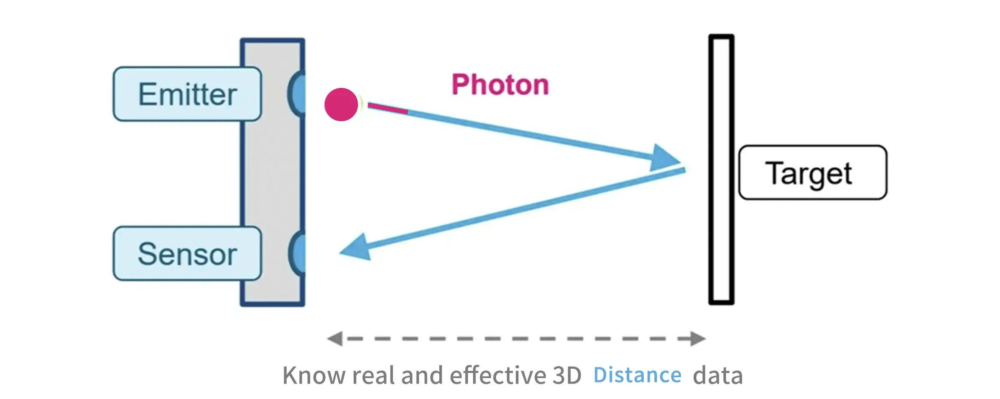<figcaption>
ToF Sensor
</figcaption></figure>

* **Function**: Measures distance using light travel time
* **Range**: Up to several meters with high precision
* **Applications**: 3D mapping, gesture recognition, precise ranging
* **Examples**: VL53L0X, VL53L1X, TMF8801

### LIDAR (Light Detection and Ranging)

* **Function**: Creates detailed distance maps using laser
* **Types**: 1D, 2D (planar), 3D
* **Applications**: Navigation, mapping, obstacle detection
* **Examples**: RPLIDAR, Velodyne Puck, YDLIDAR

### Position and Motion Tracking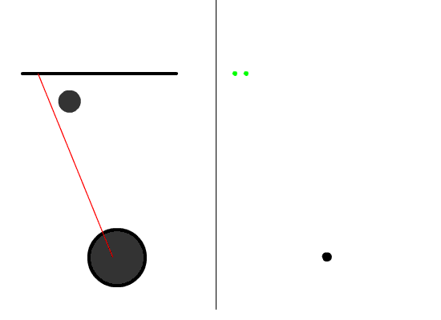 

### Encoders

<figure>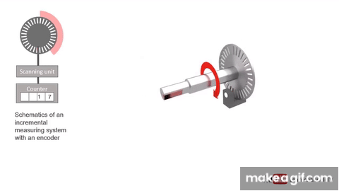<figcaption></figcaption></figure>

* **Types**: Incremental, Absolute, Optical, Magnetic
* **Function**: Measures rotation of wheels or motors
* **Applications**: Position tracking, speed control, odometry
* **Examples**: E6B2-CWZ6C, AMT102, AS5048A

### Working Principle

A typical encoder uses optical sensors, a moving mechanical component, and a special reflector to provide a series of electrical pulses to your microcontroller. These pulses can be used as part of a PID feedback control system.

There are two main types:

* **Incremental encoders**: Generate pulses as the shaft rotates, counting these pulses determines position change
* **Absolute encoders**: Provide a unique digital code for each shaft position

### Applications in Robotics

* Motor speed control
* Position feedback
* Navigation systems
* Robotic arm joint position sensing
* Wheel odometry for localization

### Potentiometer

<figure><figcaption></figcaption></figure>

* **Function**: Measures angular position through resistance
* **Applications**: Joint angle sensing, user input, simple position feedback
* **Examples**: 10K linear potentiometer, 3590S precision pot

### Linear Variable Differential Transformer (LVDT)

<figure>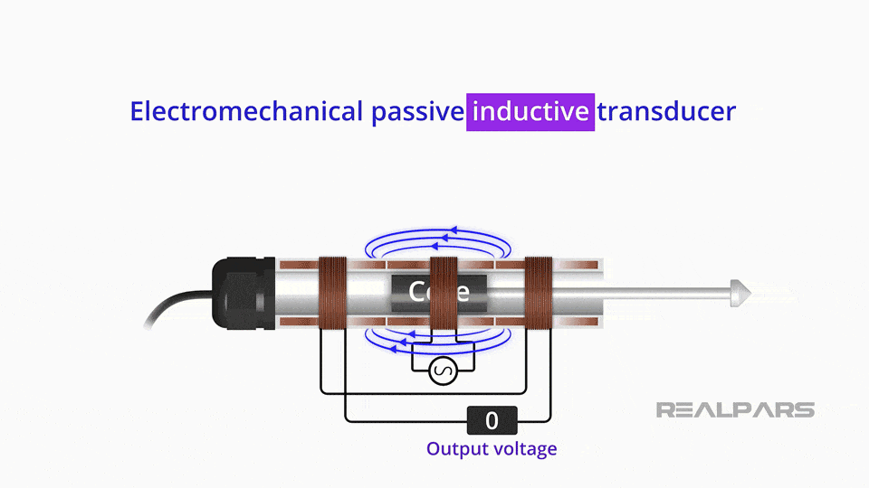<figcaption></figcaption></figure>

* **Function**: Measures linear displacement
* **Applications**: Precision motion control, industrial automation
* **Examples**: Macro Sensors GHSE/GHSER Series

### Environmental Sensors 

### Temperature Sensor

<figure>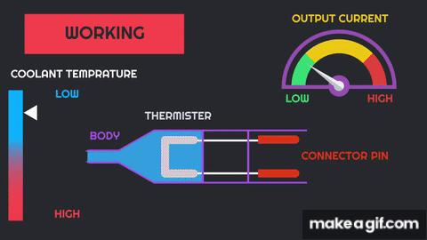<figcaption></figcaption></figure>

* **Types**: Thermistor, Thermocouple, RTD, Digital IC
* **Applications**: Thermal monitoring, environmental sensing, motor protection
* **Examples**: DS18B20, TMP36, DHT22, MAX6675

### Humidity Sensor

* **Types**: Capacitive, Resistive, Thermal
* **Applications**: Environmental monitoring, weather stations
* **Examples**: DHT11, DHT22, BME280, SHT31

### Barometric Pressure Sensor

<figure>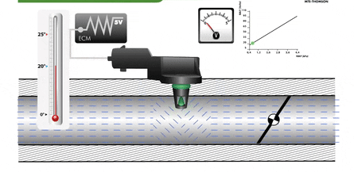<figcaption></figcaption></figure>

* **Function**: Measures atmospheric pressure
* **Applications**: Altitude estimation, weather prediction
* **Examples**: BMP280, BMP388, MS5611

### Gas Sensors

<figure><figcaption></figcaption></figure>

* **Types**: MQ series (MQ-2, MQ-3, etc.), electrochemical, infrared
* **Detects**: Various gases (CO, CO2, methane, alcohol, smoke)
* **Applications**: Air quality monitoring, leak detection, safety systems
* **Examples**: MQ-2, MQ-135, CCS811, SGP30

### Vision and Light Sensors 

### Camera Sensors

<figure>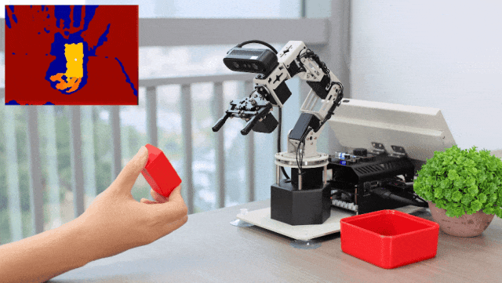<figcaption></figcaption></figure>

* **Types**: CMOS, CCD, Thermal, Depth
* **Applications**: Computer vision, object recognition, navigation
* **Examples**: OV7670, Raspberry Pi Camera, Intel RealSense

### Light Sensor (Photoresistor/Photodiode)

<figure><figcaption></figcaption></figure>

* **Function**: Detects ambient light levels
* **Applications**: Light-following, day/night detection
* **Examples**: LDR, TSL2561, BH1750

### Color Sensor

<figure>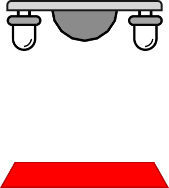<figcaption></figcaption></figure>

* **Function**: Detects surface color (usually RGB)
* **Applications**: Line following, color sorting, object identification
* **Examples**: TCS34725, TCS230, APDS-9960

### Working Principle

Color sensors work by detecting what colored light is being reflected off a surface. Each sensor typically has LEDs that illuminate with white light and a light detector. The white light hits the surface, some is absorbed and some reflected based on the surface color. The sensor detects the returning reflected colored light and determines the color.

### Applications in Robotics

* Line following robots
* Color sorting systems
* Object identification
* Quality control
* Environmental monitoring

### Force and Pressure Sensors 

### Force Sensitive Resistor (FSR)

<figure>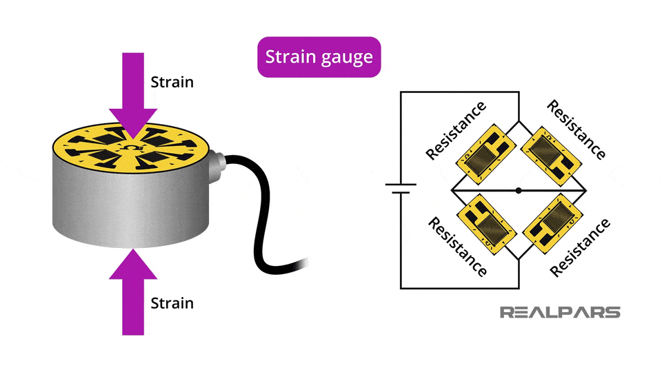<figcaption></figcaption></figure>

* **Function**: Measures applied force/pressure
* **Applications**: Touch detection, grip sensing, weight measurement
* **Examples**: FSR400, FSR402, Interlink FSR

### Load Cell

<figure>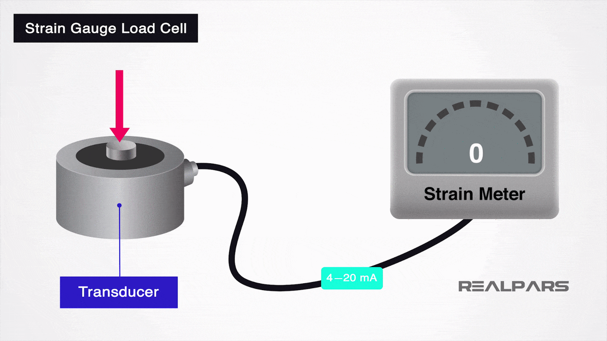<figcaption></figcaption></figure>

* **Function**: Precise weight/force measurement
* **Applications**: Weight sensing, force feedback, industrial automation
* **Examples**: HX711 with strain gauge load cells

### Pressure Sensor

<figure>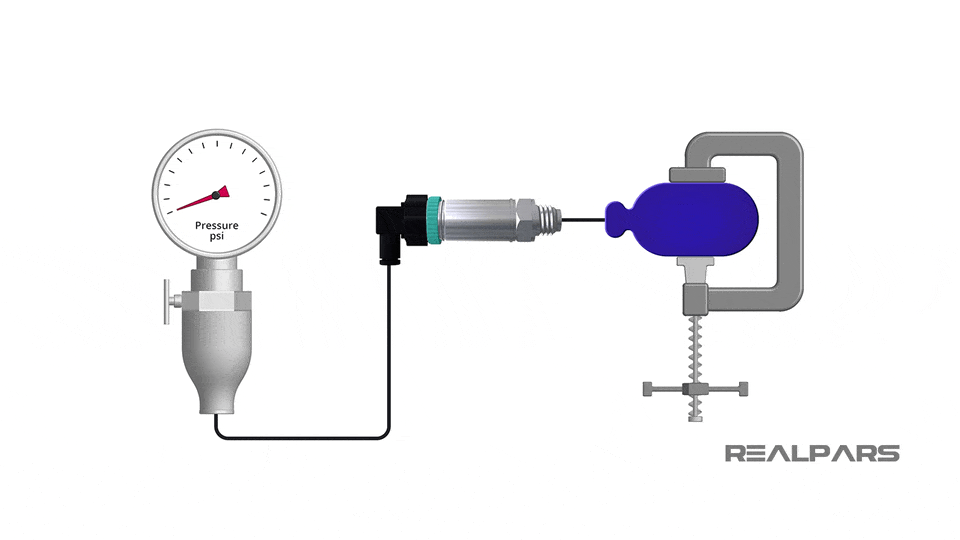<figcaption></figcaption></figure>

* **Types**: Absolute, Gauge, Differential
* **Applications**: Pneumatic systems, weather stations, altitude sensing
* **Examples**: BMP280, MS5803, MPX5010

### Strain Gauge

<figure>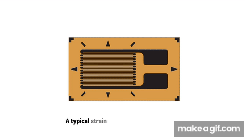<figcaption></figcaption></figure>

* **Function**: Measures deformation/strain in materials
* **Applications**: Structural monitoring, force measurement
* **Examples**: BF350-3AA, KFG series

### Tactile and Contact Sensors 

<figure><figcaption></figcaption></figure>

### Bump Sensor

<figure>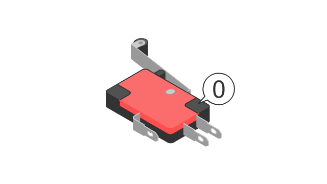<figcaption></figcaption></figure>

* **Function**: Detects physical contact/collision
* **Types**: Mechanical switch, spring-loaded
* **Applications**: Collision detection, boundary sensing
* **Examples**: Basic microswitches, roller switches

### Working Principle

Bump sensors are simple switches that close a circuit when physical contact is made. When the sensor bumps into an object, the mechanical contact completes the circuit, sending a signal to the microcontroller.

### Applications in Robotics

* Collision detection
* Boundary detection
* User interface buttons
* Safety systems
* Simple navigation

### Capacitive Touch Sensor

<figure>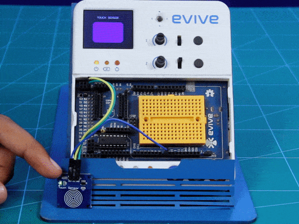<figcaption></figcaption></figure>

* **Function**: Detects touch without physical pressure
* **Applications**: User interfaces, proximity detection
* **Examples**: TTP223, MPR121, AT42QT1010

### Piezoelectric Sensor

<figure><figcaption></figcaption></figure>

* **Function**: Generates voltage when deformed
* **Applications**: Vibration sensing, knock detection
* **Examples**: Piezo discs, LDT0-028K

### Specialized Sensors 

### Current Sensor

<figure>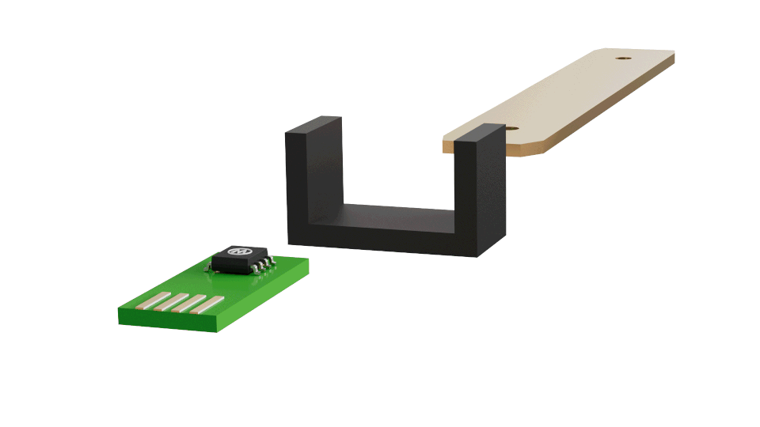<figcaption></figcaption></figure>

* **Types**: Hall effect, Shunt resistor
* **Applications**: Motor current monitoring, power management
* **Examples**: ACS712, INA219, MAX471

### Voltage Sensor

<figure>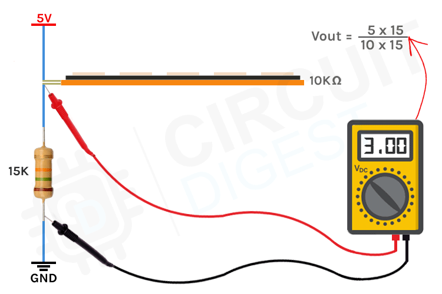<figcaption></figcaption></figure>

* **Function**: Measures voltage levels
* **Applications**: Battery monitoring, power supply sensing
* **Examples**: Voltage dividers, INA219

### Sound Sensor (Microphone)

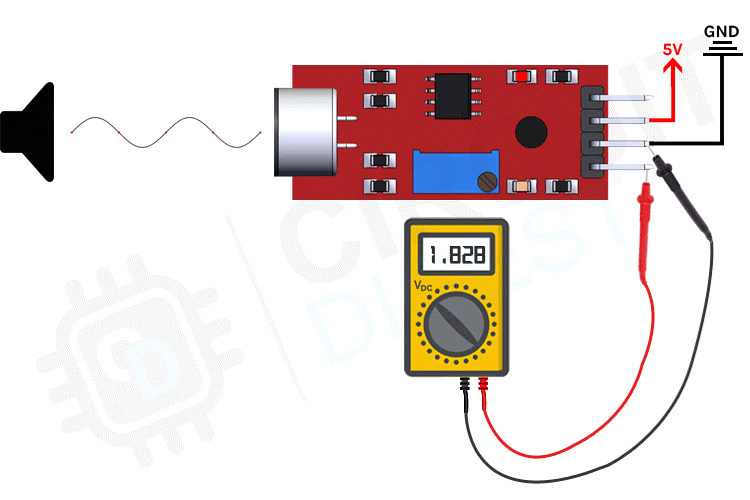

* **Types**: Electret, MEMS, Dynamic
* **Applications**: Voice commands, sound detection, acoustic localization
* **Examples**: MAX9814, INMP441, LM386 with electret mic

### Flex Sensor

<figure><figcaption></figcaption></figure>

* **Function**: Measures bending or flexing
* **Applications**: Robotic fingers, wearable devices
* **Examples**: SpectraSymbol flex sensors

### Hall Effect Sensor

<figure>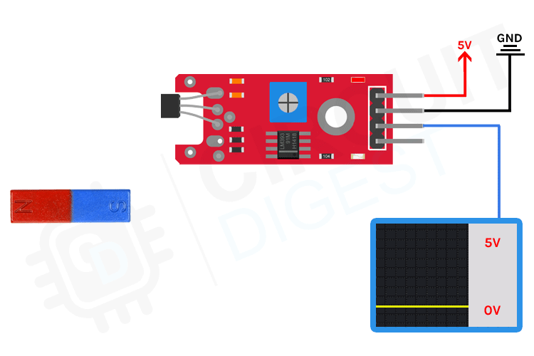<figcaption></figcaption></figure>

* **Function**: Detects magnetic fields
* **Applications**: Position sensing, speed measurement, current sensing
* **Examples**: A3144, SS49E, OH49E

### Radiation Sensor

<figure><figcaption></figcaption></figure>

* **Types**: Geiger-Müller, Scintillation
* **Applications**: Radiation monitoring, nuclear robotics
* **Examples**: SBM-20, Radiation Board

### Flow Sensor

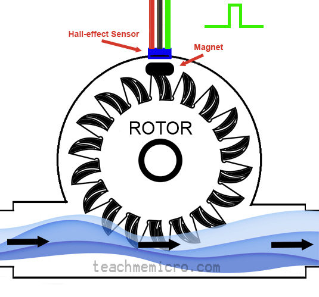

* **Function**: Measures liquid or gas flow rate
* **Applications**: Fluid control, cooling systems
* **Examples**: YF-S201, FS300A

### Bio-Sensors

* **Function**: Detects biological substances or conditions
* **Applications**: Medical robotics, health monitoring
* **Examples**: Pulse sensors, GSR (Galvanic Skin Response)

### Soil Moisture Sensor

<figure><figcaption></figcaption></figure>

* **Function**: Measures water content in soil
* **Applications**: Agricultural robots, automated irrigation
* **Examples**: Capacitive soil moisture sensor, resistive probes
