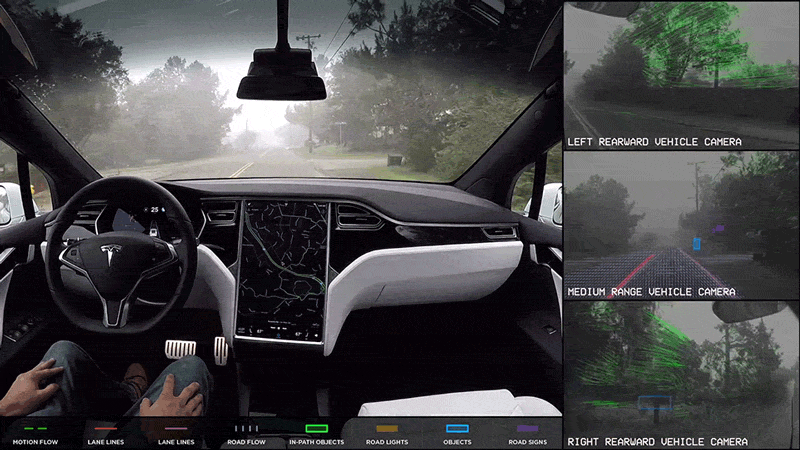

# Autonomous Navigation

### **Autonomous Navigation: A Comprehensive Guide** 

<figure><figcaption></figcaption></figure>

Autonomous navigation in robotics refers to the capability of robotic systems to perceive their environment, plan a path, and execute movement to a desired destination without direct human intervention or control. It is a cornerstone technology driving advancements across numerous fields, from self-driving cars and drones to industrial automation and space exploration. This guide explores the fundamental principles of autonomous navigation, the technologies that enable it, its diverse applications, the organizations pioneering its development, significant research contributions, and resources for further learning.

***

### **0. The 2026 split: Modular vs end-to-end**

The biggest architectural debate in autonomous navigation right now is between **modular** stacks (separate perception → localization → planning → control modules, with hand-engineered interfaces) and **end-to-end learning** stacks (a single neural network from sensors to actions, or close to it). Both are shipping.

| Approach | Companies | Strengths | Weaknesses |
|---|---|---|---|
| **Modular + ML perception** | Waymo, Mobileye, Cruise (paused), Baidu Apollo | Interpretable, debuggable, regulatory-friendly. Per-module SOTA. | Stack complexity, integration bugs, slower iteration. |
| **End-to-end learned (vision)** | Tesla FSD, Wayve | Single forward pass; data-scaling wins; simpler stack. | Hard to debug, regulatory questions, data-hungry. |
| **End-to-end learned (sim-first)** | Waabi | Trained almost entirely in simulation; novel safety arguments. | New approach; production track record building. |
| **World-model-driven** | Wayve (GAIA), NVIDIA (Cosmos) | Plan and reason in a learned world; counterfactual evaluation. | Compute-heavy, novel; only partially deployed. |

**Why this matters in 2026:** The post-RT-2 / post-foundation-model wave has moved AV in the direction of fewer, larger learned components. Tesla FSD v12+ replaced hundreds of thousands of lines of C++ heuristics with a single neural network. Wayve's GAIA-1/2 generates driving video for training. Waymo still uses a modular stack but every module has ML inside it. There is no consensus winner yet — both ship, both have ground truth in different ways.

For a deeper look at the learning side, see [Robot Learning → World Models](../robot-learning/world-models.md) and [Foundation Models / VLAs](../robot-learning/foundation-models-vla.md).

***

### **1. Guide to Autonomous Navigation**

<figure><figcaption>
Nvidia Issac ROS Simulator
</figcaption></figure>

### **1.1. What is Autonomous Navigation? Definition and Importance**

Autonomous navigation empowers a robot or system to make intelligent movement decisions by understanding its surroundings. It involves a complex interplay of sensing, localization, mapping, path planning, and motion control to achieve independent mobility. The importance of autonomous navigation is underscored by its potential to:

* Enhance efficiency and productivity in various industries.
* Improve operational safety by minimizing human error.
* Enable operations in environments that are hazardous, inaccessible, or remote for humans (e.g., disaster sites, space).
* Reduce operational costs in sectors like logistics and agriculture.

### **1.2. How Autonomous Navigation Works: Core Components and Technologies**

The success of autonomous navigation systems hinges on several key components working in synergy:

**Key Components and Technologies in Autonomous Navigation:**

| Component Category           | Technology/Method                                     | Description                                                                                                                                 |
| ---------------------------- | ----------------------------------------------------- | ------------------------------------------------------------------------------------------------------------------------------------------- |
| **Sensor Systems**           | LiDAR (Light Detection and Ranging)                   | Provides precise 3D point clouds for distance measurement, obstacle detection, and mapping.                                                 |
|                              | Cameras (Visual Sensors)                              | Capture images/video for object recognition, feature detection, and visual SLAM.                                                            |
|                              | Ultrasonic Sensors                                    | Detect nearby obstacles using sound waves, often for short-range collision avoidance.                                                       |
|                              | Radar                                                 | Uses radio waves to detect objects/velocity, effective in various weather conditions.                                                       |
|                              | Inertial Measurement Units (IMUs)                     | Measure orientation, angular velocity, linear acceleration for motion estimation and balance.                                               |
|                              | GPS (Global Positioning System)                       | Provides absolute global coordinates, primarily for outdoor navigation.                                                                     |
|                              | Sensor Fusion                                         | Combining data from multiple sensors (LiDAR, cameras, IMU) for a robust understanding of the environment and robot state.                   |
| **Localization Technology**  | GPS                                                   | For outdoor systems.                                                                                                                        |
|                              | SLAM (Simultaneous Localization and Mapping)          | Algorithms to build a map of an unknown environment while tracking location within it. Fundamental for new/dynamic environments.            |
|                              | Visual Odometry                                       | Estimates motion by analyzing consecutive camera images.                                                                                    |
|                              | Map-based Localization                                | Uses pre-existing maps and matches current sensor readings to map features.                                                                 |
| **Mapping**                  | Various Techniques                                    | Creating environmental representations (2D occupancy grids, 3D point clouds, semantic maps with object identification).                     |
| **Path Planning Algorithms** | Global Path Planners (A\*, Dijkstra's)                | Find a path using the entire known map.                                                                                                     |
|                              | Local Path Planners (DWA)                             | Make real-time adjustments to avoid immediate obstacles and follow the global path.                                                         |
|                              | Hybrid Systems (IA-DWA)                               | Integrate global and local planning for optimized and reactive navigation.                                                                  |
| **Motion Control**           | Actuator Commands                                     | Executes the planned path by sending commands to robot actuators (motors).                                                                  |
| **Machine Learning & AI**    | Deep Learning (DL), Deep Reinforcement Learning (DRL) | Enables object recognition, adaptation to dynamic conditions, learning from experience, real-time decisions, predictive obstacle avoidance. |
|                              | Transformer Architectures                             | (e.g., iMoT) showing promise for navigation, especially in GPS-denied areas.                                                                |

### **1.3. Types of Autonomous Navigation**

Different environments and applications necessitate various approaches:

| Navigation Type                     | Environment/Focus                                                                      | Key Reliance/Technologies                 |
| ----------------------------------- | -------------------------------------------------------------------------------------- | ----------------------------------------- |
| **Indoor Navigation**               | Structured (warehouses, factories, hospitals, malls).                                  | Detailed maps, SLAM, LiDAR, markers.      |
| **Outdoor Navigation**              | Complex, variable weather, uneven terrain, dynamic obstacles (vehicles, agriculture).  | GPS, robust SLAM, sensor fusion.          |
| **Underwater Navigation**           | GPS-denied, poor visibility.                                                           | Acoustic sensors, IMUs, specialized SLAM. |
| **Aerial Navigation (UAVs/Drones)** | 3D space, obstacle avoidance, airspace regulations.                                    | Precise control, SLAM, path planning.     |
| **Maritime Navigation**             | Vessels, situational awareness, decision-making (operator-guided to fully autonomous). | Sensor integration.                       |

### **1.4. Key Challenges and Solutions**

Despite significant progress, autonomous navigation still faces hurdles:

| Challenge                               | Description                                                                | Potential Solutions                                                                                             |
| --------------------------------------- | -------------------------------------------------------------------------- | --------------------------------------------------------------------------------------------------------------- |
| **Environmental Complexity & Dynamism** | Handling unpredictable obstacles, changing weather, unstructured terrains. | Advanced sensor fusion, ML for predicting dynamic obstacle movement, robust SLAM algorithms.                    |
| **Computational Requirements**          | Processing vast sensor data in real-time.                                  | Efficient algorithms, powerful onboard processors, edge computing.                                              |
| **Localization Accuracy**               | Maintaining precise position in GPS-denied or feature-poor environments.   | Robust SLAM techniques (AI-driven, Visual-Inertial SLAM), multi-sensor fusion.                                  |
| **Safety and Reliability**              | Ensuring dependable operation in human-populated or critical missions.     | Redundant sensor systems, fail-safe mechanisms, rigorous testing (simulated/real-world), continuous monitoring. |
| **Cybersecurity**                       | Protecting systems from malicious attacks (networked UAVs/vehicles).       | Robust cybersecurity measures for communication and control systems.                                            |
| **Regulatory Adaptation**               | Developing/adapting regulations for autonomous operations.                 | Ongoing dialogue between industry, researchers, and regulatory bodies.                                          |
| **Cost Factors**                        | High cost of quality sensors and processing systems (though decreasing).   | Advances in sensor technology, economies of scale.                                                              |

***

### **2. Companies and Institutes Working on Autonomous Navigation**

**Leading Global Companies & Platforms:**

| Category                                | Companies                                                                                                                                                                          |
| --------------------------------------- | ---------------------------------------------------------------------------------------------------------------------------------------------------------------------------------- |
| **Automotive**                          | Waymo (Google), Cruise (GM), Tesla, Mobileye (Intel), Nvidia (Drive platform), Zoox (Amazon), Aurora Innovation                                                                    |
| **Logistics & Warehousing (AMRs/AGVs)** | KUKA AG, OMRON Corporation (Adept Technology), Mobile Industrial Robots (MiR), Geekplus Technology Co., Ltd., ABB, Fetch Robotics (Zebra Technologies), Locus Robotics, GreyOrange |
| **Drones/UAVs**                         | DJI, Skydio, Parrot, Wing (Alphabet), Amazon Prime Air                                                                                                                             |
| **Maritime**                            | Maritime Robotics (Autonomous Navigation System), Kongsberg Maritime                                                                                                               |
| **Robotics & AI Platform Providers**    | Clearpath Robotics, Boston Dynamics (Spot), NVIDIA (Isaac Sim, Jetson)                                                                                                             |
| **Security Robotics**                   | Kabam AI (autonomous security robots)                                                                                                                                              |

**Key Research Institutes (Global):**

| Institute Name                                          | Country     | Relevant Labs/Focus                              |
| ------------------------------------------------------- | ----------- | ------------------------------------------------ |
| **MIT (Massachusetts Institute of Technology)**         | USA         | CSAIL, various robotics labs                     |
| **Stanford University**                                 | USA         | Stanford AI Lab (SAIL), Stanford Robotics Center |
| **Carnegie Mellon University (CMU)**                    | USA         | Robotics Institute                               |
| **ETH Zurich**                                          | Switzerland | Autonomous Systems Lab                           |
| **University of Oxford**                                | UK          | Oxford Robotics Institute                        |
| **DFKI (German Research Center for Artificial Intel.)** | Germany     | Robotics, AI                                     |

**Presence in India:**

| Category                  | Entities                                                                                                                                                                             |
| ------------------------- | ------------------------------------------------------------------------------------------------------------------------------------------------------------------------------------ |
| **Companies**             | Swaayatt Robots (autonomous driving), Tata Elxsi (ADAS, autonomous solutions), Infosys, Wipro, TCS (R\&D services), Startups in AMRs/Drones (e.g., Addverb Technologies, Ati Motors) |
| **Academic Institutions** | Indian Institutes of Technology (IITs - Kanpur, Bombay, Kharagpur, Madras, etc.), Indian Institute of Science (IISc) Bangalore, IIIT Hyderabad                                       |

***

### **3. Interesting Research Papers & Areas**

| Research Area                               | Focus                                                                                                                                                                   | Example/Reference                                                                                                                                                                                |
| ------------------------------------------- | ----------------------------------------------------------------------------------------------------------------------------------------------------------------------- | ------------------------------------------------------------------------------------------------------------------------------------------------------------------------------------------------ |
| **AI-Driven SLAM and Navigation**           | How AI (transformers, DRL, sensor fusion, generative modeling) enhances SLAM accuracy, environmental understanding, efficiency, robustness in challenging environments. | Ramachandran, S. (2024). "Advances in AI-Driven SLAM..." (LinkedIn summary). _Raw Link:_ `https://www.linkedin.com/pulse/advances-ai-driven-slam-recent-breakthroughs-future-ramachandran-xuyde` |
| **Path Planning Algorithms**                | Surveys on algorithms like A\*, D\*, RRT; hybrid methods like IA-DWA combining global optimization with local obstacle avoidance.                                       | Search academic databases (IEEE Xplore, ScienceDirect).                                                                                                                                          |
| **Deep Learning for Autonomous Navigation** | How DL (CNNs for perception, DRL for navigation policies) enables better environmental understanding and navigation in complex, dynamic surroundings.                   | Sharma, S., et al. (Context from Scholar9 PDF). _Raw Link (general topic search):_ `https://scholar.google.com/`                                                                                 |
| **Sensor Fusion**                           | Advanced techniques for combining data from cameras, LiDAR, radar, IMUs for enhanced environmental awareness.                                                           | Search academic databases.                                                                                                                                                                       |
| **UAV Autonomous Navigation and Control**   | Applications, SLAM/path planning, AI integration, sensor fusion, edge computing, cybersecurity for UAS.                                                                 | Call for Papers, _GNC Journal_. _Raw Link:_ `https://www.worldscientific.com/page/gnc/callforpapers03`                                                                                           |

***

### **4. Comprehensive Guides & Resources**

| Resource Title                                                         | Provider/Source    | Key Content                                                                                       | Raw Link                                                                                                     |
| ---------------------------------------------------------------------- | ------------------ | ------------------------------------------------------------------------------------------------- | ------------------------------------------------------------------------------------------------------------ |
| Autonomous Navigation in Robotics: The Future of Self-Driving Systems  | ThinkRobotics Blog | Overview, core components, types, ML integration, applications, challenges.                       | `https://thinkrobotics.com/blogs/learn/autonomous-navigation-in-robotics-the-future-of-self-driving-systems` |
| How Robot Autonomous Navigation Helps Make Smart Decisions             | Kabam AI Blog      | Enhancing robotic decision-making for threats, routes, safety in security, logistics, healthcare. | `https://kabam.ai/blog/how-robot-autonomous-navigation-helps-make-smart-decisions/`                          |
| Autonomous Navigation System                                           | Maritime Robotics  | Specific ANS for vessels, components (VCS, SeaControl, SeaSight), modes, sensor integration.      | `https://www.maritimerobotics.com/autonomous-navigation-system`                                              |
| Autonomous Navigation: Challenges and Opportunities and the Role of AI | LinkedIn Article   | AI's impact, challenges (safety, regulation), opportunities (safer, efficient transport).         | `https://www.linkedin.com/pulse/autonomous-navigation-challenges-opportunities--flctf` (may be truncated)    |
| Google Scholar                                                         | Google             | Academic research search.                                                                         | `https://scholar.google.com/`                                                                                |
| IEEE Xplore                                                            | IEEE               | Technical papers from IEEE conferences and journals.                                              | `https://ieeexplore.ieee.org/`                                                                               |
| ScienceDirect                                                          | Elsevier           | Peer-reviewed scientific and technical research.                                                  | `https://www.sciencedirect.com/`                                                                             |
| arXiv                                                                  | Cornell University | Pre-print articles.                                                                               | `https://arxiv.org/`                                                                                         |
