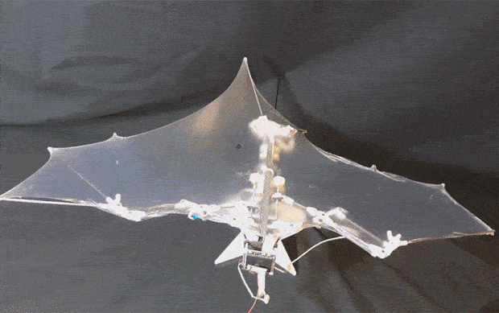
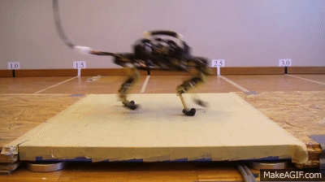

# Bio-inspired and Soft Robotics

### **Bio-inspired and Soft Robotics: A Comprehensive Guide** 

<figure><figcaption></figcaption></figure>

Nature, through millions of years of evolution, has produced an astonishing array of organisms with highly optimized forms, functionalities, and adaptive behaviors. **Bio-inspired robotics** draws from this rich biological tapestry, seeking to abstract and apply principles from living systems-animals, insects, and even plants-to design and control robots with enhanced capabilities in areas like locomotion, sensing, manipulation, and intelligence 1. It's about learning from nature to build better robots that can operate effectively in complex, unstructured environments 1.

Closely related and often intertwined is **Soft Robotics**. This field breaks away from traditional rigid robot designs by employing soft, compliant materials and deformable structures 2. The goal is to create robots that are inherently safer for human interaction, more adaptable to their surroundings, resilient, and potentially more energy-efficient . Many soft robots are also bio-inspired, mimicking the flexibility and compliance of biological organisms.

This guide explores the fundamentals of these converging fields, how they work, their key applications (excluding primary medical uses), the organizations driving their progress, significant research, and resources for further learning.

***

### **1. Guide to Bio-inspired and Soft Robotics**

### **1.1. What are Bio-inspired and Soft Robotics?**

| Concept                   | Description                                                                                                                                                                                                                              |
| ------------------------- | ---------------------------------------------------------------------------------------------------------------------------------------------------------------------------------------------------------------------------------------- |
| **Bio-inspired Robotics** | Studies biological systems to understand mechanisms, structures, and principles, then applies this knowledge to innovate robotic designs, control, sensing, and learning 1. Focuses on functional principles rather than exact mimicry . |
| **Soft Robotics**         | Investigates building robots with soft materials (elastomers, polymers, hydrogels) and deformable structures, enabling bending, stretching, and environmental conformity 2. Aims for novel functionalities, safety, and adaptability.    |

### **1.2. How Bio-inspired Robotics Works: Learning from Nature**

| Principle                            | Description                                                                                                                                    |
| ------------------------------------ | ---------------------------------------------------------------------------------------------------------------------------------------------- |
| **Observation & Abstraction**        | Study how organisms achieve tasks (walking, swimming, grasping); abstract fundamental principles 1.                                            |
| **Mimicking Morphology & Mechanics** | Replicate physical forms (leg structures, wing designs) and mechanical properties (compliant joints).                                          |
| **Emulating Sensing & Control**      | Develop sensors and control systems inspired by biological sensory organs and neural pathways for intelligence, flexibility, and adaptation 1. |
| **Energy Efficiency Focus**          | Aim to close the energy efficiency gap between robots and biological systems (robots can use 10-100x more energy for similar tasks) .          |

### **1.3. How Soft Robotics Works: Materials, Actuation, and Control**

| Aspect                     | Details                                                                                                                                                   |
| -------------------------- | --------------------------------------------------------------------------------------------------------------------------------------------------------- |
| **Soft Materials**         | Core materials include elastomers (silicone rubbers), polymers/plastics engineered for compliance , and hydrogels (biocompatibility, stimuli-responsive). |
| **Soft Actuators**         | Pneumatic Actuators (FEAs), Shape Memory Alloys (SMAs), Dielectric Elastomer Actuators (DEAs), Cable-Driven Mechanisms.                                   |
| **Sensing in Soft Bodies** | Integrating stretchable/bendable sensors: flexible electronics, conductive elastomers, fiber optics.                                                      |
| **Modeling and Control**   | Requires new mathematical models for continuous deformation, often using machine learning for control .                                                   |
| **Self-Healing**           | Emerging area using materials that autonomously repair damage (e.g., SHERO project) .                                                                     |

### **1.4. Micro/Nanorobotics (as a related sub-field)**

While distinct, this field often draws inspiration from biological microorganisms (e.g., bacteria flagella) and can use soft materials for fabrication and actuation at small scales. Non-medical applications include micro-assembly, targeted delivery of non-medical compounds, and environmental sensing/remediation.

### **1.5. Evolution and Recent Advancements**

| Advancement/Platform          | Developer/Initiative                          | Key Features/Focus                                                                                              |
| ----------------------------- | --------------------------------------------- | --------------------------------------------------------------------------------------------------------------- |
| **Bio-inspired Designs**      | Festo                                         | Robots mimicking kangaroo locomotion, whale swimming, butterfly flight, octopus arm manipulation; BionicCobot . |
| **Self-Healing Soft Robots**  | SHERO Project (VUB, Univ. of Cambridge, etc.) | Robots from self-healing flexible plastics that detect damage, temporarily heal, and resume work autonomously . |
| **Octopus-Inspired Robotics** | NUS Soft Robotics Lab                         | Studies octopuses for grasping/locomotion; designs robots for marine applications .                             |
| **Hopping Robots**            | BIRL (Univ. of Cambridge) and other labs      | Robots mimicking grasshoppers, humans, or dinosaurs for efficient locomotion .                                  |

***

### **2. Applications (Excluding Primary Medical Robotics)**

The unique properties of bio-inspired and soft robots enable applications where traditional rigid robots are less suitable.

| Application Category                               | Examples                                                                                                                                                                                                                                                                      |
| -------------------------------------------------- | ----------------------------------------------------------------------------------------------------------------------------------------------------------------------------------------------------------------------------------------------------------------------------- |
| **Manufacturing and Industry**                     | 
<strong>Delicate Object Handling:</strong> Soft grippers for fragile items (fruit, electronics) 2. <strong>Conformable Surface Treatment:</strong> Polishing, buffing, sanding complex surfaces 2.
                                                                  |
| **Exploration, Search & Rescue, Field Robotics**   | 
<strong>Traversing Complex Terrain:</strong> Soft robots deforming to navigate tight spaces, collapsed buildings, rough terrain, caves 2. <strong>Deep Ocean &#x26; Marine Applications:</strong> Bio-inspired/soft underwater robots for exploration, monitoring .
 |
| **Nature Conservation & Environmental Monitoring** | 
<strong>Minimally Invasive Observation:</strong> Robots resembling animals/plants for natural data collection . <strong>Conservation Tasks:</strong> Habitat exploration, data collection, targeted interventions (seed planting) .
                                 |
| **Safer Human-Robot Interaction (General)**        | Inherently safer interaction in shared workspaces due to compliance (manufacturing, service).                                                                                                                                                                                 |
| **Wearable Technology (Non-medical)**              | **Exoskeletons for Augmentation/Support:** 'Chairless Chair' for industrial workers (BIRL) .                                                                                                                                                                                  |
| **Micro/Nanorobotics (Non-Medical)**               | 
<strong>Micro-Assembly:</strong> Precise manipulation at microscopic scales. <strong>Environmental Remediation:</strong> Nanobots detecting/neutralizing pollutants. <strong>Material Science:</strong> Exploring/manipulating nanoscale materials.
              |

***

### **3. Companies and Institutes Working on Bio-inspired and Soft Robotics**

**Leading Global Companies:**

| Company Name           | Country     | Key Focus Areas / Products                                                                        |
| ---------------------- | ----------- | ------------------------------------------------------------------------------------------------- |
| **Festo**              | Germany     | Industrial automation, extensive portfolio of bio-inspired robots (BionicKangaroo, BionicCobot) . |
| **Boston Dynamics**    | USA         | Dynamic rigid robots (Spot, Atlas) with deeply bio-inspired locomotion principles.                |
| **Soft Robotics Inc.** | USA         | Soft robotic gripping solutions for food automation, e-commerce, logistics.                       |
| **RightHand Robotics** | USA         | Piece-picking solutions often incorporating compliant gripper designs.                            |
| **SupraPolix**         | Netherlands | Polymer manufacturer involved in SHERO self-healing robot project .                               |

**Key Research Institutes and Labs (Global):**

| Institute/Lab Name                                              | Country     | Key Focus Areas                                                                                  |
| --------------------------------------------------------------- | ----------- | ------------------------------------------------------------------------------------------------ |
| **Bio-Inspired Robotics Laboratory (BIRL), Univ. of Cambridge** | UK          | Bio-inspired locomotion (hopping robots), intelligence, self-healing materials (SHERO project) . |
| **Soft Robotics Lab, National University of Singapore (NUS)**   | Singapore   | Soft robotics technologies (materials, sensors, actuators, modeling), marine-inspired robots .   |
| **Vrije Universiteit Brussel (VUB), Brubotics**                 | Belgium     | Leads SHERO self-healing soft robot project .                                                    |
| **Harvard Microrobotics Lab / Wyss Institute**                  | USA         | Soft robotics, bio-inspired flight (RoboBee).                                                    |
| **MIT CSAIL**                                                   | USA         | Soft robotics, bio-inspired AI.                                                                  |
| **ESPCI Paris**                                                 | France      | Partner in SHERO project .                                                                       |
| **Empa (Swiss Federal Laboratories for Materials Science)**     | Switzerland | Partner in SHERO project .                                                                       |
| **Bristol Robotics Laboratory**                                 | UK          | Soft robotics, bio-mimicry.                                                                      |

**Presence in India:**

| Entity Type               | Examples                                                                                                                                                               | Focus Relevant to Bio-inspired/Soft Robotics                                                   |
| ------------------------- | ---------------------------------------------------------------------------------------------------------------------------------------------------------------------- | ---------------------------------------------------------------------------------------------- |
| **Academic Institutions** | 
<strong>Indian Institute of Science (IISc), Bangalore</strong> <strong>Indian Institutes of Technology (IITs)</strong> (Kanpur, Bombay, Madras, Delhi, etc.)
 | Research in biomechanics, soft materials, robotics with bio-inspiration, compliant mechanisms. |

_(Commercial ventures in India for advanced soft/bio-inspired robots are emerging, with strong academic research.)_

***

### **4. Interesting Research Papers & Areas**

| Research Area                            | Focus / Key Concepts                                                                                                                                                                  | Example Paper/Reference                                                                                                                                                                                                                                       |
| ---------------------------------------- | ------------------------------------------------------------------------------------------------------------------------------------------------------------------------------------- | ------------------------------------------------------------------------------------------------------------------------------------------------------------------------------------------------------------------------------------------------------------- |
| **Bio-inspired Design for Conservation** | Using bio-inspired robots as versatile agents for conservation tasks (exploration, data collection, intervention) minimizing environmental impact; Physical Artificial Intelligence . | 
Kovac, M., et al. (2023). "Bioinspired robots can foster nature conservation." <em>Frontiers in Robotics and AI</em>. <em>Raw Link:</em> <code>https://www.frontiersin.org/journals/robotics-and-ai/articles/10.3389/frobt.2023.1145798/full</code>
 |
| **Self-Healing Soft Robotics**           | Developing self-healing materials, damage detection, and integration into soft robotic arms (e.g., SHERO Project publications) .                                                      | Search publications from SHERO project partners (VUB, Cambridge, ESPCI, Empa, SupraPolix).                                                                                                                                                                    |
| **Soft Robotic Grippers**                | Novel actuator designs, material combinations, sensing for gentle/adaptive grasping.                                                                                                  | General research area; search academic databases.                                                                                                                                                                                                             |
| **Bio-mimetic Locomotion**               | Replicating animal locomotion (walking, flying, swimming, hopping) for enhanced mobility and energy efficiency 1.                                                                     | General research area; search academic databases.                                                                                                                                                                                                             |
| **Modeling & Control of Soft Robots**    | New mathematical frameworks for modeling and controlling continuous deformations of soft robots .                                                                                     | General research area; search academic databases.                                                                                                                                                                                                             |
| **Sensing for Soft Robots**              | Creating flexible, stretchable sensors embedded in soft bodies for proprioceptive/exteroceptive feedback.                                                                             | General research area; search academic databases.                                                                                                                                                                                                             |
| **Physical Artificial Intelligence**     | Co-evolution of physical form (morphology, actuation) and intelligence (control, sensing) in robotics.                                                                                | 
Miriyev, A., &#x26; Kovač, M. (2020). "Skills and Tissues..." <em>Advanced Intelligent Systems</em>. (Cited in ) Search Google Scholar for this paper.
                                                                                              |

***

### **5. Comprehensive Guides & Further Resources**

| Resource Title                                                  | Provider/Source                   | Key Content                                                                                            | Raw Link                                                                                                           |
| --------------------------------------------------------------- | --------------------------------- | ------------------------------------------------------------------------------------------------------ | ------------------------------------------------------------------------------------------------------------------ |
| "Bio-Inspired Robotics" (Edited Collection)                     | MDPI Books                        | Articles on innovative structures, sensory-motor coordination, learning 1.                             | `https://www.mdpi.com/books/book/852-bio-inspired-robotics`                                                        |
| "What is soft robotics?"                                        | Standard Bots Blog                | Introductory article on soft robotics and common applications 2.                                       | `https://standardbots.com/blog/soft-robotics`                                                                      |
| "7 Bio-Inspired Robots that Mimic Nature"                       | Machine Design                    | Examples of bio-inspired robots, particularly from Festo .                                             | `https://www.machinedesign.com/mechanical-motion-systems/article/21835853/7-bio-inspired-robots-that-mimic-nature` |
| Bio-Inspired Robotics Laboratory (BIRL)                         | University of Cambridge           | Insights into their research projects .                                                                | `https://birlab.org`                                                                                               |
| NUS Lab for Soft Robotics Research                              | National University of Singapore  | Details on their work in soft robotics technologies .                                                  | `https://www.softroboticslab.info`                                                                                 |
| _Soft Robotics_ (Journal)                                       | Mary Ann Liebert, Inc.            | Academic journal.                                                                                      | Search journal title for homepage.                                                                                 |
| _Bioinspiration & Biomimetics_ (Journal)                        | IOP Publishing                    | Academic journal.                                                                                      | Search journal title for homepage.                                                                                 |
| _Frontiers in Robotics and AI_ (Section: Bio-inspired Robotics) | Frontiers                         | Academic journal section.                                                                              | Search journal title for homepage.                                                                                 |
| _Advanced Intelligent Systems_ (Journal)                        | Wiley                             | Academic journal.                                                                                      | Search journal title for homepage.                                                                                 |
| Research Databases                                              | Google Scholar, IEEE Xplore, etc. | Search for specific topics ("soft actuators," "bio-mimetic underwater robots," "self-healing robots"). | General links to search engines.                                                                                   |
