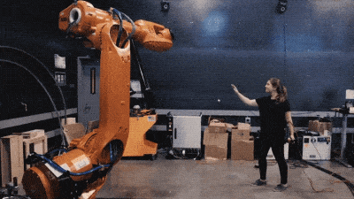

# Cobots

<figure><figcaption></figcaption></figure>

### **Collaborative Robots (Cobots): A Comprehensive Guide** 

Collaborative robots, or **cobots**, signify a pivotal advancement in industrial automation. They are engineered to work safely and effectively alongside human employees in shared workspaces, often without the need for traditional safety barriers (pending a thorough risk assessment) . Cobots serve as a bridge between fully manual operations and complete automation, providing flexibility, user-friendliness, and a more accessible pathway into robotics, especially for small to medium-sized enterprises (SMEs) . This guide examines the definition, key characteristics, types, applications, the companies (including those in India) at the forefront of their development, notable research, and further resources.

***

### **1. Guide to Collaborative Robots (Cobots)**

### **1.1. What are Cobots? Definition and Key Differentiators**



A cobot is an industrial robot specifically designed for human-robot collaboration within a shared operational space . Unlike traditional industrial robots-which are typically large, operate at high speeds, and necessitate safety caging to prevent human injury-cobots are constructed with inherent safety features and are intended for direct human interaction.

**Key Differentiators from Traditional Industrial Robots :**

* **Safety:** Designed for safe operation around humans with features like power and force limiting, rounded designs, and advanced collision detection.
* **Ease of Programming:** Often feature intuitive programming interfaces, including hand-guiding (lead-through teach), enabling non-experts to program them for various tasks .
* **Flexibility & Redeployability:** Generally lightweight, compact, and easily moved and repurposed for different tasks, making them ideal for high-mix, low-volume production environments .
* **No Cages (Typically):** Can operate without physical safety fences after a proper risk assessment, saving valuable floor space and reducing setup costs .
* **Collaboration:** Built to assist human workers by undertaking repetitive, strenuous, or ergonomically challenging tasks, allowing humans to concentrate on more complex, cognitive, and value-added activities .

### **1.2. A Brief Historic Overview**

The concept of cobots arose from the ambition to create more accessible robotic systems that could safely interact with humans, moving beyond the large, expensive, and isolated industrial robots. Introduced nearly two decades ago, cobots have seen accelerated adoption in recent years, transforming shop floors globally.

### \*\*1.3. Components and Essential Features of a Cobot \*\*

* **Arms and Joints:**
  * **Arm:** The primary structure, available in single or multiple configurations.
  * **Joints (Axes):** Typically 4 to 10, enabling bending, rotation, and extension (rotary for twisting, linear for straight-line movement).
* **End-Effectors (End-of-Arm Tooling - EOAT):** Task-specific tools at the arm's end.
  * **Grippers:** For picking, carrying, and placing objects.
  * **Specialized Tools:** Welding torches, screwdrivers, dispensers.
  * **Tool Changers:** For autonomous tool switching.
* **Sensors for Safety and Perception:**
  * **Force/Torque Sensors:** Detect contact, limit applied force .
  * **Vision Systems (2D/3D Cameras):** For object location, barcode scanning, pattern recognition .
  * **Proximity Sensors/Safety Scanners:** Detect human presence to slow down or stop .
* **Control Systems:** Intuitive software and user interfaces.
* **Range Extenders:** Optional tracks to increase reach .
* **Feeding Systems:** For supplying small components in assembly .

### \*\*1.4. Types of Collaborative Robots (Based on Safety Features) \*\*

According to ISO 10218, collaborative operation involves one or more of these features:

* **Power and Force Limiting (PFL) Cobots:** The most common type, designed with sensors to detect contact and limit force or stop, minimizing injury risk. Rounded designs are typical .
* **Safety Monitored Stop Cobots:** Sensors halt the cobot if a human enters its workspace; requires a reset to resume.
* **Speed and Separation Monitoring (SSM) Cobots:** Sensors detect human proximity and adjust speed dynamically, stopping if necessary, then resuming full speed when clear .
* **Hand-Guiding Cobots (Lead-Through Programming):** Operators manually guide the arm to teach paths, simplifying programming .

### **1.5. How to Use a Cobot: Programming and Operation**

Cobots are designed for ease of use:

* **Hand Guiding:** Manually moving the arm through desired steps .
* **Graphical User Interfaces (GUIs):** Intuitive software for task sequencing .
* **Skill-Based Programming:** Pre-programmed skills for common tasks.

***

### **2. Companies and Institutes Working on Cobots**

### **2.1. Leading Global Cobot Manufacturers**

| Company Name            | Country       | Notable Cobot Series/Features                                   |
| ----------------------- | ------------- | --------------------------------------------------------------- |
| **Universal Robots**    | Denmark       | UR series (UR5, UR10, UR20), UR+ ecosystem, market leader       |
| **FANUC Corporation**   | Japan         | CRX and CR series, high payload capabilities (up to 50kg)       |
| **ABB**                 | Switzerland   | GoFa, SWIFTI, YuMi (dual-arm)                                   |
| **KUKA**                | Germany       | LBR iiwa series, LBR iisy                                       |
| **Yaskawa Motoman**     | Japan         | HC series                                                       |
| **Techman Robot**       | Taiwan        | TM series (integrated vision)                                   |
| **Doosan Robotics**     | South Korea   | M, A, H series, wide range of applications                      |
| **AUBO Robotics**       | China/USA     | i-Series, lightweight and cost-effective                        |
| **Rethink Robotics**    | Germany (USA) | Sawyer (legacy), focus on ease of use                           |
| **Omron**               | Japan         | TM Series (integrated vision, mobile compatible)                |
| **Dobot**               | China         | CRA, CRAS, CR, CRS, Nova series                                 |
| **Franka Emika**        | Germany       | Panda (sensitive, research-focused)                             |
| **Epson Robots**        | Japan         | VT series (SCARA), some 6-axis for flexible/collaborative tasks |
| **Stäubli Robotics**    | Switzerland   | TX2 series with collaborative safety features                   |
| **Kawasaki Robotics**   | Japan         | duAro (dual-arm SCARA), general collaborative robots            |
| **Hyundai Robotics**    | South Korea   | YL series, general industrial and collaborative applications    |
| **Precise Automation**  | USA           | Collaborative SCARA and Cartesian robots                        |
| **Automata**            | UK            | Eva (desktop robotic arm)                                       |
| **Productive Robotics** | USA           | OB7 series                                                      |
| **Comau**               | Italy         | AURA (Advanced Use Robotic Arm)                                 |
| **Fairino**             | China         | FR Series                                                       |

### **2.2. Cobot Ecosystem in India**

India's cobot market is experiencing significant growth, driven by manufacturing, initiatives like "Make in India," and the need for flexible automation .

**Cobot Manufacturers & Key Solution Providers in India:**

| Company Name                              | Headquarters | Key Offerings/Focus                                                                            |
| ----------------------------------------- | ------------ | ---------------------------------------------------------------------------------------------- |
| **Universal Robots India**                | Bengaluru    | Market leader, strong focus on SMEs across various industries (automotive, FMCG, electronics)  |
| **Svaya Robotics**                        | Hyderabad    | SR-L series, pioneering indigenous cobot manufacturer for MSMEs                                |
| **Addverb Technologies**                  | Noida        | Syncro cobot, warehouse automation solutions                                                   |
| **Systemantics Robotics**                 | Bengaluru    | ASYSTR Collaborative Robots (3C, 5C, 10C), indigenously designed and manufactured              |
| **Bosan Technologies**                    | Bengaluru    | Cobots for industrial assembly, material handling, packaging                                   |
| **Omron Automation India**                | Gurgaon      | TM Series cobots for automotive, electronics, pharmaceuticals, logistics                       |
| **Breez Robots**                          | Bengaluru    | Affordable cobots for welding, pick-and-place, assembly, inspection (startup)                  |
| **CynLr Robotics**                        | Bengaluru    | Visual object intelligence platform for industrial arms, enabling collaborative capabilities   |
| **DiFACTO Robotics and Automation**       | Bengaluru    | Turnkey industrial automation solutions, robot simulation, training                            |
| **Wipro PARI Robotics**                   | Pune         | Industrial automation solutions, including robot-assisted manufacturing                        |
| **TAL Manufacturing Solutions (Tata)**    | Pune         | TAL Brabo (India's first industrial articulated robot), solutions extend to cobot applications |
| **Gridbots Technologies**                 | Ahmedabad    | Diverse robotic solutions, some suitable for collaborative tasks in specialized environments   |
| **Hi-Tech Robotics Systemz (Novus Flow)** | Gurgaon      | Focus on AMRs which often involve human-robot collaboration                                    |
| **Patvin Engineering Pvt. Ltd.**          | Mumbai       | Cobot integrators, solutions for applying adhesives, dispensing, etc.                          |
| **Neptune Systems**                       | Pune         | Manufacturer and supplier, specializing in Universal Robots integration                        |

**Suppliers, Integrators & Distributors in India (illustrative):**

| Company Name                                                                                   | Location (Primary) | Notes                             |
| ---------------------------------------------------------------------------------------------- | ------------------ | --------------------------------- |
| **Suprak Technologies**                                                                        | Pune               | Supplier/Integrator               |
| **Lingam System**                                                                              | Chennai            | Supplier of AUBO cobots           |
| **Mayura Automation & Robotic Systems**                                                        | Chennai            | Supplier of Dobot cobots          |
| **Galexon Robotics**                                                                           | Coimbatore         | Supplier of Dobot, Yaskawa cobots |
| _(Many other system integrators across India deploy cobots from various global manufacturers)_ |                    |                                   |

**Institutes (Research & Development):**

* **Indian Institutes of Technology (IITs):** Conduct foundational research in robotics, AI, HRI.
* **Indian Institute of Science (IISc), Bangalore:** Research in robotics and automation.
* **GMR Group (Robotics Centre of Excellence):** Focused on innovating robotic systems for airport and aviation ecosystems, which can include cobots .

***

### **3. Interesting Research Papers & Areas**

Research in cobots focuses on:

* **Safety Standards & Risk Assessment:** Refining protocols (ISO 10218, ISO/TS 15066).
* **Intuitive Programming & Human-Robot Interaction (HRI):** Natural language, gesture control, learning from demonstration, human trust and acceptance.
* **Advanced Sensing & Perception:** Enhanced vision, force/torque, and proximity sensing for shared workspaces.
* **Task Allocation & Shared Control:** Dynamic task allocation, human-robot joint control.
* **AI & Machine Learning:** Adapting cobot behavior, skill acquisition through reinforcement learning.
* **Applications in New Domains:** Healthcare, labs, agriculture, construction.

_(Specific paper links: search academic databases like IEEE Xplore, ACM Digital Library, ScienceDirect, Google Scholar with keywords "collaborative robot safety," "human-cobot interaction," "cobot programming," "AI in cobots.")_

***

### **4. Comprehensive Guides & Further Resources**

| Resource Title                                              | Provider/Source               | Key Content                                                          | Raw Link                                                                                                                             |
| ----------------------------------------------------------- | ----------------------------- | -------------------------------------------------------------------- | ------------------------------------------------------------------------------------------------------------------------------------ |
| Cobots: A beginner’s guide to collaborative robots          | Standard Bots Blog            | Definition, history, features, types, applications                   | `https://standardbots.com/blog/what-are-cobots-a-comprehensive-guide-to-collaborative-robots`                                        |
| What is a Cobot? \| Benefits and Applications               | Hirebotics Blog               | Definition, differences from traditional robots, common applications | `https://blog.hirebotics.com/what-is-a-cobot`                                                                                        |
| Collaborative Robots: A Comprehensive Guide                 | Force Design, Inc.            | How cobots change manufacturing, capabilities, SME benefits          | `https://forcedesign.biz/collaborative-robots-a-comprehensive-guide/`                                                                |
| What is a cobot? \| The ultimate collaborative robot guide  | WiredWorkers                  | Definition, benefits, impact, programming, vision systems            | `https://www.wiredworkers.io/cobot/`                                                                                                 |
| What Are Collaborative Robots, Cobots?                      | Automate.org (A3)             | Official definition, safety, flexibility, market potential           | `https://www.automate.org/robotics/cobots/what-are-collaborative-robots`                                                             |
| Collaborative Robots - Universal Robots India               | Universal Robots              | Cobot applications in Indian industries                              | `https://www.universal-robots.com/in/cobots-in-india/`                                                                               |
| Top Collaborative Robot Manufacturers in India              | ReportsnReports               | Growing Indian cobot market, profiles of key manufacturers           | `https://www.reportsnreports.com/uncategorized/top-collaborative-robot-manufacturers-in-india-pioneering-automation-and-innovation/` |
| Top Collaborative Robot Companies 2024                      | MarketsandMarkets Blog        | Analysis of leading global cobot companies                           | `https://www.marketsandmarkets.com/blog/SE/Top-Collaborative-Robot-Companies-2024`                                                   |
| Top 7 cobot companies boosting productivity                 | Verified Market Research Blog | Profiles of top global cobot manufacturers                           | `https://www.verifiedmarketresearch.com/blog/top-cobot-companies/`                                                                   |
| Cobots: A Guide to the Brands and Pricing                   | Devonics Blog                 | Leading manufacturers and pricing insights                           | `https://www.devonics.com/post/amp-cobots-a-guide-to-the-brands-and-pricing`                                                         |
| Leading Cobot Manufacturer Shaping India's Industry (Svaya) | Svaya Robotics Blog           | Details on Svaya Robotics and their SR-L series for MSMEs            | `https://svayarobotics.com/blog/svaya-robotics-cobot-manufacturer-india/`                                                            |

Cobots are revolutionizing automation by making robots more accessible, flexible, and safe for human collaboration, thereby boosting productivity and opening new possibilities across a myriad of industries worldwide, including significant growth in India.

ShareExportRewrite 
