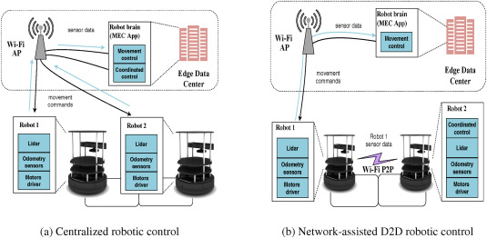

# Edge Robotics

### **Edge Robotics / On-Device AI for Robotics: A Comprehensive Guide** 

<figure><figcaption></figcaption></figure>

The paradigm of robotics is undergoing a significant transformation, moving away from systems entirely dependent on centralized cloud processing towards a more decentralized and responsive model: **Edge Robotics**. This evolution involves embedding artificial intelligence (AI) and significant computational capabilities directly onto the robot or in close proximity, enabling on-device data processing and decision-making . This shift is redefining autonomy, enabling robots to operate with greater speed, security, and efficiency, particularly in dynamic and unpredictable environments where low latency and reliable connectivity are paramount [1](https://www.einfochips.com/blog/the-edge-robotics-revolution-redefining-autonomy-in-a-technological-era/)[2](https://www.fremont.ai/post/ai-and-edge-transforming-robotics)[9](https://www.linkedin.com/pulse/7-reasons-why-edge-computing-future-robotics-carl-desalvo-q0xgc). This guide explores the fundamentals of Edge Robotics and On-Device AI, their key components, applications, the organizations driving this revolution, notable research, and resources for further learning.

***

### **1. Guide to Edge Robotics / On-Device AI**

### **1.1. What is Edge Robotics / On-Device AI?**

* **Edge Robotics:** Refers to a robotic philosophy where data processing, AI model execution, and decision-making occur locally on the robot's hardware or on an "edge server" physically close to the robot, rather than relying solely on distant cloud-based systems [1](https://www.einfochips.com/blog/the-edge-robotics-revolution-redefining-autonomy-in-a-technological-era/)[4](https://blog.milvus.io/ai-quick-reference/how-is-edge-ai-used-in-robotics). This proximity to the data source or point of action is key.
* **On-Device AI:** Specifically focuses on running AI algorithms (including machine learning models, inference engines) directly on the robot's embedded processors [2](https://www.fremont.ai/post/ai-and-edge-transforming-robotics)[4](https://blog.milvus.io/ai-quick-reference/how-is-edge-ai-used-in-robotics). This allows the robot to perform tasks like object recognition, navigation, or motion planning with greater autonomy [4](https://blog.milvus.io/ai-quick-reference/how-is-edge-ai-used-in-robotics).

The core idea is to bring intelligence closer to the action, enabling robots to be more self-reliant and responsive [1](https://www.einfochips.com/blog/the-edge-robotics-revolution-redefining-autonomy-in-a-technological-era/).

### **1.2. Why Edge Robotics? The Driving Factors and Benefits**

The move towards Edge Robotics is driven by the limitations of traditional centralized approaches when faced with modern application demands [1](https://www.einfochips.com/blog/the-edge-robotics-revolution-redefining-autonomy-in-a-technological-era/).

**Key Benefits:**

* **Reduced Latency (Immediate Responses):** Processing data locally drastically cuts down communication delays with the cloud. This is critical for applications requiring split-second decisions, such as autonomous vehicles navigating traffic or surgical robots performing intricate procedures [1](https://www.einfochips.com/blog/the-edge-robotics-revolution-redefining-autonomy-in-a-technological-era/)[9](https://www.linkedin.com/pulse/7-reasons-why-edge-computing-future-robotics-carl-desalvo-q0xgc).
* **Enhanced Data Security and Privacy:** Processing sensitive information locally minimizes the risk of data breaches during transmission to a central cloud. This is crucial in sectors like healthcare, finance, and defense [1](https://www.einfochips.com/blog/the-edge-robotics-revolution-redefining-autonomy-in-a-technological-era/)[2](https://www.fremont.ai/post/ai-and-edge-transforming-robotics)[9](https://www.linkedin.com/pulse/7-reasons-why-edge-computing-future-robotics-carl-desalvo-q0xgc).
* **Improved Reliability and Offline Operation:** Robots can continue to function effectively even with intermittent or no network connectivity to the cloud, essential for operations in remote locations or unpredictable settings like disaster response or agriculture [1](https://www.einfochips.com/blog/the-edge-robotics-revolution-redefining-autonomy-in-a-technological-era/)[4](https://blog.milvus.io/ai-quick-reference/how-is-edge-ai-used-in-robotics).
* **Reduced Bandwidth Costs:** Transmitting massive amounts of raw sensor data to the cloud is expensive. Edge processing allows for local analysis, and only essential information or insights are sent to the cloud, reducing network congestion and costs [2](https://www.fremont.ai/post/ai-and-edge-transforming-robotics)[9](https://www.linkedin.com/pulse/7-reasons-why-edge-computing-future-robotics-carl-desalvo-q0xgc).
* **Scalability and Efficiency:** Decentralized edge devices can collaboratively handle tasks, facilitating system scalability without significant cloud infrastructure costs [1](https://www.einfochips.com/blog/the-edge-robotics-revolution-redefining-autonomy-in-a-technological-era/).
* **Enhanced AI Capabilities On-Device:** Enables robots to learn from their experiences, adapt to environments in real-time, and perform complex tasks with greater accuracy without constant cloud intervention [2](https://www.fremont.ai/post/ai-and-edge-transforming-robotics)[9](https://www.linkedin.com/pulse/7-reasons-why-edge-computing-future-robotics-carl-desalvo-q0xgc).

### **1.3. How Edge Robotics Works: Key Components and Technologies**

Edge Robotics is shaped by the confluence of several technologies [1](https://www.einfochips.com/blog/the-edge-robotics-revolution-redefining-autonomy-in-a-technological-era/):

* **Onboard Processing Power:** Modern edge robots are equipped with high-performance computing capabilities (e.g., powerful CPUs, GPUs, specialized AI accelerators like TPUs, NPUs, FPGAs) that allow them to interpret data and decide actions without external cloud inputs [1](https://www.einfochips.com/blog/the-edge-robotics-revolution-redefining-autonomy-in-a-technological-era/)[5](https://www.edgeaifoundation.org/edgeai-content/the-robots-are-coming-physical-ai-and-the-edge-opportunity/). Platforms like NVIDIA Jetson or Raspberry Pi are often used [4](https://blog.milvus.io/ai-quick-reference/how-is-edge-ai-used-in-robotics).
* **Advanced Sensors and Perception:** Sophisticated sensor arrays (LiDAR, radar, cameras, infrared, IMUs) provide robots with real-time, rich awareness of their surroundings, enabling precise interactions and navigation [1](https://www.einfochips.com/blog/the-edge-robotics-revolution-redefining-autonomy-in-a-technological-era/)[2](https://www.fremont.ai/post/ai-and-edge-transforming-robotics).
* **Machine Learning and AI Integration:**
  * **Edge AI:** AI algorithms (machine learning, deep learning, inference engines) are optimized and deployed to run directly on the edge device [2](https://www.fremont.ai/post/ai-and-edge-transforming-robotics)[4](https://blog.milvus.io/ai-quick-reference/how-is-edge-ai-used-in-robotics).
  * **Local Learning & Adaptation:** Robots can learn from their experiences and consistently improve performance locally [1](https://www.einfochips.com/blog/the-edge-robotics-revolution-redefining-autonomy-in-a-technological-era/)[2](https://www.fremont.ai/post/ai-and-edge-transforming-robotics).
* **Strategic Connectivity:** While emphasizing local processing, connectivity to central systems or the cloud remains important for periodic updates, system monitoring, offloading very intensive AI model training, wider coordination, and accessing global data [1](https://www.einfochips.com/blog/the-edge-robotics-revolution-redefining-autonomy-in-a-technological-era/)[5](https://www.edgeaifoundation.org/edgeai-content/the-robots-are-coming-physical-ai-and-the-edge-opportunity/). 5G connectivity is seen as an enabler for enhanced real-time data transmission for collaborative robotics when needed [3](https://thinkrobotics.com/blogs/learn/robot-obstacle-avoidance-techniques-challenges-and-future-trends).
* **Edge Computing Architectures:** Designing systems that balance onboard processing with potential communication to edge servers or the cloud. This can involve a "three computer problem" approach: AI model training in the cloud (using generative AI, LLMs), model execution and ROS on the robot platform, and a simulation/digital twin environment [5](https://www.edgeaifoundation.org/edgeai-content/the-robots-are-coming-physical-ai-and-the-edge-opportunity/).
* **Optimized AI Models:** Deploying complex AI models on resource-constrained edge devices requires techniques like:
  * **Quantization:** Reducing the precision of model weights.
  * **Pruning:** Removing less important model parameters.
  * Frameworks like TensorFlow Lite or ONNX Runtime help convert and deploy models tailored for edge devices [4](https://blog.milvus.io/ai-quick-reference/how-is-edge-ai-used-in-robotics).
* **Robot Operating System (ROS):** Often runs on the robotics platform itself, managing processes and communication, and integrating with edge AI capabilities [5](https://www.edgeaifoundation.org/edgeai-content/the-robots-are-coming-physical-ai-and-the-edge-opportunity/).

### **1.4. Core Challenges in Edge Robotics**

Despite its promise, Edge Robotics faces several hurdles [1](https://www.einfochips.com/blog/the-edge-robotics-revolution-redefining-autonomy-in-a-technological-era/)[3](https://thinkrobotics.com/blogs/learn/robot-obstacle-avoidance-techniques-challenges-and-future-trends)[4](https://blog.milvus.io/ai-quick-reference/how-is-edge-ai-used-in-robotics):

* **Balancing Processing Power and Cost:** Achieving high computational capabilities on edge devices without making them prohibitively expensive.
* **Power Consumption / Energy Efficiency:** Many edge devices are battery-powered, making optimized energy use critical.
* **Thermal Management:** High-performance processing generates heat, which must be managed in compact robotic forms.
* **Model Optimization and Deployment:** Efficiently deploying complex AI models onto resource-constrained hardware.
* **Device Security:** Protecting edge devices from cyber threats and ensuring data integrity is paramount.
* **Need for Industry Standards:** Lack of standardized protocols for inter-device communication can hinder adoption and interoperability.
* **Hardware Failures and Sensor Noise:** Edge AI systems must be robust enough to handle these issues autonomously.

***

### **2. Applications of Edge Robotics / On-Device AI**

Edge AI is enabling smarter, faster, and more autonomous robots across various sectors:

* **Autonomous Mobile Robots (AMRs) and Logistics:**
  * Warehouse robots use edge AI to process sensor data from cameras, LiDAR, or infrared sensors to navigate dynamic environments, identify and sort packages, and detect obstacles in milliseconds without relying on cloud servers [4](https://blog.milvus.io/ai-quick-reference/how-is-edge-ai-used-in-robotics).
* **Manufacturing:**
  * Edge-enabled robots analyze production processes in real-time, optimizing quality control (e.g., visual inspection on production lines), performing predictive maintenance, and managing resource allocation [1](https://www.einfochips.com/blog/the-edge-robotics-revolution-redefining-autonomy-in-a-technological-era/)[4](https://blog.milvus.io/ai-quick-reference/how-is-edge-ai-used-in-robotics).
  * Collaborative robots (cobots) working alongside humans use edge AI for critical real-time safety checks, like detecting a worker's hand near a moving tool [4](https://blog.milvus.io/ai-quick-reference/how-is-edge-ai-used-in-robotics).
* **Autonomous Vehicles (Self-Driving Cars):**
  * Edge AI is fundamental for processing data from LiDAR, radar, and cameras on the vehicle itself, enabling real-time decision-making to respond quickly to pedestrians, other vehicles, and changing traffic situations [1](https://www.einfochips.com/blog/the-edge-robotics-revolution-redefining-autonomy-in-a-technological-era/)[2](https://www.fremont.ai/post/ai-and-edge-transforming-robotics).
* **Healthcare:**
  * Surgical robots benefit from edge processing for precision and immediate responses during intricate procedures [1](https://www.einfochips.com/blog/the-edge-robotics-revolution-redefining-autonomy-in-a-technological-era/)[9](https://www.linkedin.com/pulse/7-reasons-why-edge-computing-future-robotics-carl-desalvo-q0xgc).
  * Edge AI can enable real-time monitoring of patients and improve the accuracy of medical diagnoses by processing data quickly on edge devices [2](https://www.fremont.ai/post/ai-and-edge-transforming-robotics).
* **Agriculture (Precision Agriculture):**
  * Drones and autonomous tractors with edge features optimize crop yields, monitor plant health, manage pest control, and optimize resource usage (water, fertilizers) based on local sensor data [1](https://www.einfochips.com/blog/the-edge-robotics-revolution-redefining-autonomy-in-a-technological-era/).
* **Defense and Security:**
  * Autonomous surveillance robots, drones for reconnaissance. Local processing enhances data security for sensitive missions [1](https://www.einfochips.com/blog/the-edge-robotics-revolution-redefining-autonomy-in-a-technological-era/).
* **Retail:**
  * Inventory management robots, customer assistance robots.
* **Smart Cities:**
  * Robots for infrastructure inspection, waste management, and public safety, leveraging local processing and potentially 5G for coordination [3](https://thinkrobotics.com/blogs/learn/robot-obstacle-avoidance-techniques-challenges-and-future-trends).

***

### **3. Companies and Institutes Working on Edge Robotics / On-Device AI**

**Leading Global Technology Providers & Enablers:**

| Company Name     | Contribution to Edge Robotics / On-Device AI                                                                                                                                                                                                                                                 |
| ---------------- | -------------------------------------------------------------------------------------------------------------------------------------------------------------------------------------------------------------------------------------------------------------------------------------------- |
| **NVIDIA**       | Provides platforms like Jetson (for edge AI and robotics), Isaac Sim (for simulation), and software stacks for developing and deploying AI-enabled robots [7](https://www.nvidia.com/en-in/solutions/robotics-and-edge-computing/).                                                          |
| **Intel**        | Offers Edge Insights for Autonomous Mobile Robots (EI for AMR), processors (e.g., Core, Atom), FPGAs, Movidius VPUs for edge AI and robotics [8](https://www.intel.com/content/www/us/en/developer/topic-technology/edge-5g/edge-solutions/autonomous-mobile-robots.html).                   |
| **Qualcomm**     | Develops Snapdragon processors and AI engines used in various robotic and edge devices.                                                                                                                                                                                                      |
| **Google**       | TensorFlow Lite for deploying ML models on edge devices, Google Coral edge TPU.                                                                                                                                                                                                              |
| **Microsoft**    | Azure IoT Edge, Windows for IoT, AI tools applicable to edge robotics.                                                                                                                                                                                                                       |
| **Amazon (AWS)** | AWS IoT Greengrass, RoboMaker (though more cloud-centric, can interact with edge components).                                                                                                                                                                                                |
| **ARM**          | Processor designs (CPUs, GPUs, NPUs) widely used in embedded systems for edge devices.                                                                                                                                                                                                       |
| **AMD (Xilinx)** | FPGAs and adaptive SoCs for flexible and efficient edge processing.                                                                                                                                                                                                                          |
| **eInfochips**   | Provides engineering R\&D services, playing a role in developing and integrating edge robotics solutions across industries like manufacturing, healthcare, and transportation [1](https://www.einfochips.com/blog/the-edge-robotics-revolution-redefining-autonomy-in-a-technological-era/). |

#### Robotics Companies Leveraging Edge AI

Most modern robotics companies developing autonomous systems (AMRs, drones, self-driving cars, advanced cobots) inherently use edge computing and on-device AI. This includes:

* [**Boston Dynamics**](https://www.bostondynamics.com/) (e.g., Spot robot)
* [**Geek+**](https://www.geekplus.com/), [**Fetch Robotics**](https://fetchrobotics.com/), [**Locus Robotics**](https://locusrobotics.com/) — warehouse automation
* [**DJI**](https://www.dji.com/), [**Skydio**](https://www.skydio.com/) — drone manufacturers
* [**Waymo**](https://waymo.com/), [**Cruise**](https://www.getcruise.com/) — autonomous vehicle developers

***

#### Key Research Institutes (Global)

* Top universities like [**MIT**](https://www.mit.edu/), [**Stanford**](https://www.stanford.edu/), [**CMU**](https://www.cmu.edu/), **ETH Zurich**, and [**University of Oxford**](https://www.ox.ac.uk/) are at the forefront of robotics + edge AI research.
* Organizations such as the [**Edge AI and Vision Alliance**](https://www.edge-ai-vision.com/) and **Edge AI Foundation** promote development and standardization in this domain.

***

#### Presence in India

* **Technology Service Companies**:\
  Firms like [**Tata Elxsi**](https://www.tataelxsi.com/) and [**Persistent Systems**](https://www.persistent.com/) are actively building edge AI + IoT solutions in robotics.
* **Startups**:\
  Numerous Indian startups in **AMRs, drones**, and **agri-tech robots** are leveraging edge processing to achieve on-device autonomy.
* **Academic Institutions**:\
  Research from **IITs, IISc**, and **IIITs** focuses on embedded systems, real-time AI, and robotics optimized for edge hardware.

***

#### Interesting Research Papers & Areas

**1. Architectures & Evaluation of Edge Robotics Systems**

* Lieto, A. D., et al. (2022).\
  &#xNAN;_&#x45;dge robotics: are we ready?_\
  📖 [Read on ScienceDirect](https://www.sciencedirect.com/science/article/pii/S235286482200088X)
* Magistri, M., et al. (2023).\
  &#xNAN;_&#x45;dge robotics and emerging platforms with sensing and human interaction capabilities_\
  📄 [ADS Abstract](https://ui.adsabs.harvard.edu/abs/2023MmSAI..94a.114M/abstract)

**2. AI Model Optimization for Edge Devices**

* Covers **quantization**, **pruning**, **knowledge distillation**\
  🔍 Search: "model optimization for edge AI robotics" on Google Scholar

**3. Real-Time Obstacle Avoidance with Edge Computing**

* ThinkRobotics Blog (2025).\
  &#xNAN;_&#x52;obot Obstacle Avoidance: Techniques, Challenges, and Future Trends_\
  📘 [Read the article](https://thinkrobotics.com/blogs/learn/robot-obstacle-avoidance-techniques-challenges-and-future-trends)

**4. Frameworks & Tools for Edge AI in Robotics**

* Explore: **TensorFlow Lite**, **ONNX Runtime**, **NVIDIA Isaac**, for deployment on **Jetson**, **Raspberry Pi**, etc.

**5. Generative AI & LLMs at the Edge**

* Explores running **LLMs**, **transformers**, and **multimodal models** on robotic edge hardware with constrained resources.

***

### **5. Comprehensive Guides & Further Resources**

| Resource Title                                               | Provider/Source         | Key Content                                                                                                      | Raw Link                                                                                                                   |
| ------------------------------------------------------------ | ----------------------- | ---------------------------------------------------------------------------------------------------------------- | -------------------------------------------------------------------------------------------------------------------------- |
| The Edge Robotics Revolution: Redefining Autonomy            | eInfochips Blog         | Overview, evolution, key components, benefits, applications, challenges                                          | `https://www.einfochips.com/blog/the-edge-robotics-revolution-redefining-autonomy-in-a-technological-era/`                 |
| How AI and Edge Computing are Transforming Robotics          | Fremont AI Insights     | Impact of AI and edge computing, real-time decisions, improved accuracy, cloud integration                       | `https://www.fremont.ai/post/ai-and-edge-transforming-robotics`                                                            |
| How is edge AI used in robotics?                             | Milvus Blog             | Local data processing, latency reduction, reliability, real-time decisions, applications (AMRs, industrial arms) | `https://blog.milvus.io/ai-quick-reference/how-is-edge-ai-used-in-robotics`                                                |
| 7 Reasons Why Edge Computing is the Future of Robotics       | Carl DeSalvo (LinkedIn) | Benefits: real-time decisions, cost cutting, security, offline capabilities, enhanced AI, customization          | `https://www.linkedin.com/pulse/7-reasons-why-edge-computing-future-robotics-carl-desalvo-q0xgc` (Link might be shortened) |
| The Robots Are Coming – Physical AI and the Edge Opportunity | Edge AI Foundation      | Confluence of generative AI and robotics, edge AI hardware requirements (TOPS, memory)                           | `https://www.edgeaifoundation.org/edgeai-content/the-robots-are-coming-physical-ai-and-the-edge-opportunity/`              |
| Advance Next-Generation Robots and Edge AI Solutions         | NVIDIA                  | NVIDIA's platform for training, developing, and deploying AI-enabled robots at the edge                          | `https://www.nvidia.com/en-in/solutions/robotics-and-edge-computing/`                                                      |
| Edge Insights for Autonomous Mobile Robots (EI for AMR)      | Intel Developer Zone    | Intel's software for developing, building, and deploying end-to-end mobile robot applications                    | `https://www.intel.com/content/www/us/en/developer/topic-technology/edge-5g/edge-solutions/autonomous-mobile-robots.html`  |

d
