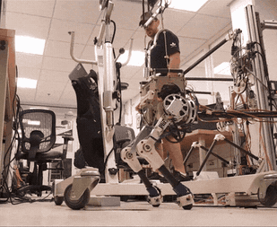

# Humanoids

Humanoid robots get the most funding, the most demo videos, and the least scrutiny of any category in this handbook. That is not an accusation - it is a description of an industry still working out whether "general-purpose humanoid" is a product category or a research program wearing a product's clothes. This page is not about the funding. It is about three specific reasons humanoids are still hard: the body is underactuated, coordinating it is an optimization problem solved in real time, and the hands at the end of the arms remain the least-solved part of the whole machine.

For the locomotion learning recipe that actually ships (PPO + privileged learning + domain randomization), see [Reinforcement Learning (modern)](../robot-learning/reinforcement-learning-modern.md) - ANYmal, Spot, and most 2026 humanoid legs descend from that pipeline. For the foundation-model side (GR00T N1, Helix), see [Foundation Models & VLAs](../robot-learning/foundation-models-vla.md). For how sim-trained policies survive contact with a real robot, see [Sim-to-Real](../robot-learning/sim-to-real.md). None of those pages are humanoid-specific. This one is.

## Why bipeds are control-hard

A biped has, in the strict sense, no actuator connecting it to the ground. The pelvis floats in the world; the only control a robot has over its own base position and orientation is indirect, mediated entirely by contact forces at the feet. Formally: an $$n$$-joint humanoid has $$n$$ actuated degrees of freedom but $$n+6$$ degrees of freedom to control once you count the unactuated floating base (three translations plus three rotations of the pelvis in the world). That gap is **underactuation**, and it's why you cannot just write a PD controller per joint and expect the robot to stand - the six base DOF are controlled entirely through where and how hard the feet push on the ground.

<figure><figcaption></figcaption></figure>

The classical tool for reasoning about this is the **Zero Moment Point (ZMP)**: the point on the ground where the net moment of the ground reaction forces, projected onto the ground plane, is zero. Keep the ZMP inside the support polygon (the convex hull of whichever foot or feet are in contact) and the robot won't tip over. Kajita et al.'s 2003 preview-control formulation - generate a ZMP-tracking trajectory from a simplified cart-on-a-table model of the robot - is still the reference method.

ZMP is a quasi-static stability criterion: it tells you the robot isn't tipping over *right now*, but nothing about whether the next step can arrest an ongoing disturbance. That's what **capture point** theory adds - the point on the ground where the robot must place its foot, this step, to come to a complete stop given its current momentum (Pratt et al., 2006). Push a walking biped and the capture point tells you where to step to catch yourself; it's the theoretical basis for essentially every "robust to a shove" demo you've seen.

The simplest version of this math, the linear inverted pendulum (LIP) model, treats the robot as a point mass on a massless telescoping leg:

```
x_zmp = x_com - (z_com / g) * xddot_com     # ZMP from center-of-mass state
omega = sqrt(g / z_com)
x_cp  = x_com + xdot_com / omega            # capture point from CoM position and velocity
```

Nobody deploys the raw LIP model on a real humanoid anymore - it's too crude for anything but generating an initial guess - but it's still how most people build intuition before reaching for the full whole-body optimization below.

Both are analysis tools built on simplified models. Most 2026 humanoid controllers don't solve ZMP or capture-point equations online at every timestep anymore - they've been superseded by the whole-body optimization approach below, or by RL policies that learn robust stepping implicitly (see [Reinforcement Learning (modern)](../robot-learning/reinforcement-learning-modern.md)). But the concepts are still how people reason about *why* a policy failed - "it stepped short of the capture point" is a diagnosis, even on a robot that never computed one explicitly.

The third source of difficulty is **contact scheduling**. Walking is a hybrid dynamical system: continuous dynamics within a contact mode (double support, single support left, single support right) and discrete, non-smooth transitions when a foot lands or lifts. Deciding *when* and *where* those transitions happen is part of the control problem, not a fixed input to it, and it's combinatorial in a way continuous control isn't. Contact-implicit trajectory optimization tries to solve contact timing and continuous motion together; most deployed systems instead fix a contact schedule ahead of time (a gait) and adapt only the continuous parts - easier, but less robust to surprises.

| | Quadruped | Biped |
|---|---|---|
| Support polygon | Large, 3-4 legs typically available | Small, often a single foot |
| Static standing stability | Achievable | Never - constant active balancing |
| Margin for a mistimed step | High (redundant legs) | Low - one bad step and it falls |
| 2026 locomotion recipe | PPO + privileged learning, mature | Same recipe, harsher failure mode |

This is why the legged-locomotion RL playbook transfers to humanoids at all: a biped is a harder instance of the same underactuated, contact-scheduled control problem a quadruped is, not a different problem. It's also why the failure mode is worse. A quadruped that mistimes a step usually stumbles and recovers on a spare leg. A biped that mistimes a step falls, full stop.

## State estimation - knowing where you actually are

Every layer above this one - whole-body control, locomotion, manipulation - assumes the robot knows its own base pose and velocity. Nothing measures those directly. They're inferred by fusing leg kinematics (where the stance foot is, computed from joint encoders and forward kinematics) with IMU readings (linear acceleration and angular velocity at the torso), usually through an extended Kalman filter or a factor-graph formulation similar in spirit to the visual-inertial fusion covered in [Visual SLAM](../slam-and-state-estimation/visual-slam.md) - except the "visual" measurement is replaced by leg odometry, and the dominant failure mode is foot slip rather than dropped visual features.

Get this wrong and every layer above it inherits the error silently: the whole-body QP tracks a task relative to a base-pose estimate that's subtly off, and the locomotion policy reacts to proprioception that doesn't match reality. A humanoid that "falls for no reason" is very often a state-estimation bug wearing a control-bug costume - which is worth knowing before you spend a week retuning a WBC that was never the problem.

## Whole-body control - an optimization problem, not a skill

"Whole-body control" (WBC) sounds like a euphemism for "coordination," and loosely it is - but concretely, on every modern humanoid, it's a quadratic program (QP) solved at the control rate (typically 500 Hz to 1+ kHz), not a hand-tuned blend of behaviors.

The lineage starts with Khatib's **operational space formulation** (1987): given a task defined in Cartesian space (move this hand to this pose) and a kinematically redundant manipulator, compute the joint torques that achieve the task while using the redundancy for something else (avoid a joint limit, stay manipulable). A humanoid is the operational-space problem with the redundancy turned up as far as it goes: dozens of joints, several simultaneous tasks (keep balance, move the right hand, keep the head level, don't collide with yourself), and contact forces that are themselves decision variables rather than given inputs.

The QP most WBC implementations solve, every control cycle, looks roughly like this:

```
minimize    sum_i  w_i * || J_i * qdd + Jdot_i * qd - xdd_i,des ||^2   (one term per task)
subject to  M(q)*qdd + h(q,qd) = S^T * tau + sum_c J_c^T * f_c         (equations of motion)
            f_c in friction cone                                       (no slipping)
            f_c,z >= 0                                                 (push, never pull, on the ground)
            tau_min <= tau <= tau_max                                  (actuator limits)
```

Solve for joint accelerations, contact forces, and torques simultaneously, every tick. Tasks are either weighted (soft priority, easy to tune incrementally) or strictly ordered (hierarchical QP, where a lower-priority task can only act in the null space of every higher-priority one - more predictable, less forgiving to get wrong). Both are used in production systems.

This is what makes whole-body control a genuinely different discipline from "a walking controller" or "an arm controller": it's the layer where balance, manipulation, and self-collision avoidance get resolved as one optimization instead of three separate systems fighting over the same joints.

**Tools people actually use:**

| Library | What it gives you | Notes |
|---|---|---|
| **Pinocchio** - [github.com/stack-of-tasks/pinocchio](https://github.com/stack-of-tasks/pinocchio) | Fast rigid-body dynamics: forward/inverse dynamics, Jacobians | The dynamics engine underneath most WBC stacks. |
| **Crocoddyl** - [github.com/loco-3d/crocoddyl](https://github.com/loco-3d/crocoddyl) | Differential dynamic programming / trajectory optimization for legged robots | LAAS-CNRS. Whole trajectories, not just per-tick QPs. |
| **OCS2** - [github.com/leggedrobotics/ocs2](https://github.com/leggedrobotics/ocs2) | MPC + WBC for legged robots | ETH RSL. A lot of quadruped and biped MPC builds on this. |
| **Drake** - [drake.mit.edu](https://drake.mit.edu/) | High-fidelity multibody dynamics + optimization | The "controls people" toolkit, also covered in [Sim-to-Real](../robot-learning/sim-to-real.md). |

Kuindersma et al.'s account of the MIT/IHMC Atlas stack for the DARPA Robotics Challenge (2016) is still one of the clearest published descriptions of a full WBC pipeline end to end - footstep planning, QP-based whole-body control, and state estimation, justified together in one paper.

Increasingly, the WBC QP is being partially replaced - not by a smarter QP, but by an RL policy that outputs joint targets directly and has learned to respect physical constraints implicitly from training rather than by having them enforced explicitly. Whether that's a durable trend or a research fashion is genuinely unsettled as of 2026. The QP approach gives you formal guarantees - torque limits are *satisfied*, not *usually satisfied*. The RL approach gives you policies that generalize to situations no engineer anticipated. Most 2026 humanoid stacks use both: RL for the legs, something closer to classical WBC or MPC for the arms and torso, because the arms have to satisfy precise constraints ("don't hit the table") that are easier to write as a constraint than to shape as a reward term.

## Dexterous manipulation - the unsolved piece

If locomotion is hard-but-converging and whole-body control is hard-but-well-posed, dexterous manipulation is neither. It's the piece of the humanoid stack furthest from solved, for reasons that are structural rather than a matter of needing a bigger model.

**The actuator-packing problem.** A human hand has roughly twenty degrees of freedom in a package the size of, well, a hand. Every one of those joints needs either its own motor (which doesn't fit in a finger) or a tendon routed from a motor somewhere else - the palm, the forearm - which is what essentially every serious anthropomorphic hand does. Tendon routing adds friction, backlash, and cross-joint coupling that a rigid-linkage arm doesn't have. This is a mechanical design problem before it's ever a control problem.

**The sensing bottleneck.** Human fingertips carry an enormous density of mechanoreceptors. Robot fingertips mostly don't. Vision-based tactile sensors (a camera behind a soft gel pad, GelSight-style) are the closest thing to dense tactile sensing that's practical to manufacture, but they're still new, fragile, and not yet standard equipment on most deployed hands. Most current humanoid hands are still flying mostly blind on contact, inferring grip state from motor current rather than direct tactile feedback.

**Why contact-rich sim-to-real is harder here than for legs.** A walking robot has at most a handful of simultaneous contacts. A hand wrapped around an irregular object can have a dozen simultaneous, constantly changing contact points, each with its own friction cone and each sensitive to the object's exact geometry. Domain randomization - the single most important sim-to-real trick, per [Sim-to-Real](../robot-learning/sim-to-real.md) - works by training across a distribution of physical parameters, but the *dimensionality* of what needs randomizing explodes for in-hand manipulation in a way it doesn't for locomotion. OpenAI's Rubik's Cube result (2019) is still the reference demonstration of pushing dynamics randomization this far - and even in retrospect, the deployed policy was less robust than the demo implied, which is the honest verdict on the whole approach: it worked, spectacularly, once, and hasn't obviously generalized past the demo it was built for.

**What VLAs bring, and don't.** [Foundation Models & VLAs](../robot-learning/foundation-models-vla.md) is explicit that dexterous manipulation - in-hand rotation, tool use - sits on the "bad at" list for every current VLA, not the "good at" list. Language-conditioned pick-and-place with a parallel-jaw gripper is solved-enough to be boring. Five-finger manipulation under language conditioning is not, and nothing on the 2026 roadmap suggests it's close.

**The hedge: underactuated, compliant hands instead of anthropomorphic ones.** A meaningful fraction of deployed humanoids sidestep the actuator-packing and sensing problems above by using simpler, underactuated adaptive grippers - tendon-driven fingers that passively conform to an object's shape - instead of a fully anthropomorphic hand with independently controlled fingers. It's a real engineering trade: give up some manipulation generality for a hand that's dramatically easier to build, control, and keep working. Whether a "real" humanoid needs five independently controllable fingers, or whether that's an aesthetic requirement inherited from the word "humanoid" rather than a functional one, is a genuinely open question, and the market hasn't converged on an answer.

**Teleop is the current workaround, not a solution.** Most of the dexterous-hand data that exists was collected via VR hand-tracking or exoskeleton teleop (see [Teleoperation & Data Collection](../robot-learning/teleop-and-data.md)) precisely because scripting a five-finger grasp policy by hand is impractical and pure-sim training doesn't transfer well yet. That's a data-collection bottleneck stacked on top of a modeling bottleneck.

## The 2026 humanoid stack, roughly

A representative architecture, gluing together the pieces above with the RL and VLA pages:

```
[VLA or task planner]                 "pick up the box and put it on the shelf"
        |
        v
[Whole-body QP / MPC]  <----->  [RL-trained locomotion policy]
        |  joint torques                |  joint targets (legs)
        v                               v
[Actuators: legs, torso, arms]  <---  [Contact state, IMU, joint encoders]
        |
        v
[Hands: teleop-trained grasp primitives, mostly not language-conditioned yet]
```

The point of this diagram is what it doesn't show: a single end-to-end network going from pixels and language straight to joint torques for a full humanoid, running reliably on real hardware. Every deployed humanoid I'm aware of in 2026 is a hybrid of the above - some layers learned, some classical, glued together at interfaces an engineer designed by hand.

## Notable platforms - the engineering angle

Not a hiring guide - see [Companies Hiring for Robotics](../career-paths-and-research-opportunities/companies-hiring-for-robotics.md) for that. This is what's mechanically and architecturally distinctive about each:

| Platform | Actuation | What's notable |
|---|---|---|
| **Boston Dynamics Atlas** | Fully electric (switched from hydraulic in the 2024 redesign) | Full-body trajectory optimization for highly dynamic, non-anthropomorphic motions - it doesn't move like a person, and isn't trying to. |
| **Tesla Optimus** | Electric, in-house actuators | Vertically integrated with Tesla's vision stack and manufacturing scale ambitions; leans heavily on learned policies over classical WBC, per public statements. |
| **Unitree H1 / G1** | Electric | Aggressively priced relative to the category, which has made it the de facto research platform for labs that can't afford a Boston Dynamics or Agility unit. |
| **Agility Digit** | Electric, reverse-knee ("bird-like") leg geometry | Deliberately non-anthropomorphic leg design chosen for actuator efficiency, not looks; deployed in real logistics pilots, not only demos. |
| **Figure 02 / 03** | Electric | Paired with Figure's own VLA work and the Helix model (see [Foundation Models & VLAs](../robot-learning/foundation-models-vla.md)) for manipulation. |
| **1X NEO / EVE** | Electric | Home-humanoid focus; data collection leans on VR teleoperation at consumer-adjacent scale. |

Notice what's absent from that table: none of these platforms have solved dexterous manipulation, and none of them run a single end-to-end network for the whole body. Every one is a bet on *which* combination of learned and classical layers to ship first, not evidence that the underlying control problem is closed.


**Field note.** The tell for how far a humanoid demo is from a product is what's off-camera. A robot walking on a flat, well-lit warehouse floor with a safety tether just out of frame is a very different claim than a robot walking on rubble. A single, slow, cherry-picked grasp is a very different claim than that same grasp working reliably on the fortieth try, with a novel object. Almost every humanoid company's demo reel is technically true and rhetorically misleading in the same specific way: it shows you the capability exists, not that it's reliable enough to deploy. Ask what the retry rate was, not whether it worked once.


## Further reading

- Kajita et al., *"Biped Walking Pattern Generation by Using Preview Control of Zero-Moment Point"* - [https://mzucker.github.io/swarthmore/e91_s2013/readings/kajita2003preview.pdf](https://mzucker.github.io/swarthmore/e91_s2013/readings/kajita2003preview.pdf)
- Pratt, Carff, Drakunov & Goswami, *"Capture Point: A Step Toward Humanoid Push Recovery"* - [http://www.ambarish.com/paper/Pratt_Goswami_Humanoids2006.pdf](http://www.ambarish.com/paper/Pratt_Goswami_Humanoids2006.pdf)
- Khatib, *"A Unified Approach for Motion and Force Control of Robot Manipulators: The Operational Space Formulation"* - [https://doi.org/10.1109/JRA.1987.1087068](https://doi.org/10.1109/JRA.1987.1087068)
- Kuindersma et al., *"Optimization-Based Locomotion Planning, Estimation, and Control Design for the Atlas Humanoid Robot"* - [https://link.springer.com/article/10.1007/s10514-015-9479-3](https://link.springer.com/article/10.1007/s10514-015-9479-3)
- OpenAI et al., *"Solving Rubik's Cube with a Robot Hand"* - [https://arxiv.org/abs/1910.07113](https://arxiv.org/abs/1910.07113)
