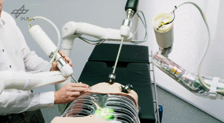
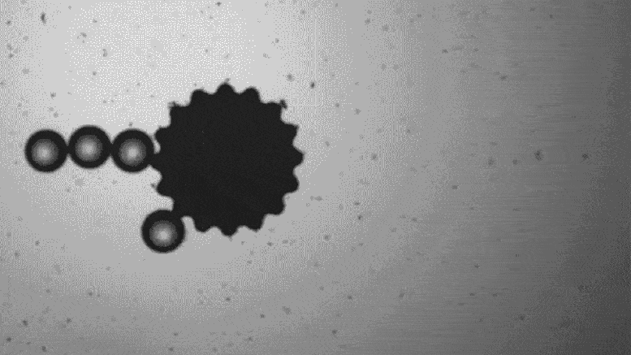
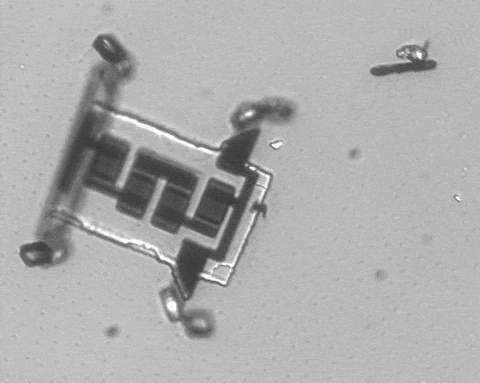

# Medical Robotics

### **Medical Robotics: A Comprehensive Guide** 

<figure><figcaption></figcaption></figure>

Medical robotics represents a transformative convergence of robotics, engineering, and medicine, designed to enhance and revolutionize various aspects of healthcare . These sophisticated systems assist healthcare professionals in diagnosis, surgery, therapy, patient care, and hospital logistics, aiming to improve precision, reduce invasiveness, enhance patient outcomes, and streamline clinical workflows . From dexterous surgical assistants to autonomous mobile robots for hospital tasks and microscopic nanobots for targeted therapies, medical robotics is at the forefront of healthcare innovation . This guide explores the fundamentals, key technologies, diverse applications, leading global and Indian entities, significant research including nanobotics, and resources for further learning.

***

### **1. Guide to Medical Robotics**

### **1.1. What is Medical Robotics? Definition and Significance**

**Medical robotics** refers to the application of robotic systems and devices in various areas of healthcare, including surgical procedures, patient monitoring and care, rehabilitation, diagnostics, and automation within medical facilities .

**Significance of Medical Robotics :**

* **Enhanced Surgical Precision:** Robots allow surgeons to manipulate instruments with greater dexterity and accuracy, especially in minimally invasive procedures .
* **Minimally Invasive Procedures:** Enables complex surgeries through small incisions, leading to reduced scarring, less pain, faster recovery times, and lower risk of infection .
* **Improved Patient Outcomes:** Increased precision and reduced invasiveness contribute to better surgical results and overall patient well-being.
* **Streamlined Clinical Workflows:** Robots can automate repetitive tasks, freeing up healthcare professionals to focus on more critical aspects of patient care .
* **Enhanced Diagnostics and Monitoring:** Robots can assist in advanced imaging, continuous patient monitoring, and even deliver smart medical capsules for internal diagnostics .
* **Accessibility and Remote Care:** Telepresence robots and telesurgery can extend expert medical care to remote or underserved areas .
* **Rehabilitation Support:** Robotic devices aid in physical therapy, helping patients regain mobility and function .

### **1.2. How Medical Robots Work: Core Components and Technologies**

Medical robotic systems are complex integrations of several key elements :

* **Sensors:** Provide the robot with information about its environment and the patient (e.g., vision sensors, force/torque sensors, tactile sensors, physiological monitors). Advanced computer vision, including high-definition 3D imaging, enhances surgical performance by allowing robots to differentiate tissue types or avoid nerves .
* **Actuators:** The "muscles" of the robot, responsible for movement and manipulation of tools or the robot itself.
* **Controllers:** The "brain" of the robot, processing sensor data and executing commands based on sophisticated algorithms. Control systems can be open-loop or closed-loop .
* **Human-Machine Interface (HMI):** Allows healthcare professionals (e.g., surgeons) to interact with and control the robot (e.g., consoles, joysticks, haptic feedback devices).
* **Kinematics and Dynamics:** Principles governing the robot's movement (displacement, velocity, acceleration) and the forces required for such motion are crucial, especially for surgical systems .
* **Artificial Intelligence (AI) and Machine Learning:** AI is increasingly integrated for tasks like image analysis, pre-operative planning, real-time decision support during surgery, and enabling robots to learn and adapt . AI modeling can train robots for specific procedures .
* **Navigation and Localization:** For mobile robots or surgical robots requiring precise positioning within the body.

### **1.3. Types of Medical Robots and Their Applications**

* **Surgical-Assistance Robots :**
  * **Function:** Assist surgeons in performing minimally invasive surgeries with enhanced precision, dexterity, and visualization (e.g., 3D HD vision). Some may eventually perform sub-procedures autonomously under supervision .
  * **Use Cases:**
    * **Orthopedic Surgeries:** Knee and hip replacements, where robots can be preprogrammed and use 3D imaging for predictable results and spatially defined boundaries .
    * **Soft Tissue Surgeries (Minimally Invasive):** Hysterectomies, prostatectomies, bariatric surgery, cardiac procedures . Robots provide stable platforms for remote-controlled instrument manipulation through small incisions.
  * **Benefits:** Reduced trauma, faster recovery, fewer complications compared to open surgery.
  * **Telesurgery:** Allows surgeons to operate remotely, potentially over vast distances (e.g., the "Lindberg Operation") , with 5G and AR enhancing capabilities .
* **Rehabilitation Robots and Exoskeletons :**
  * **Function:** Aid patients in physical therapy to regain mobility, strength, and function after strokes, paralysis, traumatic brain injuries, or due to conditions like multiple sclerosis.
  * **Use Cases:** Gait training, guided exercises for limbs. AI and depth cameras can monitor patient form and track progress.
  * **Exoskeletons:** Wearable robotic suits that provide support and enhance strength for individuals with mobility impairments .
* **Autonomous Mobile Robots (AMRs) in Healthcare :**
  * **Function:** Assist with logistics, disinfection, and telepresence within healthcare facilities.
  * **Use Cases:**
    * **Delivery Robots:** Transporting medications, medical supplies, and lab samples, reducing human contact . (e.g., Asimov Robotics' SEVABOT for blood sample transport) .
    * **Disinfection Robots:** Using UV light or hydrogen peroxide vapors to sanitize rooms and equipment .
    * **Telepresence Robots:** Allow remote consultations, specialist involvement in rounds, and remote patient interaction .
* **Companion and Socially Assistive Robots :**
  * **Function:** Provide social interaction, emotional support, and assistance with daily tasks, especially for elderly patients or those with dementia.
  * **Use Cases:** Fall detection, medication reminders, cognitive engagement.
* **Pharmacy Automation Robots:**
  * **Function:** Automate tasks like dispensing medications, compounding, and inventory management in pharmacies.
* **Diagnostic Robots:**
  * **Function:** Assist in diagnostic procedures, including smart medical capsules for internal monitoring or advanced imaging systems guided by robotic arms .

### **1.4. Nanorobotics in Medicine (Nanobots)**

<figure><figcaption></figcaption></figure>

<figure><figcaption></figcaption></figure>

Nanorobots, robots at the molecular scale (\~50–100 nm wide), represent a revolutionary frontier in medicine with the potential for highly precise interventions at the cellular and molecular level .

* **Key Characteristics & Components :**
  * **Size:** Designed to operate within the human body at nano-dimensions.
  * **Function-Specific Design:** Carry out very specific tasks.
  * **Components:** May include sensors, actuators, nanocontrollers, and propulsion mechanisms.
  * **Fabrication:** Involves complex techniques like self-assembly, microfabrication, and molecular design .
* **Applications :**
  * **Targeted Drug Delivery:** Delivering drugs precisely to diseased cells or tissues (e.g., cancer cells), minimizing systemic side effects and improving efficacy . Walls of drug carriers can dissolve upon detecting disease signs via electrical pulses .
  * **Early Disease Diagnostics & Biosensing:** Nanobots can be designed to detect specific biomarkers or pathogens for early disease identification. Sensor nanobots can monitor blood sugar levels .
  * **Minimally Invasive Nanosurgery:** Performing surgical operations at the cellular level, enabling precision beyond current capabilities .
  * **Infection Control:** Theranautilus (India) uses nanorobots guided into dentinal tubules to deploy antibacterial mechanisms, minimizing root canal failures .
  * **Repair and Monitoring at Cellular Level:** Future nanorobots could be programmed to repair specific diseased cells, functioning like artificial antibodies .
* **Challenges :**
  * **Biocompatibility:** Ensuring nanobots do not cause adverse reactions.
  * **Control and Navigation:** Precisely guiding nanobots within the complex biological environment.
  * **Powering:** Providing energy for nanobots to function.
  * **Manufacturing Complexity and Scalability:** Cost-efficient, reproducible large-scale production .
  * **Regulatory and Ethical Oversight:** Establishing guidelines for testing, clinical trials, and use of autonomous nanomachines .

***

### **2. Companies and Institutes Working on Medical Robotics**

### **2.1. Leading Global Medical Robotics Companies**

| Company Name                        | Country(s) | Notable Products/Focus Areas                                                                            |
| ----------------------------------- | ---------- | ------------------------------------------------------------------------------------------------------- |
| **Intuitive Surgical**              | USA        | da Vinci Surgical System (pioneer in robotic-assisted minimally invasive surgery)                       |
| **Medtronic**                       | USA/Global | Hugo RAS system, Stealth Autoguide & Mazor X (cranial/spinal robotic guidance), various medical devices |
| **Stryker Corporation**             | USA        | Mako Robotic-Arm Assisted Surgery system (orthopedics)                                                  |
| **Johnson & Johnson**               | USA        | Ethicon surgical technologies, Verb Surgical collaboration (advancing surgical robotics)                |
| **CMR Surgical**                    | UK         | Versius Surgical Robotic System (versatile, cost-effective minimally invasive surgery)                  |
| **TransEnterix (Asensus Surgical)** | USA/Italy  | Senhance Surgical System (digital laparoscopy)                                                          |
| **Zimmer Biomet**                   | USA        | Robotic systems for orthopedic surgery                                                                  |
| **Smith & Nephew**                  | UK         | Robotic systems for orthopedic surgery                                                                  |
| **Medicaroid**                      | Japan      | hinotori Surgical Robot System (Kawasaki & Sysmex collaboration)                                        |
| **MicroPort**                       | China      | Toumai Surgical Robot (minimally invasive surgery)                                                      |
| **TINAVI Medical Technologies**     | China      | TiRobot (orthopedic surgical robots)                                                                    |
| **Titan Medical Inc.**              | Canada/USA | Focus on single-port robotic surgery systems (Note: has faced financial challenges, status may vary)    |

### **2.2. Medical Robotics Ecosystem in India**

India's medical robotics sector is rapidly advancing, with a blend of established global players, innovative domestic companies, and strong academic research .

**Key Indian Companies and Startups:**

| Company Name                        | Headquarters | Key Products/Focus Areas                                                                                                |
| ----------------------------------- | ------------ | ----------------------------------------------------------------------------------------------------------------------- |
| **SS Innovations International**    | Gurugram     | SSI Mantra (surgical robotic system for multi-specialty MIS), SSI Mudra (endo-surgical instruments)                     |
| **Makers Hive Innovations**         | Hyderabad    | KalArm (functional bionic hand for upper limb amputees), focus on accessible prosthetic technology                      |
| **Astrek Innovations**              | Kochi        | Wearable robotics for rehabilitation, Centaur (gait training), Unik XO (robotic suit for lower limb locomotion)         |
| **Theranautilus**                   | Bengaluru    | Nanorobotics for dental applications (e.g., enhancing root canal procedures), spin-off from IISc Bangalore              |
| **Comofi Medtech**                  | Bengaluru    | Robotic solutions for surgical applications, enhancing precision and efficiency.                                        |
| **Curneu**                          | India        | Developing advanced robotic systems for healthcare applications.                                                        |
| **Articulus Surgical**              | India        | Pulsar platform (surgical robotics for orthopedic precision, minimally invasive techniques)                             |
| **Scichip Robotics**                | India        | PlanR (image-guided navigation software for surgical planning), Raibo (surgical assistant robot for camera maneuvering) |
| **Skanray Technologies**            | Mysuru       | Developing surgical robots tailored for the Indian market.                                                              |
| **Forus Health**                    | Bengaluru    | Ophthalmology devices, exploring robotic interventions in eye surgery.                                                  |
| **Asimov Robotics Pvt. Ltd.**       | Kochi        | SEVABOT (autonomous robot for transporting samples, medicines in hospitals)                                             |
| **DiFACTO Robotics and Automation** | Bengaluru    | Broader industrial automation, with solutions applicable to healthcare efficiency.                                      |
| **Gridbots Technologies**           | Ahmedabad    | Diverse robotic solutions, potentially including those for healthcare logistics or specialized tasks.                   |
| Addverb Technologies                | Noida        | Surgical and Imaging Cobots                                                                                             |

**Global Companies with Significant Presence/Operations in India:**

| Company Name                                                                          | Indian Presence/Focus                                                                                                |
| ------------------------------------------------------------------------------------- | -------------------------------------------------------------------------------------------------------------------- |
| **Medtronic India**                                                                   | Large R\&D center in Hyderabad, offers surgical robots (Stealth Autoguide, Mazor X, Hugo RAS) and other medical tech |
| **Intuitive Surgical India**                                                          | Provides da Vinci Surgical Systems and support to numerous Indian hospitals.                                         |
| **Stryker India Pvt. Ltd.**                                                           | Offers Mako robotic-arm assisted systems for orthopedic surgery.                                                     |
| **Zimmer India Pvt. Ltd.**                                                            | Provides robotic systems for orthopedic procedures.                                                                  |
| **CMR Surgical India**                                                                | Deploying Versius system in Indian hospitals.                                                                        |
| _(Other global players like Johnson & Johnson, Smith & Nephew also operate in India)_ |                                                                                                                      |

**Key Research Institutes in India:**

* **Indian Institutes of Technology (IITs):** (e.g., IIT Madras, IIT Delhi, IIT Bombay, IIT Kanpur) are involved in research on surgical robotics, rehabilitation robots, AI in healthcare, and medical device development.
* **Indian Institute of Science (IISc), Bangalore:** Significant research in robotics, nanotechnology (leading to spin-offs like Theranautilus), and biomedical engineering.
* **AIIMS (All India Institute of Medical Sciences), New Delhi:** Engaged in research, clinical application, and training for robotic surgery. Collaborates on projects like exoskeletons with DRDO .
* **Various other engineering and medical colleges** contribute to research and development in this domain.

***

### **3. Interesting Research Papers & Areas**

Medical robotics research is vast and multifaceted. Key areas include:

* **Advancements in Surgical Robotics:**
  * Focus on improving dexterity, feedback (haptics), visualization, and reducing the invasiveness of surgical robots.
  * Research into autonomous surgical sub-tasks.
  * User experience evaluation of surgical robots (workload, usability, satisfaction) .
* **AI and Machine Learning in Medical Robotics:**
  * AI for pre-operative planning, intra-operative guidance (e.g., tissue differentiation, nerve avoidance), and diagnostic assistance .
  * Machine learning for robotic control, skill acquisition, and adapting to patient-specific anatomy.
* **Rehabilitation Robotics:**
  * Development of more adaptive and personalized robotic therapies.
  * Studies on the efficacy of robotic rehabilitation for various conditions.
  * Positive emotional responses to socially assistive robots in dementia care .
* **Nanorobotics in Medicine:**
  * Srivastava, S., et al. (2024). "Advancements in Micro/Nanorobots in Medicine: Design, Actuation, Applications, and Future Perspectives." _ACS Omega_.
    * **Focus:** Comprehensive overview of nanotechnology and robots in medicine, highlighting nanorobot design, sensors, actuators, key applications (imaging, biosensing, MIS, drug delivery), actuation technologies, and future considerations (biocompatibility, control, ethics) .
    * [View Article (ACS Omega)](https://pubs.acs.org/doi/10.1021/acsomega.4c09806)
  * IgMin Research (2024). "Nanorobots in Medicine: Advancing Healthcare through Molecular Machines."
    * **Focus:** Development, mechanisms, and diverse medical applications of nanorobots, structural components, energy sources, propulsion, case studies in cancer treatment, infection control, and surgical innovations .
    * [View Article (IgMin Research)](https://www.igminresearch.com/articles/html/igmin271)
    * [View PDF (IgMin Research)](https://www.igminresearch.com/articles/a-pdf/igmin271.pdf)
* **Telepresence and Remote Healthcare:**
  * Research on improving the reliability, usability, and sensory feedback of telepresence robots for remote diagnosis and consultation .
* **Ethical and Regulatory Aspects:**
  * Studies on medical liability with AI and robotics in healthcare , data privacy, and ensuring equitable access to robotic healthcare technologies.

***

### **4. Comprehensive Guides & Further Resources**

| Resource Title                                                                 | Provider/Source                      | Key Content                                                                                                               | Raw Link                                                                                                  |
| ------------------------------------------------------------------------------ | ------------------------------------ | ------------------------------------------------------------------------------------------------------------------------- | --------------------------------------------------------------------------------------------------------- |
| Medical Robot - an overview                                                    | ScienceDirect Topics                 | General overview of medical robots, especially in minimally invasive surgery.                                             | `https://www.sciencedirect.com/topics/engineering/medical-robot`                                          |
| Robotics in Healthcare: The Future of Robots in Medicine                       | Intel                                | Types of medical robots (surgical, modular, AMRs, service), use cases, AI integration, surgeon education                  | `https://www.intel.com/content/www/us/en/learn/robotics-in-healthcare.html`                               |
| Robotics in Healthcare: An Introduction                                        | AZoRobotics                          | Core components (sensors, actuators, controllers, HMI), control systems, kinematics, dynamics in medical robots           | `https://www.azorobotics.com/Article.aspx?ArticleID=718`                                                  |
| Advancements in Medical Robotics: Revolutionizing Healthcare                   | IRJMETS (PDF)                        | Overview of applications: surgical, rehabilitation, telepresence, delivery, exoskeletons, companion robots, future trends | `https://www.irjmets.com/uploadedfiles/paper/issue_6_june_2024/59210/final/fin_irjmets1718651916.pdf`     |
| Medical Robotics Market Size, Share, Growth Report 2035                        | RootsAnalysis                        | Market overview, emphasis on patient-centric care, shift to MIS, benefits of automation in healthcare                     | `https://www.rootsanalysis.com/reports/medical-robotics-market.html`                                      |
| Top 10 Medical Robotics Companies in India                                     | ELE Times                            | Profiles of leading Indian medical robotics companies.                                                                    | `https://www.eletimes.com/top-10-medical-robotics-companies-in-india`                                     |
| The Rise of Medical Surgical Robotics: Global Leaders and India's Growing Role | Viral Leuva (LinkedIn)               | Overview of global and Indian companies in surgical robotics.                                                             | `https://www.linkedin.com/pulse/rise-medical-surgical-robotics-global-leaders-indias-growing-leuva-nutnf` |
| Journal of Medical Robotics Research (JMRR)                                    | World Scientific                     | Academic journal for fundamental contributions in medical robotics.                                                       | `https://www.worldscientific.com/worldscinet/JMRR`                                                        |
| The International Journal of Medical Robotics and Computer Assisted Surgery    | Wiley                                | Cross-disciplinary journal on robotics and computer-assisted medical technologies.                                        | `https://onlinelibrary.wiley.com/journal/1478596x`                                                        |
| JMIR e-collections on Robotics in Healthcare                                   | Journal of Medical Internet Research | Collections of research articles related to robotics in rehabilitation, chatbots, AI in health.                           | `https://www.jmir.org/themes/648/2024-robots-in-healthca`                                                 |
|                                                                                |                                      |                                                                                                                           |                                                                                                           |

s
