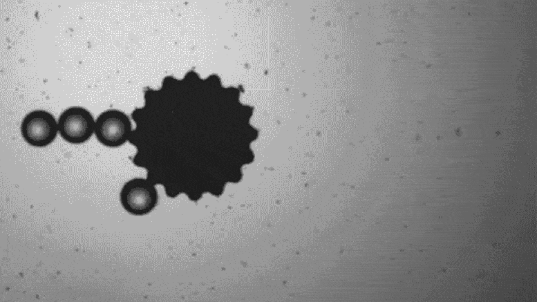
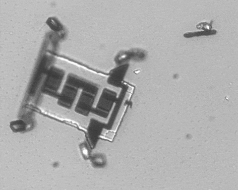

# Medical Robotics

Surgical and diagnostic robots have moved beyond research - da Vinci-class systems now perform millions of procedures a year. This is the slow field. No hype cycle, no demo-video skepticism required, because the industry doesn't sell on demo videos - it sells on FDA clearance letters and malpractice-insurance actuarial tables. If [Humanoids](humanoids.md) is a category that has outrun its shipped product, medical robotics is close to the opposite: durable revenue, real deployed units, and a regulatory bar so high that the technology is rarely the bottleneck.

## Why surgical robots are teleoperated, not autonomous

Every commercially deployed surgical robot - da Vinci, Versius, Senhance, Mako - is a **master-slave teleoperation system**. The surgeon sits at a console, moves master manipulators (or, for Mako, guides a hand-held tool), and the patient-side robot mirrors that motion at the surgical site, usually with motion scaling (a 5:1 or similar reduction, so a large hand motion becomes a small instrument motion) and tremor filtering in between. The robot does not decide where to cut. The surgeon does, continuously, for the whole procedure.

```
[Surgeon's hands]
       |  position/orientation
       v
[Master console: backdrivable manipulators, motion-scaled, tremor-filtered]
       |  scaled motion command
       v
[Patient-side manipulator: cable-driven wrist, inside the sterile field]
       |  instrument motion
       v
[Patient anatomy]  --camera feed-->  [Console display]  --visual feedback-->  [Surgeon]
```

Notice what's missing from that loop: force feedback flowing back up to the surgeon's hands. That gap is deliberate, or at least accepted, and it's covered below.

This isn't as much of a technology limitation as it looks. Two things keep it this way:

1. **Liability and licensure.** A surgeon operating a teleoperated system is still the one making every clinical decision and remains the legally accountable party. An autonomous surgical action shifts that accountability onto the device manufacturer and the regulator who cleared it - a much harder claim to support, and one neither manufacturers nor regulators have been eager to make except for narrowly defined, heavily constrained sub-tasks.
2. **Validation.** Approving a device that assists a human who retains full control is a fundamentally easier regulatory claim than approving a device that acts on its own judgment inside a human body. See "The regulatory pathway dominates the timeline," below - this isn't a minor bureaucratic detail, it's the central fact of the field.

What autonomy exists in practice is narrow and supervised: automated suturing assistance, tissue tensioning, or camera positioning within a surgeon-defined boundary, not autonomous decision-making about the procedure itself. Expect this to stay true for a long time. The bar for "the robot was right" in surgery isn't "usually" - it's "every time, and provably so beforehand," which is a much harder property to certify for a learned policy than for a teleoperated system where a human is in the loop on every motion.

The clearest research counterexample is STAR (Smart Tissue Autonomous Robot), a Johns Hopkins system that has demonstrated **supervised autonomous** soft-tissue suturing - first on porcine intestinal anastomosis in 2016, later extended to autonomous laparoscopic soft-tissue surgery in 2022. "Supervised" is doing real work in that phrase: a surgeon monitors and can intervene, and the demonstrated task is a narrow, well-defined one (suturing along a planned path) rather than an open-ended procedure. It's a genuine research result, and it's also a good illustration of the gap between "a robot can do this task autonomously in a controlled study" and "this is what gets deployed commercially" - a gap that, in this field, is measured in regulatory years, not engineering months.

## The engineering constraints that actually matter

The interesting engineering in medical robotics mostly isn't in an autonomy stack - there mostly isn't one. It's in the constraints of operating inside a sterile field where errors have sub-millimeter consequences.

**Sterilization.** Every part of the robot that enters the sterile field either has to survive repeated autoclaving or be single-use. da Vinci-class systems solve this with sterile drapes over the patient-side arms and instrument tips that are mechanically rated for a fixed number of uses - tracked by the system itself - before being retired. That's a different design constraint than "make it durable." It's "make it durable for exactly N cycles, then force replacement."

**Backdrivability, in two different places.** The surgeon's console-side manipulators need to be backdrivable and low-friction so the surgeon's hand motion translates faithfully into a command - uncontroversial. What's more contested is the patient side: despite these systems being teleoperated from the start, most deployed platforms still don't return meaningful force feedback to the surgeon's hands. Okamura's 2009 review of haptic feedback in robot-assisted minimally invasive surgery is still a fair description of the gap - the lack of haptic feedback has been recognized as a limiting factor for as long as these systems have existed, and it remains only partially solved. Surgeons largely learn to infer force from visual cues, like tissue deformation on the video feed, instead.

**Cable-driven transmission.** An instrument tip inside a patient's body needs several degrees of freedom (EndoWrist-style wrist joints) in a package a few millimeters across - too small to fit a motor. So the actuators live outside the body, at the robot's arm, and motion is transmitted down the shaft via cables and pulleys. This is the same actuator-packing problem dexterous robot hands run into (see [Humanoids](humanoids.md)), solved the same way - remote actuation, tendon transmission - with the added constraint that the cables have to survive sterilization and a fixed number of duty cycles.

**Tremor filtering.** Physiological hand tremor sits around 8-12 Hz at small amplitude. Because the system is already digitizing the surgeon's hand motion and re-synthesizing the instrument's motion, filtering that band out is comparatively simple - a low-pass filter on the command signal - and it's one of the least controversial, most reliably beneficial pieces of the whole stack.

These constraints are also a useful lens on why surgical robots and industrial robots, despite both being "robot arms," end up as almost entirely different engineering disciplines:

| | Industrial arm | Surgical robot |
|---|---|---|
| Primary design goal | Speed, payload, repeatability | Precision, sterility, safety margin |
| Autonomy | Often fully autonomous, fenced from humans | Teleoperated, human in the loop on every motion |
| End-effector DOF budget | Whatever the task needs | Squeezed into a few millimeters, cable-driven |
| Force feedback to operator | Rarely relevant | Recognized gap, still mostly unsolved |
| Regulatory bar | Industrial safety standards | FDA/CE medical device clearance |
| Failure consequence | Damaged part, line stoppage | Patient harm |

## Rehabilitation and assistive robotics

A different design problem from surgical robotics: instead of sub-millimeter precision for minutes at a time, you need hours of continuous, safe, powered assistance worn by or walked in by a person who may have limited motor control or sensation - so the failure modes that matter most are different. A stuck exoskeleton joint is a safety incident, not a missed suture.

* **Powered exoskeletons** (Ekso Bionics, ReWalk and similar) - lower-limb assistance for spinal cord injury patients, focused on gait pattern generation and fall safety rather than dexterity. The control problem here rhymes with the humanoid locomotion problem covered in [Humanoids](humanoids.md) - keeping an underactuated system stable while walking - except the "policy" has to cooperate with a human occupant who has their own intentions and, often, limited sensation to warn them if something is wrong.
* **Robotic gait trainers** (Lokomat-style systems) - treadmill-based, body-weight-supported rehabilitation robots used in clinical settings, not worn outdoors. Lower engineering risk than a wearable exoskeleton, since the patient is harnessed and the system never has to balance itself, which is part of why these were clinically deployed earlier than walking exoskeletons.
* **Robotic prosthetics and orthotics** - increasingly EMG- or intent-driven, a different sensing problem again: inferring intended motion from residual muscle signals rather than teleoperating a known hand motion. The tolerance for a misclassified intent is also different from surgery - a prosthetic hand that grips a second too late is an inconvenience, not the safety incident a surgical error would be, which is part of why this corner of medical robotics can iterate faster.

This sub-field moves slower and gets far less attention than surgical robotics or humanoids, but it's arguably the part of medical robotics with the clearest, least-disputed benefit to the people using it.

## Capsule, continuum, and steerable-needle robots

The part of medical robotics that looks the least like a "robot" in the popular sense - often no visible arms or actuation at all - and the part most directly enabled by mechanical cleverness rather than AI.

<figure><figcaption></figcaption></figure>

* **Capsule endoscopy.** Swallowable, camera-equipped capsules (PillCam-style, passive) image the GI tract without an endoscope. The active research frontier is *magnetically actuated* capsules - steer the capsule with an external magnetic field rather than relying on peristalsis to carry it, trading passivity for controllability.
* **Continuum and concentric-tube robots.** Instead of rigid links and joints, these use pre-curved, telescoping tubes or cable-actuated flexible backbones to snake through tortuous anatomy a rigid instrument can't reach. Webster & Jones' 2010 review of constant-curvature kinematics is still the standard reference for how these are modeled.
* **Steerable needles.** A bevel-tipped flexible needle, pushed through soft tissue, naturally curves toward the bevel side; duty-cycled rotation of the needle during insertion controls how much it curves, letting a single needle reach a target around an obstacle a straight needle couldn't. Webster, Kim, Cowan, Chirikjian & Okamura's 2006 nonholonomic model is the foundational paper for this whole sub-area. This is also where diagnostic imaging and robotics actually meet in practice: steerable needles are steered *under* imaging - real-time ultrasound or intraoperative MRI/CT guidance - so the "robot" here is inseparable from the imaging modality that tells it where the target and the needle tip currently are.

These platforms trade the console-plus-master-slave-arm architecture of surgical robots for something closer to guided instrumentation - less like teleoperating a robot, more like a smart, steerable version of a tool that already existed.

<figure><figcaption></figcaption></figure>

## The regulatory pathway dominates the timeline

This is the section that actually explains why medical robotics moves the way it does. In the US, medical devices are FDA-classified by risk:

| Class | Risk level | Typical pathway | What it requires |
|---|---|---|---|
| **Class I** | Low | General controls, often exempt | Basic manufacturing / labeling controls |
| **Class II** | Moderate | **510(k) premarket notification** | "Substantial equivalence" to an already-cleared predicate device |
| **Class III** | High, or life-sustaining, or novel | **PMA (Premarket Approval)** | Full clinical trial data - the most rigorous pathway |

Most commercially deployed surgical robots, including da Vinci-class systems, have historically been cleared as **Class II devices via the 510(k) pathway** - substantially equivalent to a predicate, not proven safe and effective from first principles the way a Class III device would be. This is a well-documented point of controversy: a 2023 study tracing the "ancestry" of 510(k) clearances behind a widely deployed robotic surgical system found that the overwhelming majority of clearances in that chain submitted no clinical data at all, and identified a pattern researchers call **predicate creep** - each new clearance justified by comparison to the previous cleared device rather than to first-principles clinical evidence, so incremental technological change accumulates over years without ever triggering the harder review a Class III device would face.

Outside the US, the equivalent gate is **CE marking** under the EU's Medical Device Regulation (MDR) - surgical robots typically sit in the higher-risk device classes there too, requiring a Notified Body's conformity assessment rather than self-certification.

None of this is a knock on the technology. It's the actual explanation for why this field is slow, capital-intensive, and dominated by incumbents - Intuitive Surgical's da Vinci franchise has had the surgical-robotics market largely to itself for decades - rather than fast-moving startups: **the regulatory pathway, not the engineering, is almost always the long pole.** A team that has solved the control problem for an autonomous suturing assist is still years and tens of millions of dollars away from a device an FDA reviewer will actually clear, and every incremental change to a cleared device risks resetting that clock. Compare that to the humanoid space, where a company can put out a compelling demo video within a product cycle measured in months (see [Humanoids](humanoids.md)), and the two "frontiers" start to look like they're playing entirely different games.

For who's actually building and hiring in this space, see the Surgical/Medical section of [Companies Hiring for Robotics](../career-paths-and-research-opportunities/companies-hiring-for-robotics.md) - Intuitive Surgical, CMR Surgical, Vicarious Surgical, Stryker Mako, and Asensus are the names that matter there.


**Field note.** The thing that surprises people coming from consumer robotics or ML into medical robotics is how little the pace has to do with what's technically possible. I've seen research prototypes with real autonomous capability sit for years while a company works through predicate device arguments and clinical evidence requirements - not because anyone doubts the engineering, but because the standard of proof for "safe inside someone's body" is categorically different from "worked in the demo." If you want to work in this field, budget your patience accordingly, and don't mistake the slow pace for a lack of ambition in the people doing it.


## Further reading

- Shademan et al., *"Supervised Autonomous Robotic Soft Tissue Surgery"* - [https://www.science.org/doi/abs/10.1126/scitranslmed.aad9398](https://www.science.org/doi/abs/10.1126/scitranslmed.aad9398)
- Okamura, *"Haptic Feedback in Robot-Assisted Minimally Invasive Surgery"* - [https://pmc.ncbi.nlm.nih.gov/articles/PMC2701448/](https://pmc.ncbi.nlm.nih.gov/articles/PMC2701448/)
- Webster & Jones, *"Design and Kinematic Modeling of Constant Curvature Continuum Robots: A Review"* - [https://journals.sagepub.com/doi/10.1177/0278364910368147](https://journals.sagepub.com/doi/10.1177/0278364910368147)
- Webster, Kim, Cowan, Chirikjian & Okamura, *"Nonholonomic Modeling of Needle Steering"* - [https://journals.sagepub.com/doi/10.1177/0278364906065388](https://journals.sagepub.com/doi/10.1177/0278364906065388)
- Lefkovich & Rothenberg, *"Identification of Predicate Creep Under the 510(k) Process: A Case Study of a Robotic Surgical Device"* - [https://pmc.ncbi.nlm.nih.gov/articles/PMC10047502/](https://pmc.ncbi.nlm.nih.gov/articles/PMC10047502/)
