# Fabrication Parts

**Mechanical Accessories**

Mechanical accessories are the fundamental building blocks used to construct the physical frame, articulate parts, and transmit power within a robot. These components provide structural integrity, facilitate motion, and ensure that all parts are securely connected. Careful selection of these accessories is crucial for the robot's performance, durability, and ease of assembly.

**1. Structural Parts**

Structural parts form the skeleton of the robot, providing the necessary framework to mount all other components like motors, sensors, and electronics. The choice of structural elements depends on the required strength, weight, complexity, and budget of the robot.

**1.1 Aluminum Extrusion Systems (T-Slot, V-Slot, Square Channels)**

Aluminum extrusions are a popular choice for robot frames due to their high strength-to-weight ratio, modularity, and ease of use. They feature slots along their lengths that allow for easy connection of other extrusions, plates, and components using specialized fasteners.

* **1.1.1 Square Channels or Square Pipes:**

<figure>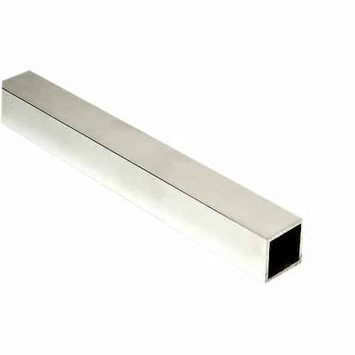<figcaption></figcaption></figure>

* **Description:** These are hollow extrusions with a square cross-section. They are a basic structural element used for creating frames and supports. While simpler than T-slot or V-slot profiles, they are robust and can be cost-effective.
* **Materials:** Commonly made from aluminum (e.g., 6061 or 6063 alloys) for a good balance of strength and weight, or steel for applications requiring higher strength or rigidity.
* **Sizes:** Available in various side lengths (e.g., 20mm, 25mm, 1 inch) and wall thicknesses.
* **Connection:** Typically connected by drilling holes and using bolts, or by using corner brackets, L-plates, or welding (for steel).
* **Applications:** Simple robot frames, support structures, linear motion guides (when precisely aligned).
* **Pros:** Simple, relatively inexpensive, widely available.
* **Cons:** Less modular than T-slot/V-slot systems, connections often require drilling.
* \[Image: Assortment of aluminum square channels/pipes of different sizes]
* \[Product Link: Search for "aluminum square tubing" or "steel square tubing" on industrial or hobbyist supplier websites like McMaster-Carr, Misumi, or local metal suppliers.]
* **1.1.2 V-Extrusions and T-Slot Extrusions:**
  * **Description:** These are customized cross-sectional aluminum extrusions characterized by V-shaped or T-shaped slots along their lengths. These slots are key to their versatility, allowing components and other extrusions to be attached anywhere along the extrusion length using specialized T-nuts or V-slot nuts that slide into the grooves, along with bolts.
  * **Common Profiles:** Often referred to by series numbers that indicate their cross-sectional dimensions, such as 2020 (20mm x 20mm), 2040 (20mm x 40mm), 3030 (30mm x 30mm), 4040 (40mm x 40mm). V-Slot extrusions specifically have angled surfaces within the slot that can also act as linear rails for V-wheels.
  * **Advantages:**
    * **Modularity:** Easy to assemble, disassemble, and reconfigure.
    * **Strength:** Provide excellent structural integrity. V-extrusions often offer enhanced strength compared to basic square pipes due to their optimized profiles.
    * **Accessory Ecosystem:** A wide range of compatible accessories is available, including various brackets, connectors, fasteners (T-nuts, hammer nuts), end caps, and linear motion components (V-wheels for V-slot).
    * **Precision:** Can be used to build precise linear motion systems.
  * **Materials:** Typically made from 6063-T5 or 6061-T6 aluminum.
  * **Applications:** Robot frames of all sizes (from small desktop robots to large CNC machines), linear actuator assemblies, 3D printer frames, machine guarding.
  * Extrusion : YouTube video link (Keep existing link)
  * Extrusion 2 : YouTube Video Link (Keep existing link)
  * \[Image: Profile views of different T-Slot and V-Slot extrusions (e.g., 2020, 4040) and an example of a structure built with them.]
  * \[Product Link: Search for "V-Slot aluminum extrusion" or "T-Slot aluminum extrusion" on websites like OpenBuilds Part Store, Misumi, 80/20 Inc., or robotics component suppliers.]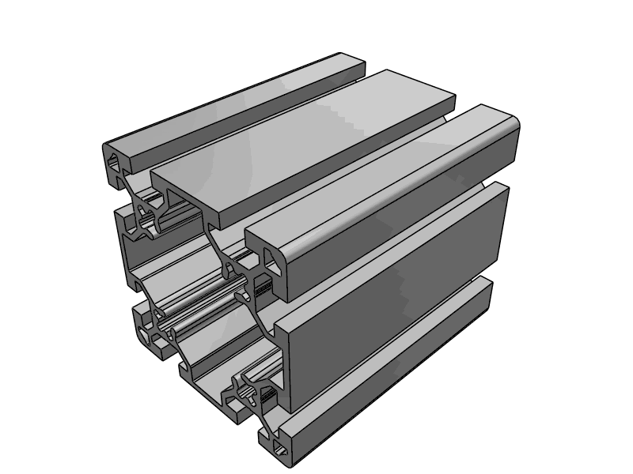

**1.2 Shafts (Axles)**

* **Description:** A shaft is a rotating machine element, usually circular in cross-section, used to transmit power or motion. It can support rotating components like gears, pulleys, wheels, or cams.
* **Types:**
  * **Round Shafts:** Simple cylindrical shafts.
  * **D-Shafts:** Round shafts with one flat side. This flat provides a surface for a set screw to press against, preventing slippage of attached components like hubs or gears.
  * **Keyed Shafts:** Have a slot (keyway) machined into them to fit a key, which also fits into a keyway on the mating component (e.g., gear, pulley). This provides a very secure way to transmit torque.
  * **Threaded Shafts (Lead Screws):** Used to convert rotary motion into linear motion (see Linear Motion section).
  * **Hex Shafts:** Hexagonal cross-section, offering good torque transmission similar to D-shafts or keyed shafts, often used in FIRST Robotics Competition (FRC).
* **Materials:** Commonly steel (e.g., stainless steel for corrosion resistance, hardened steel for high loads), aluminum for lighter applications.
* **Key Specifications:** Diameter (e.g., 3mm, 5mm, 6mm, 8mm, 1/4", 3/8"), length, material, type of shaft end (round, D-profile, keyed).
* **Applications:** Motor output shafts, axles for wheels, pivot points, supporting rotating sensors.
* \[Image: Various shaft types - D-shaft, keyed shaft, round shaft, hex shaft.]
* \[Product Link: Search for "precision shafts", "D-shafts", "keyed shafts" on robotics supplier websites like ServoCity, Pololu, AndyMark, or McMaster-Carr.]

**1.3 Plates and Brackets**

Plates and brackets are essential for joining structural components, reinforcing joints, and mounting various parts.

* **1.3.1 L-Plates (Corner Brackets):**

<figure>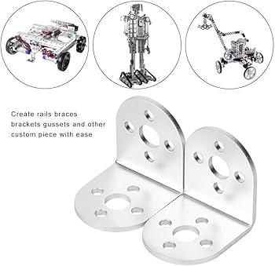<figcaption></figcaption></figure>

* **Description:** These are flat pieces of material, typically metal, bent at a 90-degree angle with pre-drilled holes. They are used to connect two structural members at a right angle and provide rigidity to the joint.
* **Materials:** Aluminum, steel.
* **Applications:** Joining square channels, connecting extrusions to flat surfaces, reinforcing corners of a chassis.
* L plates use : YouTube video link (Keep existing link)
* \[Image: Various L-plates or simple corner brackets.]
* \[Product Link: Search for "L-plates", "metal corner brackets" on hardware or robotics supplier websites.]
* **1.3.2 Angle Brackets (Gussets and Specialized Brackets):**

<figure>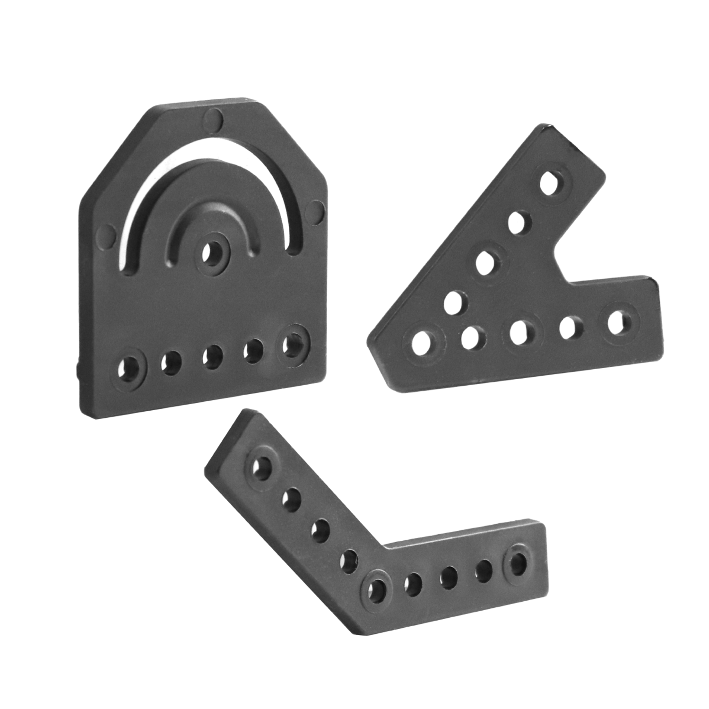<figcaption></figcaption></figure>

* **Description:** Angle brackets serve a similar purpose to L-plates but can encompass a wider variety of shapes, strengths, and specific uses, especially within extrusion systems.
  * **Gussets:** These are plates (often triangular or rectangular) used to reinforce joints, especially in extrusion-based frames. They distribute stress over a larger area, increasing the strength and rigidity of the connection.
  * **Specialized Extrusion Brackets:** T-slot and V-slot systems have a wide array of purpose-designed angle brackets (e.g., 90-degree cast corner brackets, hidden corner connectors, inner/outer L-brackets) that fit neatly into the slots for strong and clean connections.
* **Materials:** Aluminum (often cast or machined), steel.
* **Applications:** Connecting extrusions at various angles (90 degrees being most common), reinforcing joints, mounting panels or other components to frames.
* \[Image: A selection of gussets and specialized angle brackets for aluminum extrusions.]
* \[Product Link: Search for "T-slot corner bracket", "V-slot gusset", "extrusion angle connector" on OpenBuilds Part Store, Misumi, or 80/20 Inc.]
* **1.3.3 Flat Plates:**

<figure>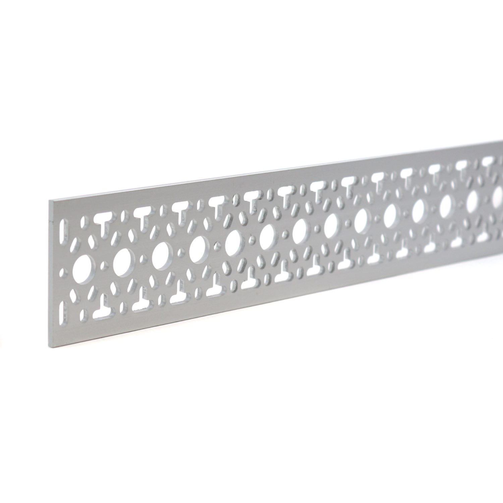<figcaption></figcaption></figure>

* **Description:** Simple flat pieces of material (metal or plastic) with various hole patterns or without holes (requiring drilling).
* **Materials:** Aluminum, steel, acrylic, polycarbonate.
* **Applications:** Joining extrusions end-to-end or side-by-side, creating custom mounting surfaces, acting as shims or spacers.
* \[Image: Assorted flat joining plates for aluminum extrusions.]
* \[Product Link: Search for "flat joining plate for aluminum extrusion", "aluminum flat bar stock" on robotics or industrial supplier sites.]
* **1.3.4 Actuator Mounting Brackets:**

<figure>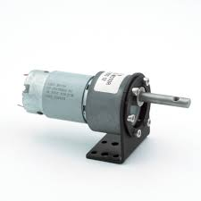<figcaption></figcaption></figure>

* **Description:** Specifically designed brackets to securely mount motors (DC motors, stepper motors), servos, and linear actuators to the robot's structure. They often have hole patterns that match standard motor or servo sizes.
* **Materials:** Aluminum, steel, 3D-printed plastic.
* **Applications:** Attaching drive motors, steering servos, actuator mechanisms.
* \[Image: Examples of motor mounts and servo brackets.]
* \[Product Link: Search for "NEMA motor mount", "standard servo bracket", "linear actuator bracket" on robotics supplier websites.]

**1.4 Standoffs and Spacers**

<figure>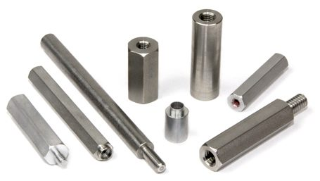<figcaption></figcaption></figure>

<figure>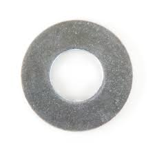<figcaption></figcaption></figure>

* **Description:** Standoffs are threaded separators (often male-female or female-female) used to create space between two components, typically for mounting printed circuit boards (PCBs) or creating layered assemblies. Spacers are similar but unthreaded, essentially hollow tubes.
* **Materials:** Brass, nylon, aluminum, stainless steel.
* **Key Specifications:** Length, thread size (for standoffs, e.g., M2, M3, M4), inner/outer diameter (for spacers).
* **Applications:** Mounting PCBs to a chassis, creating clearance between structural parts, stacking layers of components.
* \[Image: Assortment of standoffs (brass, nylon) and spacers.]
* \[Product Link: Search for "PCB standoffs", "nylon spacers", "aluminum spacers" on electronics or robotics component websites.]

**2. Fasteners**

Fasteners are devices that mechanically join or affix two or more objects together. The choice of fastener is critical for the structural integrity and serviceability of the robot.

**2.1 Nuts and Bolts (and Screws)**

<figure><figcaption></figcaption></figure>

* **Description:**
  * **Bolts:** Threaded fasteners that typically mate with a nut to clamp parts together. They usually have an unthreaded portion (shank) under the head.
  * **Screws:** Threaded fasteners designed to be inserted into a threaded hole in one of the parts being joined, or they can form their own internal thread in softer materials (self-tapping screws). Machine screws are designed to go into pre-tapped holes.
  * **Nuts:** Have an internal thread and are used on the end of a bolt to secure it.
* **Common Types:**
  * **Bolts/Screws Heads:** Hex head, Socket Head (Allen key), Button Head, Flat Head (Countersunk), Pan Head, Cheese Head.
  * **Nuts:** Hex nuts, Nylon Lock Nuts (Nyloc - have a nylon insert to prevent loosening from vibration), Wing Nuts (for hand-tightening), Square Nuts, T-Nuts/Hammer Nuts (for aluminum extrusions).
  * **Set Screws (Grub Screws):** Headless screws, typically used to secure a component (like a gear or collar) to a shaft.
* **Materials:** Steel (various grades, often zinc-plated for corrosion resistance), stainless steel (for better corrosion resistance), nylon (for light-duty or insulating applications).
* **Key Specifications:** Thread size (e.g., M2, M3, M4, M5, M6 for metric; #4-40, #6-32 for imperial), length, head type, material.
* **Applications:** Joining virtually all structural parts, mounting components. T-nuts and hammer nuts are specifically designed to slide into the slots of aluminum extrusions, providing a threaded hole to attach other parts.
* Bolts : YouTube Video Link (Keep existing link)
* Nuts : YouTube Video Link (Keep existing link)
* \[Image: Variety of bolts (hex, socket, button head), nuts (hex, nyloc, T-nut), and screws (machine, set screw).]
* \[Product Link: Search for "M3/M4/M5 bolt assortment", "socket head cap screws", "nylon lock nuts", "T-nuts for 2020 extrusion" on Amazon, McMaster-Carr, or local hardware suppliers.]

**2.2 Washers**

* **Description:** A washer is a thin plate (typically disk-shaped, but can be square or other shapes) with a hole (typically in the middle) that is normally used to distribute the load of a threaded fastener, such as a screw or nut.
* **Types:**
  * **Plain Washers (Flat Washers):** Distribute load, prevent damage to the surface of the material being fastened, and can be used to span oversized holes.
  * **Spring Washers (e.g., Split Lock Washers, Wave Washers):** Provide a spring force to create friction and resist loosening due to vibration.
  * **Locking Washers (e.g., Tooth Lock Washers - internal/external tooth):** Have teeth that bite into the fastener and the mating surface to prevent loosening.
* **Materials:** Steel, stainless steel, nylon, brass.
* **Key Specifications:** Inner diameter (to match bolt size), outer diameter, thickness, type.
* **Applications:** Used under bolt heads and nuts to improve clamping and prevent loosening.
* Washers : YouTube video Link (Keep existing link)
* \[Image: Different types of washers - flat, spring (split), tooth lock.]
* \[Product Link: Search for "washer assortment M3/M4/M5", "flat washers", "spring lock washers" on hardware or industrial supply websites.]

**2.3 Rivets**

<figure>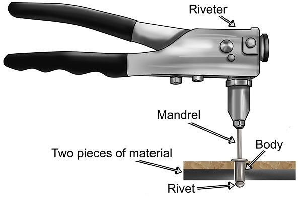<figcaption></figcaption></figure>

* **Description:** Rivets are permanent mechanical fasteners. Before being installed, a rivet consists of a smooth cylindrical shaft with a head on one end. The end opposite the head, called the tail, is deformed (upset or bucked) after the rivet is inserted into a punched or drilled hole, creating a new head and clamping the parts together.
* **Types:** Solid rivets, blind rivets (pop rivets), tubular rivets. Pop rivets are common in robotics as they can be installed from one side.
* **Materials:** Aluminum (common for robotics), steel.
* **Applications:** Creating permanent joints, especially where welding is not feasible or where vibration might loosen threaded fasteners over time. Often used for sheet metal or thin plate assembly.
* \[Image: Pop rivets and a pop rivet gun.]
* \[Product Link: Search for "pop rivets assortment", "aluminum rivets" on hardware or industrial supplier websites.]

**2.4 Threaded Inserts**

<figure><figcaption></figcaption></figure>

* **Description:** Threaded inserts are fasteners that are installed into a material (often softer like plastic, wood, or even softer metals like aluminum) to provide a strong, durable machine thread.
* **Types:** Heat-set inserts (for plastics, installed with a soldering iron), self-tapping inserts, press-in inserts.
* **Applications:** Adding robust threads to 3D-printed parts, repairing stripped threads, reinforcing threaded connections in softer materials.
* \[Image: Various types of threaded inserts, including heat-set inserts for plastics.]
* \[Product Link: Search for "heat-set threaded inserts for plastic", "self-tapping threaded inserts" on McMaster-Carr, Amazon, or specialist fastener suppliers.]

**3. Bearings**

<figure>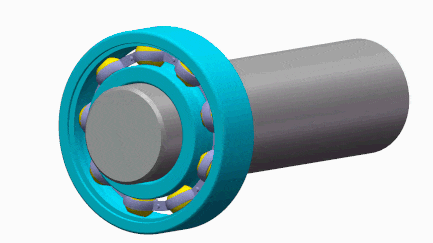<figcaption></figcaption></figure>

A bearing is a machine element that constrains relative motion to only the desired motion (e.g., rotation or linear movement) and reduces friction between moving parts. Proper bearing selection is crucial for efficiency, precision, and longevity of moving mechanisms.

**3.1 Ball Bearings**

* **Description:** Ball bearings use balls to separate the moving parts of the bearing. The purpose of a ball bearing is to reduce rotational friction and support radial (perpendicular to the shaft) and axial (parallel to the shaft) loads.
* **Types:**
  * **Deep Groove Ball Bearings:** Most common type, versatile, can handle both radial and some axial loads.
  * **Angular Contact Ball Bearings:** Designed to accommodate combined radial and axial loads, often used in pairs.
  * **Thrust Ball Bearings:** Designed specifically for axial loads.
* **Shields and Seals:**
  * **Open:** No shields or seals, grease can escape, and contaminants can enter.
  * **Shielded (ZZ or 2Z):** Metal shields on both sides to help retain grease and prevent larger contaminants from entering. Not fully sealed.
  * **Sealed (2RS):** Rubber seals on both sides providing better protection against contaminants and better grease retention than shields.
* **Key Specifications:** Inner Diameter (ID), Outer Diameter (OD), Width (W) (e.g., a 608zz bearing is 8mm ID, 22mm OD, 7mm W). Load ratings (dynamic and static).
* **Applications:** Wheel hubs, motor output shafts, rotating joints, idler pulleys, high-speed rotating mechanisms.
* Bearing : Link YouTube (Keep existing link)
* \[Image: A standard deep groove ball bearing (e.g., 608zz) and a cutaway view showing the balls and races.]
* \[Product Link: Search for "deep groove ball bearings", specific sizes like "608zz bearings" on robotics, hobby, or industrial bearing supplier websites.]

**3.2 Linear Sliders or Bearings**

<figure>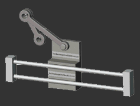<figcaption></figcaption></figure>

* **Description:** Linear bearings or sliders are designed to provide low-friction motion in a straight line.
* **Types:**
  * **Linear Ball Bearings (Bushings):** Contain rows of balls that recirculate within a cylindrical housing. These typically run on hardened and ground precision shafts (e.g., LM8UU bearings run on 8mm shafts).
  * **Linear Guide Rails and Blocks (e.g., MGN Series):** Consist of a profiled rail and a carriage (block) that contains small recirculating balls. Offer high precision, rigidity, and load capacity (e.g., MGN9, MGN12, MGN15 series).
  * **Slide Rails (Drawer Slides):** Telescopic slides, often used for extending drawers, but can be repurposed for simple linear motion in robotics.
  * **V-Wheels on V-Slot Extrusions:** As mentioned in structural parts, V-Slot extrusions can act as linear rails when used with V-profile wheels (often made of Delrin or polycarbonate) that have bearings in their centers. This is a very popular and cost-effective solution for light to medium-duty linear motion.
  * **Sleeve Bearings (Linear Bushings):** Simple cylindrical sleeves made of materials like bronze, graphite-impregnated bronze, or plastics (e.g., Igus Drylin). They slide directly on a shaft. Lower cost, good for dirty environments, but may have higher friction than ball bearings.
* **Applications:** Creating linear actuators, gantries for 3D printers or CNC machines, precise positioning systems, sliding mechanisms.
* Linear Sliders or Bearings : Link YouTube (Keep existing link)
* Linear Sliders or Bearings 2 (watch only initial 4 minutes): Link YouTube (Keep existing link)
* \[Image: Different types of linear motion systems: LM8UU linear bearing with shaft, an MGN12 linear rail with carriage, and V-wheels on a V-slot extrusion.]
* \[Product Link: Search for "LM8UU linear bearing", "MGN12 linear rail guide", "V-wheels", "Drylin linear bearings" on OpenBuilds, Misumi, Amazon, or specialized linear motion suppliers.]

**3.3 Sleeve Bearings (Bushings)**

* **Description:** Sleeve bearings, also known as bushings or plain bearings, are the simplest type of bearing. They consist of a sleeve, typically made of metal (like bronze), plastic (like nylon or PTFE), or composite material, that allows a shaft to rotate or slide within it.
* **Materials:** Bronze (often oil-impregnated for self-lubrication), PTFE, nylon, Delrin (POM), other engineering plastics.
* **Advantages:** Low cost, quiet operation, good for high loads at low speeds, tolerant of contamination, can be self-lubricating.
* **Disadvantages:** Higher friction than ball bearings, may require more lubrication, susceptible to wear if not properly selected or lubricated.
* **Applications:** Low-speed rotating joints, pivot points, simple linear guides where precision is not paramount.
* \[Image: Assortment of bronze and plastic sleeve bearings/bushings.]
* \[Product Link: Search for "bronze sleeve bearing", "plastic bushing", "SAE 841 bronze bushing" on McMaster-Carr, industrial suppliers, or robotics stores.]

**3.4 Rod Ends (Heim Joints)**

* **Description:** Rod ends, also known as Heim joints or rose joints, are mechanical articulating joints. They consist of an eye-shaped head with a shank (threaded or unthreaded) and a spherical bearing swiveling within the head.
* **Features:** Allow for angular misalignment, transmit push/pull forces. Available in male or female threaded shanks.
* **Applications:** Linkages in robotic arms, steering mechanisms, connecting rods, suspension components where misalignment needs to be accommodated.
* \[Image: Male and female threaded rod ends (Heim joints).]
* \[Product Link: Search for "rod ends", "Heim joints M5/M6" on McMaster-Carr, automotive, or industrial suppliers.]

**4. Power Transmission Components**

These components are used to transmit power and motion from motors to other parts of the robot, often involving changes in speed, torque, or direction of motion.

**4.1 Gears**

<figure>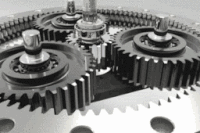<figcaption></figcaption></figure>

* **Description:** A gear or cogwheel is a rotating machine part having cut teeth (cogs) which mesh with another toothed part (another gear or a toothed rack) to transmit torque and motion. Geared devices can change the speed, torque, and direction of a power source.
*   **Types:**

    * **Spur Gears:** Simplest type, teeth are straight and parallel to the gear's axis. Used to transmit power between parallel shafts.

    <figure><figcaption></figcaption></figure>

    * **Helical Gears:** Teeth are cut at an angle to the gear's axis. Smoother and quieter operation than spur gears, can carry more load.

    <figure>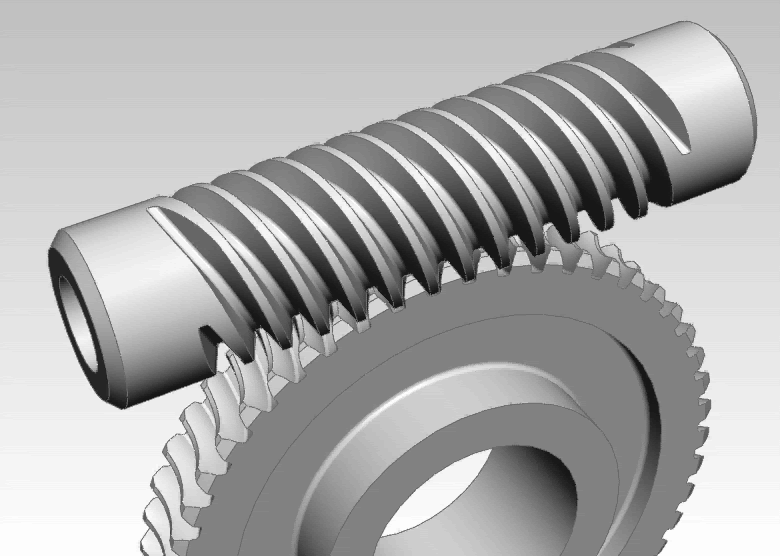<figcaption></figcaption></figure>

    * **Bevel Gears:** Cone-shaped, used to transmit power between shafts that intersect (typically at 90 degrees).

    <figure>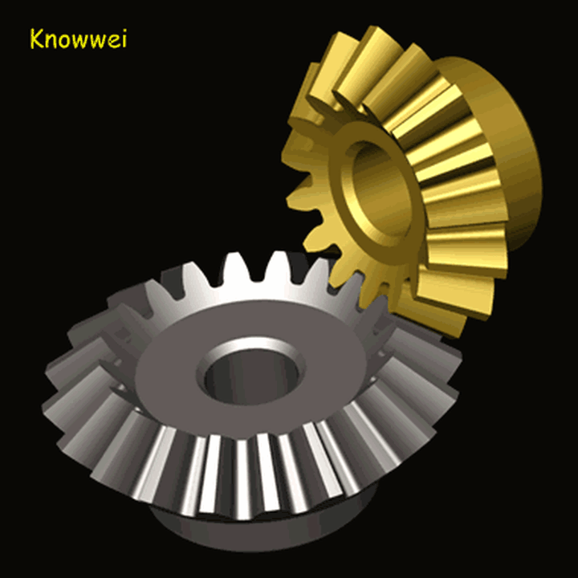<figcaption></figcaption></figure>

    * **Worm Gears:** Consist of a worm (screw-like gear) and a worm wheel (similar to a spur gear). Offer very high gear ratios in a compact space and are often self-locking (the wheel cannot drive the worm).

    <figure><figcaption></figcaption></figure>

    * **Rack and Pinion:** A rack (flat, toothed bar) meshes with a pinion (small spur gear). Converts rotary motion into linear motion or vice-versa.

    <figure>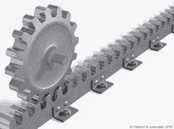<figcaption></figcaption></figure>
* **Materials:** Steel, brass, aluminum, plastics (Nylon, Delrin/POM - good for lower loads, quieter operation, self-lubricating properties).
* **Key Parameters:**
  * **Module (Metric) or Diametral Pitch (DP - Imperial):** Defines the tooth size. Gears must have the same module/DP to mesh.
  * **Number of Teeth (N):** Determines the gear ratio when meshed with another gear (Gear Ratio = N\_driven / N\_driver).
  * **Pitch Diameter (PD):** The diameter of the imaginary circle on which the teeth are based.
  * **Pressure Angle:** The angle of the tooth profile (e.g., 20 degrees is common).
* **Applications:** Gearboxes for increasing torque and reducing speed of motors, precise positioning systems, drivetrains.
* \[Image: Examples of different gear types: spur, helical, bevel, worm gear set, rack and pinion.]
* \[Product Link: Search for "spur gears module 1", "plastic gears assortment", "worm gear set" on robotics suppliers like Pololu, ServoCity, SDP/SI, or hobby stores.]

**4.2 Pulleys and Belts**

* **Description:** Pulleys and belts are used to transmit power and motion between non-intersecting, often parallel, shafts over a distance. They can also be used to change speed and torque.
*   **Types:**

    * **Timing Belts and Pulleys (e.g., GT2, HTD):**&#x20;

    <figure>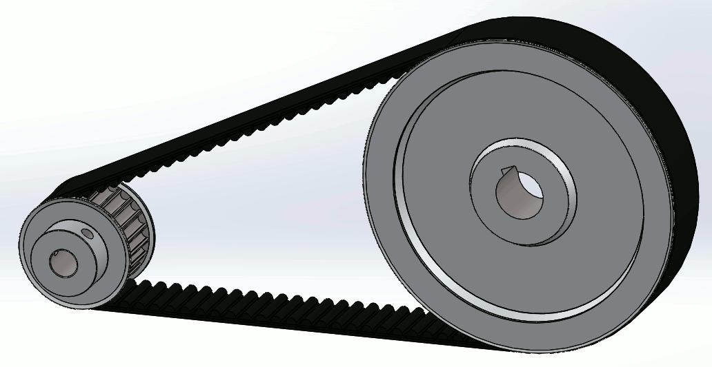<figcaption></figcaption></figure>

    * Have teeth that engage with corresponding grooves on the pulleys. Provide synchronous (no-slip) power transmission. GT2 belts are very common in 3D printers and small robots for precise motion.
    * **V-Belts and Pulleys:**&#x20;

    <figure>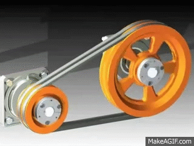<figcaption></figcaption></figure>

    * V-shaped belts fit into V-shaped grooves on pulleys. Rely on friction, can transmit high power but may have some slip.
    * **Flat Belts and Pulleys:** Simplest type, but less common now for precise power transmission in robotics.
* **Materials:** Belts are typically made of rubber reinforced with fibers (e.g., neoprene with fiberglass or steel cords). Pulleys are made of aluminum or plastic.
* **Key Specifications:**
  * **Belts:** Profile type (e.g., GT2), pitch (distance between teeth, e.g., 2mm for GT2), width (e.g., 6mm, 9mm), length.
  * **Pulleys:** Profile type, number of teeth/grooves, bore diameter (to fit shaft), overall diameter.
* **Applications:** Linear motion systems (e.g., driving carriages in 3D printers), power transmission from motors to wheels or other mechanisms where smooth, quiet operation is desired.
* \[Image: GT2 timing belt and pulley system, and an example of a V-belt and pulley.]
* \[Product Link: Search for "GT2 timing belt", "GT2 pulley 20 teeth 5mm bore", "V-belt" on OpenBuilds, Pololu, Amazon, or industrial suppliers.]

**4.3 Sprockets and Chains**

<figure><figcaption></figcaption></figure>

* **Description:** Sprockets and chains are similar to pulleys and belts but use a chain made of interconnected metal links that engage with toothed wheels called sprockets.
* **Advantages:** Can transmit very high torque, provide positive (no-slip) engagement, durable.
* **Disadvantages:** Can be heavier, noisier, and require more lubrication than belts.
* **Key Specifications:** Chain pitch (distance between roller centers, e.g., #25 chain has 1/4" pitch), sprocket number of teeth, sprocket bore diameter.
* **Applications:** Heavy-duty drivetrains in larger robots, conveyors, applications requiring high strength and reliability.
* \[Image: Roller chain and sprockets (e.g., #25 or #35 chain).]
* \[Product Link: Search for "#25 roller chain", "#25 sprocket" on AndyMark, McMaster-Carr, or industrial/motorcycle parts suppliers.]

**4.4 Shaft Couplings**

<figure>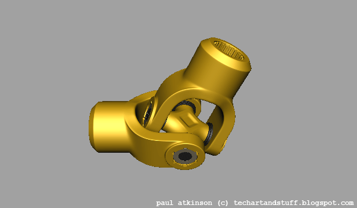<figcaption></figcaption></figure>

* **Description:** Shaft couplings are used to connect two shafts at their ends for the purpose of transmitting power. They can also accommodate some misalignment between the shafts.
* **Types:**
  * **Rigid Couplings:** Used when shafts are perfectly aligned. Provide a solid connection. (e.g., sleeve couplings, clamp couplings).
  * **Flexible Couplings:** Can accommodate misalignment (angular, parallel, or axial).
    * **Jaw/Spider Couplings:** Good for vibration damping, moderate misalignment. Consist of two hubs and an elastomeric insert (spider).
    * **Beam Couplings (Helical Couplings):** Machined from a single piece of material with a helical cut. Good for small misalignments, zero backlash.
    * **Oldham Couplings:** Accommodate significant parallel misalignment.
    * **Universal Joints (U-Joints):** Accommodate large angular misalignment.
* **Key Specifications:** Bore diameters for the two shafts to be connected, torque rating, misalignment capacity.
* **Applications:** Connecting motor shafts to lead screws, gearboxes, or other shafts. Preventing stress on bearings due to slight misalignments.
* \[Image: Different types of shaft couplings: rigid clamp coupling, flexible jaw/spider coupling, helical beam coupling.]
* \[Product Link: Search for "shaft coupling 5mm to 8mm", "flexible jaw coupling", "helical beam coupling" on robotics stores, Amazon, or industrial suppliers.]
