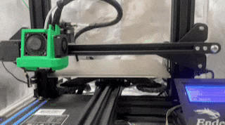
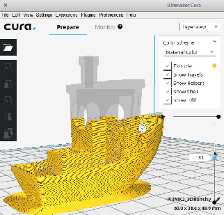
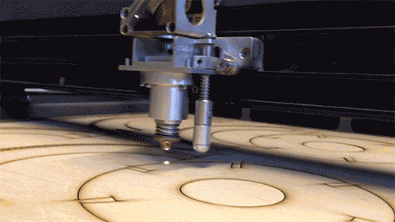
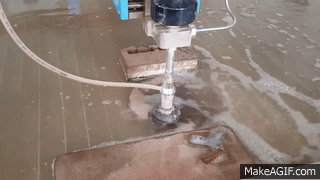

# 3D Printing and Machining

### Fabrication Methods: 3D Printing & Machining 

This guide summarizes the key additive and subtractive fabrication processes-3D printing, CNC machining, laser cutting, waterjet cutting, and EDM-including technology overviews, workflows, materials, and software tools.

### 1. 3D Printing 

<figure><figcaption>
3D Printing
</figcaption></figure>

### Technologies

* Fused Deposition Modeling (FDM)
* Stereolithography (SLA) / Digital Light Processing (DLP)
* Selective Laser Sintering (SLS) / Multi Jet Fusion (MJF)
* PolyJet / Multi-Jet Modeling (MJM)
* Direct Metal Laser Sintering (DMLS) / Selective Laser Melting (SLM)

### Workflow

1. CAD Design: Model parts in SolidWorks, Fusion 360, or Onshape.
2. Slicing: Import STL/OBJ into slicer (Cura, PrusaSlicer, ChiTuBox), set layer height, infill, supports, temperatures.
3. Printing: Load filament or resin, calibrate bed/laser, start job.
4. Post-Processing: Remove supports, wash (resins), cure (UV), sand or polish as needed.
5. Inspection: Verify dimensions with calipers and surface finish against spec.

### Materials

* FDM Filaments: PLA, ABS, PETG, Nylon, TPU, carbon-fiber/Nylon blends, PVA (soluble supports).
* Resins: Standard, tough, flexible, high-temperature, castable.
* Powder Beds (SLS/MJF): Nylon (PA11, PA12), TPU, glass-filled powders.
* Metal (DMLS/SLM): Stainless steel, aluminum, titanium, Inconel.

### Slicing Software

<figure><figcaption>
Slicing
</figcaption></figure>

* Cura (Ultimaker) - open-source, extensive machine profiles
* PrusaSlicer - advanced support/control for FDM & resin
* ChiTuBox / Lychee Slicer - popular resin slicing, hollowing, custom supports
* Simplify3D - commercial, fine control over multiple extruders
* Kiri:Moto - browser-based, integrates with CAD

### 2. CNC Machining 

<figure><figcaption></figcaption></figure>

### Technology Overview

Subtracts material via computer-controlled cutting tools to achieve tight tolerances and smooth finishes.

### Workflow

1. CAD Modeling: Define geometry in Fusion 360, SolidWorks, or Inventor.
2. CAM Programming: Generate toolpaths (roughing, finishing) in Mastercam, Fusion 360 CAM.
3. Machine Setup: Fixture workpiece on mill/lathe, load cutters, set zero points.
4. Dry Run & Cutting: Simulate toolpaths, then execute under coolant/lubrication.
5. Inspection & Post-Process: Deburr edges, apply coatings (anodize, paint), verify with CMM or micrometers.

### Machine Types

* Mills (3- to 5-axis)
* Lathes & CNC turning centers
* Routers & gantry mills
* EDM (see below)

### Software

* CAD/CAM: Fusion 360, Mastercam, SolidCAM, Autodesk HSM
* Controllers: Fanuc, Haas, Siemens Sinumerik

### 3. Laser Cutting 

<figure><figcaption>
Laser Cutter and Engraver
</figcaption></figure>

### Technology Overview

A high-power laser beam (CO₂ or fiber) thermally cuts or engraves sheet materials with narrow kerfs and minimal mechanical stress.

### Workflow

1. Design & Nesting: Prepare vector files (DXF, AI) in Illustrator, AutoCAD.
2. Machine Prep: Turn on laser, chiller, and fume extractor; set material thickness and origin.
3. Job Setup: Import into LightBurn, RDWorks or proprietary software; assign power/speed.
4. Cut/Engrave: Monitor progress, adjust focus height as needed.
5. Finish: Remove slag (for metals), clean with solvent or media blast.

### Material Compatibility

* Metals: steel, stainless, aluminum, copper
* Organics: wood, acrylic, leather
* Composites: certain laminates and plastics (check for toxic fumes)

### 4. Waterjet Cutting 

<figure><figcaption>
Waterjet Cutting
</figcaption></figure>

### Technology Overview

Delivers a high-pressure (up to 90,000 psi) water stream mixed with abrasive garnet to erode virtually any material without heat-affected zones.

### Workflow

1. CAD/CAM: Program toolpaths in FlowMaster, IntelliTECH.
2. Setup: Position workpiece on slat table, calibrate high-pressure pump.
3. Cutting: Adjust orifice/nozzle for desired kerf; run CNC-controlled cutting.
4. Cleanup: Collect spent abrasive, dry parts, remove edge burrs if needed.

### Advantages

* No thermal distortion
* Cuts metals, stone, ceramics, composites, glass
* Smooth edges-often minimal secondary finishing

### 5. Electrical Discharge Machining (EDM) 

<figure><figcaption>
Electrical Discharge Machining
</figcaption></figure>

### Technology Overview

Uses rapid electrical sparks between a shaped electrode and the workpiece, immersed in dielectric fluid, to erode material at micron-scale precision.

### Workflow

1. Electrode Fabrication: Machine graphite or copper electrode to part cavity shape.
2. Setup: Mount electrode and workpiece in dielectric tank; set pulse parameters.
3. Machining: CNC drives electrode into workpiece, spark discharges remove material.
4. Flushing & Finishing: Dielectric circulation clears debris; secondary polishing may be applied.

### Applications

* Hard alloys and tool steels
* Intricate cavities, threads, and fine features
* Mold, die, and aerospace part production

Choosing the right fabrication method hinges on part geometry, material properties, tolerance requirements, surface finish needs, and production volume. Combining additive and subtractive techniques often yields optimal design freedom, mechanical performance, and cost efficiency.
