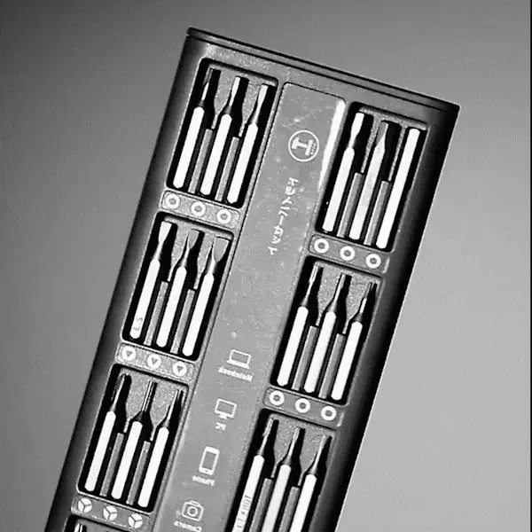
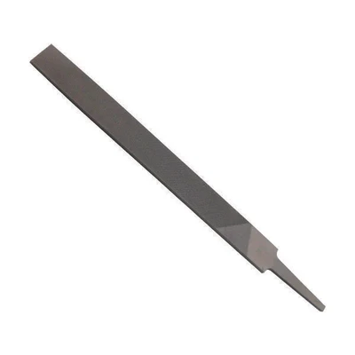
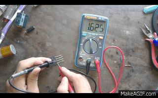
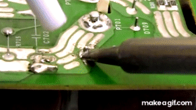
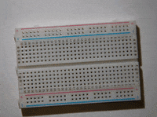
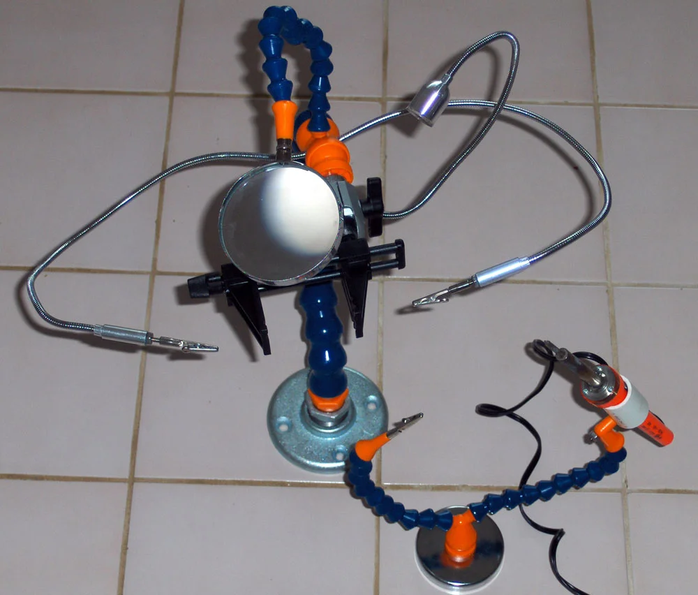
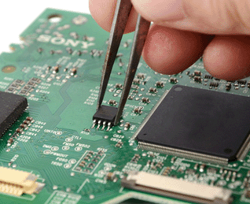

# Build and Prototyping

Robotics prototyping transforms design concepts into physical models to validate functionality, uncover design flaws early, and streamline the path to a competition-ready robot. This process combines iterative manufacturing methods-from CNC machining to 3D printing-with a well-equipped workbench featuring both mechanical and electronics tools.

### Prototyping & Build Workflow 

<figure><figcaption></figcaption></figure>

* Brainstorm and CAD: Sketch multiple concepts, then create detailed CAD models.
* Simulation: Virtually test kinematics and control logic before committing to hardware [2](https://robodk.com/blog/guide-make-robotic-arm/).
* Prototype Manufacturing: Use methods such as CNC machining, 3D printing, injection molding, vacuum casting, and sheet-metal fabrication to produce test parts [8](https://www.dekmake.com/guide-to-robotics-prototyping/).
* Assembly & Testing: Integrate components, validate mechanisms, collect performance data, and iterate until design goals are met [1](https://www.studica.com/blog/robot-prototyping/).

### Prototyping Manufacturing Methods 

* CNC Machining: Produces precision metal and plastic parts with micron-level tolerances using mills, lathes, routers, and EDMs [3](https://www.3erp.com/blog/cnc-robotics/).

<figure><figcaption></figcaption></figure>

* 3D Printing: Rapidly fabricates complex geometries and internal channels in plastics or metals for low-volume runs [8](https://www.dekmake.com/guide-to-robotics-prototyping/).

<figure><figcaption></figcaption></figure>

* Injection Molding: Creates high-strength polymer parts via molds-cost-effective for larger prototype batches [8](https://www.dekmake.com/guide-to-robotics-prototyping/).

<figure><figcaption></figcaption></figure>

* Vacuum Casting: Uses silicone molds to cast small series with excellent surface finish and material variety [8](https://www.dekmake.com/guide-to-robotics-prototyping/).

<figure><figcaption></figcaption></figure>

* Sheet-Metal Fabrication: Stamps, bends, and cuts metal sheets for structural components requiring thermal stability [8](https://www.dekmake.com/guide-to-robotics-prototyping/).

<figure><figcaption></figcaption></figure>

### Essential Machining Tools 

* CNC Mill & Lathe: Automated cutting of precise shapes in metals and plastics [3](https://www.3erp.com/blog/cnc-robotics/).

 

* CNC Router & Laser Cutter: Rapid contouring of softer materials (wood, acrylic) and detailed metal or plastic panels [3](https://www.3erp.com/blog/cnc-robotics/).

<figure><figcaption>
CNC Router
</figcaption></figure> <figure><figcaption></figcaption></figure>

<figure><figcaption>
Laser Cutter
</figcaption></figure>

* Waterjet Cutter: Cuts thick or heat-sensitive materials without thermal distortion [3](https://www.3erp.com/blog/cnc-robotics/).

<figure><figcaption>
Water Jet Cutter
</figcaption></figure>

* EDM Machine: Shapes hard metals and intricate cavities via controlled electrical discharges [3](https://www.3erp.com/blog/cnc-robotics/).

<figure><figcaption>
Electrical Discharge Machining
</figcaption></figure>

* Drill Press & Bandsaw: Fundamental for hole-making and rough cuts in prototyping materials.

<figure><figcaption>
Drill Press
</figcaption></figure>

<figure><figcaption>
Band Saw
</figcaption></figure>

### Workbench & Hand Tools 

* Digital Calipers: Measure dimensions accurately to 0.01 mm for part fit-checks [4](https://www.learnrobotics.org/blog/7-tools-that-can-help-you-build-a-prototype/).

<figure><figcaption></figcaption></figure>

* Precision Screwdriver Set: Drives small fasteners used in electronics and lightweight structures [5](https://en.wikibooks.org/wiki/Robotics/Design_Basics/Tools_and_Equipment).

<figure><figcaption></figcaption></figure>

* Wrenches, Hex Keys & Pliers: Assemble and adjust mechanical subassemblies [5](https://en.wikibooks.org/wiki/Robotics/Design_Basics/Tools_and_Equipment).

<figure><figcaption>
Wrench
</figcaption></figure>

<figure><figcaption>
Hex Keys / Allen Keys
</figcaption></figure>

* Bench Vice & Clamps: Secure parts during cutting, drilling, or gluing operations [5](https://en.wikibooks.org/wiki/Robotics/Design_Basics/Tools_and_Equipment).

<figure><figcaption></figcaption></figure> <figure><figcaption></figcaption></figure>

* Deburring Tools & Files: Remove sharp edges and ensure smooth part interfaces.

<figure><figcaption></figcaption></figure>

### Electronics & Soldering Tools 

* Multimeter: Measures voltage, current, resistance, and continuity for circuit diagnostics [5](https://en.wikibooks.org/wiki/Robotics/Design_Basics/Tools_and_Equipment).

<figure><figcaption>
Multimeter
</figcaption></figure>

* Oscilloscope: Visualizes analog and digital signals to troubleshoot complex electronics [5](https://en.wikibooks.org/wiki/Robotics/Design_Basics/Tools_and_Equipment).

<figure><figcaption>
Oscilloscope
</figcaption></figure>

* Soldering Iron & Accessories: Joins wires and components; includes tips, solder, and flux [7](https://www.linkedin.com/pulse/10-essential-tools-electronics-enthusiasts-hobbyist-rachana-jain-mskmc).

<figure><figcaption>
Soldering
</figcaption></figure>

* Desoldering Pump & Braid: Removes excess solder for rework and component replacement [7](https://www.linkedin.com/pulse/10-essential-tools-electronics-enthusiasts-hobbyist-rachana-jain-mskmc).

<figure><figcaption>
Desoldering Pump
</figcaption></figure>

* Breadboard & Jumpers: Enables solder-free prototyping of sensor and control circuits [7](https://www.linkedin.com/pulse/10-essential-tools-electronics-enthusiasts-hobbyist-rachana-jain-mskmc).

<figure><figcaption></figcaption></figure>

* Wire Strippers & Cutters: Prepare conductor ends for reliable electrical connections [7](https://www.linkedin.com/pulse/10-essential-tools-electronics-enthusiasts-hobbyist-rachana-jain-mskmc).

<figure><figcaption></figcaption></figure>

* Helping Hands & Magnifier: Holds small components steady during soldering [7](https://www.linkedin.com/pulse/10-essential-tools-electronics-enthusiasts-hobbyist-rachana-jain-mskmc).

<figure><figcaption>
Helping hands and Magnifier
</figcaption></figure>

* Tweezers: Handle miniature parts and surface-mount devices accurately [7](https://www.linkedin.com/pulse/10-essential-tools-electronics-enthusiasts-hobbyist-rachana-jain-mskmc).

<figure><figcaption>
Tweezer
</figcaption></figure>

### Software & Simulation Tools 

* CAD Packages (e.g., SolidWorks, Fusion 360): Create detailed 3D models and assemblies.
* Simulation Environments (e.g., RoboDK, Gazebo): Test kinematics, dynamics, and control logic before hardware build [2](https://robodk.com/blog/guide-make-robotic-arm/).

A well-organized prototyping phase, supported by the right mix of manufacturing methods and tools, accelerates development, reduces risk, and leads to a more reliable, high-performing competition robot.
