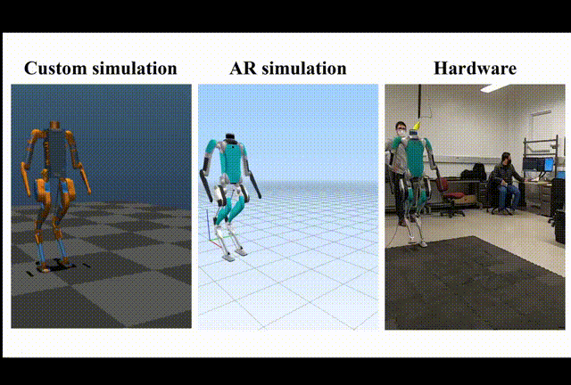

# Reinforcement Learning

<figure><figcaption></figcaption></figure>


**This page covers the classical RL foundations.** For the modern post-2023 stack — PPO with privileged learning for legged locomotion, SERL/HIL-SERL, Eureka (LLM-generated rewards), foundation-model policies, sim-to-real, world models — see the dedicated [Robot Learning](../robot-learning/) section.


Reinforcement Learning (RL) endows robots with the ability to learn control policies through trial-and-error interactions rather than hand-coding behaviors. This page surveys core RL approaches, their robotic applications, and a curated set of learning resources and software tools.



### Core RL Algorithms and Resources 

* Value-Based Methods
  * Q-Learning & SARSA – Tabular methods for discrete state–action spaces
  * Sutton & Barto’s “Reinforcement Learning: An Introduction” ([http://incompleteideas.net/book/the-book.html](http://incompleteideas.net/book/the-book.html))
  * Deep Q-Networks (DQN) & Variants (Double DQN, Dueling DQN) – Neural-network approximators for high-dimensional inputs
  * OpenAI Baselines DQN implementation ([https://github.com/openai/baselines](https://github.com/openai/baselines))
* Policy-Gradient Methods
  * REINFORCE – Monte-Carlo policy search
  * Trust Region Policy Optimization (TRPO) and Proximal Policy Optimization (PPO) – Stable on-policy updates
  * OpenAI Spinning Up tutorials ([https://spinningup.openai.com](https://spinningup.openai.com/))
  * Actor-Critic (A2C, A3C) – Combines policy gradient with value estimates
* Continuous-Control Algorithms
  * Deep Deterministic Policy Gradient (DDPG) & Twin Delayed DDPG (TD3) – Off-policy actor-critic for continuous actions
  * Soft Actor-Critic (SAC) – Maximum-entropy RL for robustness
  * Stable Baselines3 implementations ([https://github.com/DLR-RM/stable-baselines3](https://github.com/DLR-RM/stable-baselines3))
* Model-Based and Hybrid Methods
  * Model-Based Policy Optimization (MBPO) – Leverages learned dynamics models
  * Guided Policy Search – Uses trajectory optimization to supervise policy learning
  * Survey: “Reinforcement Learning in Robotic Applications” ([https://doi.org/10.1007/s10462-021-09997-9](https://doi.org/10.1007/s10462-021-09997-9))
* Multi-Agent and Hierarchical RL
  * Multi-Agent Deep Q-Learning (MADDPG) – Cooperative and competitive settings
  * Hierarchical RL (options framework) – Temporal abstractions for long-horizon tasks

### Robotics Applications 

* Locomotion & Legged Control
  * Learning stable walking, running gaits on quadrupeds and bipeds
  * NVIDIA’s Legged Gym environments ([https://developer.nvidia.com/isaac-legged-gym](https://developer.nvidia.com/isaac-legged-gym))
* Manipulation & Grasping
  * End-to-end policies for pick-and-place, tool use, and dexterous in-hand manipulation
  * Dex-Net grasp planner with RL integration ([https://berkeleyautomation.github.io/dex-net](https://berkeleyautomation.github.io/dex-net))
* Navigation & Mobile Robotics
  * Maze solving, obstacle avoidance, and mapless navigation with deep RL
  * ROS-Gazebo RL tutorials ([http://wiki.ros.org/gym\_gazebo](http://wiki.ros.org/gym_gazebo))
* Sim-to-Real Transfer
  * Domain Randomization and Sim-to-Real pipelines in NVIDIA Isaac Sim ([https://developer.nvidia.com/isaac-sim](https://developer.nvidia.com/isaac-sim))
* Aerial Robotics
  * Autonomous flight control for drones via RL
  * Microsoft AirSim environments ([https://github.com/microsoft/AirSim](https://github.com/microsoft/AirSim))

### Software Frameworks & Toolkits 

* OpenAI Gym & Gym-Robotics ([https://gym.openai.com/envs/#robotics](https://gym.openai.com/envs/#robotics))
* ROS RL Packages & ROS-Gym Bridges ([https://github.com/ros-gym](https://github.com/ros-gym))
* NVIDIA Isaac RL & Isaac Gym ([https://developer.nvidia.com/isaac-gym](https://developer.nvidia.com/isaac-gym))
* Ray RLlib: Scalable RL library ([https://docs.ray.io/en/latest/rllib.html](https://docs.ray.io/en/latest/rllib.html))
* Unity ML-Agents: Game-engine–based RL ([https://github.com/Unity-Technologies/ml-agents](https://github.com/Unity-Technologies/ml-agents))
* Intel Coach: Research RL framework ([https://github.com/intel/coach](https://github.com/intel/coach))

### Online Courses & Tutorials 

* Coursera “Reinforcement Learning Specialization” by University of Alberta ([https://www.coursera.org/specializations/reinforcement-learning](https://www.coursera.org/specializations/reinforcement-learning))
* Udacity “Deep Reinforcement Learning Nanodegree” ([https://www.udacity.com/course/deep-reinforcement-learning-nanodegree--nd893](https://www.udacity.com/course/deep-reinforcement-learning-nanodegree--nd893))
* The Construct Academy “Reinforcement Learning for Robotics” ([https://www.theconstruct.ai/robotigniteacademy\_learnros/ros-courses-library/reinforcement-learning-for-robotics/](https://www.theconstruct.ai/robotigniteacademy_learnros/ros-courses-library/reinforcement-learning-for-robotics/))
* 30 Days Coding “RL for Robotics: Locomotion & Navigation” ([https://30dayscoding.com/blog/reinforcement-learning-for-robotics-locomotion-and-navigation](https://30dayscoding.com/blog/reinforcement-learning-for-robotics-locomotion-and-navigation))

### Key Survey Papers 

* Kober, Bagnell & Peters (2013), “Reinforcement Learning in Robotics: A Survey” ([https://www.ias.informatik.tu-darmstadt.de/uploads/Publications/Kober\_IJRR\_2013.pdf](https://www.ias.informatik.tu-darmstadt.de/uploads/Publications/Kober_IJRR_2013.pdf))
* Deisenroth, Neumann & Peters (2011), “A Survey on Policy Search for Robotics” ([https://spiral.imperial.ac.uk/bitstream/10044/1/12051/7/fnt\_corrected\_2014-8-22.pdf](https://spiral.imperial.ac.uk/bitstream/10044/1/12051/7/fnt_corrected_2014-8-22.pdf))
* Singh et al. (2021), “Reinforcement Learning in Robotic Applications: A Comprehensive Survey” ([https://doi.org/10.1007/s10462-021-09997-9](https://doi.org/10.1007/s10462-021-09997-9))

By blending these algorithms, platforms, and learning pathways, practitioners can accelerate the deployment of RL-powered robots-from simulated prototypes to real-world autonomy.
