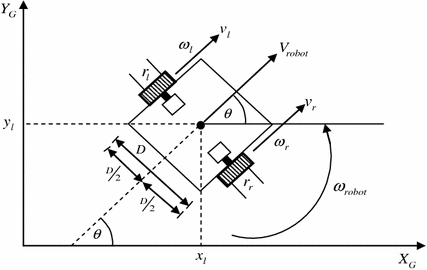
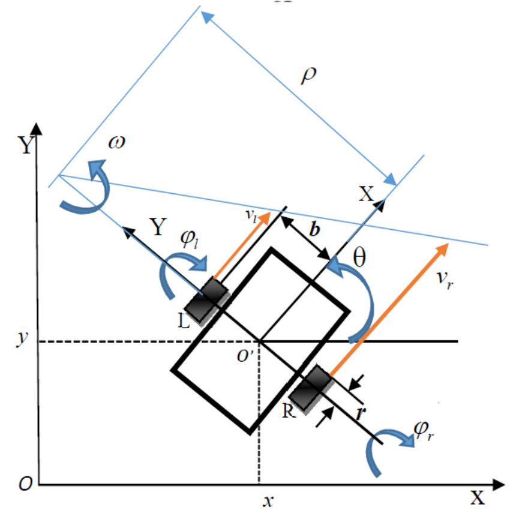
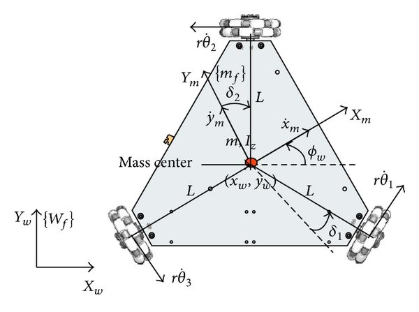

# Kinematics

**Kinematics of Wheeled Mobile Robots (WMRs)**

**Robot Pose and Velocity Definitions**

* Robot pose in the inertial frame:\
  ( $$I \eta = [x, y, \theta]^T$$ )
* Velocity in the robot frame:\
  ( $$R \dot{\eta} = [v_x, v_y, \omega]^T$$)
* Parameters:
* ( $$v_x$$ ): Forward velocity
* ( $$v_y$$ ): Lateral velocity (often constrained)
* ( $$\omega$$ ): Angular velocity

**Wheel Types and Constraints**

1. **Fixed Standard Wheel**

* Fixed orientation ( $$\beta$$) relative to chassis at location ( $$\alpha$$), ( l ) from center.
* Rolling constraint: ( $$(I_R R I \dot{\eta}) \cdot c_r = r \dot{\phi}$$ )
* Slip constraint: ( $$(I_R R I \dot{\eta}) \cdot c_s = 0$$)

1. **Steered Standard Wheel**

* Similar to fixed, but steering angle ( $$\beta$$ ) is actively controlled as ( $$\beta(t)$$ ).
* Constraints are the same as Fixed Standard Wheel, but ( $$\beta$$ ) varies over time.

1. **Caster Wheel**

* Free steering joint with offset ( d ) between the steering axis and wheel contact point.
* Rolling constraint: ( $$(I_R R I \dot{\eta}) \cdot c_r = r \dot{\phi}$$))
* Slipping constraint (allows steering rotation): $$( (I_R R I \dot{\eta}) \cdot c_s = -d \dot{\beta} )$$

1. **Omnidirectional Wheel**

* Permits movement in any direction via rollers aligned obliquely to the main wheel.
* No slip constraint; unique rolling dynamics.

**Differential Drive Model**

* Two coaxial wheels independently driven with angular velocities $$( \dot{\phi}_1 ), ( \dot{\phi}_2 )$$.
* Distance between wheels: ( $$2L$$), wheel radius: ( $$r$$ ).

Velocity calculations:

* ( $$v_x = \frac{r}{2} (\dot{\phi}_1 + \dot{\phi}_2)$$ )
* ( $$v_y = 0$$ )
* ( $$\omega = \frac{r}{2L} (\dot{\phi}_1 - \dot{\phi}_2)$$)

**Simple Car Model (Bicycle Model)**

<figure><figcaption></figcaption></figure>

Parameters:

* ( $$L$$ ): Wheelbase distance
* ( $$v$$ ): Forward velocity (determined by drivetrain)
* ( $$\phi$$ ): Steering angle

Velocity calculations

* ( $$\dot{x} = v \cos \theta$$ )
* ( $$\dot{x} = v \cos \theta$$ )
* ( $$\dot{x} = v \cos \theta$$ )

**Holonomic vs. Nonholonomic Systems**

1. **Holonomic**

<figure><figcaption></figcaption></figure>

* Constraints integrable into positional form; all degrees of freedom controllable.
* ( $$\delta_m = \text{DOF} = 3$$ )

1. **Nonholonomic**

* Velocity constraints non-integrable; limits movement flexibility.
* ( $$\delta_m < \text{DOF}$$ )

**Manipulator Kinematics & D-H Parameters**

Link parameters:

* Link length: ( $$a_i$$)
* Link twist angle: ( $$\alpha_i$$ )
* Link offset: ( $$d_i$$ )
* Joint angle: ( $$\theta_i$$ )

**Applications of D-H Parameters**

1. **Forward Kinematics**

* Computes end-effector position from joint parameters.

1. **Inverse Kinematics**

* Calculates joint parameters to achieve a desired end-effector pose.

1. **Robot Control**

* Establishes a common reference for link movements.

1. **Trajectory Generation**

* Determines smooth paths by defining joint angle sequences
