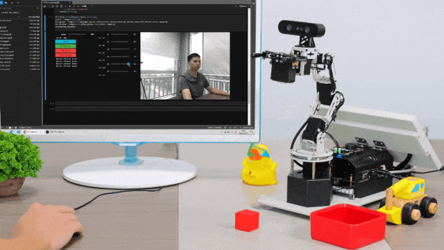
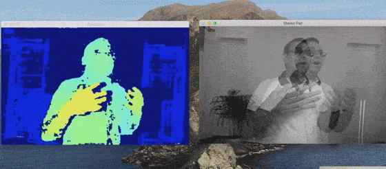
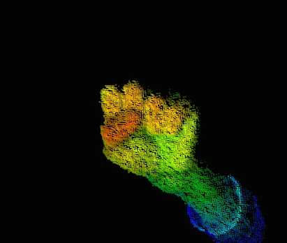
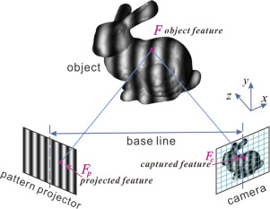
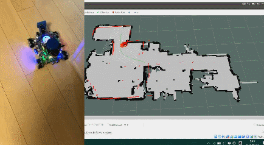
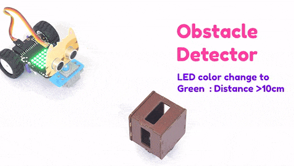
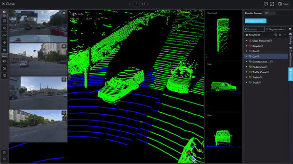

# Cameras, Depth Sensors and LiDAR

### Cameras (2D Imaging) 

<figure><figcaption></figcaption></figure>

Traditional 2D cameras capture images by focusing light onto an electronic sensor (CCD or CMOS), creating a two-dimensional representation of a scene. They excel at providing rich textural and color information, crucial for object recognition and scene interpretation [9](https://www.nature.com/articles/s41598-023-35170-z).

**Key Classification Dimensions:**

* **Sensor Type:** CCD (Charge-Coupled Device) sensors generally offer low noise and global shutter capabilities, while CMOS (Complementary Metal-Oxide-Semiconductor) sensors are known for high-speed readout and lower power consumption.
* **Shutter Type:** Global shutters expose the entire sensor simultaneously, ideal for capturing fast-moving objects without distortion. Rolling shutters expose the sensor line by line, which can be more cost-effective but may introduce artifacts with rapid motion.
* **Color vs. Monochrome:** Monochrome cameras are typically more sensitive to light and can offer higher effective resolution for tasks like metrology. Color cameras provide chromatic information vital for object identification and human-robot interaction [3](https://thinkrobotics.com/blogs/learn/integrating-lidars-and-cameras-for-advanced-robotics-projects).
* **Scan Type:** Area-scan cameras capture an entire frame at once, while line-scan cameras build an image one row of pixels at a time, often used for high-speed inspection of continuous materials.

**Use Cases:** Object detection and classification, visual servoing, barcode reading, surface inspection.\
**Limitations:** Inherently lack direct depth perception; performance can be affected by lighting conditions and shadows.

### Depth Sensors 

Depth sensors, or 3D cameras, are designed to measure the distance to objects within their field of view, creating a depth map that provides the third dimension [7](https://www.brainyneurals.com/choosing-the-right-depth-sensor/). They are crucial for robots to understand spatial relationships, detect obstacles, and navigate [6](https://aivero.com/overview-of-depth-cameras/).

### Stereo Vision Cameras

<figure><figcaption></figcaption></figure>

* **Principle:** Utilize two or more cameras offset by a known baseline. By identifying corresponding points in the images from each camera, the disparity (difference in image location) is calculated. Depth is then computed through triangulation [1](https://www.generationrobots.com/en/205-depth-sensors)[6](https://aivero.com/overview-of-depth-cameras/).
* **Use Cases:** Mobile robot navigation, 3D mapping, precision gripping tasks, object recognition [1](https://www.generationrobots.com/en/205-depth-sensors)[3](https://thinkrobotics.com/blogs/learn/integrating-lidars-and-cameras-for-advanced-robotics-projects).
* **Algorithms:** Block matching, Semi-Global Block Matching (SGBM) for disparity calculation.
* **Pros:** Can distinguish shapes, colors, and movements similarly to human vision; passive sensing (no emitted light); often have a wide field of view [1](https://www.generationrobots.com/en/205-depth-sensors).
* **Cons:** Performance depends on scene texture (struggles with uniform surfaces); can produce false positives or "ghost" readings; accuracy can degrade in poor lighting [1](https://www.generationrobots.com/en/205-depth-sensors).
* **Popular Models:**
  * **Intel® RealSense™ Depth Camera D415 & D457:** Offer high-resolution depth sensing and color imaging. The D415 is suitable for object recognition and 3D reconstruction, while the D457 is known for robust performance [3](https://thinkrobotics.com/blogs/learn/integrating-lidars-and-cameras-for-advanced-robotics-projects).
  * **Orbbec Persee+ 3D Camera Computer:** Integrates a depth sensor with an onboard processing unit for real-time depth data acquisition and on-device processing [3](https://thinkrobotics.com/blogs/learn/integrating-lidars-and-cameras-for-advanced-robotics-projects).

### Time-of-Flight (ToF) Cameras

<figure><figcaption></figcaption></figure>

* **Principle:** Emit pulses of light (typically infrared) and measure the time it takes for the light to reflect off objects and return to the sensor. The round-trip time directly correlates to distance [6](https://aivero.com/overview-of-depth-cameras/)[7](https://www.brainyneurals.com/choosing-the-right-depth-sensor/).
* **Use Cases:** Gesture recognition, augmented reality, obstacle avoidance, real-time depth mapping for dynamic environments.
* **Pros:** Provides direct depth measurement for each pixel; generally performs well in varying lighting conditions and with moving objects.
* **Cons:** Can have lower spatial resolution compared to stereo; accuracy can be affected by highly reflective or absorptive surfaces and multi-path interference.

### Structured Light Cameras

<figure><figcaption></figcaption></figure>

* **Principle:** Project a known pattern of light (e.g., stripes, grids) onto the scene. A camera captures the deformation of this pattern as it strikes object surfaces. Geometric analysis of the deformation allows for depth calculation [7](https://www.brainyneurals.com/choosing-the-right-depth-sensor/).
* **Use Cases:** High-accuracy 3D scanning, industrial inspection, facial recognition.
* **Pros:** Can achieve high depth accuracy, especially at short ranges.
* **Cons:** Active projection can be sensitive to ambient light; performance may degrade on dark or shiny surfaces; projector adds to system complexity and power consumption.

### LiDAR (Light Detection and Ranging) 

<figure><figcaption></figcaption></figure>

LiDAR sensors use laser beams to measure distances to objects, creating a 3D "point cloud" representing the surrounding environment [1](https://www.generationrobots.com/en/205-depth-sensors)[2](https://avantierinc.com/resources/knowledge-center/lidar-for-robotics/). They emit laser pulses and measure the reflected light's travel time to determine distance.

**Types:**

* **1D LiDAR:** Measures distance along a single beam. Used for simple range-finding, collision avoidance, and altitude measurement (e.g., in UAVs) [2](https://avantierinc.com/resources/knowledge-center/lidar-for-robotics/).
* **2D LiDAR:** Scans a single plane (typically horizontally) by rotating a 1D LiDAR or using a spinning mirror. Creates a 2D slice of the environment. Common in indoor mobile robots for navigation and obstacle detection [2](https://avantierinc.com/resources/knowledge-center/lidar-for-robotics/). Popular models include YDLIDAR TG15 Outdoor Lidar and RPLIDAR A2M12 [3](https://thinkrobotics.com/blogs/learn/integrating-lidars-and-cameras-for-advanced-robotics-projects). The DTOF Laser Lidar Sensor STL27L is noted for high accuracy in distance measurement using Direct Time-of-Flight technology [3](https://thinkrobotics.com/blogs/learn/integrating-lidars-and-cameras-for-advanced-robotics-projects).
* **3D LiDAR:** Scans in multiple planes or uses an array of lasers to build a full 3D point cloud. Essential for autonomous vehicles and comprehensive outdoor mapping [2](https://avantierinc.com/resources/knowledge-center/lidar-for-robotics/).
* **Advanced LiDAR:** Includes Flash LiDAR (captures an entire scene with a single flash of light), Optical Phased Arrays (OPA LiDAR), and MEMS (Micro-Electro-Mechanical Systems) LiDAR, which aim for smaller, more robust, and potentially lower-cost solutions [2](https://avantierinc.com/resources/knowledge-center/lidar-for-robotics/).

**Use Cases:** Autonomous navigation, 3D mapping, obstacle detection and avoidance, environmental surveying, object recognition (when fused with camera data) [1](https://www.generationrobots.com/en/205-depth-sensors)[2](https://avantierinc.com/resources/knowledge-center/lidar-for-robotics/).\
**Pros:** High accuracy and precision in distance measurement; reliable performance in various lighting conditions, including darkness; fast data acquisition [1](https://www.generationrobots.com/en/205-depth-sensors)[2](https://avantierinc.com/resources/knowledge-center/lidar-for-robotics/)[3](https://thinkrobotics.com/blogs/learn/integrating-lidars-and-cameras-for-advanced-robotics-projects).\
**Cons:** Cannot detect transparent surfaces like glass or mirrors [1](https://www.generationrobots.com/en/205-depth-sensors); point clouds are typically sparse compared to camera images and lack color/texture information [9](https://www.nature.com/articles/s41598-023-35170-z); performance can be affected by highly reflective or absorptive materials; fewer LiDAR points are captured from faraway regions, potentially reducing detail at a distance [4](https://www.ri.cmu.edu/app/uploads/2019/12/20190716-Chen.pdf).

### Ultrasonic Proximity Sensors 

<figure><figcaption></figcaption></figure>

While not optical, ultrasonic sensors are often used to complement cameras and LiDAR. They emit sound waves and measure the time it takes for echoes to return.\
**Use Cases:** Detecting obstacles that LiDAR might miss, such as glass and mirrors; simple, low-cost proximity detection [1](https://www.generationrobots.com/en/205-depth-sensors).\
**Pros:** Effective for detecting transparent or acoustically reflective surfaces.\
**Cons:** Lower resolution and range compared to LiDAR and cameras; susceptible to variations in air temperature and humidity, and soft materials that absorb sound.

### Sensor Fusion: Integrating Cameras, Depth Sensors, and LiDAR 

<figure><figcaption></figcaption></figure>

Sensor fusion is the process of combining data from multiple sensors to achieve a more accurate, complete, and reliable understanding of the environment than any single sensor could provide [3](https://thinkrobotics.com/blogs/learn/integrating-lidars-and-cameras-for-advanced-robotics-projects)[8](https://mindkosh.com/blog/lidar-sensor-fusion-in-autonomous-systems/). Cameras provide rich semantic information (color, texture) but lack direct depth, while LiDAR offers precise depth but sparse, uncolored data [9](https://www.nature.com/articles/s41598-023-35170-z). Depth cameras bridge some of this gap but have their own limitations.

**Benefits of Fusion:**

* **Enhanced Object Recognition:** Cameras identify objects by appearance, while LiDAR provides their precise 3D shape and location. Fusion leads to more robust recognition [3](https://thinkrobotics.com/blogs/learn/integrating-lidars-and-cameras-for-advanced-robotics-projects)[5](https://xray.greyb.com/lidar/sensor-fusion-of-lidar).
* **Improved Scene Understanding:** LiDAR's spatial map combined with a camera's visual context allows robots to build a comprehensive model of the scene [3](https://thinkrobotics.com/blogs/learn/integrating-lidars-and-cameras-for-advanced-robotics-projects).
* **Accurate 3D Reconstruction:** Combining camera imagery with LiDAR's precise depth measurements results in highly accurate 3D models of the environment [3](https://thinkrobotics.com/blogs/learn/integrating-lidars-and-cameras-for-advanced-robotics-projects).
* **Increased Robustness and Redundancy:** If one sensor fails or performs poorly in certain conditions (e.g., LiDAR with glass, camera in low light), data from other sensors can compensate [8](https://mindkosh.com/blog/lidar-sensor-fusion-in-autonomous-systems/).

**Technical Aspects of Fusion:**

* **Sensor Calibration (Extrinsic & Intrinsic):** Meticulously aligning the coordinate systems of different sensors to ensure their data corresponds to the same physical points in space [3](https://thinkrobotics.com/blogs/learn/integrating-lidars-and-cameras-for-advanced-robotics-projects)[5](https://xray.greyb.com/lidar/sensor-fusion-of-lidar). This involves determining the precise 3D position and orientation of each sensor relative to others and correcting for internal lens distortions in cameras.
* **Data Synchronization:** Ensuring that data streams from all sensors are timestamped and aligned temporally, so the fused information reflects the state of the environment at the same instant [3](https://thinkrobotics.com/blogs/learn/integrating-lidars-and-cameras-for-advanced-robotics-projects).
* **Data Fusion Algorithms:** Sophisticated algorithms are used to combine sensor data at different levels:
  * **Low-Level (Early) Fusion:** Raw sensor data or minimally processed data is combined before feature extraction. For example, projecting LiDAR points onto a camera image to create a dense depth map with color [4](https://www.ri.cmu.edu/app/uploads/2019/12/20190716-Chen.pdf)[9](https://www.nature.com/articles/s41598-023-35170-z).
  * **Mid-Level Fusion:** Features extracted independently from each sensor (e.g., edges from images, planes from point clouds) are fused.
  * **High-Level (Late) Fusion:** Each sensor independently performs object detection or scene interpretation, and these interpretations are then combined.
  * Techniques include Kalman filtering, Bayesian networks, deep learning approaches (e.g., Siamese networks for fusing RGB and depth features [9](https://www.nature.com/articles/s41598-023-35170-z)), and probabilistic methods [3](https://thinkrobotics.com/blogs/learn/integrating-lidars-and-cameras-for-advanced-robotics-projects).
* **Computational Resources:** Processing and fusing data from multiple high-bandwidth sensors in real-time requires significant computational power [3](https://thinkrobotics.com/blogs/learn/integrating-lidars-and-cameras-for-advanced-robotics-projects).

**Core Algorithms Used with These Sensors:**

* **SLAM (Simultaneous Localization and Mapping):** Algorithms like GMapping, Hector SLAM, Cartographer, LOAM, and ORB-SLAM use data from LiDAR and/or cameras (including depth cameras) to build a map of an unknown environment while simultaneously tracking the robot's position within it.
* **Point Cloud Processing:** Includes filtering (e.g., voxel grid, statistical outlier removal), segmentation (e.g., Euclidean clustering, RANSAC for plane fitting), and registration (e.g., Iterative Closest Point - ICP, Normal Distributions Transform - NDT) to align multiple point clouds.
* **Object Detection and Tracking:** Deep learning models like YOLO, SSD, and Mask R-CNN are often applied to camera images, and their outputs can be fused with 3D data for robust tracking and interaction.
