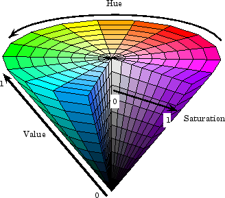
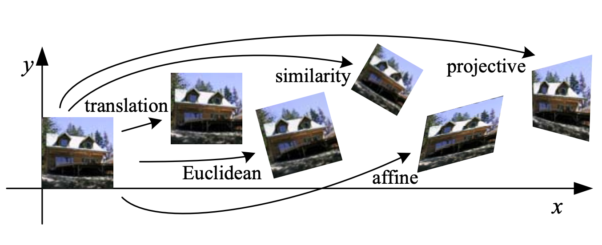
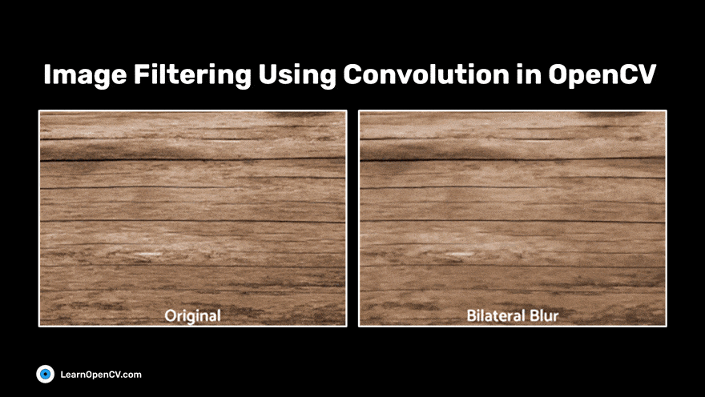
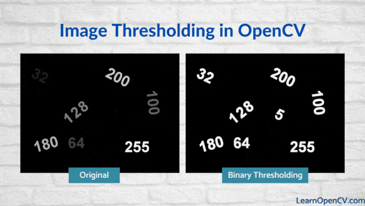
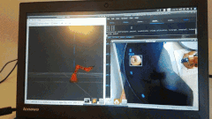

# Image Processing Basics (OpenCV)

## Image Processing Basics with OpenCV <a href="#image-processing-basics-with-opencv" id="image-processing-basics-with-opencv"></a>

OpenCV (Open Source Computer Vision Library) is a powerful, open-source library widely used for image and video processing, computer vision, and machine learning. It provides a rich set of functions for manipulating images, detecting features, performing transformations, and much more. Below is an overview of essential image processing concepts in OpenCV, along with Python code snippets and useful references to get started.

### 1. Reading, Displaying, and Writing Images <a href="#id-1-reading-displaying-and-writing-images" id="id-1-reading-displaying-and-writing-images"></a>

Before processing, you need to load images into your program, display them for visualization, and save results.

```
pythonimport cv2

# Read an image from file
image = cv2.imread('path_to_image.jpg')

# Display the image in a window
cv2.imshow('Original Image', image)
cv2.waitKey(0)  # Wait for a key press to close the window
cv2.destroyAllWindows()

# Save the image to disk
cv2.imwrite('output_image.jpg', image)
```

* `cv2.imread()` loads the image into a NumPy array.
* `cv2.imshow()` creates a window to display the image.
* `cv2.waitKey(0)` waits indefinitely for a key press.
* `cv2.imwrite()` saves the image to a file.

**Reference:** [OpenCV Tutorial: Read, Display and Write an Image](https://learnopencv.com/read-display-and-write-an-image-using-opencv/)

### 2. Color Space Conversion <a href="#id-2-color-space-conversion" id="id-2-color-space-conversion"></a>

<figure><figcaption></figcaption></figure>

Many image processing tasks require converting images between color spaces, e.g., from BGR (OpenCV default) to grayscale.

```
python# Convert BGR image to grayscale
gray_image = cv2.cvtColor(image, cv2.COLOR_BGR2GRAY)

cv2.imshow('Grayscale Image', gray_image)
cv2.waitKey(0)
cv2.destroyAllWindows()
```

Grayscale images simplify processing by reducing channels to one intensity channel.

**Reference:** [OpenCV-Python Tutorials: Color Space Conversion](https://docs.opencv.org/4.x/d6/d00/tutorial_py_root.html)

### 3. Geometric Transformations <a href="#id-3-geometric-transformations" id="id-3-geometric-transformations"></a>

###  <a href="#id-4-image-filtering-and-smoothing" id="id-4-image-filtering-and-smoothing"></a>

You can perform image rotation, translation, scaling, and affine transformations.

```
pythonimport numpy as np

# Get image dimensions
(h, w) = image.shape[:2]

# Define rotation matrix to rotate image by 45 degrees around center
M = cv2.getRotationMatrix2D((w//2, h//2), 45, 1.0)

# Apply affine warp
rotated = cv2.warpAffine(image, M, (w, h))

cv2.imshow('Rotated Image', rotated)
cv2.waitKey(0)
cv2.destroyAllWindows()
```

**Reference:** [OpenCV Image Processing Tutorial](https://docs.opencv.org/4.x/d2/d96/tutorial_py_table_of_contents_imgproc.html)

### 4. Image Filtering and Smoothing <a href="#id-4-image-filtering-and-smoothing" id="id-4-image-filtering-and-smoothing"></a>

<figure><figcaption></figcaption></figure>

Filters reduce noise or extract features. Common filters include blurring and sharpening.

```
python# Gaussian Blur
blurred = cv2.GaussianBlur(image, (7, 7), 0)

cv2.imshow('Blurred Image', blurred)
cv2.waitKey(0)
cv2.destroyAllWindows()

# Sharpening using kernel
kernel = np.array([[0, -1, 0],
                   [-1, 5,-1],
                   [0, -1, 0]])
sharpened = cv2.filter2D(image, -1, kernel)

cv2.imshow('Sharpened Image', sharpened)
cv2.waitKey(0)
cv2.destroyAllWindows()
```

**Reference:** [Image Processing in OpenCV](https://docs.opencv.org/4.x/d2/d96/tutorial_py_table_of_contents_imgproc.html)

### 5. Thresholding and Binarization <a href="#id-5-thresholding-and-binarization" id="id-5-thresholding-and-binarization"></a>

<figure><figcaption></figcaption></figure>

Convert grayscale images into binary images to segment objects.

```
python# Global thresholding
_, thresh = cv2.threshold(gray_image, 127, 255, cv2.THRESH_BINARY)

cv2.imshow('Thresholded Image', thresh)
cv2.waitKey(0)
cv2.destroyAllWindows()

# Adaptive thresholding for varying lighting
adaptive_thresh = cv2.adaptiveThreshold(gray_image, 255,
                                        cv2.ADAPTIVE_THRESH_GAUSSIAN_C,
                                        cv2.THRESH_BINARY, 11, 2)

cv2.imshow('Adaptive Threshold', adaptive_thresh)
cv2.waitKey(0)
cv2.destroyAllWindows()
```

**Reference:** [OpenCV Thresholding Tutorial](https://docs.opencv.org/4.x/d7/d4d/tutorial_py_thresholding.html)

### 6. Edge Detection <a href="#id-6-edge-detection" id="id-6-edge-detection"></a>

<figure><figcaption></figcaption></figure>

Detect edges using algorithms like Canny edge detector.

```
pythonedges = cv2.Canny(gray_image, 100, 200)

cv2.imshow('Edges', edges)
cv2.waitKey(0)
cv2.destroyAllWindows()
```

**Reference:** [OpenCV Canny Edge Detection](https://docs.opencv.org/4.x/da/d22/tutorial_py_canny.html)

### 7. Contour Detection and Object Counting <a href="#id-7-contour-detection-and-object-counting" id="id-7-contour-detection-and-object-counting"></a>

<figure><figcaption></figcaption></figure>

Contours are curves joining continuous points with the same intensity. Useful for shape analysis and object counting.

```
python# Find contours
contours, _ = cv2.findContours(thresh, cv2.RETR_EXTERNAL, cv2.CHAIN_APPROX_SIMPLE)

# Draw contours
output = image.copy()
cv2.drawContours(output, contours, -1, (0, 255, 0), 2)

print(f"Number of objects detected: {len(contours)}")

cv2.imshow('Contours', output)
cv2.waitKey(0)
cv2.destroyAllWindows()
```

**Reference:** [PyImageSearch: Counting Objects with Contours](https://pyimagesearch.com/2018/07/19/opencv-tutorial-a-guide-to-learn-opencv/)

### 8. Feature Detection and Description <a href="#id-8-feature-detection-and-description" id="id-8-feature-detection-and-description"></a>

<figure><figcaption></figcaption></figure>

OpenCV supports feature detectors like SIFT, SURF, ORB for matching and recognition.

```
python# Initialize ORB detector
orb = cv2.ORB_create()

# Detect keypoints and descriptors
keypoints, descriptors = orb.detectAndCompute(gray_image, None)

# Draw keypoints
output = cv2.drawKeypoints(image, keypoints, None, color=(0,255,0))

cv2.imshow('ORB Keypoints', output)
cv2.waitKey(0)
cv2.destroyAllWindows()
```

**Reference:** [OpenCV Feature Detection](https://docs.opencv.org/4.x/d1/d89/tutorial_py_orb.html)

### 9. Video Processing Basics <a href="#id-9-video-processing-basics" id="id-9-video-processing-basics"></a>

OpenCV can capture and process video streams from cameras.

```
pythoncap = cv2.VideoCapture(0)  # Open default camera

while True:
    ret, frame = cap.read()
    if not ret:
        break

    gray = cv2.cvtColor(frame, cv2.COLOR_BGR2GRAY)
    cv2.imshow('Video Feed - Grayscale', gray)

    if cv2.waitKey(1) & 0xFF == ord('q'):
        break

cap.release()
cv2.destroyAllWindows()
```

**Reference:** [OpenCV Video I/O Tutorial](https://docs.opencv.org/4.x/dd/d43/tutorial_py_video_display.html)

## Summary <a href="#summary" id="summary"></a>

OpenCV provides a comprehensive set of tools to perform image processing, from basic operations like reading and displaying images to advanced techniques like feature detection, segmentation, and video analysis. The library’s Python bindings make it accessible for rapid prototyping and deployment.

### Further Learning Resources

* Official OpenCV Python Tutorials: [https://docs.opencv.org/4.x/d6/d00/tutorial\_py\_root.html](https://docs.opencv.org/4.x/d6/d00/tutorial_py_root.html)
* PyImageSearch OpenCV Guide: [https://pyimagesearch.com/2018/07/19/opencv-tutorial-a-guide-to-learn-opencv/](https://pyimagesearch.com/2018/07/19/opencv-tutorial-a-guide-to-learn-opencv/)
* OpenCV Documentation: [https://docs.opencv.org/4.x/](https://docs.opencv.org/4.x/)
* OpenCV Video Tutorials by Rob Mulla: [https://www.youtube.com/watch?v=kSqxn6zGE0c](https://www.youtube.com/watch?v=kSqxn6zGE0c)
* DataCamp OpenCV Tutorial: [https://www.datacamp.com/tutorial/opencv-tutorial](https://www.datacamp.com/tutorial/opencv-tutorial)
