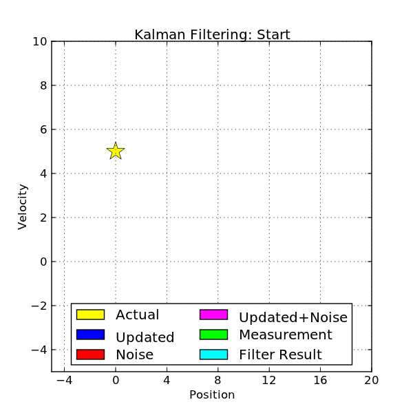
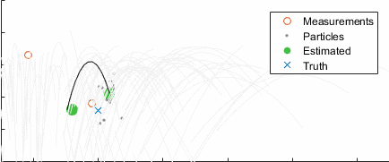
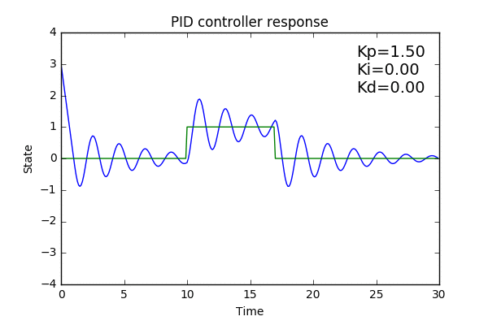
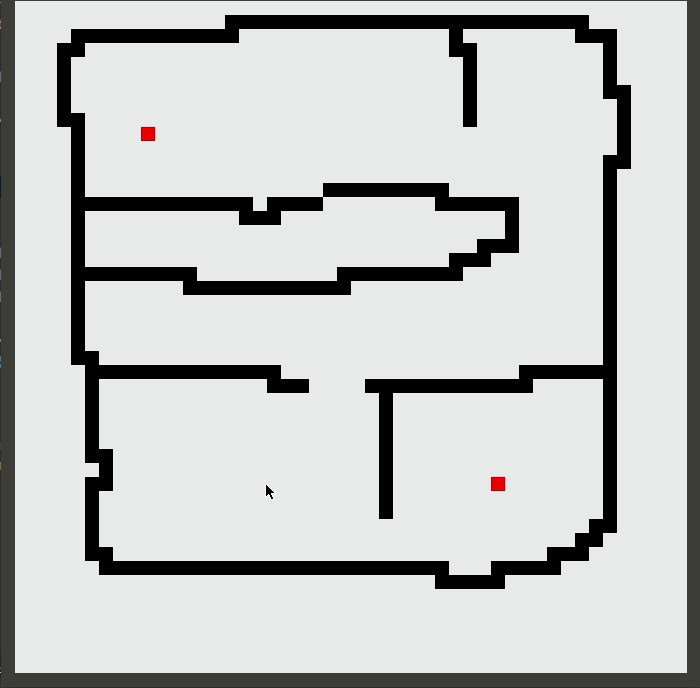
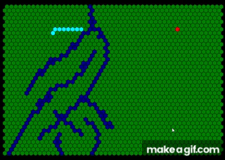
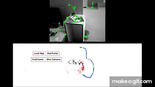
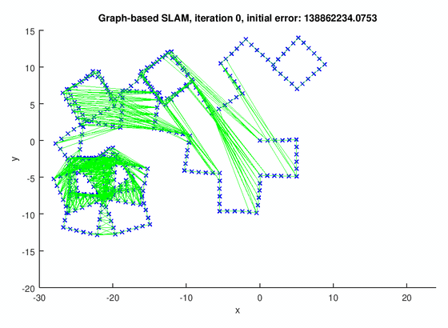
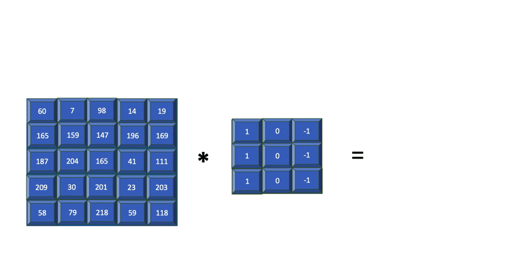
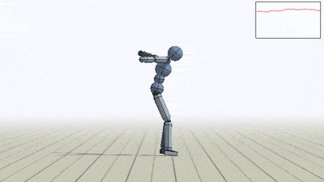

# Algorithms

Robotics systems rely on a rich toolbox of algorithms for sensing, estimation, control, planning and perception. Below is a comprehensive survey-organized by function-of core methods used in modern robots, with links to further reading.

### Filtering & State Estimation <a href="#filtering--state-estimation" id="filtering--state-estimation"></a>



<figure><figcaption><p>Kalman FIlter</p></figcaption></figure>

* **Kalman Filter**: Optimal linear estimator for fusing motion models and noisy measurements (e.g., IMU + odometry)\
  [https://www.vaia.com/en-us/explanations/engineering/robotics-engineering/robotics-algorithms/](https://www.vaia.com/en-us/explanations/engineering/robotics-engineering/robotics-algorithms/)
* **Extended Kalman Filter (EKF)**: Nonlinear extension of the Kalman Filter for mapping and SLAM\
  [https://www.mdpi.com/2504-446X/7/6/339](https://www.mdpi.com/2504-446X/7/6/339)
* **Unscented Kalman Filter (UKF)**: Deterministic sampling approach to nonlinear state estimation\
  [https://www.mdpi.com/2504-446X/7/6/339](https://www.mdpi.com/2504-446X/7/6/339)
* **Particle Filter / Monte Carlo Localization**: Uses a set of random samples (particles) to represent arbitrary distributions for robot pose\
  [https://arxiv.org/pdf/1301.0607.pdf](https://arxiv.org/pdf/1301.0607.pdf)
* **FastSLAM / Rao–Blackwellized Particle Filter**: Combines particle filters with per-feature Kalman filters for efficient SLAM\
  [https://arxiv.org/pdf/1301.0607.pdf](https://arxiv.org/pdf/1301.0607.pdf)
* **Moving Average & Savitzky–Golay Filters**: Simple smoothing techniques for sensor signal conditioning
* **Butterworth & Chebyshev Filters**: Frequency-domain filters for removing high-frequency noise

### Control & Trajectory Tracking <a href="#control--trajectory-tracking" id="control--trajectory-tracking"></a>

<figure><figcaption></figcaption></figure>

<figure><figcaption><p>PID Based Balancer</p></figcaption></figure>

* **PID (Proportional–Integral–Derivative)**: Ubiquitous feedback controller for setpoint tracking
* **LQR (Linear Quadratic Regulator)**: Optimal state-feedback controller minimizing a quadratic cost
* **MPC (Model Predictive Control)**: Online optimization of control signals subject to constraints
* **H∞ Control**: Robust control design against modeling uncertainties
* **Feedforward / Inverse Dynamics**: Calculates required joint torques for planned accelerations

### Path Planning & Navigation <a href="#path-planning--navigation" id="path-planning--navigation"></a>

<figure><figcaption></figcaption></figure>

<figure><figcaption><p>A* Algorithm</p></figcaption></figure>

* **Dijkstra’s Algorithm**: Guaranteed shortest paths on weighted graphs
* **A★ (A-Star)**: Heuristic search combining Dijkstra with best-first bias for efficient grid and graph planning\
  [https://roboticsbiz.com/path-planning-algorithms-for-robotic-systems/](https://roboticsbiz.com/path-planning-algorithms-for-robotic-systems/)
* **D★ / D★ Lite**: Incremental replanning in dynamic or partially known environments\
  [https://roboticsbiz.com/path-planning-algorithms-for-robotic-systems/](https://roboticsbiz.com/path-planning-algorithms-for-robotic-systems/)
* **RRT (Rapidly-Exploring Random Trees)**: Sampling-based planner for high-dimensional spaces\
  [https://roboticsbiz.com/path-planning-algorithms-for-robotic-systems/](https://roboticsbiz.com/path-planning-algorithms-for-robotic-systems/)
* **PRM (Probabilistic Roadmap)**: Builds a graph of collision-free configurations offline for query planning
* **RRT★ / PRM★**: Asymptotically optimal variants of RRT and PRM
* **Genetic Algorithms**: Evolutionary search for path optimization in complex cost landscapes
* **Ant Colony Optimization**: Swarm-intelligence-inspired heuristic for shortest path discovery\
  [https://roboticsbiz.com/path-planning-algorithms-for-robotic-systems/](https://roboticsbiz.com/path-planning-algorithms-for-robotic-systems/)
* **Firefly & Particle Swarm Optimization**: Nature-inspired metaheuristics for global path and parameter tuning

### SLAM & Mapping <a href="#slam--mapping" id="slam--mapping"></a>

<figure><figcaption></figcaption></figure>

<figure><figcaption><p>GRAPH SLAM</p></figcaption></figure>

<figure><figcaption><p>ORB SLAM</p></figcaption></figure>

* **EKF-SLAM**: Maps landmarks with Gaussian estimates via EKF
* **Graph-SLAM**: Poses and landmarks jointly optimized in a large factor graph
* **FastSLAM**: Leverages particle filters for robot pose and separate Kalman filters for landmarks\
  [https://arxiv.org/pdf/1301.0607.pdf](https://arxiv.org/pdf/1301.0607.pdf)
* **ORB-SLAM / LSD-SLAM**: Visual SLAM systems using ORB features or direct image alignment

### Optimization & Numerical Methods <a href="#optimization--numerical-methods" id="optimization--numerical-methods"></a>

* **Gauss–Newton & Levenberg–Marquardt**: Nonlinear least-squares solvers for bundle adjustment, calibration, and pose-graph optimization. See [GO-SLAM](../authors-projects/go-slam.md) for an implementation from scratch.
* **Gradient Descent & Stochastic Gradient Descent**: Iterative minimization for learning and control parameter tuning
* **Convex Optimization (CVX, CVXPY)**: Fast solvers for quadratic and semidefinite programs in control and state estimation
* **Trajectory Optimization (iLQR, DDP)**: Nonlinear optimization of state-action trajectories — the math behind MPC for robotics
* **Constraint Programming (CP-SAT, OR-Tools)**: Discrete optimization for task sequencing, scheduling. See [LEAP](../authors-projects/leap.md) for asymmetric TSP pick-and-place.
* **Factor Graphs (g2o, GTSAM, Ceres)**: Library-backed graph optimization — the modern way to solve SLAM, calibration, and sensor fusion. See [Optimization Libraries](optimization-libraries.md).

### Pseudocode: Core Algorithms

**A\* search** (grid path planning):

```python
def a_star(start, goal, neighbors_fn, h_fn):
    open_set = PriorityQueue()
    open_set.put((0, start))
    came_from, g_score = {}, {start: 0}
    while not open_set.empty():
        _, current = open_set.get()
        if current == goal:
            return reconstruct_path(came_from, current)
        for nb, cost in neighbors_fn(current):
            tentative = g_score[current] + cost
            if tentative < g_score.get(nb, float('inf')):
                came_from[nb] = current
                g_score[nb] = tentative
                f = tentative + h_fn(nb, goal)
                open_set.put((f, nb))
    return None  # no path
```

**Kalman filter** (1D linear):

```python
def kf_step(x, P, u, z, A, B, H, Q, R):
    # Predict
    x = A @ x + B @ u
    P = A @ P @ A.T + Q
    # Update
    y = z - H @ x                  # innovation
    S = H @ P @ H.T + R
    K = P @ H.T @ np.linalg.inv(S) # Kalman gain
    x = x + K @ y
    P = (np.eye(len(x)) - K @ H) @ P
    return x, P
```

**RRT** (sampling-based motion planning):

```python
def rrt(start, goal, sample_fn, steer_fn, collision_free, max_iter=5000):
    tree = {start: None}
    for _ in range(max_iter):
        q_rand = sample_fn()
        q_near = nearest(tree, q_rand)
        q_new  = steer_fn(q_near, q_rand)
        if collision_free(q_near, q_new):
            tree[q_new] = q_near
            if dist(q_new, goal) < goal_tol:
                return reconstruct(tree, q_new)
    return None
```

### Perception & Computer Vision <a href="#perception--computer-vision" id="perception--computer-vision"></a>

<figure><figcaption></figcaption></figure>

* **SIFT / SURF / ORB**: Feature detection and description for landmark recognition and place recognition
* **FAST & Shi–Tomasi Corner Detectors**: Lightweight keypoint extractors for real-time tracking
* **Lucas–Kanade & Horn–Schunck Optical Flow**: Dense and sparse methods for image motion estimation
* **RANSAC**: Robust model fitting (e.g., fundamental matrix estimation) in the presence of outliers
* **CNNs (Convolutional Neural Networks)**: Deep learning models for object detection and semantic segmentation
* **YOLO / SSD / Mask R-CNN**: Real-time detection and instance segmentation frameworks

### Machine Learning & AI <a href="#machine-learning--ai" id="machine-learning--ai"></a>

<figure><figcaption></figcaption></figure>

* **Reinforcement Learning (Q-Learning, DQN, PPO, SAC)**: Autonomous policy learning from interaction rewards
* **Imitation Learning (BC, DAgger, ACT, Diffusion Policy)**: Learning policies from human demonstrations — the dominant 2024-2026 paradigm for manipulation
* **Foundation Models / VLAs (RT-2, OpenVLA, π0)**: Vision-language-action models pretrained at scale, generalist robot policies
* **Gaussian Processes**: Nonparametric models for regression and uncertainty quantification in terrain modeling
* **Support Vector Machines (SVM)**: Classification of sensor or vision data in low-dimensional feature spaces

For a deep dive on modern robot learning — imitation, RL, foundation models, world models, sim-to-real — see the [Robot Learning](../robot-learning/robot-learning.md) section.

By combining these algorithms-choosing the right filter for robust sensing, the optimal controller for precise motion, and the most suitable planner for agile navigation-robots can perceive, plan, and act reliably in complex, dynamic environments.
