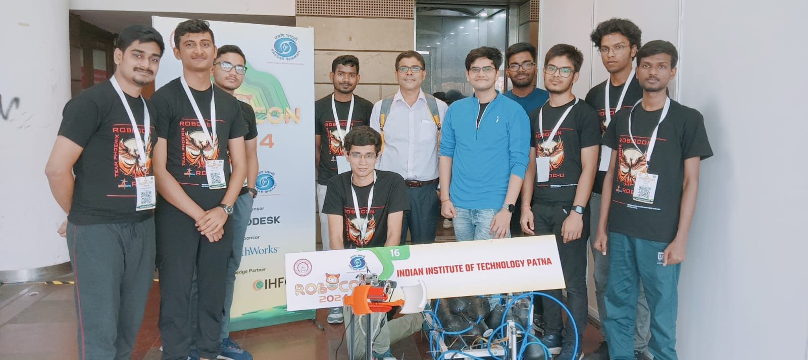

# Authors Note

<figure><figcaption></figcaption></figure>

The idea to make a full fledged and hosted Guide for Robotics and it's associated concepts sparked off when a few juniors asked me for resources.\
\
I hope this will help greatly in knowledge transfer and newer generations both in IITP and outside to get to grips with robotics and not get lost in the process. I draw inspiration greatly from the Robocon Team which I once led and my Juniors toil at. These are some of the most passionate and hard working people on campus. Participating in Robocon had been that way, when I came to campus there was an utter lack of knowledge transfer, no support from the curriculum and I had to learn all on my own, help out the others. With this, I hope my juniors will have an easy time and get tremendous help in testing out new technologies/mechanisms and train the future generations.\
\
I would like to thank Atul Sir whose lecture materials and knowledge have trickled down into making this guide, especially the Kinematics Part, Yuvaraj Sir, Members of the BRAIn Lab and The Robocon Team for proofreading.

If you wish to help or collaborate/sponsor the Robocon Team please connect&#x20;

<a href="mailto:robocon@iitp.ac.in?cc=panav_2101ee48@iitp.ac.in" class="button primary">Mail to me and the Team for Collaboration </a>

If you wish to collaborate on maintaining this guide or further opportunities please convey over  <a href="mailto:panav_2101ee48@iitp.ac.in?cc=praajarpit@gmail.com" class="button primary">Mail Panav (me)</a> or <a href="https://www.linkedin.com/in/panavraaj/" class="button primary">Connect with me on LinkedIn</a>\
\
You can also reach out to BRAIn lab and Atul Sir for research/funding related opportunities <a href="mailto:athakur@iitp.ac.in?cc=panav_2101ee48@iitp.ac.in" class="button primary">Mail Atul Sir</a>&#x20;

Robocon and Rover Team Site : <a href="https://robocon-iit-patna.github.io" class="button primary">Robocon and Rover Team IIT Patna</a>

***

### Find me online

I'm currently a Robotics Engineer at **Eternal.ag** (Bangalore), working on GPU-accelerated SLAM and Navigation on Jetson Orin. Before that, I was at **10xConstruction.ai** (Swerve-drive MPPI, custom Nav2 collision-monitor, Lichtblick visualization) and **Addverb Technologies** (AMR localization/mapping).

* 🌐 Portfolio — [panav.netlify.app](https://panav.netlify.app)
* 💻 GitHub — [github.com/Pana1v](https://github.com/Pana1v)
* 💼 LinkedIn — [linkedin.com/in/panavraaj](https://www.linkedin.com/in/panavraaj/)

### My open-source robotics work

If you want to see how the concepts in this handbook translate to shipped code, the [Author's Projects](../authors-projects/) section walks through them in depth:

* **[Polka](../authors-projects/polka.md)** — ROS 2 multi-LiDAR fusion node (CUDA-accelerated, IMU-deskewed, Humble + Jazzy).
* **[GO-SLAM](../authors-projects/go-slam.md)** — A full SLAM stack built from scratch (GICP front-end, pose-graph back-end, custom Levenberg–Marquardt solvers, KITTI-benchmarked).
* **[LEAP](../authors-projects/leap.md)** — Learning-augmented exact optimization for asymmetric pick-and-place sequencing (BRAIn Lab, IIT Patna; manuscript in preparation).
* **[BARN Challenge 2026](../authors-projects/barn-challenge.md)** — Breadcrumb Explorer for mapless navigation; highest score by an Indian team since the benchmark began.

I also contribute to [Nav2](https://github.com/ros-navigation/navigation2), [PlotJuggler](https://github.com/facontidavide/PlotJuggler), and [Lichtblick](https://github.com/Lichtblick-Suite/lichtblick).

