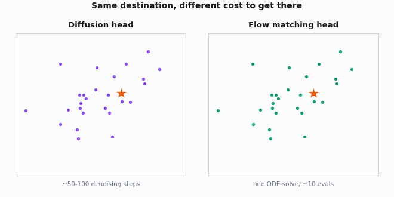
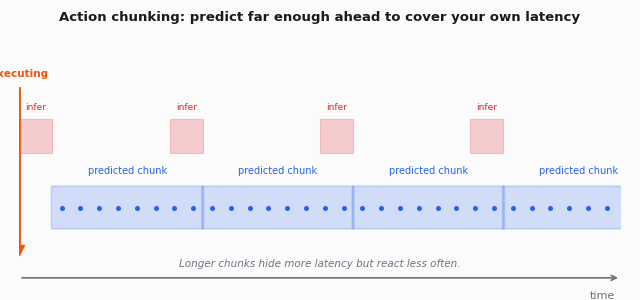

# Foundation Models & Vision-Language-Action (VLA) Models

In 2022, the idea that you could pretrain one neural network on a giant mix of robot data and then fine-tune it for any task was speculative. In 2026, it is the default research direction across most major robotics labs. Whether it is the *production* default depends on who you ask and how patient your customers are.

This page covers the **VLA paradigm**: models that take vision + language as input and emit robot actions. It is the direction the field is most excited about and the direction most likely to be oversold.

## What is a VLA?

A Vision-Language-Action model is a single neural network that:

1. Takes one or more **images** (RGB, sometimes depth) as input.
2. Takes a **language instruction** ("pick up the red cup and put it on the plate").
3. Optionally takes **proprioception** (joint positions, gripper state).
4. Emits **robot actions** (end-effector deltas, joint targets, gripper commands).

Architecturally, almost all VLAs in 2026 follow the same template:

```
[Image] --[Vision Encoder, e.g. ViT, SigLIP]--> tokens
[Text]  --[Text Tokenizer]--> tokens
        --> [Transformer LLM backbone (Llama, PaLM-E, Pi base, etc.)]
        --> Action head (regression, autoregressive tokens, diffusion, or flow matching)
        --> [Action chunk for next ~1 second]
```

The "language model as policy backbone" framing is the big idea. You take a pretrained multimodal LLM and either:

- **Discretize actions into tokens** and let the LLM autoregress over them (RT-2 style), or
- **Replace the language head with an action decoder** (OpenVLA, π0 style), trained on robot demonstrations.

## A brief lineage

The order matters because each model fixed problems in the previous one.

### RT-1 (Google/Everyday Robots, 2022)

Brohan et al., *"RT-1: Robotics Transformer for Real-World Control at Scale"*. [https://arxiv.org/abs/2212.06817](https://arxiv.org/abs/2212.06817)

The first scaled-up version of "tokenize everything, transformer in the middle." 130k demonstrations across 700+ tasks, single policy, 35Hz inference. Not a foundation model in the modern sense (the encoder was not pretrained on web data), but the architectural ancestor.

### RT-2 (Google DeepMind, 2023)

Brohan et al., *"RT-2: Vision-Language-Action Models Transfer Web Knowledge to Robotic Control"*. [https://arxiv.org/abs/2307.15818](https://arxiv.org/abs/2307.15818)

The model that defined the term "VLA." Took a pretrained vision-language model (PaLI-X / PaLM-E), fine-tuned on robot data with actions encoded as text tokens. The big result: emergent capabilities from web pretraining transferred to manipulation (e.g., understanding "move the dinosaur to the red object" even when no demo showed dinosaurs).

### Open X-Embodiment / RT-X (2023)

Padalkar, Pooley et al., *"Open X-Embodiment: Robotic Learning Datasets and RT-X Models"*. [https://arxiv.org/abs/2310.08864](https://arxiv.org/abs/2310.08864)

Project: [https://robotics-transformer-x.github.io/](https://robotics-transformer-x.github.io/)

A collaboration of 30+ labs pooling robot data into one dataset (~1M trajectories across 22 embodiments). The dataset became the standard pretraining corpus for everything that followed. RT-X (RT-1-X, RT-2-X) was the demo: train a single model on all that data, get better cross-embodiment transfer.

### OpenVLA (Stanford, 2024)

Kim, Pertsch, Karamcheti et al. [https://openvla.github.io/](https://openvla.github.io/)
Paper: [https://arxiv.org/abs/2406.09246](https://arxiv.org/abs/2406.09246)

The first competitive open-weights VLA. 7B params, built on Llama-2 + SigLIP + DINOv2 fusion. Trained on Open X-Embodiment. Released weights, code, fine-tuning recipes.

OpenVLA is what most people in 2025-2026 actually start with because (a) weights are open, (b) the codebase is reasonable, (c) the LoRA fine-tuning recipes work on a single A100.

### Octo (Berkeley, 2024)

Octo Team. [https://octo-models.github.io/](https://octo-models.github.io/)
Paper: [https://arxiv.org/abs/2405.12213](https://arxiv.org/abs/2405.12213)

Berkeley's open VLA. Smaller (Octo-Base is ~93M params, Octo-Small ~27M), uses diffusion action heads instead of discrete tokens. Designed for fast fine-tuning and inference. Less flashy than OpenVLA but often a better default for hardware-constrained deployments.

### π0 / π0.5 / π0-FAST (Physical Intelligence, 2024-2026)

Black, Brown, Driess, Esmail, et al. [https://www.physicalintelligence.company/blog/pi0](https://www.physicalintelligence.company/blog/pi0)

π0 introduced **flow matching action heads** - instead of autoregressive token sampling or diffusion denoising, generate the action chunk via a single ODE solve. Order of magnitude faster inference at similar quality. Pretrained on a substantially larger and more diverse robot dataset than what was public at the time.

π0.5 (2025) extended to long-horizon mobile manipulation with open-ended language instructions ("clean the kitchen") - including some of the most impressive autonomous home demonstrations to date.

The lineage has since continued: π\*0.6 (late 2025) added reinforcement learning from real-world experience on top of the π0.5 recipe, and π0.7 (April 2026) is PI's current flagship - a steerable generalist model with a claimed step-change in generalization. Neither has open weights as of mid-2026.

**OpenPi** [https://github.com/Physical-Intelligence/openpi](https://github.com/Physical-Intelligence/openpi) is the open release of π0-base + fine-tuning code. As of 2026 this is the strongest open-weights VLA and what I would build on if starting today.

### Other 2024-2026 VLAs worth knowing

| Model | Org | Distinguishing feature | Open weights? |
|---|---|---|---|
| **RDT-1B** | Tsinghua | 1B diffusion VLA, bimanual focus | Yes |
| **GR00T N1 / N1.5** | NVIDIA | Humanoid-first VLA, system-1 + system-2 split | Partial |
| **HPT** | MIT (Wang et al.) | Heterogeneous robot transformer | Yes |
| **CogACT** | Microsoft | VLM + diffusion action head | Yes |
| **Helix** | Figure AI | Humanoid VLA | No (closed) |
| **TinyVLA** | Various | Compressed VLAs <1B params | Some |

## How VLAs are trained

Three stages, all of which matter:

### Stage 1: Vision-language pretraining

Take an off-the-shelf vision-language model (Llama-2 + SigLIP for OpenVLA, PaLM-E for RT-2, internal model for π0). This is the bulk of the "world knowledge." Skip this and your VLA is just a slightly fancier ACT.

### Stage 2: Robot pretraining

Fine-tune on a large mix of robot data: Open X-Embodiment + DROID + internal data. ~1M+ trajectories. Action representation matters a lot here:

- **Discretized action tokens** (RT-2, OpenVLA) - easy to plug into LLM training, but lossy.
- **Continuous action diffusion** (Octo, CogACT) - better fidelity, slower inference.
- **Flow matching** (π0) - best of both, currently SOTA.

### Stage 3: Task-specific fine-tuning

You collect 50-500 demos of your specific task on your specific robot, fine-tune the base VLA. This is where you actually deploy.

LoRA fine-tuning works well - you do not need to update the full 7B params, a few hundred million LoRA params is enough for downstream tasks.

## Data scale, very roughly

For context - what "internet-scale robot data" actually means:

| Dataset / model | Trajectories | Robot-hours (approx) | Notes |
|---|---|---|---|
| RT-1 internal | 130k | ~17k | EveryDay Robots fleet, ~17 months |
| Open X-Embodiment | 1M+ across 22 robot types | not reported | Aggregated from 60 datasets, 34 labs |
| DROID | 76k | ~350 | Single-arm Franka, large scene diversity |
| BridgeData V2 | 60k | ~140 | Berkeley, WidowX |
| Physical Intelligence π0 internal | not disclosed | ~10k (per π0 paper) | 7 robot configurations, 68 tasks + OXE; largest non-public corpus as of mid-2026 |
| RT-2 / web pretraining contribution | ~9B image-text pairs (web) | n/a | The "magic" of VLAs is mostly here |

Compare to LLM scales (10T+ tokens) and you see why robot foundation models are still early. The "internet of robot data" is not a thing yet.

## What VLAs are good at (2026)

- **Language-conditioned manipulation** in moderately structured environments. Pick-and-place with arbitrary objects, simple kitchen tasks, sorting.
- **Cross-embodiment transfer.** Train on lots of arms, fine-tune on yours.
- **Multi-task policies.** One model, many tasks via language conditioning.
- **Few-shot adaptation** to new objects/scenes when the base task is in distribution.
- **Long-horizon tasks when paired with a planner** (LLM picks subgoals, VLA executes).

## What VLAs are bad at (2026)

- **Latency-critical control.** Even fast VLAs (π0 with flow matching) run at ~20-50Hz on an A100. Most cannot run on the robot's onboard compute at production frame rates.
- **Fine force control.** VLAs are trained on position/velocity demos. They mostly do not have a notion of compliance or force.
- **Truly novel tasks.** "In distribution" matters. A VLA fine-tuned on kitchen manipulation will not suddenly do circuit board assembly.
- **Dexterous manipulation.** OpenAI hand-cube rotation, in-hand tool use - not yet.
- **Tasks where the demonstrator was bad.** Garbage in, garbage out. VLAs amplify systematic demonstrator errors.


**Field note.** The honest 2026 take on VLAs: they are a real capability advance for moderately-structured manipulation, *especially* when you need language conditioning. They are not yet the "GPT-3 of robotics." A bespoke ACT or Diffusion Policy fine-tuned on your specific task will still beat a fine-tuned VLA in narrow benchmarks - the VLA wins on *generalization* and *language instructability*. Pick the tool based on the deployment, not the demo video.


## Architectural details - a sketch

A representative modern VLA (OpenVLA-style) at a sketch level:

```
Input:
  - 2x RGB images (3rd person + wrist)
  - Language instruction (tokenized)
  - (Optional) proprioception

Encoders:
  - Image: SigLIP + DINOv2 fused, ViT-Large
  - Text: Llama tokenizer
  
Backbone:
  - Llama-2 7B (or similar)
  - Image patch tokens + text tokens + state tokens interleaved
  - Causal attention
  
Output:
  - Either: discretized action tokens (7 per step: dx, dy, dz, droll, dpitch, dyaw, gripper)
  - Or: diffusion/flow head on action chunks (k = 8 to 50 future actions)

Inference:
  - Predict action chunk (1 forward pass for autoregressive heads, multiple for diffusion)
  - Execute chunk
  - Re-plan at chunk boundary or earlier (receding horizon)
```

π0-style with flow matching:

```
Same encoders + backbone
Output: flow-matching head conditioned on hidden state
  - Sample noise z ~ N(0, I) in action space
  - Solve ODE dz/dt = v_θ(z, t, hidden) from t=0 to t=1
  - Resulting z is the predicted action chunk
  - Single ODE solve = ~10 function evaluations vs 50-100 for diffusion
```

<figure><figcaption></figcaption></figure>

## Where VLAs fit in your stack

A pragmatic 2026 architecture for a manipulation deployment:

```
[High-level planner / LLM]
        |
        | "pick up the red mug"
        v
[VLA: π0 or OpenVLA fine-tuned for kitchen tasks]
        |
        | end-effector delta + gripper command (10-20 Hz)
        v
[Inverse Kinematics + Cartesian impedance controller]
        |
        | joint torques (1 kHz)
        v
[Real robot]
        |
        | proprio + force/torque + images (varying rates)
        v
[Feedback to VLA + safety supervisor]
```

The VLA is not the only thing running. Force-sensitive primitives, safety stops, and IK still live as classical controllers. The VLA is a smart commander, not the whole stack.

## Inference and deployment economics

The "what VLAs are bad at" list above already concedes the core problem: even a fast VLA runs at ~20-50Hz on an A100, and most cannot run on the robot's onboard compute at production frame rates. Here is what actually drives that number, and what your real options are.

**What determines latency.** Two things multiply together: the backbone forward-pass cost (roughly proportional to parameter count and sequence length - two camera views plus a language instruction can push past a thousand tokens before the model has "seen" anything) and the action-head type. The head matters more than people expect:

| Action head | What dominates latency | Tuning lever | Does a KV-cache help? |
|---|---|---|---|
| Autoregressive discrete tokens (RT-2, OpenVLA) | Sequential token-by-token decode, one backbone step per action token | Coarser action discretization (fewer tokens per step), smaller backbone | Yes - incremental decode reuses the attention cache over the fixed image/text prefix instead of recomputing it per token |
| Diffusion (Octo, CogACT) | Repeated full denoising passes over the whole action chunk (10-100 steps, scheduler-dependent) | Fewer denoising steps, lighter backbone, consistency distillation | No - each step is a fresh full pass, not incremental generation |
| Flow matching (π0) | Repeated ODE function evaluations over the chunk - fewer steps than diffusion for comparable quality, per the pseudocode above | Fewer ODE solver steps, smaller hidden state | No - same reason as diffusion, it's an iterative solve, not a token-by-token decode |

Regardless of head type, the vision + language prefix is encoded once per chunk - that part is shared. What differs is everything after it: only autoregressive heads decode incrementally, so only they benefit from an LLM-serving-style KV-cache. Diffusion and flow heads pay their latency in function evaluations, not decode steps, which is why the lever for π0-style models is "fewer ODE steps," not caching.

**Quantization and its cost for the action head.** FP16/INT8 for the vision encoder and LLM backbone is the same story as on the [Foundation Vision Models](../perception-and-computer-vision/foundation-vision-models.md) page - mostly free at FP16, needs calibration and measurement at INT8. What's different for a VLA is the action head. Actions are continuous, so quantization error there doesn't cost you an accuracy percentage the way it does for a classifier - it shows up as bias or added noise in the emitted trajectory. Because a chunk gets executed open-loop for several timesteps (more on this below), that per-step noise compounds across the chunk the same way behavior cloning's compounding error compounds across a rollout - see [Imitation Learning](imitation-learning.md) for the mechanism. Calibrate on your own task's action distribution, and check the *executed trajectory*, not just the weight error, before trusting a quantized action head.

**Distillation to a smaller policy.** The pattern is the same one covered for perception models on the [Foundation Vision Models](../perception-and-computer-vision/foundation-vision-models.md) page: the big model labels the data, the small model runs on the robot. For a VLA that means running your fine-tuned checkpoint as a teacher, generating a large set of successful rollouts on your task, then training a small dedicated policy (ACT- or Diffusion-Policy-sized, well under 100M params) on that data with ordinary behavior cloning. You give up the VLA's open-vocabulary generalization and keep only what you distilled - but the student actually hits your control rate on an Orin, which the teacher does not.

**Action-chunk rate vs. control rate.** The stack diagram above already draws this distinction: the VLA runs at 10-20Hz, the impedance controller underneath runs at 1kHz. That is not a rounding error, it is the design. The VLA only needs to hit the chunk-replanning rate; everything between chunk boundaries is the classical controller's job, and that layer runs far faster than any foundation model will this decade. Expecting the VLA itself to close a 1kHz loop is a design mistake, not a performance target to chase.

**Running the policy on-robot vs. off-robot.** Off-board inference (a workstation or server-class GPU, the robot streams observations over the network and receives actions back) buys you the full model at full precision - no quantization, no distillation, easier iteration. It costs you network round-trip latency and jitter stacked on top of model latency, and it introduces a failure mode on-robot inference does not have: a dropped connection does not just slow the policy down, it removes it. That needs an explicit fallback (freeze in place, retreat to a safe pose, hand off to a local reflex controller), not an assumption of graceful degradation. On-robot inference removes the network dependency but locks you into whatever compute is bolted to the robot.

**The 7B reality check.** A 7B-parameter model's weights alone are ~14GB at FP16, ~7GB at INT8 - before the vision encoder, before a KV-cache for however many image tokens you are feeding in, before leaving any headroom for the rest of the perception and planning stack that also wants the same GPU (see the [Foundation Vision Models](../perception-and-computer-vision/foundation-vision-models.md) inference-cost table for what that competition looks like). An 8GB Jetson Orin Nano cannot hold the weights, full stop. A 16GB Orin NX can hold quantized weights with little room left for anything else. This is why "it runs on the robot" in 2026 practice usually means a distilled or substantially smaller model, not the 7B foundation checkpoint you fine-tuned.

Jiang, Clemons, Sankaralingam & Kozyrakis map this design space systematically - model size, architecture, asynchrony, inference placement and network configuration - in *"How Fast Can I Run My VLA?"* (cited below). Worth reading before you commit to a placement decision instead of guessing.

## Action chunking latency and real-time execution

The architectural sketch above mentions replanning "at chunk boundary or earlier (receding horizon)" without saying what that costs. Latency is a control problem here, not just a throughput number.

**The inference gap.** When a chunk boundary arrives, computing the next chunk takes non-zero wall-clock time. Something has to happen to the robot during that gap: stall and wait (a visible pause), or keep executing the tail of the previous chunk and hope it is still valid (quietly more open-loop than intended).

**Open-loop chunk execution is a real cost, not a footnote.** Within a chunk the policy is not looking at new observations - it committed to k actions based on the observation at chunk start. If the world changes mid-chunk (the object moves, contact happens earlier than expected), the robot will not react until the chunk ends or a new one is spliced in. This is the same tension as behavior cloning's compounding-error problem, moved up one level of abstraction: instead of one-step open-loop error you have a k-step open-loop commitment. ACT's temporal ensembling (see [Imitation Learning](imitation-learning.md)) is the standard mitigation at the execution layer - smoothing across overlapping chunk predictions instead of committing hard to any single one.

<figure><figcaption></figcaption></figure>

**Asynchronous / streaming inference.** The fix that has actually shipped for diffusion and flow-matching action heads is Physical Intelligence's **Real-Time Chunking (RTC)**: start generating the next chunk while the current one is still executing, freeze the portion that overlaps with actions already committed, and let the solver fill in ("inpaint") the rest so the new chunk splices smoothly onto the old one instead of producing a visible seam. It is an inference-time algorithm - no retraining required. This specifically targets iterative-solve heads (diffusion, flow matching); it does not obviously carry over to token-by-token autoregressive heads, which generate differently. See Black, Galliker & Levine, cited below.

```
Synchronous (naive):
execute chunk i --------> [ STALL / coast on stale actions ] --> execute chunk i+1
                           (compute chunk i+1 starts only now)

Asynchronous (RTC-style):
execute chunk i ------------------------------------------------> execute chunk i+1
                 (compute chunk i+1 in the background, overlapped, no gap)
```

**Chunk length vs. reactivity.** Longer k means fewer replanning calls (cheaper) and a smoother multi-step commitment (good for continuous contact-rich motion), but worse reactivity to anything that changes mid-chunk and a larger open-loop blind spot if you are not running async inference. Shorter k means more inference calls but a tighter feedback loop. There is no universally correct chunk length - it is a property of how fast your task's world can change relative to your inference latency. The range this page has already cited (k = 8 to 50 for diffusion/flow heads, k = 100 for ACT at a much cheaper per-step cost) reflects genuinely different assumptions about that, not disagreement about a shared constant.

## Fine-tuning recipes

For OpenVLA, the recipe that works:

```
1. Collect 50-500 demos of your task (teleop, kinesthetic, or both)
2. Convert to LeRobot or RLDS format
3. LoRA fine-tune OpenVLA-7B with:
   - rank 32, alpha 16
   - lr 5e-4
   - batch size 16 (single A100 80GB)
   - ~20k steps
4. Eval on held-out scene configurations
5. Iterate: more demos for failure modes, repeat
```

Time: ~1-2 days for data collection, ~6-12 hours for fine-tuning, ~1 day for eval. Faster than training a Diffusion Policy from scratch on the same task in most cases.

For π0 / OpenPi:

```
Similar pipeline. The OpenPi repo has reference fine-tuning scripts.
Flow matching head means inference is faster than diffusion, so this is preferred for higher-frequency control loops.
```

## RL post-training and preference-based methods

The lineage section above mentions that π\*0.6 "added reinforcement learning from real-world experience" on top of the π0.5 recipe. Worth unpacking what that move actually is and why it differs from everything else on this page.

**Why supervised imitation caps out at demonstrator quality.** Every fine-tuning recipe above - LoRA, full fine-tune, whatever - is still minimizing distance to what the demonstrator did. Even at the global optimum of that objective, the policy reproduces the demonstrator's behavior, mistakes included (this page already notes VLAs are bad at "tasks where the demonstrator was bad," for exactly this reason). There is no mechanism in supervised imitation for the policy to become better than its teacher - the loss function doesn't encode "better," only "closer to."

**How RL post-training differs from RL from scratch.** [Reinforcement Learning (modern)](reinforcement-learning-modern.md) already makes the case that training RL from scratch on a real robot is mostly impractical - slow data, hardware degradation, exploration you cannot safely allow. Post-training starts somewhere very different: from a policy that is already competent, because it was fine-tuned on demonstrations first. The RL phase refines an already-good behavior distribution toward higher success, rather than discovering behavior from a random initialization. That difference in starting point is most of why real-world RL post-training is practical at all - it isn't solving the exploration problem that HIL-SERL-style methods were built around, because the policy already knows roughly what to do.

**Reward models and preference data.** Dense reward functions for open-ended manipulation are hard to hand-specify - there is no obvious equation for "cleaned the kitchen well." Two patterns fill that gap. The first is sparse success/failure labeling: a human or a classifier marks whether a rollout succeeded, the same no-reward-shaping instinct behind HIL-SERL's binary rewards. The second is preference data: a human or model ranks which of two rollouts was better, and a reward model trains on those pairwise comparisons - the mechanism that made RLHF work for language models (Christiano et al., cited below) and that DPO (Rafailov et al., cited below) later showed can skip the explicit reward model and optimize directly against preference pairs. Applying either pattern to robot trajectories instead of text completions is active, unsettled territory - the field has not converged on a standard recipe the way LLM post-training has, and the specifics of how π\*0.6 or π0.7 actually do this are not public as of this writing, consistent with neither having open weights.

**The connection to HIL-SERL.** [Reinforcement Learning (modern)](reinforcement-learning-modern.md) covers HIL-SERL - imitation warm-start plus real-world RL refinement with a human safety net, applied to a from-scratch policy on a narrow task. RL post-training a foundation-model VLA is the same underlying idea at a different starting scale: imitation gets you a competent starting policy, real-world experience closes the gap the demonstrator's ceiling left behind. It's the same insight wearing a much bigger model.

## Practical libraries

| Library | What it gives you | Notes |
|---|---|---|
| **OpenVLA** - [https://github.com/openvla/openvla](https://github.com/openvla/openvla) | OpenVLA training + inference + LoRA fine-tuning | The de-facto open VLA baseline. |
| **OpenPi** - [https://github.com/Physical-Intelligence/openpi](https://github.com/Physical-Intelligence/openpi) | π0 weights, fine-tuning, flow matching | The 2026 strongest open-weights VLA. |
| **Octo** - [https://github.com/octo-models/octo](https://github.com/octo-models/octo) | Octo-Small/Base + fine-tuning | Lighter weight, good for resource-constrained. |
| **LeRobot** - [https://github.com/huggingface/lerobot](https://github.com/huggingface/lerobot) | VLA fine-tuning recipes, dataset tooling | Has OpenVLA, π0 integrations. The integration layer. |
| **RDT-1B** - [https://github.com/thu-ml/RoboticsDiffusionTransformer](https://github.com/thu-ml/RoboticsDiffusionTransformer) | 1B bimanual diffusion VLA | If your task is bimanual. |
| **NVIDIA GR00T** - [https://github.com/NVIDIA/Isaac-GR00T](https://github.com/NVIDIA/Isaac-GR00T) | Humanoid-focused foundation model stack | New (2025), humanoid-specific. |

## How to actually evaluate a VLA

A single success-rate number is close to useless on its own, and this is where I see the most self-deception in the field.

**Why one number misleads.** "70% success" is compatible with wildly different generalization profiles: 100% on the exact scene/object/pose you trained on and 0% on anything else, or a flat 70% everywhere. Those are different products. A fine-tune that bumps the pooled number up a few points can be quietly overfitting to the training distribution while getting worse everywhere else - the aggregate number will not tell you that happened.

**Held-out axes that matter.** Report success broken out along each of these separately, not just pooled:

- **Novel object** - same task, an object instance or category not seen in fine-tuning.
- **Novel scene** - same task and object, different background, lighting, or room.
- **Novel instruction phrasing** - does the model generalize the language, or did it pattern-match the exact training phrasing? "Put the cup on the plate" vs. "place the mug atop the dish" should not be a different task to a model that actually understands language.
- **Novel initial pose** - object and/or robot starting configuration outside the training distribution.

**The sim-vs-real gap.** See [Datasets & Benchmarks](datasets-and-benchmarks.md) for what LIBERO, SimplerEnv, CALVIN, and RoboCasa each actually measure - the short version is that winning in sim is necessary, not sufficient, and SimplerEnv is the one of those explicitly designed to correlate with real-robot results. Do not let a sim leaderboard stand in for a real-robot number in anything you ship.

**Statistical power - the part everyone skips.** A success rate from n trials is an estimate with a margin of error, and that margin is much wider than intuition suggests at the trial counts most people actually run. Using the standard normal approximation, the margin of error on a single proportion works out to roughly:

| Trials (n) | Approx. 95% margin of error (worst case, p≈0.5) |
|---|---|
| 10 | ±31 points |
| 20 | ±22 points |
| 50 | ±14 points |
| 100 | ±10 points |
| 200 | ±7 points |

That normal (Wald) approximation is simple but known to under-cover at small n and near the 0%/100% boundary - real decisions should use a Wilson or Clopper-Pearson interval instead, both standard in any stats package, which give a more honest bound in exactly this small-n regime.

The sharper problem: the comparison people actually make is between two checkpoints ("checkpoint A got 8/10, checkpoint B got 6/10, A is better"). The variance of a *difference* of two independent proportions adds, so the margin of error on that difference is roughly root-2 wider than either arm alone. At n=10 per arm, that puts the margin comfortably past 40 points - meaning most "n=10 vs. n=10" comparisons you will see in a demo or a slide are statistically indistinguishable from noise.

The fix that actually helps: evaluate checkpoints on the *same* fixed set of scenes, seeds, and initial poses rather than independently sampled trials for each. Paired evaluation correlates the noise across arms and shrinks the effective variance of the difference - which is also exactly what the regression suite below buys you.


**Field note.** If someone shows you "8/10 successful trials" as evidence a new checkpoint is better, ask for the confidence interval before you believe it. At that trial count the noise floor is usually wider than the actual difference being argued about - a 6/10 to 8/10 bump is, statistically, closer to a coin flip than to progress.


**Build a regression suite.** Keep a small, fixed, version-controlled battery of eval scenes and seeds spanning the held-out axes above. Re-run it after every fine-tune, every data addition, every base-checkpoint swap, and track success rate over time per axis - not just in aggregate. This is the only reliable way to notice that a change which helped your training distribution quietly hurt generalization.

## Failure-mode debugging playbook

When a VLA is failing, the useful question is not "why" but "which layer." Work through these in order - each has a diagnostic that isolates it from the others.

| Suspect | Symptom pattern | How to isolate it | If confirmed |
|---|---|---|---|
| **Data (demos)** | Fails even on scenes/objects identical to training data, often with a consistent, repeatable mistake | Replay held-out demos open-loop and diff predicted vs. recorded actions per timestep; check the demos themselves for the same mistake | Re-collect or filter demos - watch especially for recovery-from-error segments (see [Imitation Learning](imitation-learning.md) pitfalls) |
| **Base model** | Fails to generalize to any variation - object, scene, or phrasing - even trivial ones, despite a clean fine-tune | Roll out the un-fine-tuned base VLA zero/few-shot on the task family; compare its language-following to the base model's own reported behavior | A capacity ceiling in the base checkpoint, not something more of your data fixes - consider a different base model |
| **The fine-tune** | Base model handles similar tasks reasonably zero-shot; your fine-tuned checkpoint is worse than base on those same held-out cases | Run the regression suite above against both the base and fine-tuned checkpoints | Overfitting or catastrophic forgetting - lower the LoRA rank, add data diversity, or stop training earlier |
| **Observation setup** | Failures correlate with camera angle, lighting, or robot mounting differences between data collection and deployment | Log raw deployed camera frames and compare their distribution (exposure, camera pose) against training data | Re-mount cameras to match the training rig, or re-collect data on the actual deployment rig |
| **The controller underneath** | The VLA's predicted action stream looks reasonable when logged, but execution is wrong - jitter, overshoot, dropped grasps | Feed a known-good scripted or teleop trajectory through the same IK/impedance controller; if that also misbehaves, the VLA was never the problem | Tune the classical controller - IK, impedance gains, gripper force - not a VLA problem at all |

## Honest assessment of state of the art (early 2026)

What you can actually do today with off-the-shelf open VLAs:

- Fine-tune for a kitchen-scale manipulation task (~50-200 demos, single arm, single scene): ~70-85% success rate.
- Multi-scene generalization (same task, different rooms): ~50-70%.
- Cross-task generalization (related tasks unseen at fine-tune time): hit or miss, often <50%.
- Mobile manipulation: still early; π0.5 and Mobile ALOHA-derived work show promise but few open-weights baselines.
- Force-sensitive contact tasks: poor without specific force/torque conditioning.
- Sub-second precision tasks: poor due to inference latency.

For comparison: a Diffusion Policy or ACT trained from scratch on the *exact* task usually gets 85-95% success but does not generalize off-distribution.

## Further reading

- Brohan et al., *"RT-2: Vision-Language-Action Models Transfer Web Knowledge to Robotic Control"* - [https://arxiv.org/abs/2307.15818](https://arxiv.org/abs/2307.15818)
- Padalkar et al., *"Open X-Embodiment: Robotic Learning Datasets and RT-X Models"* - [https://arxiv.org/abs/2310.08864](https://arxiv.org/abs/2310.08864)
- Kim et al., *"OpenVLA: An Open-Source Vision-Language-Action Model"* - [https://arxiv.org/abs/2406.09246](https://arxiv.org/abs/2406.09246)
- Octo Team, *"Octo: An Open-Source Generalist Robot Policy"* - [https://arxiv.org/abs/2405.12213](https://arxiv.org/abs/2405.12213)
- Physical Intelligence, *"π0: A Vision-Language-Action Flow Model for General Robot Control"* - [https://www.physicalintelligence.company/blog/pi0](https://www.physicalintelligence.company/blog/pi0)
- Black, Galliker & Levine, *"Real-Time Execution of Action Chunking Flow Policies"* - [https://arxiv.org/abs/2506.07339](https://arxiv.org/abs/2506.07339)
- Jiang, Clemons, Sankaralingam & Kozyrakis, *"How Fast Can I Run My VLA? Demystifying VLA Inference Performance with VLA-Perf"* - [https://arxiv.org/abs/2602.18397](https://arxiv.org/abs/2602.18397)
- Christiano et al., *"Deep Reinforcement Learning from Human Preferences"* - [https://arxiv.org/abs/1706.03741](https://arxiv.org/abs/1706.03741)
- Rafailov et al., *"Direct Preference Optimization: Your Language Model is Secretly a Reward Model"* - [https://arxiv.org/abs/2305.18290](https://arxiv.org/abs/2305.18290)
- CoRL 2024 and CoRL 2025 best papers - the VLA frontier is published here.
