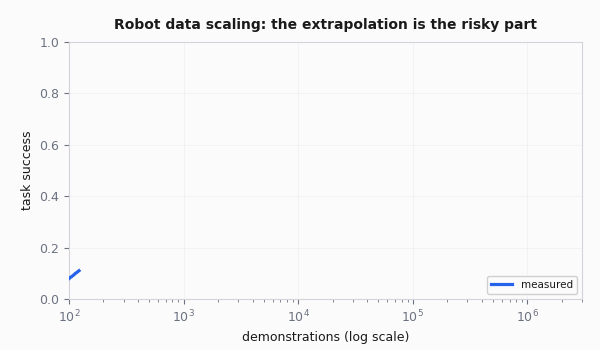

# Scaling Laws for Robot Data

Every robot learning talk in 2026 eventually gets the question: "so what's the scaling law for robots?" The honest answer is that nobody has published one with the predictive precision Kaplan and Chinchilla gave language models, and I would not bet on one arriving soon. That is not a reason to ignore the framing - it is a reason to be precise about what does and does not carry over from the LLM world, and to stop citing "scaling laws" as if robotics already had its own clean equation. It does not, yet.

This page is about the mechanism, not a number. If you came here for an exponent to plug into a spreadsheet, I do not have one I trust, and I would be suspicious of anyone who hands you one with confidence.

## What a scaling law actually is

Strip away the hype: a scaling law is an empirical observation that some measure of model quality (usually pretraining loss, sometimes downstream success rate) improves as a smooth, predictable function of one resource axis - dataset size, compute, or parameter count - while holding the others fixed or scaled appropriately. The functional form that keeps showing up is a power law plus a floor:

$$
L(N) \approx \left(\frac{N_c}{N}\right)^{\alpha} + L_\infty
$$

Where $$N$$ is the resource (tokens, demonstrations, FLOPs, whatever you are scaling), $$\alpha$$ is the scaling exponent (how fast returns diminish), $$N_c$$ is a fitting constant, and $$L_\infty$$ is the irreducible loss floor no amount of that resource alone will beat. Plot it on log-log axes and you get a straight line, which is the "scaling law" chart everyone has seen.

Kaplan et al. (2020) - [https://arxiv.org/abs/2001.08361](https://arxiv.org/abs/2001.08361) - showed this held for language model pretraining loss against data, compute, and parameters, each held roughly independent of the others. Hoffmann et al. (2022), the **Chinchilla** paper - [https://arxiv.org/abs/2203.15556](https://arxiv.org/abs/2203.15556) - refined it into something actionable: for a fixed compute budget, there is an optimal split between model size and data, and most large models at the time were badly under-trained relative to their size. That second result, "compute-optimal training," is the one people try to import into robotics, and it is also the one that breaks first. More on that below.

The reason any of this matters is prediction, not aesthetics. If loss scales predictably with data, you can extrapolate: "we need roughly 10x more tokens to hit this loss." That extrapolation is the entire value of a scaling law. The question for this page is whether robot data supports the same kind of extrapolation. Mostly, it does not - or at least, nobody has shown convincingly that it does across the axes that matter.

One nuance worth flagging early: the *backbone* of a modern VLA is a transformer language/vision model, and the parameter-count-vs-compute axis for that backbone plausibly does follow ordinary LLM-style scaling, because it is architecturally the same object. What breaks is the *data* axis specifically - the robot-demonstration side of the equation, not the "how big should the network be" side. Keep those two questions separate; a lot of sloppy scaling-law talk in robotics conflates them.

## Why robot data refuses to behave like text

The LLM scaling story works because text has properties that robot data lacks, all at once.

| Property | Text / web pretraining | Robot demonstration data | Consequence for the curve |
|---|---|---|---|
| Cost to acquire | Already exists, just crawl it | Must be physically generated | No "cheap tail" to bulk up on |
| Availability | Already sitting on the internet | Does not pre-exist; has to be actively collected | Volume is capped by throughput, not by search |
| Distribution | Heterogeneous by default (millions of authors) | Homogeneous by default (one lab, one operator, one week) | Diversity must be engineered in, not assumed |
| Portability | A token means roughly the same thing everywhere | An action is embodiment-specific | Pooling does not automatically give "more of the same thing" |
| Marginal cost trend | Falls toward zero at scale | Stays roughly flat, or rises | No economy of scale in teleoperation |

### Not free

A token comes from a web page that already exists. A demonstration requires a robot, an operator, and real wall-clock time in which the task is physically performed at roughly the speed the task actually takes. You cannot scrape a pick-and-place trajectory into existence; someone has to move the arm.

### Not sitting on the internet

There is no pre-existing corpus of "delicate force-controlled assembly with a parallel-jaw gripper" waiting to be crawled the way natural language sits on billions of web pages. Web video shows humans doing tasks, and that is genuinely useful for visual and semantic pretraining (more on this in the co-training section below), but it does not come with actions in your robot's action space, its proprioception, or its exact kinematics. You still have to generate the action-labeled data yourself, from scratch, on your own hardware.

### Not i.i.d.

A batch of demos from one lab, one operator, one week looks nothing like a random sample from "the space of ways to do this task." Text scraped from the internet is heterogeneous by default. Robot data is homogeneous by default - one room, one lighting rig, one person's motion habits - unless you deliberately engineer variation in. Homogeneity is the natural resting state you have to fight against, not something that comes for free the way it does when you scrape a thousand different websites.

### Embodiment-specific

A token means roughly the same thing across tokenizer variants. An action does not transfer that cleanly: a 7-DOF Franka arm's joint-space action and a humanoid hand's delta pose are not interchangeable units, and pooling them naively does not automatically give you more "of the same thing" the way pooling two web-text shards does. What transfers across embodiments is mostly perception and semantics, not low-level control - see the diversity section below.

### Expensive per unit

This deserves its own section, because it is the single biggest structural difference and it explains most of the rest of this page.

## The economics: a trajectory is not a token

Marginal cost is the whole story. Scraping the ten-millionth web page costs about the same (near-zero) as scraping the first. Collecting the ten-thousandth demonstration of a task costs about the same as collecting the first - full operator time, full robot time, full reset overhead. There is no economy of scale in human teleoperation the way there is in web crawling.

| Cost driver | Text token | Robot trajectory | Implication |
|---|---|---|---|
| Marginal cost of one more unit | Near zero (scrape, dedupe) | Operator wage + robot uptime + reset labor | Robot data never gets "cheap at the margin" the way text did |
| Time to produce one unit | Milliseconds | Seconds to minutes, at real task speed | You cannot out-run the task's own duration |
| Parallelizability | Massive (thousands of scrapers at once) | One operator per robot, mostly serial | Horizontal scaling means buying more robots and hiring more operators, not more servers |
| Reset overhead | None | Often *longer* than the task itself | The "demo" is a small fraction of the time actually spent per data point |
| Failure cost | A bad token is silently discarded | Wasted robot-hours, operator time, and real hardware wear | Bad data is expensive to produce *and* expensive to filter out afterward |
| Cost trend as you scale | Falls toward zero | Roughly flat, sometimes rises (coordination overhead across more operators) | No "cheap tail" of the dataset to bulk up on |

A back-of-envelope sanity check: a 15-second pick-and-place demo can easily carry 60-120 seconds of scene reset and setup around it. At a modest operator wage, that puts the real marginal cost of one demo somewhere in the neighborhood of a dollar, before you count robot depreciation or the engineer-hours spent curating and QA-ing the dataset afterward.

A token's marginal cost, once the page hosting it has already been crawled, is a small fraction of a cent. That gap - dollars per unit versus fractions of a cent per unit - not any difference in algorithms, is why the LLM data-scaling playbook does not port over directly.

What this implies for the shape of the curve: because you pay close to full price for every additional demonstration, you cannot chase the asymptote by brute volume the way LLM pretraining did. The rational strategy is to maximize information gained per dollar spent, not units collected per dollar spent - and information per dollar is a diversity question, not a volume question. See [Imitation Learning](imitation-learning.md) for the demo-count rules of thumb (roughly "100x the task duration" in collection time once you count resets and setup) that fall directly out of this economics.

## Diversity vs. volume: what Open X-Embodiment actually showed

[Open X-Embodiment](datasets-and-benchmarks.md) (Padalkar et al., 2023) pooled roughly a million trajectories across 20+ robot embodiments from 30+ labs into one dataset. The headline result was that a single model trained on the pooled mix outperformed models trained on any single lab's data alone, including on that lab's own robot. That is a real, useful result: cross-embodiment pooling transfers *something*.

What it is not is proof that "more embodiments always helps, unconditionally." Transfer is uneven across what a policy actually needs to learn:

| What needs to be learned | Transfers across embodiments? | Why |
|---|---|---|
| Visual scene understanding, object recognition | Mostly yes | Pixels look similar regardless of which robot is looking at them |
| Language grounding, coarse task structure | Mostly yes | "Pick up the cup" means the same thing to any robot |
| Contact dynamics, force profiles | Poorly | Depends on the specific gripper, compliance, and mass |
| Exact kinematics, actuator characteristics | Poorly | A joint-space action for one arm has no meaning for another |

Pooling a wheeled mobile manipulator's data with a stationary bimanual arm's data helps the vision backbone and the language conditioning; it does very little for the low-level control policy, because the two robots move through the world in physically different ways.

A more direct empirical attempt at a robotics-specific scaling law is Lin et al., *"Data Scaling Laws in Imitation Learning for Robotic Manipulation"* (2024) - [https://arxiv.org/abs/2410.18647](https://arxiv.org/abs/2410.18647). They varied the number of training environments, the number of objects, and the number of demonstrations independently, and found a power-law relationship between generalization performance and the number of environments and objects.

But crucially, once the number of demonstrations *per* environment or object crossed a fairly low threshold, collecting more demos there stopped helping. Diversity of conditions was the axis that kept paying off; repetition within a condition saturated fast. This is the most concrete evidence I know of for diversity beating volume in manipulation IL, and it is worth reading directly rather than taking my summary of it as gospel.

There is also a cautionary result in the other direction. A 2025 analysis of shortcut learning in generalist policies - [https://arxiv.org/abs/2508.06426](https://arxiv.org/abs/2508.06426) - found that datasets like OXE are collections of independently-gathered sub-datasets, each with limited internal diversity and each systematically different from the others. Policies trained on the pool latch onto spurious correlations - which sub-dataset a scene came from, rather than task-relevant structure - because within any one sub-dataset the irrelevant factors (background, camera angle, lighting) are suspiciously constant.

The fix the paper points to is not "pool more sub-datasets" but "make each sub-dataset internally diverse and keep factors consistent across sub-datasets," which is a much harder data-collection discipline than just adding more sources. Cross-embodiment pooling and raw diversity both help, in other words, but only along the axes where the underlying physics or semantics is actually shared - treat any unconditional claim that either one "always helps" with the same skepticism.

## Co-training ratios: the web pretraining is doing the work

Every serious 2026 VLA mixes robot demonstration data with vision-language data during training, not just as an initialization step. Even within one paper the ratio is not fixed - it is tuned empirically per base model:

| Model | Robot data weight | Vision-language / web data weight | Source |
|---|---|---|---|
| RT-2 (PaLI-X variant) | ~50% | ~50% | Brohan et al., 2023 |
| RT-2 (PaLM-E variant) | ~66% | ~34% | Brohan et al., 2023 |

Same paper, two backbones, two different ratios. That alone is a good demonstration that the mixing ratio is a tuned hyperparameter, not a principle derived from first causes.

Why bother mixing at all instead of just fine-tuning a pretrained VLM on 100% robot data? Because the web data buys you three things robot demonstration data is worst at supplying on its own:

- **Open-vocabulary object recognition** - recognizing objects your robot demos never happened to include.
- **Language grounding** - understanding what an instruction means, not just the specific phrasings in your dataset.
- **Commonsense about tasks** - knowing what "put the banana in the bowl" implies even without a demo of that exact pairing.

You would need an implausible number of demonstrations to see every object category, every phrasing of an instruction, every visual context a deployed robot might encounter. Web pretraining has already paid that cost, on someone else's compute budget, at a scale (billions of image-text pairs, see [VLAs](foundation-models-vla.md)) no robotics lab will ever collect physically-grounded data at. Co-training is how you keep that capability from being overwritten (catastrophic forgetting) as you fine-tune on a much smaller, much narrower robot-only distribution.

What ratio is "correct" is genuinely unsettled. More recent systematic studies of co-training modalities - mixing vision-language data, cross-embodiment robot data, human video, and dense language annotations in various combinations - find that mixing helps generalization broadly, but do not converge on one universal ratio across setups. I would treat the co-training ratio the way you'd treat a learning rate: a hyperparameter worth sweeping for your setup, not a constant to copy from a paper whose base model, data scale, and task distribution differ from yours.

## Compute-optimal framing, and why it transfers badly

Chinchilla's core move was reframing "how big should my model be" into "given a fixed compute budget, what is the loss-minimizing split between model size and data volume." That reframing only makes sense when compute is the scarce, binding resource and data is comparatively abundant and cheap to acquire more of.

| Axis | LLM pretraining assumption | Robot learning reality |
|---|---|---|
| Scarce resource | Compute (GPU-hours) | Data collection throughput (operator-hours, robot uptime) |
| Getting more of the scarce resource | Rent more GPUs | Hire and train more operators, build or buy more robots |
| Cost of the abundant resource | Data is already crawled, effectively free | Data is not abundant; it costs roughly the same per unit at any scale |
| Where the ceiling comes from | Budget for compute | Physical throughput - hours in a day, robots on hand, operator fatigue |

In robot learning, GPU-hours are rarely the bottleneck. A lab that wants to train on 10x more compute can usually rent it. A lab that wants to collect 10x more demonstrations has to find 10x more operator-hours, 10x more robot uptime, and 10x more calendar time, none of which scale by writing a bigger check to a cloud provider. Data collection throughput, not FLOPs, is almost always the binding constraint on how good your robot policy can get. Plotting loss against compute and asking "what's compute-optimal" is answering a question you were not actually stuck on.

There are partial mitigations that reduce the physical cost of a "trajectory," which is why they are worth tracking even though none of them make the problem disappear:

- **Simulation** - cheap synthetic trajectories, at the cost of a sim-to-real gap. See [Sim-to-Real](sim-to-real.md).
- **Demonstration hardware decoupled from the robot**, like **UMI**'s handheld gripper, which lets you record manipulation data without a robot in the loop at all. See [Teleoperation & Data Collection](teleop-and-data.md).

Both push the effective marginal cost of a demonstration down, but neither turns robot data into something you can generate at web-scraping speed. Compute-optimal thinking is useful once you have decided how much data you can afford to collect; it is the wrong lens for deciding whether to collect more data in the first place.

## Where the curves bend, and what nobody knows yet

Some parts of this are reasonably well characterized empirically, even without a clean published exponent:

<figure><figcaption></figcaption></figure>

- **Same-condition demo count bends early.** For a single task in a single scene with the same objects, returns to additional demonstrations flatten out somewhere in the low hundreds for most manipulation tasks (see the rules of thumb on [Teleoperation & Data Collection](teleop-and-data.md) and [Imitation Learning](imitation-learning.md)). This is the part of the curve people actually have working intuition for.
- **Where the diversity axis itself bends is not well pinned down.** Lin et al.'s result was measured on a small number of tasks with one lab's hardware. I would not extrapolate their specific curve shape to a different task family without re-measuring.
- **Cross-embodiment pooling has a ceiling nobody has mapped.** It clearly helps up to a point. Whether adding a sufficiently different embodiment eventually *hurts* (negative transfer) rather than just plateauing is, as far as I know, still an open empirical question. I would not be surprised either way, and I have not seen a study that isolates it cleanly.
- **VLA pretraining's exact discount on fine-tuning demos is a rule of thumb, not a law.** The commonly cited heuristic that VLA fine-tuning needs "about half" the demos a from-scratch policy would need (see [Foundation Models & VLAs](foundation-models-vla.md)) is a practitioner's rule, not a fitted curve, and it clearly depends on how close the fine-tuning task is to the pretraining distribution.

The honest summary: nobody has published a robotics scaling law with anywhere near the reproducibility of Kaplan or Chinchilla, across labs, robots, and tasks. Individual groups have fit power laws to their own data (Lin et al. is the best example), and those results are worth taking seriously as *directional* evidence, but treat any specific exponent as belonging to that paper's setup rather than as a universal constant. Even on the LLM side, the exact compute-optimal ratios have been revised more than once since Chinchilla; robotics is starting from a much thinner evidence base, over fewer replications, on more heterogeneous hardware.

## Practical implications: more data, more diverse data, or a different algorithm?

When a policy is not good enough, the temptation is always "collect more data." That is sometimes right and often an expensive way to learn the wrong lesson.

### A cheap way to check where you are on the curve

Before committing to weeks of additional collection, spend an afternoon on this instead: retrain your current policy on 25%, 50%, and 100% of the dataset you already have, and plot success rate (or held-out loss) against dataset fraction. If the curve is still climbing steeply from 50% to 100%, you are on the steep part of the same-condition curve and more of the same data will likely help. If it has already flattened by 50%, more of the identical kind of data is very unlikely to move the needle - and you should redirect the next batch of collection toward new scenes, objects, or lighting instead of more repetitions of what you already have. This costs an afternoon of compute and saves weeks of teleop.

### The diagnostic

| Symptom | Likely cause | What to do |
|---|---|---|
| Plateaued in your exact scene, same objects, same lighting | You are past the saturation point of the same-condition curve | Diversify scenes, objects, lighting, distractors - do not collect more of the same |
| Success rate is still climbing steeply as you add similar demos | You are still on the steep part of the same-condition curve | Keep collecting the same kind of data; you have not saturated yet |
| More data, even diverse data, does not move the needle at all | Algorithm or representation limitation, not a data problem | Reconsider action space, add proprioception, check for compounding error - see [Imitation Learning](imitation-learning.md) |
| Great in sim regardless of sim data volume, poor on the real robot | Sim-to-real gap, not a data-scaling problem | See [Sim-to-Real](sim-to-real.md); more sim data will not close a domain gap |
| Task is close to your base VLA's pretraining distribution | You are in fine-tuning territory | Expect roughly half the demos of a from-scratch policy; see [VLAs](foundation-models-vla.md) |
| Task is far from anything in your pretraining mix or Open X-Embodiment | Novel task, no free lunch from pretraining | Budget for either a from-scratch policy or a real diversity-focused data campaign before fine-tuning |


**Field note.** The single most expensive mistake I see teams make is treating a plateaued success rate as a "we need more data" problem and quietly tripling their existing dataset in the exact same room with the exact same objects. It almost never moves the number, because they were already past the saturation point of that axis. The fix is nearly always "go collect in a different kitchen," not "collect more in this one" - but admitting that means admitting the last few weeks of data collection targeted the wrong variable, which is a harder conversation than just scheduling more teleop sessions.


## Further reading

- Kaplan et al., *"Scaling Laws for Neural Language Models"* - [https://arxiv.org/abs/2001.08361](https://arxiv.org/abs/2001.08361)
- Hoffmann et al., *"Training Compute-Optimal Large Language Models"* (Chinchilla) - [https://arxiv.org/abs/2203.15556](https://arxiv.org/abs/2203.15556)
- Lin et al., *"Data Scaling Laws in Imitation Learning for Robotic Manipulation"* - [https://arxiv.org/abs/2410.18647](https://arxiv.org/abs/2410.18647)
- Padalkar et al., *"Open X-Embodiment: Robotic Learning Datasets and RT-X Models"* - [https://arxiv.org/abs/2310.08864](https://arxiv.org/abs/2310.08864)
- *"Shortcut Learning in Generalist Robot Policies: The Role of Dataset Diversity and Fragmentation"* - [https://arxiv.org/abs/2508.06426](https://arxiv.org/abs/2508.06426)
- Brohan et al., *"RT-2: Vision-Language-Action Models Transfer Web Knowledge to Robotic Control"* - [https://arxiv.org/abs/2307.15818](https://arxiv.org/abs/2307.15818)
