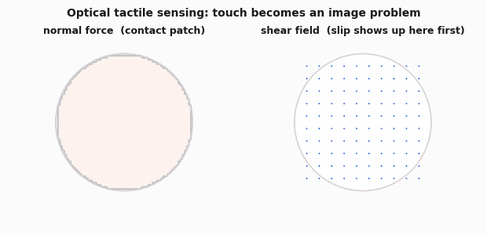

# Tactile Sensing & Touch-Conditioned Policies

The [Foundation Models & VLAs](foundation-models-vla.md) page admits the gap this page exists to fill: VLAs "mostly do not have a notion of compliance or force," and force-sensitive contact tasks are "poor without specific force/torque conditioning." Those are not minor caveats. Insertion, cable routing, deformable-object handling, and most of what makes manipulation hard in practice are contact-rich tasks, and a policy trained on RGB and proprioception alone is flying blind through exactly the part of the task where blindness costs you.

Tactile sensing is also the least mature part of the robot learning stack. Vision has ImageNet, web-scale VLMs, and a decade of transfer learning behind it. Touch has none of that. There is no tactile foundation model, no "internet of touch data," and the sensors themselves are still a fragmented set of competing designs, each with its own failure modes. This page covers the sensor landscape honestly, how touch enters a policy, and where the real engineering problems are - not a hype cycle for a modality that is, in 2026, still mostly a research problem with a few narrow production wins.

## Why touch matters

A short list of tasks vision genuinely cannot solve on its own:

- **Occlusion at the moment of contact.** The instant a gripper touches an object, the gripper itself, the object, or the hand blocks the camera's view of the exact contact point you need to reason about. Vision is best informed right before contact and right after, and blind during the part that matters.
- **Slip detection.** A grasped object beginning to slide is a gradual event carried by a high-frequency shear signal at the fingertip. Third-person or wrist cameras running at 10-30Hz, several centimeters away, are a poor sensor for this. By the time slip is visible in RGB, the object has usually already fallen or rotated out of the intended grasp.
- **Force-controlled insertion.** Peg-in-hole, connector insertion, and similar tasks require knowing whether you are jammed against an edge and building dangerous force, not just where the peg looks like it is. Vision gives you position. It does not give you the one number that tells you to stop pushing.
- **Deformable objects.** Cloth, food, cables, and packaging do not have a fixed shape vision can key off of. Knowing how much force you are applying, and where, is often the only way to tell "folding the shirt" from "tearing the shirt."
- **In-hand manipulation.** Once an object is inside a closed hand and being reoriented, external cameras lose the view entirely. The only sensor that can localize the object at that point is whatever is on the fingers themselves.

## The sensor landscape

There is no single "tactile sensor." The field is a set of genuinely different physical principles, each trading spatial detail against durability, bandwidth, and cost.

### Optical tactile: GelSight and DIGIT

**GelSight** (Yuan, Dong & Adelson, MIT) turned tactile sensing into a computer vision problem: a small camera sits behind a soft, clear elastomer gel with a reflective coating, illuminated from multiple angles by colored LEDs. When the gel contacts something, its surface deforms, and because the illumination geometry is known, the camera image can be inverted (photometric stereo) into a dense, sub-millimeter-resolution height map of the contact patch. Painted markers embedded in the gel let you track in-plane shear and slip as marker displacement, i.e. optical flow.

<figure><figcaption></figcaption></figure>

**DIGIT** (Lambeta et al., Meta AI) is the sensor that made this practical to actually build. Same optical principle, but shrunk to a small, cheap, standardized, 3D-printable/injection-moldable package built from off-the-shelf parts, designed specifically so labs could reproduce it rather than hand-build a one-off GelSight rig. DIGIT is what most research groups in 2026 actually mount on a fingertip.

What you get: the best geometric and shear detail of any tactile sensor family, effectively for free, because it rides on standard vision processing. What it costs you:

- **Bulk.** A camera, lens, and LED ring do not fit into a slim fingertip alongside actuators easily.
- **Gel wear.** Repeated contact abrades, cuts, and permanently deforms the gel, so it needs periodic replacement and recalibration.
- **Latency.** Bounded by camera frame rate and any photometric-stereo processing - tens of milliseconds, not the sub-millisecond response of a strain gauge.
- **Cost.** A camera plus optics plus lighting per finger is a real bill of materials compared to a single sensing chip.

### Magnetic elastomer skins: ReSkin and AnySkin

**ReSkin** (Bhirangi et al., CMU/Meta) replaced the camera entirely. A thin elastomer skin embedded with magnetic particles sits over a small magnetometer on a rigid PCB. Contact deforms the skin, moving the particles and changing the local magnetic field, which the magnetometer reads directly as a vector - no illumination, no image, no optics. ReSkin's key design insight was to physically separate the passive magnetic skin (which wears out) from the sensing electronics underneath (which does not), so the skin becomes a cheap, replaceable consumable.

**AnySkin** (Bhirangi et al.) pushed that idea one step further, and this is the step that actually matters for deployment: it is engineered so a policy trained against one physical skin instance keeps working when you swap in a nominally identical replacement, without retraining or per-instance recalibration. That sounds small, but most tactile sensors, optical or magnetic, have real unit-to-unit and wear-related variance - a policy trained on sensor A can silently degrade on sensor B, or on sensor A after enough wear. Calibration transfer, not just physical interchangeability, is what turns a tactile sensor from a lab artifact you retrain around into a component you can actually field.

Tradeoff versus optical tactile: much lower spatial resolution (a sparse taxel readout, not an image), but higher achievable bandwidth (electronic readout is not bounded by camera frame rate), and a thinner, tougher, cheaper package.

### TacTip and biomimetic pin-based designs

**TacTip** (Ward-Cherrier et al., Bristol Robotics Laboratory) is also camera-based, but photographs a sparse array of pins projecting from the inside of a soft dome rather than a continuous gel surface - explicitly modeled on the papillae structure of human fingertip dermis. Contact bends the pins; the camera tracks pin-tip displacement as marker motion, the same way GelSight tracks embedded markers, but as the *entire* signal rather than an addition to a dense image.

Because the readout is a small set of tracked points instead of a raw image, TacTip is less sensitive to gel material drift and lighting variation than a dense optical-tactile image, and gives a clean, direct estimate of local shear and normal deformation per pin. It is a good fit for edge detection and contact-geometry estimation where you want a robust, interpretable signal rather than maximum spatial detail.

### Capacitive, resistive, and barometric arrays

Capacitive and resistive taxel arrays (the technology behind whole-body robot skins like iCub's, and pressure-mapping mats) trade spatial and mechanical fidelity for coverage and per-taxel cost. You can tile a whole hand, arm, or torso far more cheaply than with optical tactile, at coarse spatial resolution and with well-known failure modes: hysteresis, drift, and crosstalk between neighboring taxels.

Barometric/fluid-based sensors, the **BioTac** lineage (SynTouch) being the best-known example, take a different approach again: a fluid-filled compliant skin over a rigid, electrode-instrumented core reads deformation through changes in fluid impedance, plus vibration through a hydrophone-like transducer, plus static temperature and heat flux. This is genuinely multimodal contact sensing (force, texture/vibration, thermal) from one package, at the cost of being a complex, largely closed commercial part that is much harder to fabricate or repair yourself than a magnetic skin or a 3D-printed TacTip dome.

### Wrist force/torque: the boring, reliable default

A 6-axis strain-gauge force/torque sensor mounted between the wrist and end-effector is the oldest tactile-adjacent technology on this list, and still the one most force-controlled industrial arms actually use. It is well-understood, extremely durable, has no gel or skin to wear out, and runs at high bandwidth. Its limitation is structural, not a maturity problem: it measures the aggregate wrench at one point upstream of the fingers. It tells you the total force and torque on the whole tool, not where on the gripper contact happened, or whether one finger slipped while the other held. For coarse compliant control, impedance control, and force-controlled search patterns during insertion, that is often enough, and it is what most production force control has quietly run on for years. It just cannot answer "where" or "what shape."

### Comparison table

| Sensor family | Sensing principle | Spatial detail | Bandwidth | Durability | Verdict |
|---|---|---|---|---|---|
| **GelSight** / **DIGIT** | Camera + illuminated deformable gel | Very high (image-resolution height map) | Camera-frame-rate limited | Gel wears, tears, needs replacement | Best geometric/shear detail, worst bulk and durability |
| **ReSkin** / **AnySkin** | Magnetometer under magnetic elastomer | Coarse (taxel-level) | High, direct electronic readout | Thin, tough, designed to be swapped | Best durability-to-cost tradeoff; AnySkin adds swap-without-recalibration |
| **TacTip** | Camera + biomimetic pin array | Medium (pin-count limited) | Camera-frame-rate limited | Pins/dome outlast bare gel skins | Best for edges, shear, contact geometry with less material drift |
| Capacitive / resistive arrays | Taxel grid, pressure mapping | Low per-taxel, tileable over large area | Fast, simple electronics | Robust but drifts, hysteresis | Best for whole-hand/whole-body coverage, worst precision |
| **BioTac** lineage (barometric/fluid) | Fluid impedance + vibration + thermal | Low spatial, rich multimodal | High for vibration | Sealed, durable, hard to self-repair | Richest single-sensor multimodality, most complex integration |
| Wrist F/T | 6-axis strain gauge | None (single aggregate point) | High, mature | Very durable, industrial-grade | Coarse but bulletproof; the default when you need force, not shape |

For the hobby-grade end of contact sensing (bump switches, microswitches, basic FSRs), see [Sensors for Robotics](../embedded-systems-for-robotics/sensors-and-actuators/sensors-for-robotics.md#tactile-and-contact-sensors). That page covers the switch-and-taxel end of the spectrum. This page covers the learning end - sensors rich enough to feed a policy, and what it takes to actually use them.

## Tactile representation learning - why "tactile as an image" worked, and where it breaks

The single most productive framing in this field has been treating tactile signal as an image. GelSight and DIGIT literally output a camera frame, so the entire deep vision toolbox - CNNs, ViTs, optical flow, contrastive pretraining, ImageNet-pretrained backbones - applies with zero new architecture. Calandra et al.'s early grasp-outcome work is the clean example: two GelSight frames (pre-grasp and post-grasp) treated as extra image channels, fed into a standard vision model, predicting grasp success. No bespoke tactile architecture required.

Where it breaks:

- **Non-optical sensors do not produce images.** AnySkin and ReSkin give you a handful of 3-axis magnetic vectors. Capacitive arrays give sparse taxel grids. Wrist F/T gives a single 6-vector. Forcing these into a pseudo-image (interpolating taxels onto a 2D grid) is a legitimate technique, but it is a fabricated image, not a real one, and it discards the actual structure of the sensor.
- **A single tactile frame is a snapshot; the interesting signal is often temporal.** Slip, shear rate, and vibration/texture are dynamic or spectral phenomena, not spatial ones. A single-frame CNN does not see them natively - you need video encoders, explicit optical-flow-style processing, or frequency-domain features, and single-frame image pretraining does not cover that for free.
- **Cross-sensor transfer barely exists.** An encoder trained on GelSight images does not transfer cleanly to DIGIT images (different gel, different lighting, different camera), let alone to a magnetic skin's taxel grid. Tactile representation learning is nowhere near as sensor-agnostic as vision representation learning, where SigLIP and DINOv2, trained on arbitrary web photos, transfer broadly across cameras. In practice, a new tactile sensor is closer to a new modality than a new camera.

## Getting touch into a policy

The naive version: add a tactile encoder, produce a token or embedding, concatenate it with the vision and proprioception tokens, let the transformer figure out the rest. A representative architecture:

```
Tactile sensor (GelSight / DIGIT / AnySkin)
        |
        v
  raw tactile signal (image, or taxel/magnetic vector)
        |
        v
  [Tactile encoder: small CNN/ViT for optical tactile,
   MLP for taxel/magnetic vectors -
   usually trained from scratch or on a small
   tactile-only dataset, rarely web-pretrained]
        |
        v
   tactile embedding token(s)
        |
        v
  concat / interleave with:
    - vision tokens (3rd-person + wrist cameras)
    - proprioception tokens
    - language tokens (if VLA)
        |
        v
  [Transformer backbone / policy]
        |
        v
  action chunk (position/velocity + gripper)
```

This is the version that ships in most papers, and it has a specific, important failure: bolting a tactile encoder onto a policy that still emits position or velocity targets does not give that policy a notion of compliance. The encoder can perfectly represent "I am slipping" and the policy can still have no way to *act* on it, because nothing downstream turns that signal into a force adjustment. The more serious architectures (recent tactile-augmented VLA work like **Tactile-VLA**, Huang et al., and **VLA-Touch**, Bi et al., both make this point explicitly) pair the tactile signal with a hybrid position-force controller: the VLA's output is not the final motor command, it is a target that a downstream compliant controller executes using the tactile or force signal as feedback, the same way [VLAs](foundation-models-vla.md) already keep a classical impedance controller downstream of the action head rather than commanding joint torques directly. Tactile conditioning without that downstream force loop is decoration, not control.

Practical problems that show up regardless of architecture:

- **Modality imbalance and scarcity.** Tactile datasets are minuscule next to vision-language corpora. There is no web-scale tactile pretraining corpus, so tactile encoders cannot ride on internet-scale pretraining the way vision encoders do, and every tactile-augmented policy is training its touch representation nearly from scratch on a few hundred or thousand demos.
- **The policy will happily learn to ignore the tactile channel.** If a task is solvable from vision and proprioception alone within the training distribution, gradient descent has no reason to use the extra tactile stream. The model quietly stops attending to it, and you only discover this the first time touch was actually load-bearing and the policy fails anyway.
- **Sensor-to-sensor transfer is not solved.** Train against your specific tactile sensor instance and do not expect that to transfer to a different unit, let alone a different sensor family, without retraining or an explicit sensor-invariant scheme.
- **Timing mismatch.** Tactile signals often run at a different rate than vision, sometimes much higher. Fusing them at the same timestep the way you fuse two camera views is not free; naive synchronization silently discards the bandwidth advantage some tactile sensors have.

## Data collection for tactile - the actual hard part

The same lesson from [Imitation Learning](imitation-learning.md) applies here, worse. Most teleop rigs described in [Teleoperation & Data Collection](teleop-and-data.md) - ALOHA, GELLO, SO-100/101 leader-follower setups - give the human operator no force feedback at all. The operator is moving a lightweight leader arm with encoders on it, feeling nothing about what the follower's fingers are actually touching. VR teleop is no better: stereoscopic passthrough vision, still no haptics.

This means the demonstrations you collect literally lack the signal you are trying to teach a policy to use. The tactile sensor on the follower still records real readings, so it is not that touch data is absent from the dataset. It is that the human's actions were never *informed* by touch, because the human never felt it. A policy trained on "vision-and-touch-blind human actions, plus touch sensor readings recorded after the fact" is learning a correlation between contact events and whatever the operator happened to do, not the causal control law a touch-aware human would actually have used. That gap is easy to miss because the dataset looks complete: every field is populated, tactile included. The problem is upstream, in what the demonstrator could perceive while generating the label.

A handful of rigs address this directly with force-feedback leader arms or haptic gloves, closing the loop so the operator actually feels what the robot feels. These remain rarer and more expensive than plain leader-follower teleop, and none of the popular open-source stacks (GELLO, SO-100/101) include haptics out of the box. Tactile sensors also add wiring and, for camera-based designs, another video stream per finger, which is real data-engineering overhead most vision-only pipelines do not have to budget for.

## Sim-to-real for touch - the gap inside the gap

[Sim-to-Real Transfer](sim-to-real.md) already flags contact dynamics as one of the worst-modeled parts of physics simulation, full stop, before tactile sensing enters the picture. Tactile sim-to-real inherits that problem and adds another layer on top: you now need to simulate not just whether and how hard two rigid bodies touch, but the sub-millimeter deformation of a soft gel or elastomer skin, and then turn that deformation into a synthetic camera image or magnetic-field reading that resembles what the real sensor would report. That is a soft-body, FEM-grade simulation problem stacked on an already-hard rigid-contact problem, followed by a sensor model that has to match real noise, illumination, and wear characteristics closely enough to transfer.

Domain randomization for tactile has to randomize things vision sim-to-real never touches: gel stiffness and wear state, marker position drift, sensor-specific noise floors, and, for optical tactile, the illumination inside the sensor housing itself - on top of the usual friction, mass, and latency randomization every other modality needs. As of 2026, tactile sim-to-real lags visual and even locomotion sim-to-real by a wide margin. Most tactile-policy work sidesteps full simulation and either collects more real data directly, or learns a residual correction on top of real-world tactile data rather than attempting the analytic-sim-plus-domain-randomization recipe that works for legged locomotion.


**Field note.** The failure mode I have seen most often with a bolted-on tactile encoder is not that the policy fails to use touch at all - it is that it learns to use the easy read (binary contact / no-contact) and never learns the harder one (how much shear, which direction it is slipping). This is invisible in evaluation if your demonstrations only ever showed slip in one direction, because the policy looks like it is using tactile information right up until deployment shows it a slip direction the training data never covered. If you add tactile to a policy, deliberately stress-test with slip and contact patterns your demos did not contain before you trust that the channel is doing anything beyond a coarse on/off switch.


## What actually works in 2026 vs what is still research

**Works, in narrow production use:**

- Slip detection as a scalar auxiliary signal driving a simple regrasp trigger, rather than as a primary control input. Narrow, well-scoped, and it does not require the tactile channel to carry the whole policy.
- Force/tactile-driven compliant control as a classical or RL controller *downstream* of a coarse vision-based approach phase - vision gets the gripper close, a force-controlled search-and-insert routine finishes the job. This is a hybrid architecture, not an end-to-end tactile-conditioned policy, and it is the pattern most deployed contact-rich manipulation actually uses.
- Wrist F/T for coarse impedance control in industrial-style force control. Mature, unglamorous, works.
- Vision-plus-tactile grasp-outcome prediction (the Calandra et al. lineage) as an offline or auxiliary signal for grasp planning.

**Still mostly research:**

- End-to-end tactile-augmented VLAs that meaningfully change generalist behavior based on touch. Work like **Tactile-VLA** and **VLA-Touch** shows the direction - tactile tokens or signals feeding a pretrained VLA, gated or refined through a hybrid position-force controller - and both report zero-shot generalization on contact-rich tasks from only a handful of demonstrations. Those are the authors' own claims, not independently replicated results, and they remain single-lab demonstrations on a small number of tasks, not a default architecture the way vision-language conditioning already is.
- Sensor-agnostic tactile representation learning: an encoder that transfers across GelSight, DIGIT, AnySkin, and whatever comes next the way DINOv2 transfers across arbitrary cameras. Open problem.
- Sim-to-real for contact-rich tactile tasks at anything like the maturity of visual or locomotion sim-to-real. Not there yet.
- A large-scale, cross-lab tactile pretraining corpus analogous to Open X-Embodiment for vision-action data. Does not exist yet. Tactile datasets remain small, sensor-specific, and collected by individual labs.

## Further reading

- Yuan, Dong & Adelson, *"GelSight: High-Resolution Robot Tactile Sensors for Estimating Geometry and Force"* - [https://www.mdpi.com/1424-8220/17/12/2762](https://www.mdpi.com/1424-8220/17/12/2762)
- Lambeta et al., *"DIGIT: A Novel Design for a Low-Cost Compact High-Resolution Tactile Sensor with Application to In-Hand Manipulation"* - [https://arxiv.org/abs/2005.14679](https://arxiv.org/abs/2005.14679)
- Bhirangi et al., *"ReSkin: Versatile, Replaceable, Lasting Tactile Skins"* - [https://arxiv.org/abs/2111.00071](https://arxiv.org/abs/2111.00071)
- Bhirangi et al., *"AnySkin: Plug-and-play Skin Sensing for Robotic Touch"* - [https://arxiv.org/abs/2409.08276](https://arxiv.org/abs/2409.08276)
- Ward-Cherrier et al., *"The TacTip Family: Soft Optical Tactile Sensors with 3D-Printed Biomimetic Morphologies"* - [https://journals.sagepub.com/doi/10.1089/soro.2017.0052](https://journals.sagepub.com/doi/10.1089/soro.2017.0052)
- Calandra et al., *"The Feeling of Success: Does Touch Sensing Help Predict Grasp Outcomes?"* - [https://arxiv.org/abs/1710.05512](https://arxiv.org/abs/1710.05512)
- Huang et al., *"Tactile-VLA: Unlocking Vision-Language-Action Model's Physical Knowledge for Tactile Generalization"* - [https://arxiv.org/abs/2507.09160](https://arxiv.org/abs/2507.09160)
- Bi et al., *"VLA-Touch: Enhancing Vision-Language-Action Models with Dual-Level Tactile Feedback"* - [https://arxiv.org/abs/2507.17294](https://arxiv.org/abs/2507.17294)
